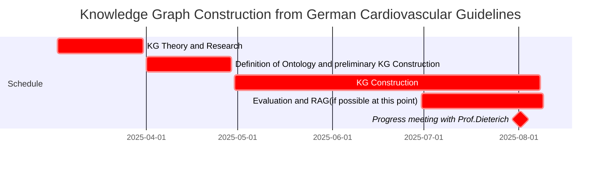

# CardioGuidelinesGraph

## Gantt chart

This is the gantt chart for the project in continues development. :

This gantt chart is a first draft and can be altered, re-scheduled and continued at any time. 


## ToDos:

- user credentials via dotenv
- restructuring project

## Utility Scripts

### PDF Processing Tools

The project includes several utilities to process medical guidelines from PDF documents for knowledge graph construction:

#### `split_pages.py`

This script splits a PDF document into individual page files, which is an essential preprocessing step for detailed analysis by Large Language Models (LLMs).

**Functionality:**
- Extracts each page from a source PDF and saves it as a separate PDF file
- Handles large documents efficiently with progress tracking
- Preserves original PDF formatting and content

**Usage:**
```bash
python split_pages.py --input-path /path/to/guideline.pdf --output-path /path/to/output/directory/
```

**Default Paths:**
- Input Path: `/home/pwiesenbach/CardioGuidelinesGraph/scripts_emre/data/guidelines/esc_ccs.pdf`
- Output Path: `/home/pwiesenbach/CardioGuidelinesGraph/scripts_emre/data/guidelines/pages/`

#### `parse_images.py`

This script performs visual analysis of PDF pages to extract structured information for the knowledge graph.

**Functionality:**
- Converts PDF pages to high-quality images
- Utilizes visual LLMs to analyze medical flowcharts, tables, and diagrams
- Extracts structured information including:
  - If-else decision trees from clinical flowcharts
  - Semantic triples (subject-predicate-object) from medical content
- Saves extracted information as JSON files for downstream processing

**Usage:**
```bash
python parse_images.py --input-dir /path/to/pdf/pages/ --output-dir /path/to/json/output/ --model [llm_model_name]
```

**Default Paths:**
- PDF Path: `/home/pwiesenbach/CardioGuidelinesGraph/scripts_emre/data/guidelines/esc_ccs.pdf`
- Image Output Path: `/home/pwiesenbach/CardioGuidelinesGraph/scripts_emre/data/guidelines/images/{pdf_name}/`
- Structures Output Paths: 
  - Pickle: `/home/pwiesenbach/CardioGuidelinesGraph/scripts_emre/data/guidelines/structures_pkl/{pdf_name}/`
  - JSON: `/home/pwiesenbach/CardioGuidelinesGraph/scripts_emre/data/guidelines/structures_json/{pdf_name}/`

These utilities form a crucial part of our knowledge graph construction pipeline, enabling the transformation of complex medical guidelines into a structured format that can be queried to provide precise clinical decision support.