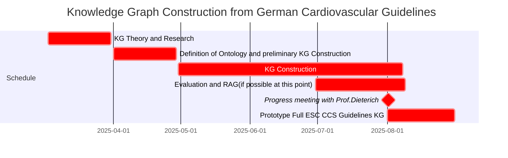

# CardioGuidelinesGraph

## Gantt chart

This is the gantt chart for the project in continues development. :

This gantt chart is a first draft and can be altered, re-scheduled and continued at any time. 

```mermaid
gantt
    title Knowledge Graph Construction from German Cardiovascular Guidelines
    dateFormat  YYYY-MM-DD
    section Schedule
    KG Theory and Research :crit, m1, 2025-03-03, 28d
    Definition of Ontology and preliminary KG Construction:crit, m2, 2025-04-01, 28d
    KG Construction:crit, m3, 2025-04-30, 100d
    Evaluation and RAG(if possible at this point):crit, m3, 2025-06-30, 40d
    Progress meeting with Prof.Dieterich:milestone, crit, 2025-08-01, 1d
    Prototype Full ESC CCS Guidelines KG:crit, m3, 2025-08-01, 30d
   
```

## ToDos:

- user credentials via dotenv
- restructuring project

## Utility Scripts

The project includes several utilities to process medical guidelines from PDF documents for knowledge graph construction:

### `parse_tables.py`

This script extracts structured information from both images and markdown content of medical guidelines, transforming them into semantic triples and decision trees for knowledge graph construction.

**Functionality:**
- Processes images (PNG, JPG) and markdown files containing medical tables and flowcharts
- Utilizes LLMs to extract structured information including:
  - Semantic triples (subject-predicate-object) from medical content
  - If-else decision trees from clinical flowcharts
- Supports both batch processing and single file processing
- Saves all extracted information as JSON files for downstream processing

**Usage:**

Process multiple images from a directory:
```bash
python parse_tables.py images --path /path/to/image/directory/
```

Process a single image file:
```bash
python parse_tables.py images --single --path /path/to/single/image.png
# Or use default single image:
python parse_tables.py images --single
```

Process markdown file with chunking:
```bash
python parse_tables.py markdown --path /path/to/markdown/file.md
```

Process markdown as single chunk:
```bash
python parse_tables.py markdown --single --path /path/to/markdown/file.md
# Or use default single markdown:
python parse_tables.py markdown --single
```

**Default Paths:**
- Batch Images: `/home/pwiesenbach/CardioGuidelinesGraph/scripts_emre/data/guidelines/images/esc_ccs/`
- Single Image: `/home/pwiesenbach/CardioGuidelinesGraph/scripts_emre/data/guidelines/images/page37_tab6.png`
- Batch Markdown: `/home/pwiesenbach/CardioGuidelinesGraph/scripts_emre/data/guidelines/markdown/esc_ccs.md`
- Single Markdown: `/home/pwiesenbach/CardioGuidelinesGraph/scripts_emre/data/guidelines/markdown/page37_tab6.md`

**Output:**
- All extracted structures (semantic triples and if-else trees) are saved to a single `structures.json` file
- Each structure includes source tracking information (filepath for images, original markdown chunk for markdown)

### PDF Processing Tools

#### `parse_flowcharts_from_pdfs_via_images.py`

This script extracts flowchart and decision tree structures from PDF documents by converting pages to images and analyzing them with visual LLMs.

**Functionality:**
- Converts PDF pages to high-resolution PNG images
- Uses the `Image2Tree` BAML function to analyze flowcharts and decision trees
- Extracts structured flowchart information including nodes, connections, and decision paths
- Supports both single PDF files and directory batch processing
- Saves all extracted flowchart structures as JSON files with source tracking

**Usage:**
```bash
# Process single PDF file
python parse_flowcharts_from_pdfs_via_images.py --path /path/to/single.pdf

# Process with custom output directory
python parse_flowcharts_from_pdfs_via_images.py --path /path/to/single.pdf --output-dir /custom/output/

# Process entire directory of PDFs
python parse_flowcharts_from_pdfs_via_images.py --path /path/to/pdf/directory/

# Enable verbose output
python parse_flowcharts_from_pdfs_via_images.py --verbose --path /path/to/file.pdf
```

**Default Paths:**
- Input Path: `/home/pwiesenbach/CardioGuidelinesGraph/scripts_emre/data/guidelines/esc_ccs.pdf`
- Output Directory: `/home/pwiesenbach/CardioGuidelinesGraph/scripts_emre/data/guidelines/flowchart_structures`

**Output:**
- Extracted images are temporarily stored in the output directory
- Flowchart structures saved as `{pdf_name}.json` containing all detected flowcharts
- Each structure includes source filepath and extracted flowchart data

#### `parse_tables_from_markdown_or_pdfs_via_images.py`

This script provides dual functionality for extracting table structures from both PDF files (via image conversion) and markdown files.

**Functionality:**
- **PDF Mode**: Converts PDF pages to images and extracts table structures using `Image2Table`
- **Markdown Mode**: Processes markdown files by chunking text and extracting tables using `Markdown2Table`
- Supports batch processing for both file types
- Preserves source information for all extracted structures
- Handles large documents with progress tracking

**Usage:**

**PDF Processing:**
```bash
# Process single PDF file
python parse_tables_from_markdown_or_pdfs_via_images.py pdf --path /path/to/file.pdf

# Process with custom output directory
python parse_tables_from_markdown_or_pdfs_via_images.py pdf --path /path/to/file.pdf --output-dir /custom/output/

# Process directory of PDFs
python parse_tables_from_markdown_or_pdfs_via_images.py pdf --path /path/to/pdf/directory/

# Enable verbose output
python parse_tables_from_markdown_or_pdfs_via_images.py pdf --verbose --path /path/to/file.pdf
```

**Markdown Processing:**
```bash
# Process markdown file
python parse_tables_from_markdown_or_pdfs_via_images.py markdown --path /path/to/file.md

# Process with verbose output
python parse_tables_from_markdown_or_pdfs_via_images.py markdown --verbose --path /path/to/file.md
```

**Default Paths:**
- **PDF Input**: `/home/pwiesenbach/CardioGuidelinesGraph/scripts_emre/data/guidelines/esc_ccs.pdf`
- **PDF Output**: `/home/pwiesenbach/CardioGuidelinesGraph/scripts_emre/data/guidelines/table_structures/from_pdf_images`
- **Markdown Input**: `/home/pwiesenbach/CardioGuidelinesGraph/scripts_emre/data/guidelines/markdown/esc_ccs.md`
- **Markdown Output**: `/home/pwiesenbach/CardioGuidelinesGraph/scripts_emre/data/guidelines/table_structures/from_markdown`

**Output:**
- Table structures saved as `{source_name}.json` files
- Each extracted table includes source information (filepath or markdown chunk)
- Supports complex table structures with nested data

#### `parse_pdfs_with_docling.py`

This script uses the Docling library for comprehensive PDF content extraction, providing separate commands for different content types.

**Functionality:**
- **Text Extraction**: Converts PDF content to clean markdown format
- **Table Extraction**: Detects and extracts table structures with optional DataFrame conversion
- **Image Extraction**: Extracts embedded images from PDF documents
- Supports both single files and directory batch processing
- Configurable OCR and table structure detection options

**Usage:**

**Text Extraction:**
```bash
# Extract text from single PDF
python parse_pdfs_with_docling.py text --pdf-path /path/to/file.pdf

# Extract with custom output directory
python parse_pdfs_with_docling.py text --pdf-path /path/to/file.pdf --output-dir /custom/output/

# Process directory of PDFs
python parse_pdfs_with_docling.py text --pdf-path /path/to/pdf/directory/
```

**Table Extraction:**
```bash
# Extract tables from PDF
python parse_pdfs_with_docling.py tables --pdf-path /path/to/file.pdf

# Extract tables with custom output
python parse_pdfs_with_docling.py tables --pdf-path /path/to/file.pdf --output-dir /custom/output/
```

**Image Extraction:**
```bash
# Extract images from PDF
python parse_pdfs_with_docling.py images --pdf-path /path/to/file.pdf

# Extract images with custom output
python parse_pdfs_with_docling.py images --pdf-path /path/to/file.pdf --output-dir /custom/output/
```

**Extract Everything:**
```bash
# Extract text, tables, and images
python parse_pdfs_with_docling.py all --pdf-path /path/to/file.pdf

# Enable verbose output
python parse_pdfs_with_docling.py --verbose all --pdf-path /path/to/file.pdf
```

**Default Paths:**
- Input PDF: `/home/pwiesenbach/CardioGuidelinesGraph/scripts_emre/data/guidelines/pdf_pages/_37.pdf`
- Output Directory: `/home/pwiesenbach/CardioGuidelinesGraph/scripts_emre/data/guidelines/docling/`

**Output Structure:**
- **Text**: `{pdf_name}.md` - Clean markdown conversion of PDF content
- **Tables**: `{pdf_name}/tables/` directory containing:
  - `table_{i:03d}.json` - Individual table files
  - `tables_summary.json` - Summary of all extracted tables
- **Images**: `{pdf_name}/images/` directory containing:
  - `image_{i:03d}.png` - Extracted image files
  - `images_metadata.json` - Image extraction metadata

#### `split_pages.py`

This script splits a PDF document into individual page files, which is an essential preprocessing step for detailed analysis by Large Language Models (LLMs).

**Functionality:**
- Extracts each page from a source PDF and saves it as a separate PDF file
- Handles large documents efficiently with progress tracking
- Preserves original PDF formatting and content

**Usage:**
```bash
python split_pages.py --input-path /path/to/guideline.pdf --output-path /path/to/output/directory/
```

**Default Paths:**
- Input Path: `/home/pwiesenbach/CardioGuidelinesGraph/scripts_emre/data/guidelines/esc_ccs.pdf`
- Output Path: `/home/pwiesenbach/CardioGuidelinesGraph/scripts_emre/data/guidelines/pages/`

#### `parse_images.py`

This script performs visual analysis of PDF pages to extract structured information for the knowledge graph.

**Functionality:**
- Converts PDF pages to high-quality images
- Utilizes visual LLMs to analyze medical flowcharts, tables, and diagrams
- Extracts all structured information from medical content (semantic triples and if-else decision trees)
- Saves extracted information as JSON files for downstream processing
- Includes source filepath tracking for all extracted structures

**Usage:**
```bash
python parse_images.py extract --pdf-path /path/to/pdf.pdf --img-path /path/to/images/
python parse_images.py parse --imgx-path /path/to/images/
python parse_images.py save_json --imgx-path /path/to/images/
# Or run the complete pipeline:
python parse_images.py process_all --pdf-path /path/to/pdf.pdf --output-dir /path/to/output/
```

**Default Paths:**
- PDF Path: `/home/pwiesenbach/CardioGuidelinesGraph/scripts_emre/data/guidelines/esc_ccs.pdf`
- Image Output Path: `/home/pwiesenbach/CardioGuidelinesGraph/scripts_emre/data/guidelines/images/{pdf_name}/`
- Structures Output Path: `/home/pwiesenbach/CardioGuidelinesGraph/scripts_emre/data/guidelines/flowchart_structures/{pdf_name}/`

**Output:**
- All extracted structures are saved to a single `structures.json` file
- Each structure includes source filepath information for traceability

These utilities form a crucial part of our knowledge graph construction pipeline, enabling the transformation of complex medical guidelines into a structured format that can be queried to provide precise clinical decision support.
