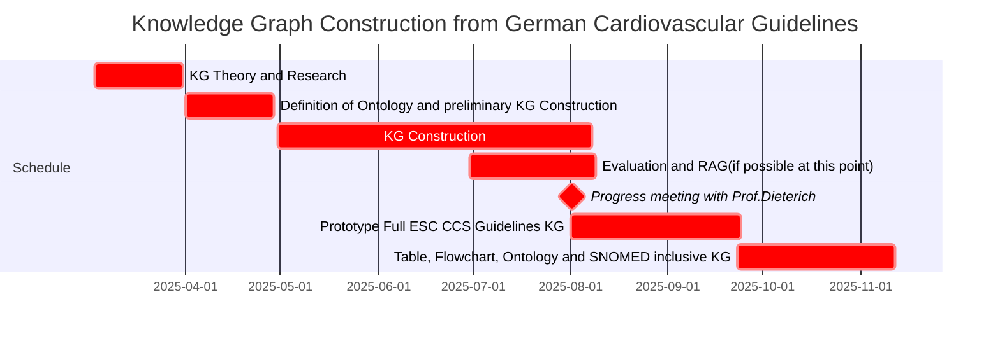

# CardioGuidelinesGraph

A project for knowledge graph construction from German cardiovascular guidelines.

## Project Setup

This project uses Poetry for dependency management. Before using any scripts, set up your environment:

```bash
# Install project with dependencies
poetry install

# Activate the virtual environment
poetry shell

# Download the spaCy model for Named Entity Recognition
poetry run python -m spacy download en_core_web_sm

# Download the scispaCy biomedical models for sentence splitting and entity grounding
poetry run pip install https://s3-us-west-2.amazonaws.com/ai2-s2-scispacy/releases/v0.5.4/en_core_sci_lg-0.5.4.tar.gz
poetry run pip install https://s3-us-west-2.amazonaws.com/ai2-s2-scispacy/releases/v0.5.4/en_ner_bc5cdr_md-0.5.4.tar.gz
```

## Gantt chart

This is the gantt chart for the project in continuous development:

This gantt chart is a first draft and can be altered, re-scheduled and continued at any time.

```mermaid
gantt
    title Knowledge Graph Construction from German Cardiovascular Guidelines
    dateFormat  YYYY-MM-DD
    section Schedule
    KG Theory and Research :crit, m1, 2025-03-03, 28d
    Definition of Ontology and preliminary KG Construction:crit, m2, 2025-04-01, 28d
    KG Construction:crit, m3, 2025-04-30, 100d
    Evaluation and RAG(if possible at this point):crit, m3, 2025-06-30, 40d
    Progress meeting with Prof.Dieterich:milestone, crit, 2025-08-01, 1d
    Prototype Full ESC CCS Guidelines KG:crit, m3, 2025-08-01, 54d
    Table, Flowchart, Ontology and SNOMED inclusive KG:crit, m3, 2025-09-23, 50d
   
```

## Project Structure

```
src/
  cardio_graph/           # Main package
    extraction_utils/     # Extraction and graph generation utilities
    neo4j_utils/          # Neo4j database interactions
    ollama_utils/         # Ollama LLM interfaces
    pdf_utils/            # PDF processing tools
    rag_utils/            # Retrieval augmented generation tools
    snomedct_utils/       # SNOMED CT utilities
    other/                # Miscellaneous utilities
```

## Utility Scripts

The project includes several utilities to process medical guidelines from PDF documents for knowledge graph construction. All scripts can be run either using Poetry's CLI scripts or directly with Python.

### PDF Processing Tools

#### Parse PDFs with Docling (`parse-pdfs`)

Extract structured content from PDFs using the Docling library.

```bash
# Extract text from a PDF
poetry run parse-pdfs --text --pdf-path /path/to/file.pdf

# Extract structures from a PDF
poetry run parse-pdfs --structures --pdf-path /path/to/file.pdf

# Extract images from a PDF
poetry run parse-pdfs --images --pdf-path /path/to/file.pdf

# Extract all content types
poetry run parse-pdfs --text --structures --images --pdf-path /path/to/file.pdf

# Process an entire directory of PDFs
poetry run parse-pdfs --text --structures --pdf-path /path/to/pdf/directory/

# Use Visual Language Model for enhanced extraction
poetry run parse-pdfs --text --structures --use-vlm --pdf-path /path/to/file.pdf
```

Default paths:
- Input PDF: `/home/pwiesenbach/CardioGuidelinesGraph/src/data/guidelines/pdf_pages/_37.pdf`
- Output Directory: `/home/pwiesenbach/CardioGuidelinesGraph/src/data/guidelines/docling/`

#### Split PDF Pages (`split-pages`)

Split a PDF document into individual page files for detailed analysis.

```bash
# Split a PDF with default settings
poetry run split-pages --input-path /path/to/guideline.pdf --output-path /path/to/output/directory/
```

#### Convert PDF to Markdown (`pdf-to-markdown`)

Convert PDF files to markdown format for easier text analysis.

```bash
# Convert PDFs with default settings (uses Docling for better quality)
poetry run pdf-to-markdown

# Use custom input and output directories
poetry run pdf-to-markdown --input-dir /path/to/pdfs --output-dir /path/to/output

# Use simpler, faster conversion with PyPDF
poetry run pdf-to-markdown --use-pypdf

# Enable verbose logging
poetry run pdf-to-markdown --verbose
```

Default paths:
- Input Directory: `/home/pwiesenbach/CardioGuidelinesGraph/src/data/guidelines/pdf/pages`
- Output Directory: `/home/pwiesenbach/CardioGuidelinesGraph/src/data/guidelines/markdown/pages`

### Extraction Utilities

#### Markdown Text Chunker (`markdown-chunks`)

Split large markdown files into manageable chunks for downstream processing using LangChain's MarkdownTextSplitter.

```bash
# Process the default ESC CCS markdown file
poetry run python src/cardio_graph/extraction_utils/markdown_chunks.py

# Specify custom input file and output directory
poetry run python src/cardio_graph/extraction_utils/markdown_chunks.py --input-file /path/to/file.md --output-dir /path/to/output

# Customize chunk size and overlap
poetry run python src/cardio_graph/extraction_utils/markdown_chunks.py --chunk-size 2000 --chunk-overlap 200

# Enable verbose logging
poetry run python src/cardio_graph/extraction_utils/markdown_chunks.py --verbose
```

**Features:**
- Uses LangChain's MarkdownTextSplitter for intelligent markdown-aware chunking
- Configurable chunk size and overlap to maintain context
- Zero-padded filenames for consistent ordering
- Comprehensive logging and error handling
- Creates organized output directory structure

**Default Settings:**
- Input File: `/prj/doctoral_letters/guide/data/guidelines/markdown/esc_ccs.md`
- Output Directory: `/prj/doctoral_letters/guide/data/guidelines/markdown/chunks`
- Chunk Size: 1000 characters
- Chunk Overlap: 100 characters

#### Parse Structures from Markdown or PDFs (`parse-structures`)

Extract structures from both PDF files (via image conversion) and markdown files.

```bash
# Process PDF files
poetry run parse-structures pdf --path /path/to/file.pdf

# Process with custom output directory
poetry run parse-structures pdf --path /path/to/file.pdf --output-dir /custom/output/

# Process markdown files
poetry run parse-structures markdown --path /path/to/file.md

# Enable verbose output
poetry run parse-structures pdf --verbose --path /path/to/file.pdf
```

#### Entity Grounding Service (`entity-grounding-service`)

Ground entities in text to SNOMED CT ontology concepts using Whoosh indexing and scispaCy biomedical NER.

**Programmatic Usage:**
```python
from src.cardio_graph.extraction_utils.entity_grounding_service import EntityGroundingService

# Initialize with default paths
egs = EntityGroundingService()

# Or specify custom paths
egs = EntityGroundingService(
    ontology_path="/prj/doctoral_letters/guide/data/ontologies/cardio_ontology.owl",
    index_path="/prj/doctoral_letters/guide/data/egs_index"
)

# Ground entities in text
entities = egs.ground("HFrEF patients need SGLT2 inhibitors")
```

**Command Line Usage:**
```bash
# Ground entities in text
poetry run python src/cardio_graph/extraction_utils/entity_grounding_service.py --ontology-path data/ontologies/cardio_ontology.owl ground "Text to ground"

# Use different ontology
poetry run python src/cardio_graph/extraction_utils/entity_grounding_service.py --ontology-path /path/to/other.owl ground "Text to ground"

# Enable verbose logging
poetry run python src/cardio_graph/extraction_utils/entity_grounding_service.py --verbose --ontology-path data/ontologies/cardio_ontology.owl ground "Text to ground"
```

#### Sentence Splitter (`sentence-splitter`)

Split text into sentences or chunks using ScispaCy or LangChain for biomedical text processing.

```bash
# Split text into sentences using ScispaCy (default)
poetry run python src/cardio_graph/parsing_utils/sentence_splitter.py --input-file /path/to/text.txt --output-dir /path/to/output

# Use LangChain chunking instead
poetry run python src/cardio_graph/parsing_utils/sentence_splitter.py --splitter langchain --chunk-size 500 --chunk-overlap 50 --input-file /path/to/text.txt --output-dir /path/to/output

# Use custom input/output paths
poetry run python src/cardio_graph/parsing_utils/sentence_splitter.py --input-file data/guidelines/text/esc_ccs.txt --output-dir data/guidelines/sentences
```

#### Text Extraction (`extract`)

Extract structured information from text.

```bash
# Extract information from text
poetry run extract "Your text here"
```

#### Knowledge Graph Generation (`generate-graph`)

Generate a knowledge graph from text content.

```bash
# Generate a graph from text
poetry run generate-graph "Your text here"
```

#### API BAML Scripts (`api-baml-scripts`)

Process markdown files in batches to extract triples and generate Cypher statements for Neo4j using configurable LLM models.

**Command Line Usage:**
```bash
# Use default model (Qwen32b5 on g5)
poetry run python src/cardio_graph/extraction_utils/api_baml_scripts.py

# Specify custom model and node
poetry run python src/cardio_graph/extraction_utils/api_baml_scripts.py --model Qwen14b5 --node g4

# Use custom directories
poetry run python src/cardio_graph/extraction_utils/api_baml_scripts.py --model Gemma --input-dir /path/to/input --output-dir /path/to/output
```

**Features:**
- Batch processing of markdown files
- Automatic Cypher generation from extracted triples
- Direct Neo4j database insertion
- Configurable model selection via ClientRegistry
- Error handling and retry logic

#### Query Interpretation (`query`)

Use the query interpreter to interact with the knowledge graph.

```bash
# Run the query interpreter
poetry run query
```

### Neo4j Database Tools

#### Feed Neo4j Database (`feed-neo4j`)

Load Cypher files into a Neo4j database.

```bash
# Run with default settings
poetry run feed-neo4j
```

Default configuration:
- URI: "bolt://neo4j-dev2.internal:7687"
- Cypher Directory: "/prj/doctoral_letters/guide/outputs2/cypher"

#### Draw.io to Cypher Converter

Convert Draw.io diagrams to Cypher queries for Neo4j.

```bash
# Run the converter
poetry run python src/cardio_graph/neo4j_utils/drawio_to_cypher.py
```

### LLM Utilities

#### Run Ollama (`run-ollama`)

Interact with Ollama models for text generation tasks.

```bash
# Run the Ollama client with a custom prompt
poetry run run-ollama "Your prompt here"

# Using the default prompt
poetry run run-ollama
```

Default configuration:
- Model: 'qwen3:32b'
- Host: 'http://10.250.135.153:11430'

### SNOMED CT Utilities

#### SNOMED CT Explorer (`snomed-explorer`)

Explore the SNOMED CT database to extract concepts related to cardiovascular guidelines for ontology creation.

```bash
# Run the interactive SNOMED CT explorer
poetry run snomed-explorer
```

The SNOMED CT Explorer provides an interactive menu with the following options:

1. **Explore database structure**: View all tables and their columns in the SNOMED CT database
2. **Show sample data**: View sample records from any specified table
3. **Search cardiovascular concepts**: Find concepts related to cardiovascular medicine
4. **Search concepts by term**: Search for any concept using a keyword
5. **Find concepts related to cardiovascular guidelines**: Targeted search for guideline-relevant concepts
6. **Get relationships for a concept**: Find all relationships for a specified concept ID
7. **Execute custom query**: Run custom SQL queries against the database
8. **Export results to CSV/JSON**: Export search results for further analysis or ontology creation

Default connection settings:
- Host: '10.250.135.23'
- Port: '3306'
- User: 'test_user'
- Database: 'snomedct'

### Cardiovascular Ontology Generator (`generate-cardio-ontology`)

**What it does**: Creates a comprehensive OWL/RDF ontology for cardiovascular guidelines by extracting and organizing medical concepts from the SNOMED CT international terminology system.

**Why it's needed**: Provides a standardized knowledge structure that enables:
- Consistent representation of cardiovascular concepts across the knowledge graph
- Semantic interoperability with other medical systems
- Automated reasoning about clinical relationships
- Grounding of extracted guideline information in established medical terminology

#### The Ontology Generation Process (3-Step Refinement Funnel)

The generation follows a systematic approach to ensure both **comprehensiveness** (finding all relevant concepts) and **precision** (accurate categorization):

##### Step 1: Schema Design (Human Intelligence)
- **Configuration-driven**: Everything starts with `ontology_config.yaml`
- **Domain expertise**: Defines 34 core classes that represent key concepts in cardiovascular guidelines:
  - **10 Main Categories**: ClinicalAction, PatientPhenotype, Purpose, WorkflowStep, Guideline, EvidenceSource, Medication, Condition, GuidelineRecommendation, GuidelineSource (these are the primary buckets for SNOMED concept mapping)
  - **24 Specialized Classes**: Including CardiovascularDisease, CardiacImaging, CardiacBiomarker, various therapy types (AnticoagulationTherapy, HeartFailureTherapy), and workflow classes (EmergencyCardiacCare, CardiacRehabilitation)
- **Relationship framework**: Establishes 17 core object properties (like "recommends", "hasAction", "isSupportedBy") and 13 data properties (like "hasEvidenceLevel", "hasTargetValue", "pageNumber") that define how concepts relate

##### Step 2: Targeted Concept Extraction (Broad Collection)
- **Smart searching**: Uses 50+ specific search terms from the YAML config to query SNOMED CT database
- **Database integration**: Connects to PostgreSQL SNOMED CT database with secure SSL authentication
- **Quality filtering**: Retrieves thousands of cardiovascular-relevant concepts while avoiding irrelevant matches
- **Search examples**: Terms like "myocardial infarction", "heart failure", "echocardiography", "statin therapy", "beta blocker"

##### Step 3: Intelligent Categorization (Precision Refinement)
- **AI-powered classification**: Large Language Model examines each concept's full context (FSN, synonyms, descriptions)
- **Schema mapping**: Assigns each extracted concept to one of the 10 main SNOMED categories
- **Quality assurance**: Ensures concepts are placed in semantically appropriate classes
- **Fallback method**: Keyword-based categorization available when LLM is unavailable

#### Current Ontology Statistics

The generated `cardio_ontology_class.owl` contains:
- **21,350 OWL Classes**:
  - 34 core schema classes (from YAML configuration)
  - 21,316 SNOMED-derived classes (extracted and categorized concepts)
- **89 Object Properties**:
  - 17 core properties (from YAML schema definition)
  - 72 dynamic SNOMED properties (automatically generated from SNOMED relationships like "is-a", "has-component", "associated-with")
- **13 Datatype Properties**: Attributes with specific data types (evidence levels, target values, page numbers, dosage instructions)
- **80,892 RDF Triples**: The complete knowledge graph structure
- **SNOMED CT Integration**: All concepts properly linked to international medical terminology standard

**Class Distribution Examples**:
- **ClinicalAction**: 2,100+ concepts (procedures, therapies, interventions)
- **PatientPhenotype**: 1,900+ concepts (symptoms, findings, risk factors)
- **Condition**: 1,400+ concepts (diseases, disorders, syndromes)
- **Medication**: 800+ concepts (drugs, pharmaceuticals, therapies)

#### Key Technical Features

- **Standards Compliant**: Valid OWL/RDF format compatible with Protégé, Jena, and other semantic web tools
- **SNOMED CT Grounded**: Built on SNOMED CT (Systematized Nomenclature of Medicine Clinical Terms), the world's most comprehensive clinical terminology
- **AI-Enhanced Precision**: Uses BAML framework with Ollama LLM server for nuanced concept categorization
- **Configuration Driven**: Entire process controlled by human-editable YAML file with 64 configurable elements
- **Dual Modeling Support**: 
  - **Class-based** (current): SNOMED concepts become OWL Classes (better for reasoning)
  - **Instance-based** (legacy): SNOMED concepts become Named Individuals (better for direct application)
- **Database Integration**: Secure PostgreSQL connection with SSL certificate verification and connection pooling
- **Batch Processing**: Efficiently handles thousands of concepts with optimized database queries
- **Quality Assurance**: Preflight validation, duplicate detection, and relationship verification

#### Usage Examples

```bash
# Generate the main ontology (recommended approach)
poetry run generate-cardio-ontology --modeling-approach class --categorization-method llm

# Generate instance-based ontology (SNOMED concepts as individuals)
poetry run generate-cardio-ontology --modeling-approach instance --categorization-method llm

# Quick debug run with limited concepts (10 per category for testing)
poetry run generate-cardio-ontology --debug

# Use keyword-based categorization instead of LLM (faster, less accurate)
poetry run generate-cardio-ontology --categorization-method keyword

# Custom output path and Ollama server configuration
poetry run generate-cardio-ontology --output /custom/path/my_ontology.owl --model Qwen8b --node g4 --ollama-port 11435

# Generate with verbose logging for debugging
poetry run generate-cardio-ontology --verbose
```

#### Understanding the Output

The generated ontology serves as both:
- **T-Box (Schema)**: Defines the high-level classes and relationships for modeling guideline logic
- **A-Box (Instances)**: Pre-populates with thousands of specific cardiovascular concepts from SNOMED CT

**What this enables**:
- **Semantic Search**: Find all "heart failure therapies" regardless of how they're named
- **Automated Reasoning**: Infer that "myocardial infarction" is a type of "cardiovascular disease"
- **Relationship Discovery**: Understand that "ACE inhibitors" are "recommended" for "heart failure" patients
- **Guideline Integration**: Map extracted text to standardized medical concepts
- **Interoperability**: Connect with other medical systems using SNOMED CT identifiers

**Example Reasoning Capabilities**:
- "Beta blockers are recommended for patients with heart failure" → System can find all beta blocker medications and heart failure conditions
- "ACE inhibitors interact with potassium supplements" → System can identify potential drug interactions
- "Target blood pressure < 130/80 mmHg" → System can represent quantitative treatment goals with operators and units

This foundation enables the knowledge graph to understand and reason about complex clinical scenarios like "ACE inhibitors are recommended for heart failure patients with reduced ejection fraction who are symptomatic."

### Running Scripts Directly

All scripts can also be run directly using Python after activating the Poetry environment:

```bash
# First activate the Poetry environment
poetry shell

# Then run scripts directly
python src/cardio_graph/pdf_utils/parse_pdfs_with_docling.py --text --structures --pdf-path /path/to/file.pdf
python src/cardio_graph/neo4j_utils/feedneo4jdb.py
```
