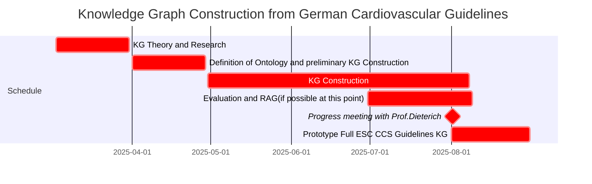

# CardioGuidelinesGraph

## Gantt chart

This is the gantt chart for the project in continues development. :

This gantt chart is a first draft and can be altered, re-scheduled and continued at any time. 

```mermaid
gantt
    title Knowledge Graph Construction from German Cardiovascular Guidelines
    dateFormat  YYYY-MM-DD
    section Schedule
    KG Theory and Research :crit, m1, 2025-03-03, 28d
    Definition of Ontology and preliminary KG Construction:crit, m2, 2025-04-01, 28d
    KG Construction:crit, m3, 2025-04-30, 100d
    Evaluation and RAG(if possible at this point):crit, m3, 2025-06-30, 40d
    Progress meeting with Prof.Dieterich:milestone, crit, 2025-08-01, 1d
    Prototype Full ESC CCS Guidelines KG:crit, m3, 2025-08-01, 30d
   
```

## ToDos:

- user credentials via dotenv
- restructuring project

## Utility Scripts

The project includes several utilities to process medical guidelines from PDF documents for knowledge graph construction:

### `parse_tables.py`

This script extracts structured information from both images and markdown content of medical guidelines, transforming them into semantic triples and decision trees for knowledge graph construction.

**Functionality:**
- Processes images (PNG, JPG) and markdown files containing medical tables and flowcharts
- Utilizes LLMs to extract structured information including:
  - Semantic triples (subject-predicate-object) from medical content
  - If-else decision trees from clinical flowcharts
- Supports both batch processing and single file processing
- Saves all extracted information as JSON files for downstream processing

**Usage:**

Process multiple images from a directory:
```bash
python parse_tables.py images --path /path/to/image/directory/
```

Process a single image file:
```bash
python parse_tables.py images --single --path /path/to/single/image.png
# Or use default single image:
python parse_tables.py images --single
```

Process markdown file with chunking:
```bash
python parse_tables.py markdown --path /path/to/markdown/file.md
```

Process markdown as single chunk:
```bash
python parse_tables.py markdown --single --path /path/to/markdown/file.md
# Or use default single markdown:
python parse_tables.py markdown --single
```

**Default Paths:**
- Batch Images: `/home/pwiesenbach/CardioGuidelinesGraph/scripts_emre/data/guidelines/images/esc_ccs/`
- Single Image: `/home/pwiesenbach/CardioGuidelinesGraph/scripts_emre/data/guidelines/images/page37_tab6.png`
- Batch Markdown: `/home/pwiesenbach/CardioGuidelinesGraph/scripts_emre/data/guidelines/markdown/esc_ccs.md`
- Single Markdown: `/home/pwiesenbach/CardioGuidelinesGraph/scripts_emre/data/guidelines/markdown/page37_tab6.md`

**Output:**
- All extracted structures (semantic triples and if-else trees) are saved to a single `tables_tables.json` file
- Each structure includes source tracking information (filepath for images, original markdown chunk for markdown)

### PDF Processing Tools

#### `split_pages.py`

This script splits a PDF document into individual page files, which is an essential preprocessing step for detailed analysis by Large Language Models (LLMs).

**Functionality:**
- Extracts each page from a source PDF and saves it as a separate PDF file
- Handles large documents efficiently with progress tracking
- Preserves original PDF formatting and content

**Usage:**
```bash
python split_pages.py --input-path /path/to/guideline.pdf --output-path /path/to/output/directory/
```

**Default Paths:**
- Input Path: `/home/pwiesenbach/CardioGuidelinesGraph/scripts_emre/data/guidelines/esc_ccs.pdf`
- Output Path: `/home/pwiesenbach/CardioGuidelinesGraph/scripts_emre/data/guidelines/pages/`

#### `parse_images.py`

This script performs visual analysis of PDF pages to extract structured information for the knowledge graph.

**Functionality:**
- Converts PDF pages to high-quality images
- Utilizes visual LLMs to analyze medical flowcharts, tables, and diagrams
- Extracts structured information including:
  - If-else decision trees from clinical flowcharts
  - Semantic triples (subject-predicate-object) from medical content
- Saves extracted information as JSON files for downstream processing

**Usage:**
```bash
python parse_images.py --input-dir /path/to/pdf/pages/ --output-dir /path/to/json/output/ --model [llm_model_name]
```

**Default Paths:**
- PDF Path: `/home/pwiesenbach/CardioGuidelinesGraph/scripts_emre/data/guidelines/esc_ccs.pdf`
- Image Output Path: `/home/pwiesenbach/CardioGuidelinesGraph/scripts_emre/data/guidelines/images/{pdf_name}/`
- Structures Output Paths: 
  - Pickle: `/home/pwiesenbach/CardioGuidelinesGraph/scripts_emre/data/guidelines/structures_pkl/{pdf_name}/`
  - JSON: `/home/pwiesenbach/CardioGuidelinesGraph/scripts_emre/data/guidelines/structures_json/{pdf_name}/`

These utilities form a crucial part of our knowledge graph construction pipeline, enabling the transformation of complex medical guidelines into a structured format that can be queried to provide precise clinical decision support.
