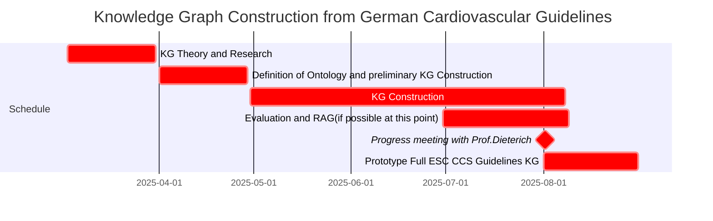

# CardioGuidelinesGraph

A project for knowledge graph construction from German cardiovascular guidelines.

## Project Setup

This project uses Poetry for dependency management. Before using any scripts, set up your environment:

```bash
# Install project with dependencies
poetry install

# Activate the virtual environment
poetry shell
```

## Gantt chart

This is the gantt chart for the project in continuous development:

This gantt chart is a first draft and can be altered, re-scheduled and continued at any time.

```mermaid
gantt
    title Knowledge Graph Construction from German Cardiovascular Guidelines
    dateFormat  YYYY-MM-DD
    section Schedule
    KG Theory and Research :crit, m1, 2025-03-03, 28d
    Definition of Ontology and preliminary KG Construction:crit, m2, 2025-04-01, 28d
    KG Construction:crit, m3, 2025-04-30, 100d
    Evaluation and RAG(if possible at this point):crit, m3, 2025-06-30, 40d
    Progress meeting with Prof.Dieterich:milestone, crit, 2025-08-01, 1d
    Prototype Full ESC CCS Guidelines KG:crit, m3, 2025-08-01, 30d
   
```

## Project Structure

```
src/
  cardio_graph/           # Main package
    extraction_utils/     # Extraction and graph generation utilities
    neo4j_utils/          # Neo4j database interactions
    ollama_utils/         # Ollama LLM interfaces
    pdf_utils/            # PDF processing tools
    rag_utils/            # Retrieval augmented generation tools
    snomedct_utils/       # SNOMED CT utilities
    other/                # Miscellaneous utilities
```

## Utility Scripts

The project includes several utilities to process medical guidelines from PDF documents for knowledge graph construction. All scripts can be run either using Poetry's CLI scripts or directly with Python.

### PDF Processing Tools

#### Parse PDFs with Docling (`parse-pdfs`)

Extract structured content from PDFs using the Docling library.

```bash
# Extract text from a PDF
poetry run parse-pdfs --text --pdf-path /path/to/file.pdf

# Extract structures from a PDF
poetry run parse-pdfs --structures --pdf-path /path/to/file.pdf

# Extract images from a PDF
poetry run parse-pdfs --images --pdf-path /path/to/file.pdf

# Extract all content types
poetry run parse-pdfs --text --structures --images --pdf-path /path/to/file.pdf

# Process an entire directory of PDFs
poetry run parse-pdfs --text --structures --pdf-path /path/to/pdf/directory/

# Use Visual Language Model for enhanced extraction
poetry run parse-pdfs --text --structures --use-vlm --pdf-path /path/to/file.pdf
```

Default paths:
- Input PDF: `/home/pwiesenbach/CardioGuidelinesGraph/src/data/guidelines/pdf_pages/_37.pdf`
- Output Directory: `/home/pwiesenbach/CardioGuidelinesGraph/src/data/guidelines/docling/`

#### Split PDF Pages (`split-pages`)

Split a PDF document into individual page files for detailed analysis.

```bash
# Split a PDF with default settings
poetry run split-pages --input-path /path/to/guideline.pdf --output-path /path/to/output/directory/
```

### Extraction Utilities

#### Parse Structures from Markdown or PDFs (`parse-structures`)

Extract structures from both PDF files (via image conversion) and markdown files.

```bash
# Process PDF files
poetry run parse-structures pdf --path /path/to/file.pdf

# Process with custom output directory
poetry run parse-structures pdf --path /path/to/file.pdf --output-dir /custom/output/

# Process markdown files
poetry run parse-structures markdown --path /path/to/file.md

# Enable verbose output
poetry run parse-structures pdf --verbose --path /path/to/file.pdf
```

#### Text Extraction (`extract`)

Extract structured information from text.

```bash
# Extract information from text
poetry run extract "Your text here"
```

#### Knowledge Graph Generation (`generate-graph`)

Generate a knowledge graph from text content.

```bash
# Generate a graph from text
poetry run generate-graph "Your text here"
```

#### Query Interpretation (`query`)

Use the query interpreter to interact with the knowledge graph.

```bash
# Run the query interpreter
poetry run query
```

### Neo4j Database Tools

#### Feed Neo4j Database (`feed-neo4j`)

Load Cypher files into a Neo4j database.

```bash
# Run with default settings
poetry run feed-neo4j
```

Default configuration:
- URI: "bolt://neo4j-dev2.internal:7687"
- Cypher Directory: "/prj/doctoral_letters/guide/outputs2/cypher"

#### Draw.io to Cypher Converter

Convert Draw.io diagrams to Cypher queries for Neo4j.

```bash
# Run the converter
poetry run python src/cardio_graph/neo4j_utils/drawio_to_cypher.py
```

### LLM Utilities

#### Run Ollama (`run-ollama`)

Interact with Ollama models for text generation tasks.

```bash
# Run the Ollama client with a custom prompt
poetry run run-ollama "Your prompt here"

# Using the default prompt
poetry run run-ollama
```

Default configuration:
- Model: 'qwen3:32b'
- Host: 'http://10.250.135.153:11430'

### Running Scripts Directly

All scripts can also be run directly using Python after activating the Poetry environment:

```bash
# First activate the Poetry environment
poetry shell

# Then run scripts directly
python src/cardio_graph/pdf_utils/parse_pdfs_with_docling.py --text --structures --pdf-path /path/to/file.pdf
python src/cardio_graph/neo4j_utils/feedneo4jdb.py
```

### BAML Utilities

The project includes BAML definitions in `src/cardio_graph/extraction_utils/baml_src/` for:
- Client configurations (`clients.baml`)
- Knowledge graph generators (`kg_generator.baml`)
- Query tools (`query.baml`)
- Structure definitions (`structures.baml`)

These BAML files define the interfaces and prompts used for the LLM interactions.

## ToDos

- User credentials via dotenv
- Continue restructuring project
