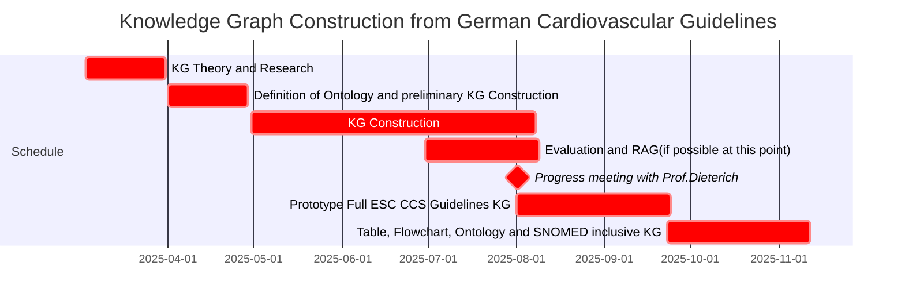

# CardioGuidelinesGraph

A project for knowledge graph construction from German cardiovascular guidelines.

## Project Setup

This project uses Poetry for dependency management. Before using any scripts, set up your environment:

```bash
# Install project with dependencies
poetry install

# Activate the virtual environment
poetry shell

# Download the spaCy model for Named Entity Recognition
poetry run python -m spacy download en_core_web_sm

# Download the scispaCy biomedical models for sentence splitting and entity grounding
poetry run pip install https://s3-us-west-2.amazonaws.com/ai2-s2-scispacy/releases/v0.5.4/en_core_sci_lg-0.5.4.tar.gz
poetry run pip install https://s3-us-west-2.amazonaws.com/ai2-s2-scispacy/releases/v0.5.4/en_ner_bc5cdr_md-0.5.4.tar.gz
```

## Gantt chart

This is the gantt chart for the project in continuous development:

This gantt chart is a first draft and can be altered, re-scheduled and continued at any time.

```mermaid
gantt
    title Knowledge Graph Construction from German Cardiovascular Guidelines
    dateFormat  YYYY-MM-DD
    section Schedule
    KG Theory and Research :crit, m1, 2025-03-03, 28d
    Definition of Ontology and preliminary KG Construction:crit, m2, 2025-04-01, 28d
    KG Construction:crit, m3, 2025-04-30, 100d
    Evaluation and RAG(if possible at this point):crit, m3, 2025-06-30, 40d
    Progress meeting with Prof.Dieterich:milestone, crit, 2025-08-01, 1d
    Prototype Full ESC CCS Guidelines KG:crit, m3, 2025-08-01, 54d
    Table, Flowchart, Ontology and SNOMED inclusive KG:crit, m3, 2025-09-23, 50d
   
```

## Project Structure

```
src/
  cardio_graph/           # Main package
    extraction_utils/     # Extraction and graph generation utilities
    neo4j_utils/          # Neo4j database interactions
    ollama_utils/         # Ollama LLM interfaces
    pdf_utils/            # PDF processing tools
    rag_utils/            # Retrieval augmented generation tools
    snomedct_utils/       # SNOMED CT utilities
    other/                # Miscellaneous utilities
```

## Utility Scripts

The project includes several utilities to process medical guidelines from PDF documents for knowledge graph construction. All scripts can be run either using Poetry's CLI scripts or directly with Python.

### PDF Processing Tools

#### Parse PDFs with Docling (`parse-pdfs`)

Extract structured content from PDFs using the Docling library.

```bash
# Extract text from a PDF
poetry run parse-pdfs --text --pdf-path /path/to/file.pdf

# Extract structures from a PDF
poetry run parse-pdfs --structures --pdf-path /path/to/file.pdf

# Extract images from a PDF
poetry run parse-pdfs --images --pdf-path /path/to/file.pdf

# Extract all content types
poetry run parse-pdfs --text --structures --images --pdf-path /path/to/file.pdf

# Process an entire directory of PDFs
poetry run parse-pdfs --text --structures --pdf-path /path/to/pdf/directory/

# Use Visual Language Model for enhanced extraction
poetry run parse-pdfs --text --structures --use-vlm --pdf-path /path/to/file.pdf
```

Default paths:
- Input PDF: `/home/pwiesenbach/CardioGuidelinesGraph/src/data/guidelines/pdf_pages/_37.pdf`
- Output Directory: `/home/pwiesenbach/CardioGuidelinesGraph/src/data/guidelines/docling/`

#### Split PDF Pages (`split-pages`)

Split a PDF document into individual page files for detailed analysis.

```bash
# Split a PDF with default settings
poetry run split-pages --input-path /path/to/guideline.pdf --output-path /path/to/output/directory/
```

#### Convert PDF to Markdown (`pdf-to-markdown`)

Convert PDF files to markdown format for easier text analysis.

```bash
# Convert PDFs with default settings (uses Docling for better quality)
poetry run pdf-to-markdown

# Use custom input and output directories
poetry run pdf-to-markdown --input-dir /path/to/pdfs --output-dir /path/to/output

# Use simpler, faster conversion with PyPDF
poetry run pdf-to-markdown --use-pypdf

# Enable verbose logging
poetry run pdf-to-markdown --verbose
```

Default paths:
- Input Directory: `/home/pwiesenbach/CardioGuidelinesGraph/src/data/guidelines/pdf/pages`
- Output Directory: `/home/pwiesenbach/CardioGuidelinesGraph/src/data/guidelines/markdown/pages`

### Extraction Utilities

#### Parse Structures from Markdown or PDFs (`parse-structures`)

Extract structures from both PDF files (via image conversion) and markdown files.

```bash
# Process PDF files
poetry run parse-structures pdf --path /path/to/file.pdf

# Process with custom output directory
poetry run parse-structures pdf --path /path/to/file.pdf --output-dir /custom/output/

# Process markdown files
poetry run parse-structures markdown --path /path/to/file.md

# Enable verbose output
poetry run parse-structures pdf --verbose --path /path/to/file.pdf
```

#### Entity Grounding Service (`entity-grounding-service`)

Ground entities in text to SNOMED CT ontology concepts using Whoosh indexing and scispaCy biomedical NER.

**Programmatic Usage:**
```python
from src.cardio_graph.extraction_utils.entity_grounding_service import EntityGroundingService

# Initialize with default paths
egs = EntityGroundingService()

# Or specify custom paths
egs = EntityGroundingService(
    ontology_path="/prj/doctoral_letters/guide/data/ontologies/cardio_ontology.owl",
    index_path="/prj/doctoral_letters/guide/data/egs_index"
)

# Ground entities in text
entities = egs.ground("HFrEF patients need SGLT2 inhibitors")
```

**Command Line Usage:**
```bash
# Ground entities in text
poetry run python src/cardio_graph/extraction_utils/entity_grounding_service.py --ontology-path data/ontologies/cardio_ontology.owl ground "Text to ground"

# Use different ontology
poetry run python src/cardio_graph/extraction_utils/entity_grounding_service.py --ontology-path /path/to/other.owl ground "Text to ground"

# Enable verbose logging
poetry run python src/cardio_graph/extraction_utils/entity_grounding_service.py --verbose --ontology-path data/ontologies/cardio_ontology.owl ground "Text to ground"
```

#### Sentence Splitter (`sentence-splitter`)

Split text into sentences or chunks using ScispaCy or LangChain for biomedical text processing.

```bash
# Split text into sentences using ScispaCy (default)
poetry run python src/cardio_graph/parsing_utils/sentence_splitter.py --input-file /path/to/text.txt --output-dir /path/to/output

# Use LangChain chunking instead
poetry run python src/cardio_graph/parsing_utils/sentence_splitter.py --splitter langchain --chunk-size 500 --chunk-overlap 50 --input-file /path/to/text.txt --output-dir /path/to/output

# Use custom input/output paths
poetry run python src/cardio_graph/parsing_utils/sentence_splitter.py --input-file data/guidelines/text/esc_ccs.txt --output-dir data/guidelines/sentences
```

#### Text Extraction (`extract`)

Extract structured information from text.

```bash
# Extract information from text
poetry run extract "Your text here"
```

#### Knowledge Graph Generation (`generate-graph`)

Generate a knowledge graph from text content.

```bash
# Generate a graph from text
poetry run generate-graph "Your text here"
```

#### Query Interpretation (`query`)

Use the query interpreter to interact with the knowledge graph.

```bash
# Run the query interpreter
poetry run query
```

### Neo4j Database Tools

#### Feed Neo4j Database (`feed-neo4j`)

Load Cypher files into a Neo4j database.

```bash
# Run with default settings
poetry run feed-neo4j
```

Default configuration:
- URI: "bolt://neo4j-dev2.internal:7687"
- Cypher Directory: "/prj/doctoral_letters/guide/outputs2/cypher"

#### Draw.io to Cypher Converter

Convert Draw.io diagrams to Cypher queries for Neo4j.

```bash
# Run the converter
poetry run python src/cardio_graph/neo4j_utils/drawio_to_cypher.py
```

### LLM Utilities

#### Run Ollama (`run-ollama`)

Interact with Ollama models for text generation tasks.

```bash
# Run the Ollama client with a custom prompt
poetry run run-ollama "Your prompt here"

# Using the default prompt
poetry run run-ollama
```

Default configuration:
- Model: 'qwen3:32b'
- Host: 'http://10.250.135.153:11430'

### SNOMED CT Utilities

#### SNOMED CT Explorer (`snomed-explorer`)

Explore the SNOMED CT database to extract concepts related to cardiovascular guidelines for ontology creation.

```bash
# Run the interactive SNOMED CT explorer
poetry run snomed-explorer
```

The SNOMED CT Explorer provides an interactive menu with the following options:

1. **Explore database structure**: View all tables and their columns in the SNOMED CT database
2. **Show sample data**: View sample records from any specified table
3. **Search cardiovascular concepts**: Find concepts related to cardiovascular medicine
4. **Search concepts by term**: Search for any concept using a keyword
5. **Find concepts related to cardiovascular guidelines**: Targeted search for guideline-relevant concepts
6. **Get relationships for a concept**: Find all relationships for a specified concept ID
7. **Execute custom query**: Run custom SQL queries against the database
8. **Export results to CSV/JSON**: Export search results for further analysis or ontology creation

Default connection settings:
- Host: '10.250.135.23'
- Port: '3306'
- User: 'test_user'
- Database: 'snomedct'

#### Cardiovascular Ontology Generator (`generate-cardio-ontology`)

Generate an OWL/RDF ontology for cardiovascular guidelines based on SNOMED CT concepts.

```bash
# Generate the ontology with default settings
poetry run generate-cardio-ontology

# Specify a custom output file
poetry run generate-cardio-ontology --output my_cardio_ontology.owl

# Use custom database connection
poetry run generate-cardio-ontology --host myhost.example.com --port 3306 --user myuser --password mypassword

# Set custom base URI and version
poetry run generate-cardio-ontology --base-uri "http://example.org/ontologies/cardio/" --version "1.0.0"
```

The generator creates an OWL ontology with:

1. **Core Classes**: ClinicalWorkflow, WorkflowStep, ClinicalAction, Purpose, LogicalJunction, etc.
2. **Core Properties**: hasStep, hasAction, hasPurpose, requiresCondition, hasOperand, etc.
3. **SNOMED CT Integration**: Imports relevant cardiovascular concepts from SNOMED CT
4. **Example Patterns**: Creates example workflow patterns for cardiovascular care
5. **Evidence Structure**: Supports evidence levels and guideline recommendations

Preflight validation (quick schema sanity check):
By default a schema preflight report runs before concept extraction. It lists how many core classes, object properties, and data properties were declared vs. expected and warns about any missing subclass parents.

Disable it if you need a minimal run:
```bash
poetry run generate-cardio-ontology --no-preflight
```

Data & datatype properties:
Datatype properties defined in `ontology_config.yaml` under `data_properties` are now emitted as OWL DatatypeProperties with XSD ranges (string/integer/float/date/dateTime/boolean). Unknown ranges default to `xsd:string` with a warning.

Dynamic SNOMED relationship properties:
Each distinct SNOMED CT relationship type encountered is converted to an object property `cgo:snomed_rel_<typeId>` with its human‑readable label when available.

Default output file: `cardio_ontology.owl` in the current directory

###### Purpose

The goal of this tool is to automate the creation of a rich, domain-specific, and standardized ontology (.owl file). This ontology serves two critical purposes:

- The Blueprint (T-Box): It formally defines the high-level classes (e.g., ClinicalAction, PatientPhenotype) and properties (e.g., isRecommendedFor) that we use to model the complex reasoning found in clinical guidelines.

- The Foundational Vocabulary (A-Box): It pre-populates the ontology with thousands of relevant cardiovascular concepts (e.g., "Atrial fibrillation," "ACE inhibitor therapy") extracted directly from the SNOMED CT international terminology, grounding our knowledge graph in a clinical standard.

How It Works: A Refinement Funnel

The generator avoids the pitfalls of manual ontology creation by following a robust, semi-automated, three-step process. This process is a refinement funnel, designed to move from broad retrieval to high-precision classification.
Step 1: Schema Definition (The Human-Designed Blueprint)

The entire process is driven by the ontology_config.yaml file. Here, we define our target schema—the handful of high-level classes and properties that are meaningful for modeling guideline logic. This is the "top-down" human intelligence that guides the system.
Step 2: Schema-Aware Concept Retrieval (High Recall)

Instead of blindly searching SNOMED CT, the script uses the snomed_search_terms defined in the YAML config to perform dozens of targeted searches. This step acts as a wide net, retrieving a large set of candidate concepts that are highly relevant to our schema. The goal here is high recall—to ensure we don't miss any important concepts.
Step 3: Intelligent Categorization (High Precision)

This is the crucial refinement step. Each candidate concept retrieved from SNOMED is individually examined by a Large Language Model (LLM). The LLM is provided with the concept's full context (its Fully Specified Name, synonyms, etc.) and is tasked with mapping it to the single best category from our predefined schema. This step ensures high precision, correctly classifying a diverse set of SNOMED concepts (procedures, disorders, findings) into our clean, high-level buckets.

This two-stage process (broad retrieval followed by precise classification) ensures that the final ontology is both comprehensive and accurately structured according to our specific modeling needs.
Visual Workflow

```    
+---------------------------+
|    ontology_config.yaml   |
|   (The Guiding Schema)    |
+-------------+-------------+
              |
              v
+-------------+-------------+      +------------------------+
|   Step 2: Schema-Aware    |----->|   SNOMED CT Database   |
|     Concept Retrieval     |      | (The Source Vocabulary)|
+-------------+-------------+      +------------------------+
              |
              v (Broad set of candidate concepts)
+-------------+-------------+
|    Step 3: Intelligent    |<----- (LLM Categorization Logic)
|      Categorization       |
+-------------+-------------+
              |
              v (Clean, classified concepts & schema)
+-------------+-------------+
| cardio_ontology.owl       |
|  (The Final Ontology)     |
+---------------------------+
```
  

Key Features

- Configuration-Driven: The entire ontology schema is managed in a single, easy-to-edit YAML file.

- SNOMED CT Grounded: Ensures our knowledge graph is built on standardized, internationally recognized clinical terminology.

- AI-Powered Precision: Leverages LLMs to perform nuanced, context-aware classification, far surpassing brittle keyword-based methods.

- Formal & Standardized Output: Generates a valid OWL/RDF file, ensuring interoperability with standard ontology tools (like Protégé) and graph databases.

### Running Scripts Directly

All scripts can also be run directly using Python after activating the Poetry environment:

```bash
# First activate the Poetry environment
poetry shell

# Then run scripts directly
python src/cardio_graph/pdf_utils/parse_pdfs_with_docling.py --text --structures --pdf-path /path/to/file.pdf
python src/cardio_graph/neo4j_utils/feedneo4jdb.py
```
