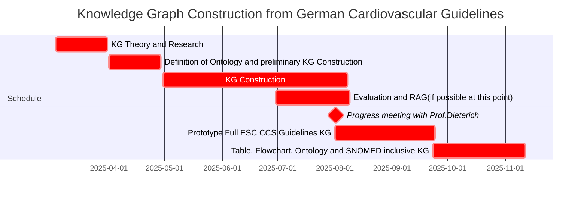

# CardioGuidelinesGraph

A project for knowledge graph construction from German cardiovascular guidelines.

## Project Setup

This project uses Poetry for dependency management. Before using any scripts, set up your environment:

```bash
# Install project with dependencies
poetry install

# Activate the virtual environment
poetry shell

# Download the spaCy model for Named Entity Recognition
poetry run python -m spacy download en_core_web_sm

# Download the scispaCy biomedical models for sentence splitting and entity grounding
poetry run pip install https://s3-us-west-2.amazonaws.com/ai2-s2-scispacy/releases/v0.5.4/en_core_sci_lg-0.5.4.tar.gz
poetry run pip install https://s3-us-west-2.amazonaws.com/ai2-s2-scispacy/releases/v0.5.4/en_ner_bc5cdr_md-0.5.4.tar.gz
```

## Gantt chart

This is the gantt chart for the project in continuous development:

This gantt chart is a first draft and can be altered, re-scheduled and continued at any time.

```mermaid
gantt
    title Knowledge Graph Construction from German Cardiovascular Guidelines
    dateFormat  YYYY-MM-DD
    section Schedule
    KG Theory and Research :crit, m1, 2025-03-03, 28d
    Definition of Ontology and preliminary KG Construction:crit, m2, 2025-04-01, 28d
    KG Construction:crit, m3, 2025-04-30, 100d
    Evaluation and RAG(if possible at this point):crit, m3, 2025-06-30, 40d
    Progress meeting with Prof.Dieterich:milestone, crit, 2025-08-01, 1d
    Prototype Full ESC CCS Guidelines KG:crit, m3, 2025-08-01, 54d
    Table, Flowchart, Ontology and SNOMED inclusive KG:crit, m3, 2025-09-23, 50d
   
```

## Project Structure

```
src/
  cardio_graph/           # Main package
    extraction_utils/     # Extraction and graph generation utilities
    neo4j_utils/          # Neo4j database interactions
    ollama_utils/         # Ollama LLM interfaces
    pdf_utils/            # PDF processing tools
    rag_utils/            # Retrieval augmented generation tools
    snomedct_utils/       # SNOMED CT utilities
    other/                # Miscellaneous utilities
```

## Utility Scripts

The project includes several utilities to process medical guidelines from PDF documents for knowledge graph construction. All scripts can be run either using Poetry's CLI scripts or directly with Python.

### PDF Processing Tools

#### Parse PDFs with Docling (`parse-pdfs`)

Extract structured content from PDFs using the Docling library.

```bash
# Extract text from a PDF
poetry run parse-pdfs --text --pdf-path /path/to/file.pdf

# Extract structures from a PDF
poetry run parse-pdfs --structures --pdf-path /path/to/file.pdf

# Extract images from a PDF
poetry run parse-pdfs --images --pdf-path /path/to/file.pdf

# Extract all content types
poetry run parse-pdfs --text --structures --images --pdf-path /path/to/file.pdf

# Process an entire directory of PDFs
poetry run parse-pdfs --text --structures --pdf-path /path/to/pdf/directory/

# Use Visual Language Model for enhanced extraction
poetry run parse-pdfs --text --structures --use-vlm --pdf-path /path/to/file.pdf
```

Default paths:
- Input PDF: `/home/pwiesenbach/CardioGuidelinesGraph/src/data/guidelines/pdf_pages/_37.pdf`
- Output Directory: `/home/pwiesenbach/CardioGuidelinesGraph/src/data/guidelines/docling/`

#### Split PDF Pages (`split-pages`)

Split a PDF document into individual page files for detailed analysis.

```bash
# Split a PDF with default settings
poetry run split-pages --input-path /path/to/guideline.pdf --output-path /path/to/output/directory/
```

#### Convert PDF to Markdown (`pdf-to-markdown`)

Convert PDF files to markdown format for easier text analysis.

```bash
# Convert PDFs with default settings (uses Docling for better quality)
poetry run pdf-to-markdown

# Use custom input and output directories
poetry run pdf-to-markdown --input-dir /path/to/pdfs --output-dir /path/to/output

# Use simpler, faster conversion with PyPDF
poetry run pdf-to-markdown --use-pypdf

# Enable verbose logging
poetry run pdf-to-markdown --verbose
```

Default paths:
- Input Directory: `/home/pwiesenbach/CardioGuidelinesGraph/src/data/guidelines/pdf/pages`
- Output Directory: `/home/pwiesenbach/CardioGuidelinesGraph/src/data/guidelines/markdown/pages`

### Extraction Utilities

#### Parse Structures from Markdown or PDFs (`parse-structures`)

Extract structures from both PDF files (via image conversion) and markdown files.

```bash
# Process PDF files
poetry run parse-structures pdf --path /path/to/file.pdf

# Process with custom output directory
poetry run parse-structures pdf --path /path/to/file.pdf --output-dir /custom/output/

# Process markdown files
poetry run parse-structures markdown --path /path/to/file.md

# Enable verbose output
poetry run parse-structures pdf --verbose --path /path/to/file.pdf
```

#### Entity Grounding Service (`entity-grounding-service`)

Ground entities in text to SNOMED CT ontology concepts using Whoosh indexing and scispaCy biomedical NER.

**Programmatic Usage:**
```python
from src.cardio_graph.extraction_utils.entity_grounding_service import EntityGroundingService

# Initialize with default paths
egs = EntityGroundingService()

# Or specify custom paths
egs = EntityGroundingService(
    ontology_path="/prj/doctoral_letters/guide/data/ontologies/cardio_ontology.owl",
    index_path="/prj/doctoral_letters/guide/data/egs_index"
)

# Ground entities in text
entities = egs.ground("HFrEF patients need SGLT2 inhibitors")
```

**Command Line Usage:**
```bash
# Ground entities in text
poetry run python src/cardio_graph/extraction_utils/entity_grounding_service.py --ontology-path data/ontologies/cardio_ontology.owl ground "Text to ground"

# Use different ontology
poetry run python src/cardio_graph/extraction_utils/entity_grounding_service.py --ontology-path /path/to/other.owl ground "Text to ground"

# Enable verbose logging
poetry run python src/cardio_graph/extraction_utils/entity_grounding_service.py --verbose --ontology-path data/ontologies/cardio_ontology.owl ground "Text to ground"
```

#### Sentence Splitter (`sentence-splitter`)

Split text into sentences or chunks using ScispaCy or LangChain for biomedical text processing.

```bash
# Split text into sentences using ScispaCy (default)
poetry run python src/cardio_graph/parsing_utils/sentence_splitter.py --input-file /path/to/text.txt --output-dir /path/to/output

# Use LangChain chunking instead
poetry run python src/cardio_graph/parsing_utils/sentence_splitter.py --splitter langchain --chunk-size 500 --chunk-overlap 50 --input-file /path/to/text.txt --output-dir /path/to/output

# Use custom input/output paths
poetry run python src/cardio_graph/parsing_utils/sentence_splitter.py --input-file data/guidelines/text/esc_ccs.txt --output-dir data/guidelines/sentences
```

#### Text Extraction (`extract`)

Extract structured information from text.

```bash
# Extract information from text
poetry run extract "Your text here"
```

#### Knowledge Graph Generation (`generate-graph`)

Generate a knowledge graph from text content.

```bash
# Generate a graph from text
poetry run generate-graph "Your text here"
```

#### API BAML Scripts (`api-baml-scripts`)

Process markdown files in batches to extract triples and generate Cypher statements for Neo4j using configurable LLM models.

**Command Line Usage:**
```bash
# Use default model (Qwen32b5 on g5)
poetry run python src/cardio_graph/extraction_utils/api_baml_scripts.py

# Specify custom model and node
poetry run python src/cardio_graph/extraction_utils/api_baml_scripts.py --model Qwen14b5 --node g4

# Use custom directories
poetry run python src/cardio_graph/extraction_utils/api_baml_scripts.py --model Gemma --input-dir /path/to/input --output-dir /path/to/output
```

**Features:**
- Batch processing of markdown files
- Automatic Cypher generation from extracted triples
- Direct Neo4j database insertion
- Configurable model selection via ClientRegistry
- Error handling and retry logic

#### Query Interpretation (`query`)

Use the query interpreter to interact with the knowledge graph.

```bash
# Run the query interpreter
poetry run query
```

### Neo4j Database Tools

#### Feed Neo4j Database (`feed-neo4j`)

Load Cypher files into a Neo4j database.

```bash
# Run with default settings
poetry run feed-neo4j
```

Default configuration:
- URI: "bolt://neo4j-dev2.internal:7687"
- Cypher Directory: "/prj/doctoral_letters/guide/outputs2/cypher"

#### Draw.io to Cypher Converter

Convert Draw.io diagrams to Cypher queries for Neo4j.

```bash
# Run the converter
poetry run python src/cardio_graph/neo4j_utils/drawio_to_cypher.py
```

### LLM Utilities

#### Run Ollama (`run-ollama`)

Interact with Ollama models for text generation tasks.

```bash
# Run the Ollama client with a custom prompt
poetry run run-ollama "Your prompt here"

# Using the default prompt
poetry run run-ollama
```

Default configuration:
- Model: 'qwen3:32b'
- Host: 'http://10.250.135.153:11430'

### SNOMED CT Utilities

#### SNOMED CT Explorer (`snomed-explorer`)

Explore the SNOMED CT database to extract concepts related to cardiovascular guidelines for ontology creation.

```bash
# Run the interactive SNOMED CT explorer
poetry run snomed-explorer
```

The SNOMED CT Explorer provides an interactive menu with the following options:

1. **Explore database structure**: View all tables and their columns in the SNOMED CT database
2. **Show sample data**: View sample records from any specified table
3. **Search cardiovascular concepts**: Find concepts related to cardiovascular medicine
4. **Search concepts by term**: Search for any concept using a keyword
5. **Find concepts related to cardiovascular guidelines**: Targeted search for guideline-relevant concepts
6. **Get relationships for a concept**: Find all relationships for a specified concept ID
7. **Execute custom query**: Run custom SQL queries against the database
8. **Export results to CSV/JSON**: Export search results for further analysis or ontology creation

Default connection settings:
- Host: '10.250.135.23'
- Port: '3306'
- User: 'test_user'
- Database: 'snomedct'

### Cardiovascular Ontology Generator (`generate-cardio-ontology`)

Generate an OWL/RDF ontology for cardiovascular guidelines based on SNOMED CT concepts with dual modeling support (classes vs instances).

#### Detailed Configuration Usage from `ontology_config.yaml`

The ontology generation process uses **every section** of the `ontology_config.yaml` file in a structured, hierarchical manner:

##### 1. **SNOMED Categories** (`snomed_categories`)
- **Purpose**: Defines the 10 high-level categorization buckets for LLM-based concept classification
- **Usage**: When using `--categorization-method llm`, each extracted SNOMED concept is mapped to exactly one of these categories
- **Categories**: `ClinicalAction`, `PatientPhenotype`, `Purpose`, `WorkflowStep`, `Guideline`, `EvidenceSource`, `Medication`, `Condition`, `GuidelineRecommendation`, `GuidelineSource`

##### 2. **SNOMED Keywords** (`snomed_keywords`) 
- **Purpose**: Provides keyword-based fallback categorization when LLM is unavailable
- **Usage**: Each category has associated keywords (e.g., "procedure", "therapy" for ClinicalAction) used for pattern matching
- **Fallback Method**: Only used when `--categorization-method keyword` is specified

##### 3. **Core Classes** (`core_classes`)
- **Purpose**: Defines the complete T-Box (terminological box) schema - the high-level classes that structure the ontology
- **Usage in Generation**:
  - **Class Declaration**: Each entry creates an `owl:Class` with name, description, and labels
  - **Subclass Relationships**: `subclass_of` entries create `rdfs:subClassOf` triples
  - **SNOMED Search Terms**: `snomed_search_terms` arrays drive targeted database queries to extract relevant concepts
- **Statistics**: 30+ core classes defined, each with specific cardiovascular domain semantics

##### 4. **Core Properties** (`core_properties`) - Object Properties
- **Purpose**: Defines relationship types between classes (object properties in OWL terminology)
- **Usage**: Each property creates an `owl:ObjectProperty` with domain, range, and description
- **Examples**: `hasAction` (ClinicalWorkflow → WorkflowStep), `recommends` (GuidelineRecommendation → ClinicalAction)
- **Statistics**: 17 object properties defining the relational structure

##### 5. **Data Properties** (`data_properties`) - Datatype Properties  
- **Purpose**: Defines attribute types for classes (datatype properties in OWL)
- **Usage**: Each property creates an `owl:DatatypeProperty` with XSD range types (string, integer, date, etc.)
- **Examples**: `hasEvidenceLevel` (string), `hasTargetValue` (string), `pageNumber` (integer)
- **Statistics**: 13 datatype properties for clinical attributes

#### Relationship Sources (Yes, Relations Are Included!)

**Relations come from THREE distinct sources** in the ontology generation:

##### 1. **Schema-Level Relations** (From `ontology_config.yaml`)
- **Source**: `core_properties` section defines high-level relationships between core classes
- **Example**: `GuidelineRecommendation recommends ClinicalAction`
- **Type**: Object properties with domain/range constraints

##### 2. **SNOMED CT Database Relations** (Dynamic Properties)
- **Source**: Extracted directly from SNOMED CT relationship tables during ontology generation
- **Process**: For each SNOMED concept, outgoing and incoming relationships are queried
- **Naming**: Dynamic properties named `cgo:snomed_rel_<typeId>` with human-readable labels
- **Example**: Relationships like "is-a", "has-component", "associated-with" from SNOMED hierarchy

##### 3. **SNOMED Concept Instance Relations** (Between Extracted Concepts)
- **Source**: Relationships between the extracted SNOMED concepts themselves
- **Process**: After categorization, relationships between concepts in the same categories are added
- **Type**: Uses both schema properties and dynamic SNOMED properties

#### Ontology Generation Process Details

##### Phase 1: Schema-Aware Concept Extraction
```python
# For each core_class with snomed_search_terms:
for class_entry in ontology_classes:
    for term in class_entry["snomed_search_terms"]:
        # Query SNOMED CT database with targeted search
        concepts = snomed_explorer.search_concepts_by_term(term, limit=200)
```

- **Search Strategy**: Uses `snomed_search_terms` from YAML to perform ~50 targeted searches
- **Database Queries**: PostgreSQL queries against SNOMED CT tables using SQLAlchemy ORM
- **Deduplication**: Ensures unique concepts across all search results

##### Phase 2: Intelligent Categorization  
```python
# LLM-based categorization for each concept
result = b.CategorizeConcept({
    "term": preferred_term,
    "description": fsn, 
    "synonyms": ", ".join(synonyms)
}, SNOMED_CATEGORIES)
```
- **LLM Context**: Each concept examined with full SNOMED details (FSN, synonyms, descriptions)
- **Mapping**: Concepts assigned to single best-fit category from the 10 predefined buckets
- **Fallback**: Keyword matching available when LLM categorization fails

##### Phase 3: Relationship Extraction & Integration
```python
# Extract relationships for all found concepts
outgoing_rels = snomed_explorer.get_outgoing_relationships_in_batch(concept_ids)
incoming_rels = snomed_explorer.get_incoming_relationships_in_batch(concept_ids)
```
- **Batch Processing**: Efficiently retrieves all relationships in single database operations
- **Dynamic Properties**: SNOMED relationship types become OWL object properties on-the-fly

#### Generated Ontology Statistics (Class-Based Version)

Based on the current `cardio_ontology_class.owl` file:

- **Total OWL Classes**: 44
  - Core Schema Classes: 30 (from `core_classes` in YAML)
  - SNOMED Concept Classes: 10 (extracted and categorized concepts)
  - Additional Structural Classes: 4 (LogicalJunction, Conjunction, Disjunction, QuantitativePhenotype)

- **Object Properties**: 17
  - Schema Properties: 17 (from `core_properties` in YAML)
  - Dynamic SNOMED Properties: 0 (in this smaller debug run; would be more in full generation)

- **Datatype Properties**: 13 (from `data_properties` in YAML)

- **RDF Triples**: 413 total
  - Class declarations and metadata: ~200 triples
  - Property declarations: ~150 triples  
  - SNOMED concept integrations: ~63 triples

- **SNOMED CT Integration**: 10 concepts imported with proper URIs and categorization

#### Key Technical Features

- **Dual Modeling Support**: SNOMED concepts can be modeled as OWL Classes (`--modeling-approach class`) or Named Individuals (`--modeling-approach instance`)
- **LLM-Powered Precision**: BAML framework with Ollama server integration for intelligent categorization
- **Database Integration**: Secure PostgreSQL connection to SNOMED CT with SSL certificate verification
- **Standards Compliant**: Valid OWL/RDF output compatible with Protégé and graph databases
- **Configuration Driven**: Entire process controlled by human-editable YAML file
- **Quality Assurance**: Preflight validation checks schema completeness before generation

Default output file: `cardio_ontology.owl` in the current directory

###### Purpose

The goal of this tool is to automate the creation of a rich, domain-specific, and standardized ontology (.owl file). This ontology serves two critical purposes:

- The Blueprint (T-Box): It formally defines the high-level classes (e.g., ClinicalAction, PatientPhenotype) and properties (e.g., isRecommendedFor) that we use to model the complex reasoning found in clinical guidelines.

- The Foundational Vocabulary (A-Box): It pre-populates the ontology with thousands of relevant cardiovascular concepts (e.g., "Atrial fibrillation," "ACE inhibitor therapy") extracted directly from the SNOMED CT international terminology, grounding our knowledge graph in a clinical standard.

How It Works: A Refinement Funnel

The generator avoids the pitfalls of manual ontology creation by following a robust, semi-automated, three-step process. This process is a refinement funnel, designed to move from broad retrieval to high-precision classification.
Step 1: Schema Definition (The Human-Designed Blueprint)

The entire process is driven by the ontology_config.yaml file. Here, we define our target schema—the handful of high-level classes and properties that are meaningful for modeling guideline logic. This is the "top-down" human intelligence that guides the system.
Step 2: Schema-Aware Concept Retrieval (High Recall)

Instead of blindly searching SNOMED CT, the script uses the snomed_search_terms defined in the YAML config to perform dozens of targeted searches. This step acts as a wide net, retrieving a large set of candidate concepts that are highly relevant to our schema. The goal here is high recall—to ensure we don't miss any important concepts.
Step 3: Intelligent Categorization (High Precision)

This is the crucial refinement step. Each candidate concept retrieved from SNOMED is individually examined by a Large Language Model (LLM). The LLM is provided with the concept's full context (its Fully Specified Name, synonyms, etc.) and is tasked with mapping it to the single best category from our predefined schema. This step ensures high precision, correctly classifying a diverse set of SNOMED concepts (procedures, disorders, findings) into our clean, high-level buckets.

This two-stage process (broad retrieval followed by precise classification) ensures that the final ontology is both comprehensive and accurately structured according to our specific modeling needs.
Visual Workflow

```    
+---------------------------+
|    ontology_config.yaml   |
|   (The Guiding Schema)    |
+-------------+-------------+
              |
              v
+-------------+-------------+      +------------------------+
|   Step 2: Schema-Aware    |----->|   SNOMED CT Database   |
|     Concept Retrieval     |      | (The Source Vocabulary)|
+-------------+-------------+      +------------------------+
              |
              v (Broad set of candidate concepts)
+-------------+-------------+
|    Step 3: Intelligent    |<----- (LLM Categorization Logic)
|      Categorization       |
+-------------+-------------+
              |
              v (Clean, classified concepts & schema)
+-------------+-------------+
| cardio_ontology.owl       |
|  (The Final Ontology)     |
+---------------------------+
```
  

Key Features

- Configuration-Driven: The entire ontology schema is managed in a single, easy-to-edit YAML file.

- SNOMED CT Grounded: Ensures our knowledge graph is built on standardized, internationally recognized clinical terminology.

- AI-Powered Precision: Leverages LLMs to perform nuanced, context-aware classification, far surpassing brittle keyword-based methods.

- Formal & Standardized Output: Generates a valid OWL/RDF file, ensuring interoperability with standard ontology tools (like Protégé) and graph databases.

### Running Scripts Directly

All scripts can also be run directly using Python after activating the Poetry environment:

```bash
# First activate the Poetry environment
poetry shell

# Then run scripts directly
python src/cardio_graph/pdf_utils/parse_pdfs_with_docling.py --text --structures --pdf-path /path/to/file.pdf
python src/cardio_graph/neo4j_utils/feedneo4jdb.py
```

## Cardiovascular Ontology Generation Guide

### Overview
The `cardio_ontology.owl` file was generated using the `generate_cardio_ontology.py` script, which creates a comprehensive OWL/RDF ontology for cardiovascular guidelines by extracting and categorizing concepts from the SNOMED CT terminology system.

### Process Architecture

The ontology generation follows a **refinement funnel approach** with three main phases:

#### Phase 1: Schema Definition (T-Box Design)
- **Configuration File**: `ontology_config.yaml` defines the entire ontology schema
- **Core Classes**: ~30 high-level classes (ClinicalWorkflow, ClinicalAction, PatientPhenotype, etc.)
- **Properties**: Object properties (relationships) and datatype properties (attributes)
- **SNOMED Categories**: 10 categorization buckets for mapping SNOMED concepts

#### Phase 2: Schema-Aware Concept Extraction (High Recall)
- **Targeted Searches**: Uses `snomed_search_terms` from YAML config to perform dozens of specific searches
- **Database Queries**: Searches SNOMED CT PostgreSQL database using SQLAlchemy ORM
- **Deduplication**: Ensures unique concepts across all search results
- **Result**: Broad set of cardiovascular-relevant SNOMED concepts

#### Phase 3: Intelligent Categorization (High Precision)
- **LLM Classification**: Each concept examined by BAML-powered LLM for precise categorization
- **Context-Aware**: LLM receives full concept details (FSN, synonyms, descriptions)
- **Quality Assurance**: Maps concepts to single best-fit category from predefined schema

### Technical Implementation

#### Database Connection
```python
# PostgreSQL connection with SSL
url = f"postgresql://{user}:{password}@{host}:{port}/{database}?sslrootcert={sslrootcert}&sslmode={sslmode}"
engine = create_engine(url)
```

#### Concept Extraction Process
```python
# For each ontology class with snomed_search_terms:
for class_entry in ontology_classes:
    for term in class_entry.get("snomed_search_terms", []):
        concepts = snomed_explorer.search_concepts_by_term(term, limit=200)
        # Deduplicate and store with source class metadata
```

#### LLM Categorization
```python
# BAML function call for each concept
result = b.CategorizeConcept({
    "term": preferred_term,
    "description": fsn,
    "synonyms": ", ".join(synonyms)
}, SNOMED_CATEGORIES)
```

#### Ontology Generation
- **RDF Graph**: Uses rdflib to build OWL ontology
- **Namespace Management**: Custom namespaces for CardioGuidelinesOntology (cgo)
- **Triple Generation**: Creates class declarations, subclass relationships, properties
- **SNOMED Integration**: Imports relevant concepts as OWL classes with proper URIs

### Generated Ontology Structure

#### Classes Generated
- **Core Schema Classes**: 30 predefined classes from YAML configuration (ClinicalWorkflow, ClinicalAction, PatientPhenotype, etc.)
- **SNOMED Concept Classes**: 10 cardiovascular concepts extracted and categorized from SNOMED CT
- **Category Classes**: SNOMED concepts properly subclassed under appropriate CGO categories

#### Properties Generated
- **Object Properties**: 17 relationships between classes (hasAction, recommends, isSupportedBy, etc.)
- **Datatype Properties**: 13 attributes with XSD datatypes (hasEvidenceLevel, hasTargetValue, pageNumber, etc.)
- **Dynamic SNOMED Properties**: Relationship types discovered in SNOMED CT data (snomed_rel_* properties)

#### Key Features
- **Standards Compliant**: Valid OWL/RDF format using established vocabularies
- **Interoperable**: Compatible with Protégé, ontology editors, and graph databases
- **Evidence-Based**: Grounded in SNOMED CT international clinical terminology
- **Extensible**: YAML-driven configuration allows easy schema modifications
- **Dual Modeling**: Support for both class-based and instance-based SNOMED modeling

### Usage Examples

#### Command Line Generation
```bash
# Generate class-based ontology (SNOMED concepts as OWL Classes)
poetry run generate-cardio-ontology --modeling-approach class --categorization-method llm

# Generate instance-based ontology (SNOMED concepts as Named Individuals)  
poetry run generate-cardio-ontology --modeling-approach instance --categorization-method llm

# Generate with keyword fallback categorization
poetry run generate-cardio-ontology --categorization-method keyword

# Debug mode with limited queries (10 concepts per category)
poetry run generate-cardio-ontology --debug

# Custom output path (overrides automatic naming)
poetry run generate-cardio-ontology --output /custom/path/my_ontology.owl

# Use specific Ollama server for LLM categorization
poetry run generate-cardio-ontology --model Qwen8b --node g4 --ollama-port 34
```

#### Programmatic Usage
```python
from cardio_graph.snomedct_utils.generate_cardio_ontology import CardioOntologyGenerator

# Generate class-based ontology (auto-saved to cardio_ontology_class.owl)
generator = CardioOntologyGenerator(modeling_approach="class")
success = generator.generate_ontology(categorization_method="llm")

# Generate instance-based ontology (auto-saved to cardio_ontology_instances.owl)
generator = CardioOntologyGenerator(modeling_approach="instance")
success = generator.generate_ontology(categorization_method="llm")

# Custom configuration with Ollama server
generator = CardioOntologyGenerator(
    output_path="/custom/path/my_ontology.owl",
    modeling_approach="class",
    model="Qwen8b",
    node="g4", 
    ollama_port=34
)
```

### Quality Assurance

#### Preflight Validation
- Schema completeness check
- Class/property declaration verification
- Subclass relationship validation
- SNOMED category coverage assessment

#### Statistics Tracking
- Concepts extracted per category
- Relationships discovered
- Ontology size metrics (classes, properties, triples)

### Ontology Design Decision: Classes vs Instances

**Important Design Decision**: The ontology can model SNOMED CT concepts as either **OWL Classes** or **Named Individuals**, controlled by the `--modeling-approach` parameter.

#### Class-Based Modeling (Recommended for `cardio_ontology_class.owl`)
- **Approach**: SNOMED concepts become OWL Classes that are subclasses of CGO categories
- **Use Case**: Building a pure T-Box ontology for logical reasoning and concept hierarchies
- **RDF Pattern**:
```xml
<owl:Class rdf:about="http://snomed.info/id/18360001">
  <rdfs:subClassOf rdf:resource="http://dieterich-lab.org/ontologies/cardioguidelinesonto/#CardiovascularDisease"/>
  <rdfs:label>Myocardial infarction</rdfs:label>
</owl:Class>
```

#### Instance-Based Modeling (Legacy `cardio_ontology_instances.owl`)
- **Approach**: SNOMED concepts become NamedIndividuals that are instances of CGO categories
- **Use Case**: When you want concrete, instantiable concepts for direct use in applications
- **RDF Pattern**:
```xml
<owl:NamedIndividual rdf:about="http://snomed.info/id/18360001">
  <rdf:type rdf:resource="http://dieterich-lab.org/ontologies/cardioguidelinesonto/#ClinicalAction"/>
  <rdfs:label>Myocardial infarction</rdfs:label>
</owl:NamedIndividual>
```

#### Choosing the Right Approach
- **Class-based**: Better for pure ontology modeling, enables sophisticated logical reasoning, current standard
- **Instance-based**: Better for direct application use, easier to instantiate in knowledge graphs, legacy approach
- **Current Generation**: The `cardio_ontology_class.owl` uses class-based modeling with 44 classes and 413 triples
