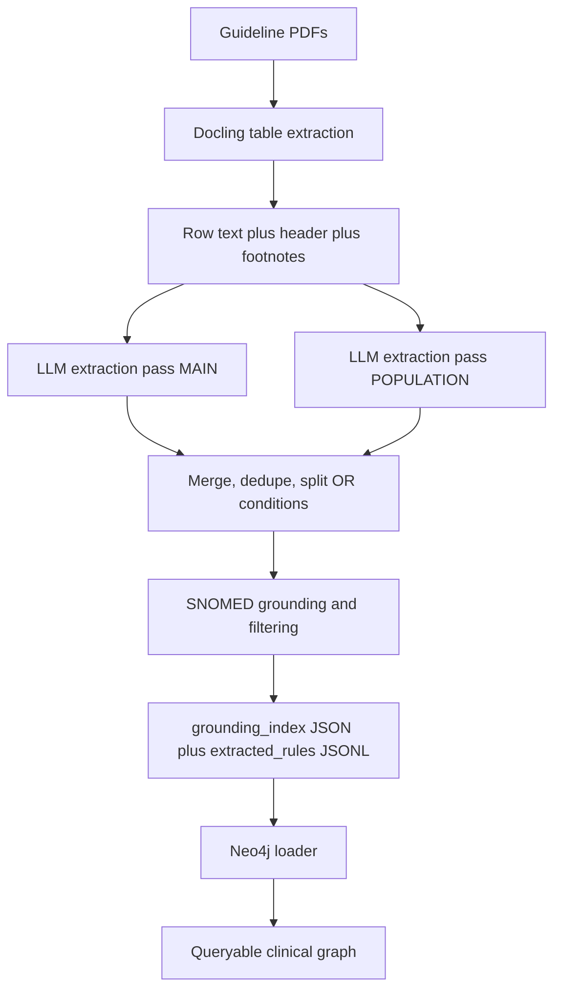
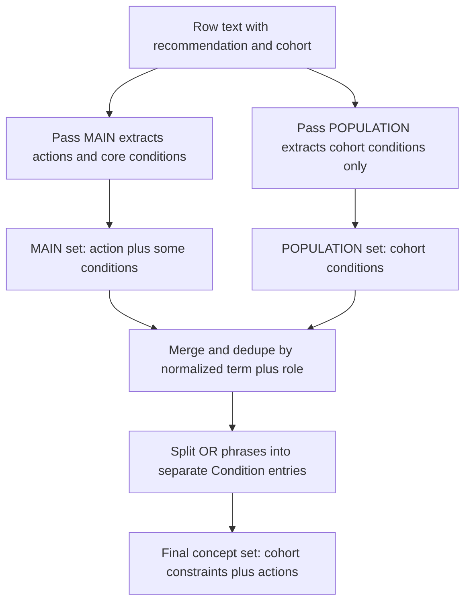
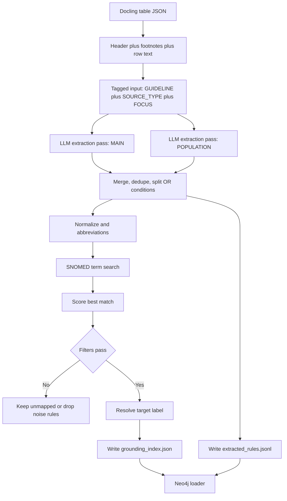

# CardioGuidelinesGraph

Comprehensive knowledge graph construction and reasoning for cardiovascular guidelines, focused on a lean, reproducible pipeline that converts guideline tables into logic-aware Neo4j graphs.

## Table of contents

- [Project vision](#project-vision)
- [High-level pipeline](#high-level-pipeline)
- [Compact project layout](#compact-project-layout)
- [Extraction and grounding pipeline details](#extraction-and-grounding-pipeline-details)
- [LLM tagging format](#llm-tagging-format)
- [Two-pass extraction and merge](#two-pass-extraction-and-merge)
- [Grounding and filtering](#grounding-and-filtering)
- [Full pipeline flowchart](#full-pipeline-flowchart)
- [Outputs](#outputs)
- [Neo4j mapping](#neo4j-mapping)
- [Quickstart](#quickstart)
- [Key configuration](#key-configuration)

## Project vision

CardioGuidelinesGraph transforms guideline tables into a computable, queryable, and explainable knowledge graph. It enables:

- Semantic interoperability via SNOMED CT integration
- Logic-aware reasoning for complex clinical recommendations
- Patient-specific question answering and evidence tracing
- Rapid extension to new guidelines and tables

## High-level pipeline


```mermaid
flowchart TD
  A[Guideline PDFs] --> B[Docling table extraction]
  B --> C[Row text plus header plus footnotes]
  C --> D[LLM extraction pass MAIN]
  C --> E[LLM extraction pass POPULATION]
  D --> F[Merge, dedupe, split OR conditions]
  E --> F
  F --> G[SNOMED grounding and filtering]
  G --> H[grounding_index JSON plus extracted_rules JSONL]
  H --> I[Neo4j loader]
  I --> J[Queryable clinical graph]
```

## Compact project layout

Core modules are now in a single package:

- [src/cardio_graph_core/extraction/guideline_graph_builder.py](src/cardio_graph_core/extraction/guideline_graph_builder.py)
- [src/cardio_graph_core/neo4j/grounding_index_to_neo4j.py](src/cardio_graph_core/neo4j/grounding_index_to_neo4j.py)
- [src/cardio_graph_core/parsing/docling/parse_pdfs_with_docling.py](src/cardio_graph_core/parsing/docling/parse_pdfs_with_docling.py)
- [src/cardio_graph_core/snomedct/snomed_query.py](src/cardio_graph_core/snomedct/snomed_query.py)

Legacy modules are archived in [archive/cardio_graph_legacy](archive/cardio_graph_legacy).

## Extraction and grounding pipeline details

### LLM tagging format

Each row input is tagged before calling BAML:

- GUIDELINE: title
- SOURCE_TYPE: table
- FOCUS: MAIN or POPULATION

### Two-pass extraction and merge

We run two passes over the same row text:

1) MAIN: conditions or parameters plus actions
2) POPULATION: cohort and population conditions only

The results are merged and deduplicated, then OR conditions are split.

Example (two-pass extraction and merge):

Input row:
"In chronic coronary syndrome patients with LVEF <= 35% who are high surgical risk or not operable, PCI may be considered."

MAIN pass output:
- Condition: chronic coronary syndrome patients
- ClinicalParameter: left ventricular ejection fraction <= 35% with operator <= threshold 35 unit %
- Condition: high surgical risk
- Condition: not operable
- Procedure: percutaneous coronary intervention with Class IIb Level B

POPULATION pass output:
- Condition: chronic coronary syndrome patients
- ClinicalParameter: left ventricular ejection fraction <= 35% with operator <= threshold 35 unit %

Merge result:
- Keep one copy of shared population conditions
- Keep action from MAIN
- Split "high surgical risk or not operable" into two Condition concepts with OR logic group


```mermaid
graph TD
  A[Row text with recommendation and cohort] --> B[Pass MAIN extracts actions and core conditions]
  A --> C[Pass POPULATION extracts cohort conditions only]
  B --> D[MAIN set: action plus some conditions]
  C --> E[POPULATION set: cohort conditions]
  D --> F[Merge and dedupe by normalized term plus role]
  E --> F
  F --> G[Split OR phrases into separate Condition entries]
  G --> H[Final concept set: cohort constraints plus actions]
```

### Grounding and filtering

Scoring selects the best candidate by composite similarity, then applies filters:

- min match score: drop low-confidence mappings
- domain filter: keep candidates whose taxonomy path intersects allowed root concepts per role
- semantic tag filter: enforce FSN tag allowlist
- off-domain minimum score: allow off-domain candidates only if they score >= threshold

Example (scoring):

```
Input term: SYNTAX score
Candidate A: Leukocyte alkaline phosphatase score (procedure) -> score 0.72
Candidate B: SYNTAX score (procedure) -> score 0.93
Result: Candidate B wins; if min match score is 0.9, candidate B is kept
```

Example (domain filter):

```
Role: ClinicalParameter
Allowed roots: Observable entity
Candidate term: Determination of ventricular ejection fraction (procedure)
Taxonomy path: Procedure
Result: Filtered out because no Observable entity in the path
```

### Full pipeline flowchart


```mermaid
flowchart TD
  A[Docling table JSON] --> B[Header plus footnotes plus row text]
  B --> C[Tagged input: GUIDELINE plus SOURCE_TYPE plus FOCUS]
  C --> D[LLM extraction pass: MAIN]
  C --> E[LLM extraction pass: POPULATION]
  D --> F[Merge, dedupe, split OR conditions]
  E --> F
  F --> G[Normalize and abbreviations]
  G --> H[SNOMED term search]
  H --> I[Score best match]
  I --> J{Filters pass}
  J -- No --> K[Keep unmapped or drop noise rules]
  J -- Yes --> L[Resolve target label]
  L --> M[Write grounding_index.json]
  F --> N[Write extracted_rules.jsonl]
  M --> O[Neo4j loader]
  N --> O
```

### Outputs

- grounding_index JSON: SNOMED cache by ID
- extracted_rules JSONL: logic-preserving rule entries

Example grounding entry:

```json
{
  "entity_standardized_candidate": "left ventricular ejection fraction <= 35%",
  "snomed_id": 250908004,
  "preferred_term": "Left ventricular ejection fraction (observable entity)",
  "score": 0.91,
  "taxonomy_path": [{"concept_id": "250908004", "term": "..."}],
  "target_label": "ClinicalParameter"
}
```

### Neo4j mapping

The loader builds:

- Concept nodes merged by snomed_id and labeled by target_label
- Decision and recommendation nodes from rules
- Edges: CHECKS_FOR, EVALUATES, LEADS_TO, RESULTS_IN, RECOMMENDS_PROCEDURE, RECOMMENDS_MEDICATION

## Quickstart

```bash
poetry install
poetry shell
```

Row-wise extraction example:

```bash
poetry run python src/cardio_graph_core/extraction/guideline_graph_builder.py \
  --docling-table-json /prj/doctoral_letters/guide/data/guidelines/docling/pdf_pages/_62/tables/table_000.json \
  --docling-table-json /prj/doctoral_letters/guide/data/guidelines/docling/pdf_pages/_63/tables/table_000.json \
  --docling-table-id _62_63/table_000.json \
  --docling-footnotes-path /tmp/docling_table_footnotes.txt \
  --min-match-score 0.6 \
  --domain-filter \
  --off-domain-min-score 0.9 \
  --guideline-title "2024 ESC Guidelines for the management of chronic coronary syndromes" \
  --index-path /prj/doctoral_letters/guide/data/graph/grounding_index_docling_table_000.json \
  --rules-out-path /prj/doctoral_letters/guide/data/graph/extracted_rules_docling_table_000.jsonl \
  --node g5 \
  --model Qwen30b
```

Load into Neo4j:

```bash
poetry run python src/cardio_graph_core/neo4j/grounding_index_to_neo4j.py \
  --index-path /prj/doctoral_letters/guide/data/graph/grounding_index_docling_table_000.json \
  --rules-path /prj/doctoral_letters/guide/data/graph/extracted_rules_docling_table_000.jsonl
```

## Key configuration

- SNOMED mapping rules: [src/cardio_graph_core/snomedct/guideline_graph_schema.yaml](src/cardio_graph_core/snomedct/guideline_graph_schema.yaml)
- Abbreviations: [src/cardio_graph_core/snomedct/abbrv.txt](src/cardio_graph_core/snomedct/abbrv.txt)
- LLM model registry: [src/cardio_graph_core/extraction/clients.py](src/cardio_graph_core/extraction/clients.py)
- SNOMED query: [src/cardio_graph_core/snomedct/snomed_query.py](src/cardio_graph_core/snomedct/snomed_query.py)
- Neo4j loader: [src/cardio_graph_core/neo4j/grounding_index_to_neo4j.py](src/cardio_graph_core/neo4j/grounding_index_to_neo4j.py)