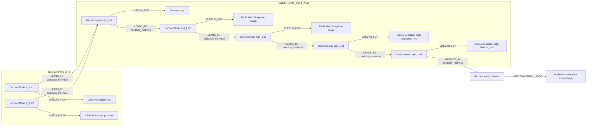

# Ground Truth Rules - Table 17 Row 06

- table: 17
- row: row_06

Recommendation text:

```text
ticagrelor monotherapy 90 mg b.i.d. may be considered as an alternative to dual or other IIb C single antiplatelet therapy
```

Ground-truth rules:

```json
[
  {
    "conditions": [
      {
        "entity": "ccs",
        "entity_original": "ccs",
        "role": "ClinicalCondition",
        "operator": "PRESENT",
        "threshold": null,
        "unit": null,
        "context": null,
        "logic_type": "OR",
        "logic_group": "or_1",
        "strength": null,
        "level": null,
        "direction": null,
        "_side": "condition"
      },
      {
        "entity": "post acs",
        "entity_original": "post acs",
        "role": "ClinicalCondition",
        "operator": "PRESENT",
        "threshold": null,
        "unit": null,
        "context": null,
        "logic_type": "OR",
        "logic_group": "or_1",
        "strength": null,
        "level": null,
        "direction": null,
        "_side": "condition"
      },
      {
        "entity": "pci",
        "entity_original": "pci",
        "role": "Procedure",
        "operator": "PRESENT",
        "threshold": null,
        "unit": null,
        "context": null,
        "logic_type": "AND",
        "logic_group": "and_1",
        "strength": null,
        "level": null,
        "direction": null,
        "_side": "condition"
      },
      {
        "entity": "ticagrelor-based",
        "entity_original": "ticagrelor-based",
        "role": "Medication",
        "operator": "PRESENT",
        "threshold": null,
        "unit": null,
        "context": null,
        "logic_type": "AND",
        "logic_group": "and_1",
        "strength": null,
        "level": null,
        "direction": null,
        "_side": "condition"
      },
      {
        "entity": "ticagrelor-based",
        "entity_original": "ticagrelor-based",
        "role": "Medication",
        "operator": "PRESENT",
        "threshold": null,
        "unit": null,
        "context": null,
        "logic_type": "AND",
        "logic_group": "and_1",
        "strength": null,
        "level": null,
        "direction": null,
        "_side": "condition"
      },
      {
        "entity": "high ischaemic risk",
        "entity_original": "high ischaemic risk",
        "role": "ClinicalCondition",
        "operator": "PRESENT",
        "threshold": null,
        "unit": null,
        "context": null,
        "logic_type": "AND",
        "logic_group": "and_1",
        "strength": null,
        "level": null,
        "direction": null,
        "_side": "condition"
      },
      {
        "entity": "high bleeding risk",
        "entity_original": "high bleeding risk",
        "role": "ClinicalCondition",
        "operator": "ABSENT",
        "threshold": null,
        "unit": null,
        "context": null,
        "logic_type": "AND",
        "logic_group": "and_1",
        "strength": null,
        "level": null,
        "direction": null,
        "_side": "condition"
      }
    ],
    "actions": [
      {
        "entity": "ticagrelor monotherapy",
        "entity_original": "ticagrelor monotherapy",
        "role": "Medication",
        "operator": null,
        "threshold": null,
        "unit": null,
        "context": null,
        "logic_type": null,
        "logic_group": null,
        "strength": "IIb",
        "level": "C",
        "direction": "POSITIVE",
        "_side": "action"
      }
    ]
  }
]
```

Mermaid graph:


