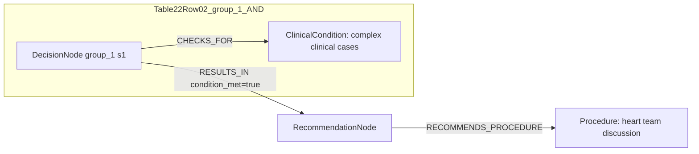

# Ground Truth Rules - Table 22 Row 02

- table: 22
- row: row_02

Recommendation text:

```text
a Heart Team discussion is recommended to define the optimal treatment strategy, including representatives from interventional cardiology, cardiac surgery, non-interventional cardiology, and other specialties if indicated, aimed at selecting the most appropriate treatment to improve patient outcomes and quality of life.
```

Ground-truth rules:

```json
[
  {
    "conditions": [
      {
        "entity": "complex clinical cases",
        "entity_original": "complex clinical cases",
        "role": "ClinicalCondition",
        "operator": "PRESENT",
        "threshold": null,
        "unit": null,
        "context": null,
        "logic_type": "NULL",
        "logic_group": null,
        "strength": null,
        "level": null,
        "direction": null,
        "_side": "condition"
      }
    ],
    "actions": [
      {
        "entity": "heart team discussion",
        "entity_original": "heart team discussion",
        "role": "Procedure",
        "operator": null,
        "threshold": null,
        "unit": null,
        "context": null,
        "logic_type": null,
        "logic_group": null,
        "strength": "I",
        "level": "C",
        "direction": "POSITIVE",
        "_side": "action"
      }
    ]
  }
]
```

Mermaid graph:


