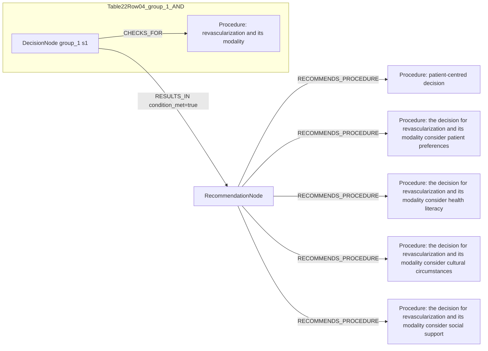

# Ground Truth Rules - Table 22 Row 04

- table: 22
- row: row_04

Recommendation text:

```text
It is recommended that the decision for revascularization and its modality be patient-centred, considering patient preferences, health literacy, cultural circumstances, and social support
```

Ground-truth rules:

```json
[
  {
    "conditions": [
      {
        "entity": "revascularization and its modality",
        "entity_original": "revascularization and its modality",
        "role": "Procedure",
        "operator": "PRESENT",
        "threshold": null,
        "unit": null,
        "context": null,
        "logic_type": "NULL",
        "logic_group": null,
        "strength": null,
        "level": null,
        "direction": null,
        "_side": "condition"
      }
    ],
    "actions": [
      {
        "entity": "patient-centred decision",
        "entity_original": "patient-centred decision",
        "role": "Procedure",
        "operator": null,
        "threshold": null,
        "unit": null,
        "context": null,
        "logic_type": null,
        "logic_group": null,
        "strength": "I",
        "level": "C",
        "direction": "positive",
        "_side": "action"
      },
      {
        "entity": "the decision for revascularization and its modality consider patient preferences",
        "entity_original": "the decision for revascularization and its modality consider patient preferences",
        "role": "Procedure",
        "operator": null,
        "threshold": null,
        "unit": null,
        "context": null,
        "logic_type": null,
        "logic_group": null,
        "strength": "I",
        "level": "C",
        "direction": "positive",
        "_side": "action"
      },
      {
        "entity": "the decision for revascularization and its modality consider health literacy",
        "entity_original": "the decision for revascularization and its modality consider health literacy",
        "role": "Procedure",
        "operator": null,
        "threshold": null,
        "unit": null,
        "context": null,
        "logic_type": null,
        "logic_group": null,
        "strength": "I",
        "level": "C",
        "direction": "positive",
        "_side": "action"
      },
      {
        "entity": "the decision for revascularization and its modality consider cultural circumstances",
        "entity_original": "the decision for revascularization and its modality consider cultural circumstances",
        "role": "Procedure",
        "operator": null,
        "threshold": null,
        "unit": null,
        "context": null,
        "logic_type": null,
        "logic_group": null,
        "strength": "I",
        "level": "C",
        "direction": "positive",
        "_side": "action"
      },
      {
        "entity": "the decision for revascularization and its modality consider social support",
        "entity_original": "the decision for revascularization and its modality consider social support",
        "role": "Procedure",
        "operator": null,
        "threshold": null,
        "unit": null,
        "context": null,
        "logic_type": null,
        "logic_group": null,
        "strength": "I",
        "level": "C",
        "direction": "positive",
        "_side": "action"
      }
    ]
  }
]
```

Mermaid graph:


