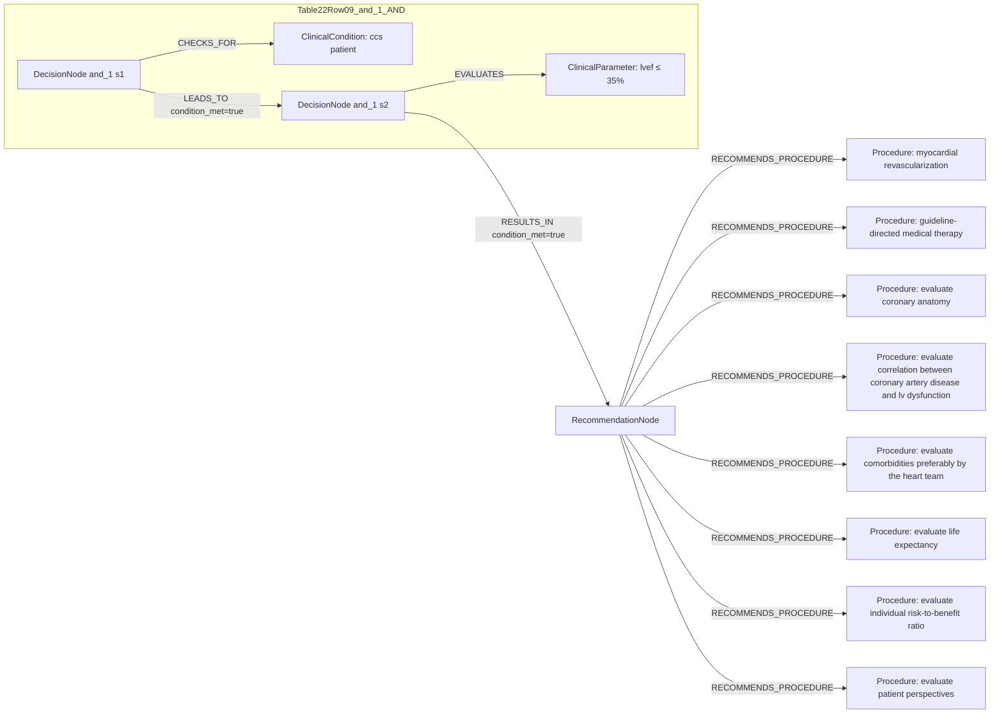

# Ground Truth Rules - Table 22 Row 09

- table: 22
- row: row_09

Recommendation text:

```text
it is recommended to choose between revascularization or medical therapy alone, after careful evaluation, preferably by the Heart Team, of coronary anatomy, correlation between coronary artery disease and LV dysfunction, comorbidities, life expectancy, individual risk-to-benefit ratio, and patient perspectives.
```

Ground-truth rules:

```json
[
  {
    "conditions": [
      {
        "entity": "ccs patient",
        "entity_original": "ccs patient",
        "role": "ClinicalCondition",
        "operator": "PRESENT",
        "threshold": null,
        "unit": null,
        "context": null,
        "logic_type": "AND",
        "logic_group": "and_1",
        "strength": null,
        "level": null,
        "direction": null,
        "_side": "condition"
      },
      {
        "entity": "lvef \u2264 35%",
        "entity_original": "lvef \u2264 35%",
        "role": "ClinicalParameter",
        "operator": "\u2264",
        "threshold": "35",
        "unit": "%",
        "context": null,
        "logic_type": "AND",
        "logic_group": "and_1",
        "strength": null,
        "level": null,
        "direction": null,
        "_side": "condition"
      }
    ],
    "actions": [
      {
        "entity": "myocardial revascularization",
        "entity_original": "myocardial revascularization",
        "role": "Procedure",
        "operator": "PRESENT",
        "threshold": null,
        "unit": null,
        "context": null,
        "logic_type": "OR",
        "logic_group": "or_1",
        "strength": "I",
        "level": "C",
        "direction": "POSITIVE",
        "_side": "action"
      },
      {
        "entity": "guideline-directed medical therapy",
        "entity_original": "guideline-directed medical therapy",
        "role": "Procedure",
        "operator": "PRESENT",
        "threshold": null,
        "unit": null,
        "context": null,
        "logic_type": "OR",
        "logic_group": "or_1",
        "strength": "I",
        "level": "C",
        "direction": "POSITIVE",
        "_side": "action"
      },
      {
        "entity": "evaluate coronary anatomy",
        "entity_original": "evaluate coronary anatomy",
        "role": "Procedure",
        "operator": "PRESENT",
        "threshold": null,
        "unit": null,
        "context": null,
        "logic_type": "AND",
        "logic_group": "and_1",
        "strength": "I",
        "level": "C",
        "direction": "POSITIVE",
        "_side": "action"
      },
      {
        "entity": "evaluate correlation between coronary artery disease and lv dysfunction",
        "entity_original": "evaluate correlation between coronary artery disease and lv dysfunction",
        "role": "Procedure",
        "operator": "PRESENT",
        "threshold": null,
        "unit": null,
        "context": null,
        "logic_type": "AND",
        "logic_group": "and_1",
        "strength": "I",
        "level": "C",
        "direction": "POSITIVE",
        "_side": "action"
      },
      {
        "entity": "evaluate comorbidities preferably by the heart team",
        "entity_original": "evaluate comorbidities preferably by the heart team",
        "role": "Procedure",
        "operator": "PRESENT",
        "threshold": null,
        "unit": null,
        "context": null,
        "logic_type": "AND",
        "logic_group": "and_1",
        "strength": "I",
        "level": "C",
        "direction": "POSITIVE",
        "_side": "action"
      },
      {
        "entity": "evaluate life expectancy",
        "entity_original": "evaluate life expectancy",
        "role": "Procedure",
        "operator": "PRESENT",
        "threshold": null,
        "unit": null,
        "context": null,
        "logic_type": "AND",
        "logic_group": "and_1",
        "strength": "I",
        "level": "C",
        "direction": "POSITIVE",
        "_side": "action"
      },
      {
        "entity": "evaluate individual risk-to-benefit ratio",
        "entity_original": "evaluate individual risk-to-benefit ratio",
        "role": "Procedure",
        "operator": "PRESENT",
        "threshold": null,
        "unit": null,
        "context": null,
        "logic_type": "AND",
        "logic_group": "and_1",
        "strength": "I",
        "level": "C",
        "direction": "POSITIVE",
        "_side": "action"
      },
      {
        "entity": "evaluate patient perspectives",
        "entity_original": "evaluate patient perspectives",
        "role": "Procedure",
        "operator": "PRESENT",
        "threshold": null,
        "unit": null,
        "context": null,
        "logic_type": "AND",
        "logic_group": "and_1",
        "strength": "I",
        "level": "C",
        "direction": "POSITIVE",
        "_side": "action"
      }
    ]
  }
]
```

Mermaid graph:


