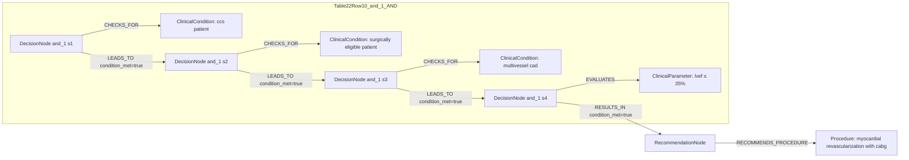

# Ground Truth Rules - Table 22 Row 10

- table: 22
- row: row_10

Recommendation text:

```text
myocardial revascularization with CABG is recommended over medical therapy alone to improve long-term survival
```

Ground-truth rules:

```json
[
  {
    "conditions": [
      {
        "entity": "ccs patient",
        "entity_original": "ccs patient",
        "role": "ClinicalCondition",
        "operator": "PRESENT",
        "threshold": null,
        "unit": null,
        "context": null,
        "logic_type": "AND",
        "logic_group": "and_1",
        "strength": null,
        "level": null,
        "direction": null,
        "_side": "condition"
      },
      {
        "entity": "surgically eligible patient",
        "entity_original": "surgically eligible patient",
        "role": "ClinicalCondition",
        "operator": "PRESENT",
        "threshold": null,
        "unit": null,
        "context": null,
        "logic_type": "AND",
        "logic_group": "and_1",
        "strength": null,
        "level": null,
        "direction": null,
        "_side": "condition"
      },
      {
        "entity": "multivessel cad",
        "entity_original": "multivessel cad",
        "role": "ClinicalCondition",
        "operator": "PRESENT",
        "threshold": null,
        "unit": null,
        "context": null,
        "logic_type": "AND",
        "logic_group": "and_1",
        "strength": null,
        "level": null,
        "direction": null,
        "_side": "condition"
      },
      {
        "entity": "lvef \u2264 35%",
        "entity_original": "lvef \u2264 35%",
        "role": "ClinicalParameter",
        "operator": "\u2264",
        "threshold": "35",
        "unit": "%",
        "context": null,
        "logic_type": "AND",
        "logic_group": "and_1",
        "strength": null,
        "level": null,
        "direction": null,
        "_side": "condition"
      }
    ],
    "actions": [
      {
        "entity": "myocardial revascularization with cabg",
        "entity_original": "myocardial revascularization with cabg",
        "role": "Procedure",
        "operator": null,
        "threshold": null,
        "unit": null,
        "context": null,
        "logic_type": null,
        "logic_group": null,
        "strength": "I",
        "level": "B",
        "direction": "POSITIVE",
        "_side": "action"
      }
    ]
  }
]
```

Mermaid graph:


