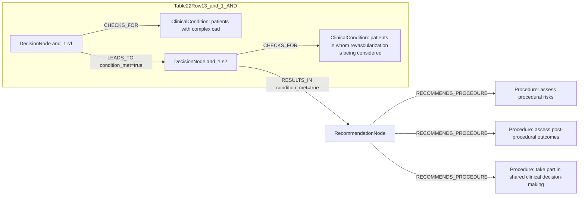

# Ground Truth Rules - Table 22 Row 13

- table: 22
- row: row_13

Recommendation text:

```text
it is recommended to assess procedural risks and post-procedural outcomes to guide shared clinical decision-making
```

Ground-truth rules:

```json
[
  {
    "conditions": [
      {
        "entity": "patients with complex cad",
        "entity_original": "patients with complex cad",
        "role": "ClinicalCondition",
        "operator": "PRESENT",
        "threshold": null,
        "unit": null,
        "context": null,
        "logic_type": "AND",
        "logic_group": "and_1",
        "strength": null,
        "level": null,
        "direction": null,
        "_side": "condition"
      },
      {
        "entity": "patients in whom revascularization is being considered",
        "entity_original": "patients in whom revascularization is being considered",
        "role": "ClinicalCondition",
        "operator": "PRESENT",
        "threshold": null,
        "unit": null,
        "context": null,
        "logic_type": "AND",
        "logic_group": "and_1",
        "strength": null,
        "level": null,
        "direction": null,
        "_side": "condition"
      }
    ],
    "actions": [
      {
        "entity": "assess procedural risks",
        "entity_original": "assess procedural risks",
        "role": "Procedure",
        "operator": null,
        "threshold": null,
        "unit": null,
        "context": null,
        "logic_type": null,
        "logic_group": null,
        "strength": "I",
        "level": "C",
        "direction": "POSITIVE",
        "_side": "action"
      },
      {
        "entity": "assess post-procedural outcomes",
        "entity_original": "assess post-procedural outcomes",
        "role": "Procedure",
        "operator": null,
        "threshold": null,
        "unit": null,
        "context": null,
        "logic_type": null,
        "logic_group": null,
        "strength": "I",
        "level": "C",
        "direction": "POSITIVE",
        "_side": "action"
      },
      {
        "entity": "take part in shared clinical decision-making",
        "entity_original": "take part in shared clinical decision-making",
        "role": "Procedure",
        "operator": null,
        "threshold": null,
        "unit": null,
        "context": null,
        "logic_type": null,
        "logic_group": null,
        "strength": "I",
        "level": "C",
        "direction": "POSITIVE",
        "_side": "action"
      }
    ]
  }
]
```

Mermaid graph:


