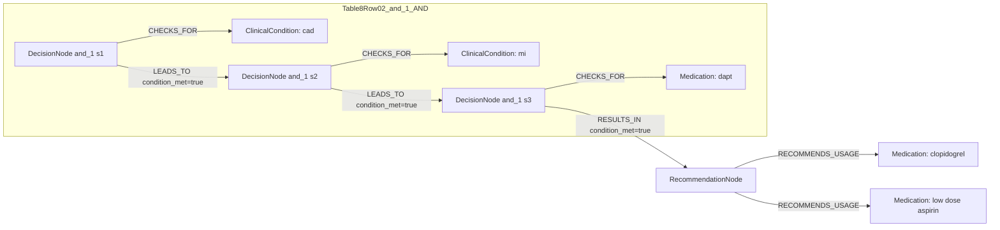

# Ground Truth Rules - Table 8 Row 02

- table: 8
- row: row_02

Recommendation text:

```text
Clopidogrel 75 mg/day Co-administered with low-dose aspirin 75-162 mg o.d.
```

Ground-truth rules:

```json
[
  {
    "conditions": [
      {
        "entity": "cad",
        "entity_original": "cad",
        "role": "ClinicalCondition",
        "operator": "PRESENT",
        "threshold": null,
        "unit": null,
        "context": null,
        "logic_type": "AND",
        "logic_group": "and_1",
        "strength": null,
        "level": null,
        "direction": null,
        "_side": "condition"
      },
      {
        "entity": "mi",
        "entity_original": "mi",
        "role": "ClinicalCondition",
        "operator": "PRESENT",
        "threshold": null,
        "unit": null,
        "context": null,
        "logic_type": "AND",
        "logic_group": "and_1",
        "strength": null,
        "level": null,
        "direction": null,
        "_side": "condition"
      },
      {
        "entity": "dapt",
        "entity_original": "dapt",
        "role": "Medication",
        "operator": "AND",
        "threshold": null,
        "unit": null,
        "context": null,
        "logic_type": "AND",
        "logic_group": "and_1",
        "strength": null,
        "level": null,
        "direction": null,
        "_side": "condition"
      }
    ],
    "actions": [
      {
        "entity": "clopidogrel",
        "entity_original": "clopidogrel",
        "role": "Medication",
        "operator": "PRESENT",
        "threshold": null,
        "unit": null,
        "context": null,
        "logic_type": "AND",
        "logic_group": "and_1",
        "strength": null,
        "level": null,
        "direction": "POSITIVE",
        "_side": "action"
      },
      {
        "entity": "low dose aspirin",
        "entity_original": "low dose aspirin",
        "role": "Medication",
        "operator": "PRESENT",
        "threshold": null,
        "unit": null,
        "context": null,
        "logic_type": "AND",
        "logic_group": "and_1",
        "strength": null,
        "level": null,
        "direction": "POSITIVE",
        "_side": "action"
      }
    ]
  }
]
```

Mermaid graph:


