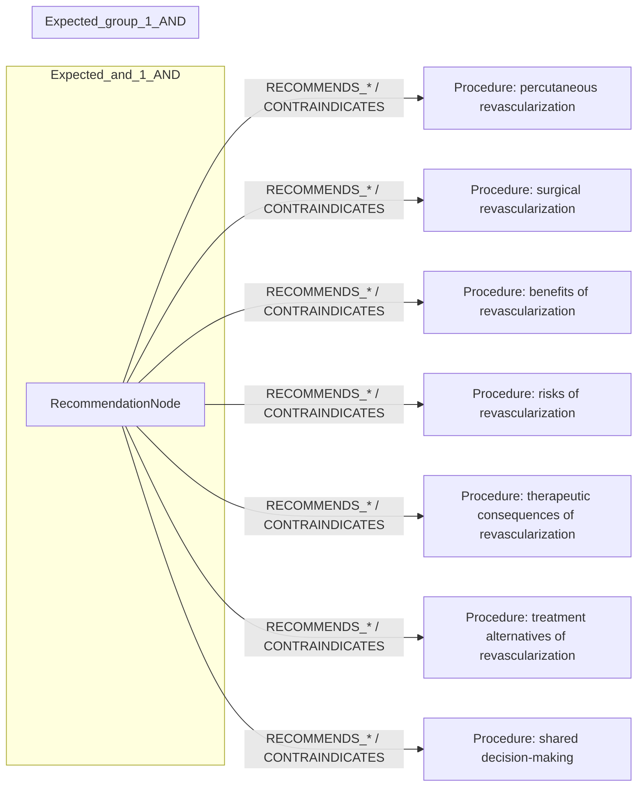
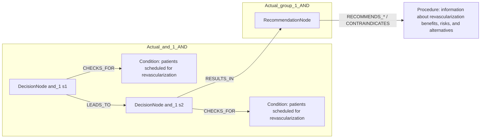

# row_01 (mapped to row_02)

Original table row text (ground truth):

```json
{
  "Table Header": "Recommendations for revascularization in patients with chronic coronary syndrome",
  "Section Header": "Informed and shared decisions",
  "Recommendations": "It is recommended that patients scheduled for percutaneous or surgical revascularization receive complete information about the benefits, risks, therapeutic consequences, and alternatives to revascularization, as part of shared clinical decision-making. 847,848,857",
  "input": "patients scheduled for percutaneous or surgical revascularization",
  "recommendation": "patients receive complete information about the benefits, risks, therapeutic consequences, and alternatives to revascularization, as part of shared clinical decision-making.",
  "Class a": "I",
  "Level b": "C"
}
```

Aligned JSON (expected vs actual):

<table>
  <tr>
    <th align="left">Expected</th>
    <th align="left">Actual</th>
  </tr>
  <tr>
    <td valign="top"><pre>
[
  {
    "entity": "percutaneous revascularization",
    "entity_original": "patients scheduled for percutaneous revascularization",
    "role": "Procedure",
    "operator": "PRESENT",
    "threshold": null,
    "unit": null,
    "condition_context": null,
    "logic_type": "AND",
    "logic_group": "and_1",
    "strength": null,
    "level": null,
    "direction": null
  },
  {
    "entity": "surgical revascularization",
    "entity_original": "patients scheduled for surgical revascularization",
    "role": "Procedure",
    "operator": "PRESENT",
    "threshold": null,
    "unit": null,
    "condition_context": null,
    "logic_type": "AND",
    "logic_group": "and_1",
    "strength": null,
    "level": null,
    "direction": null
  },
  {
    "entity": "benefits of revascularization",
    "entity_original": "provide information about benefits of revascularization",
    "role": "Procedure",
    "operator": null,
    "threshold": null,
    "unit": null,
    "condition_context": null,
    "logic_type": null,
    "logic_group": null,
    "strength": "I",
    "level": "C",
    "direction": "POSITIVE"
  },
  {
    "entity": "risks of revascularization",
    "entity_original": "provide information about risks of revascularization",
    "role": "Procedure",
    "operator": null,
    "threshold": null,
    "unit": null,
    "condition_context": null,
    "logic_type": null,
    "logic_group": null,
    "strength": "I",
    "level": "C",
    "direction": "POSITIVE"
  },
  {
    "entity": "therapeutic consequences of revascularization",
    "entity_original": "receive information about therapeutic consequences of revascularization",
    "role": "Procedure",
    "operator": null,
    "threshold": null,
    "unit": null,
    "condition_context": null,
    "logic_type": null,
    "logic_group": null,
    "strength": "I",
    "level": "C",
    "direction": "POSITIVE"
  },
  {
    "entity": "treatment alternatives of revascularization",
    "entity_original": "provide information about treatment alternatives of revascularization",
    "role": "Procedure",
    "operator": null,
    "threshold": null,
    "unit": null,
    "condition_context": null,
    "logic_type": null,
    "logic_group": null,
    "strength": "I",
    "level": "C",
    "direction": "POSITIVE"
  },
  {
    "entity": "shared decision-making",
    "entity_original": "take part in shared clinical decision-making",
    "role": "Procedure",
    "operator": null,
    "threshold": null,
    "unit": null,
    "condition_context": null,
    "logic_type": null,
    "logic_group": null,
    "strength": "I",
    "level": "C",
    "direction": "POSITIVE"
  }
]
</pre></td>
    <td valign="top"><pre>
[
  {
    "entity": "patients scheduled for revascularization",
    "entity_original": "patients scheduled for percutaneous or surgical revascularization",
    "role": "Condition",
    "operator": "PRESENT",
    "threshold": null,
    "unit": null,
    "condition_context": null,
    "logic_type": "AND",
    "logic_group": "and_1",
    "strength": "I",
    "level": "C",
    "direction": "POSITIVE"
  },
  {
    "entity": "information about revascularization benefits, risks, and alternatives",
    "entity_original": "complete information about the benefits, risks, therapeutic consequences, and alternatives to revascularization",
    "role": "Procedure",
    "operator": null,
    "threshold": null,
    "unit": null,
    "condition_context": null,
    "logic_type": null,
    "logic_group": null,
    "strength": "I",
    "level": "C",
    "direction": "POSITIVE"
  },
  {
    "entity": "patients scheduled for revascularization",
    "entity_original": "patients scheduled for percutaneous or surgical revascularization",
    "role": "Condition",
    "operator": "PRESENT",
    "threshold": null,
    "unit": null,
    "condition_context": "scheduled for",
    "logic_type": "AND",
    "logic_group": "and_1",
    "strength": "I",
    "level": "C",
    "direction": "UNKNOWN"
  }
]
</pre></td>
  </tr>
</table>

Mermaid (expected):



Mermaid (actual):



Concepts:
- expected: 7
- actual: 2
- matches: 0
- missing: 7
- extra: 2

Missing concepts:
- Procedure: benefits of revascularization
- Procedure: percutaneous revascularization
- Procedure: risks of revascularization
- Procedure: shared decision-making
- Procedure: surgical revascularization
- Procedure: therapeutic consequences of revascularization
- Procedure: treatment alternatives of revascularization

Extra concepts:
- Condition: patients scheduled for revascularization
- Procedure: information about revascularization benefits, risks, and alternatives

Rules (concept + logic fields):
- expected: 7
- actual: 3
- matches: 0
- missing: 7
- extra: 3

Missing rules:
- Procedure: benefits of revascularization | class=I | level=C | dir=POSITIVE
- Procedure: percutaneous revascularization | op=PRESENT | logic=AND | grp=and_1
- Procedure: risks of revascularization | class=I | level=C | dir=POSITIVE
- Procedure: shared decision-making | class=I | level=C | dir=POSITIVE
- Procedure: surgical revascularization | op=PRESENT | logic=AND | grp=and_1
- Procedure: therapeutic consequences of revascularization | class=I | level=C | dir=POSITIVE
- Procedure: treatment alternatives of revascularization | class=I | level=C | dir=POSITIVE

Extra rules:
- Condition: patients scheduled for revascularization | op=PRESENT | ctx=scheduled for | logic=AND | grp=and_1 | class=I | level=C | dir=UNKNOWN
- Condition: patients scheduled for revascularization | op=PRESENT | logic=AND | grp=and_1 | class=I | level=C | dir=POSITIVE
- Procedure: information about revascularization benefits, risks, and alternatives | class=I | level=C | dir=POSITIVE

