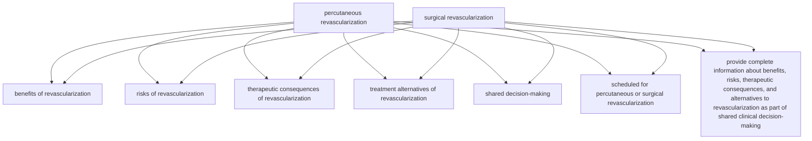

# row_01

## Ground Truth

```json
{
  "rules": [
    {
      "conditions": [
        {
          "entity": "percutaneous revascularization",
          "entity_original": "patients scheduled for percutaneous revascularization",
          "role": "Procedure",
          "side": "condition",
          "operator": "PRESENT",
          "threshold": null,
          "unit": null,
          "context": null,
          "logic_type": "OR",
          "logic_group": "or_1",
          "strength": null,
          "level": null,
          "direction": null
        },
        {
          "entity": "surgical revascularization",
          "entity_original": "patients scheduled for surgical revascularization",
          "role": "Procedure",
          "side": "condition",
          "operator": "PRESENT",
          "threshold": null,
          "unit": null,
          "context": null,
          "logic_type": "OR",
          "logic_group": "or_1",
          "strength": null,
          "level": null,
          "direction": null
        }
      ],
      "actions": [
        {
          "entity": "benefits of revascularization",
          "entity_original": "provide information about benefits of revascularization",
          "role": "ClinicalAction",
          "side": "action",
          "operator": null,
          "threshold": null,
          "unit": null,
          "context": null,
          "logic_type": null,
          "logic_group": null,
          "strength": "I",
          "level": "C",
          "direction": "POSITIVE"
        },
        {
          "entity": "risks of revascularization",
          "entity_original": "provide information about risks of revascularization",
          "role": "ClinicalAction",
          "side": "action",
          "operator": null,
          "threshold": null,
          "unit": null,
          "context": null,
          "logic_type": null,
          "logic_group": null,
          "strength": "I",
          "level": "C",
          "direction": "POSITIVE"
        },
        {
          "entity": "therapeutic consequences of revascularization",
          "entity_original": "receive information about therapeutic consequences of revascularization",
          "role": "ClinicalAction",
          "side": "action",
          "operator": null,
          "threshold": null,
          "unit": null,
          "context": null,
          "logic_type": null,
          "logic_group": null,
          "strength": "I",
          "level": "C",
          "direction": "POSITIVE"
        },
        {
          "entity": "treatment alternatives of revascularization",
          "entity_original": "provide information about treatment alternatives of revascularization",
          "role": "ClinicalAction",
          "side": "action",
          "operator": null,
          "threshold": null,
          "unit": null,
          "context": null,
          "logic_type": null,
          "logic_group": null,
          "strength": "I",
          "level": "C",
          "direction": "POSITIVE"
        },
        {
          "entity": "shared decision-making",
          "entity_original": "take part in shared clinical decision-making",
          "role": "ClinicalAction",
          "side": "action",
          "operator": null,
          "threshold": null,
          "unit": null,
          "context": null,
          "logic_type": null,
          "logic_group": null,
          "strength": "I",
          "level": "C",
          "direction": "POSITIVE"
        }
      ]
    }
  ]
}
```

## Extracted

```json
{
  "rules": [
    {
      "conditions": [],
      "actions": [
        {
          "entity": "scheduled for percutaneous or surgical revascularization",
          "entity_original": "patients scheduled for percutaneous or surgical revascularization",
          "role": "Procedure",
          "side": "action",
          "operator": "PLANNED",
          "threshold": null,
          "unit": null,
          "context": null,
          "logic_type": null,
          "logic_group": null,
          "strength": "Class I",
          "level": "C",
          "direction": "POSITIVE"
        },
        {
          "entity": "provide complete information about benefits, risks, therapeutic consequences, and alternatives to revascularization as part of shared clinical decision-making",
          "entity_original": "patients receive complete information about the benefits, risks, therapeutic consequences, and alternatives to revascularization, as part of shared clinical decision-making",
          "role": "Procedure",
          "side": "action",
          "operator": null,
          "threshold": null,
          "unit": null,
          "context": null,
          "logic_type": null,
          "logic_group": null,
          "strength": "Class I",
          "level": "C",
          "direction": "POSITIVE"
        }
      ]
    }
  ]
}
```

## Mermaid



Match Score: 0.29
