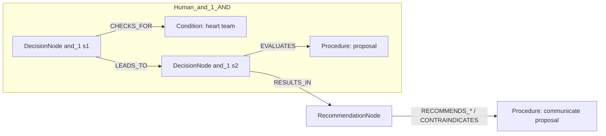
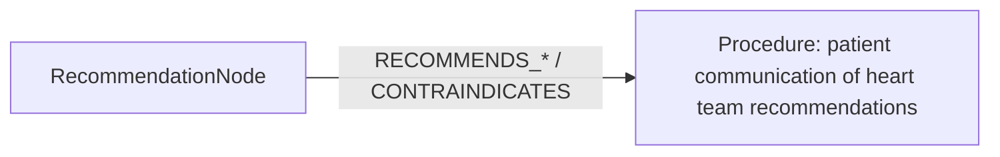

# row_03 (mapped to row_04)

Original table row text (ground truth):

```json
{
  "Recommendations": "It is recommended to communicate the proposal of the Heart Team in a balanced way using language that the patient can understand.",
  "Class a": "I",
  "Level b": "C"
}
```

Aligned JSON (expected vs actual):

<table>
  <tr>
    <th align="left">Human Annotation</th>
    <th align="left">LLM Generated</th>
  </tr>
  <tr>
    <td valign="top"><pre>
[
  {
    "rule_id": 1,
    "conditions": [
      {
        "entity": "heart team",
        "entity_original": "heart team",
        "role": "Condition",
        "operator": "PRESENT",
        "threshold": null,
        "unit": null,
        "condition_context": null,
        "logic_type": "AND",
        "logic_group": "and_1",
        "strength": null,
        "level": null,
        "direction": null
      },
      {
        "entity": "proposal",
        "entity_original": "proposal",
        "role": "Procedure",
        "operator": "PRESENT",
        "threshold": null,
        "unit": null,
        "condition_context": null,
        "logic_type": "AND",
        "logic_group": "and_1",
        "strength": null,
        "level": null,
        "direction": null
      }
    ],
    "actions": [
      {
        "entity": "communicate proposal",
        "entity_original": "communicate the proposal of the heart team in a balanced way using language that the patient can understand",
        "role": "Procedure",
        "operator": null,
        "threshold": null,
        "unit": null,
        "condition_context": null,
        "logic_type": null,
        "logic_group": null,
        "strength": "I",
        "level": "C",
        "direction": "POSITIVE"
      }
    ]
  }
]
</pre></td>
    <td valign="top"><pre>
[
  {
    "entity": "patient communication of heart team recommendations",
    "entity_original": "communicate the proposal of the heart team in a balanced way using language that the patient can understand",
    "role": "Procedure",
    "operator": null,
    "threshold": null,
    "unit": null,
    "condition_context": null,
    "logic_type": null,
    "logic_group": null,
    "strength": "I",
    "level": "C",
    "direction": "POSITIVE"
  }
]
</pre></td>
  </tr>
</table>

Mermaid (Human Annotation):



Mermaid (LLM Generated):



Concepts:
- expected: 3
- actual: 1
- matches: 0
- missing: 3
- extra: 1

Missing concepts:
- Condition: heart team
- Procedure: communicate proposal
- Procedure: proposal

Extra concepts:
- Procedure: patient communication of heart team recommendations

Rules (concept + logic fields):
- expected: 3
- actual: 1
- matches: 0
- missing: 3
- extra: 1

Missing rules:
- Condition: heart team | op=PRESENT | logic=AND | grp=and_1
- Procedure: communicate proposal | class=I | level=C | dir=POSITIVE
- Procedure: proposal | op=PRESENT | logic=AND | grp=and_1

Extra rules:
- Procedure: patient communication of heart team recommendations | class=I | level=C | dir=POSITIVE

