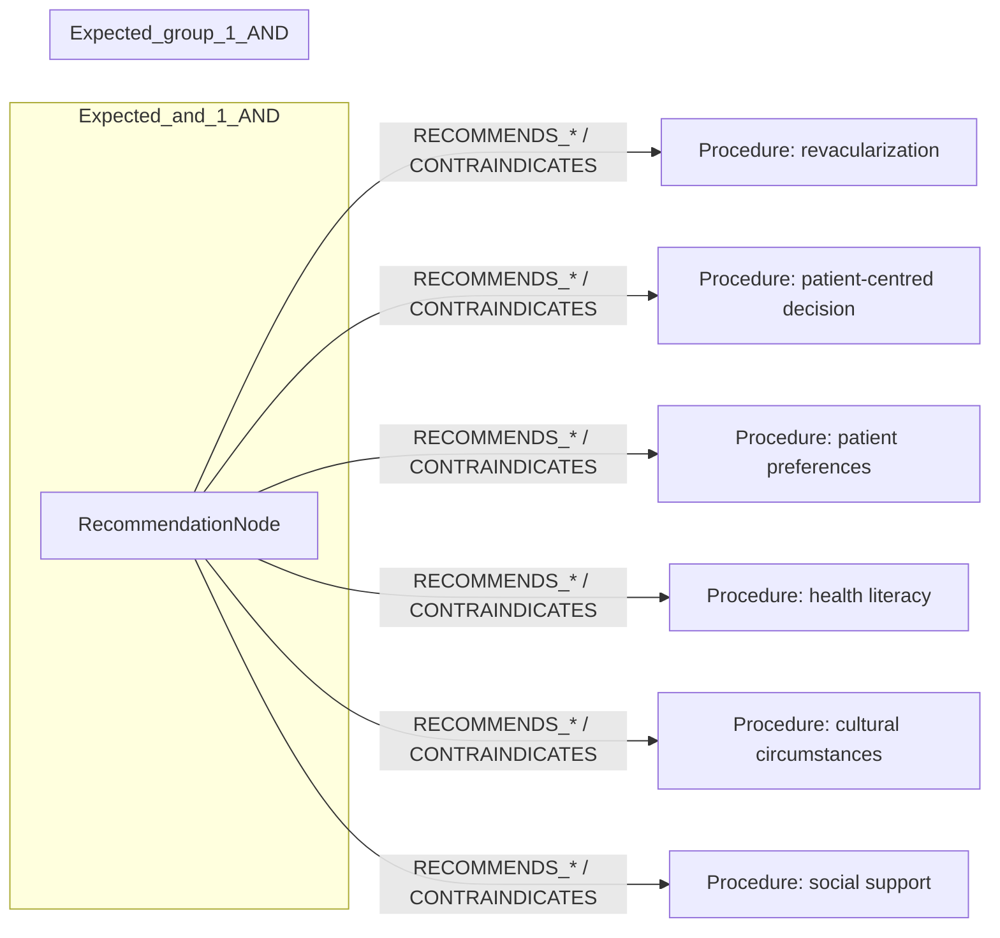
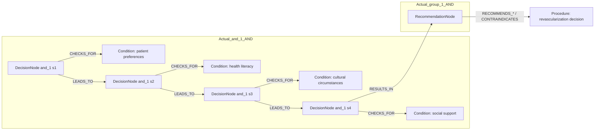

# row_04 (mapped to row_05)

Original table row text (ground truth):

```json
{
  "Recommendations": "It is recommended that the decision for revascularization and its modality be patient-centred, considering patient preferences, health literacy, cultural circumstances, and social support. 849-851",
  "Class a": "I",
  "Level b": "C"
}
```

Aligned JSON (expected vs actual):

<table>
  <tr>
    <th align="left">Human Annotation</th>
    <th align="left">LLM Generated</th>
  </tr>
  <tr>
    <td valign="top"><pre>
[
  {
    "rule_id": 1,
    "conditions": [
      {
        "entity": "revacularization",
        "entity_original": "the decision for revascularization and its modality",
        "role": "Procedure",
        "operator": "PRESENT",
        "threshold": null,
        "unit": null,
        "condition_context": null,
        "logic_type": "AND",
        "logic_group": "and_1",
        "strength": null,
        "level": null,
        "direction": null
      }
    ],
    "actions": [
      {
        "entity": "patient-centred decision",
        "entity_original": "the decision for revascularization and its modality be patient-centred",
        "role": "Procedure",
        "operator": null,
        "threshold": null,
        "unit": null,
        "condition_context": null,
        "logic_type": null,
        "logic_group": null,
        "strength": "I",
        "level": "C",
        "direction": "POSITIVE"
      },
      {
        "entity": "patient preferences",
        "entity_original": "the decision for revascularization and its modality consider patient preferences",
        "role": "Procedure",
        "operator": null,
        "threshold": null,
        "unit": null,
        "condition_context": null,
        "logic_type": null,
        "logic_group": null,
        "strength": "I",
        "level": "C",
        "direction": "POSITIVE"
      },
      {
        "entity": "health literacy",
        "entity_original": "the decision for revascularization and its modality consider health literacy",
        "role": "Procedure",
        "operator": null,
        "threshold": null,
        "unit": null,
        "condition_context": null,
        "logic_type": null,
        "logic_group": null,
        "strength": "I",
        "level": "C",
        "direction": "POSITIVE"
      },
      {
        "entity": "cultural circumstances",
        "entity_original": "the decision for revascularization and its modality consider cultural circumstances",
        "role": "Procedure",
        "operator": null,
        "threshold": null,
        "unit": null,
        "condition_context": null,
        "logic_type": null,
        "logic_group": null,
        "strength": "I",
        "level": "C",
        "direction": "POSITIVE"
      },
      {
        "entity": "social support",
        "entity_original": "the decision for revascularization and its modality consider social support",
        "role": "Procedure",
        "operator": null,
        "threshold": null,
        "unit": null,
        "condition_context": null,
        "logic_type": null,
        "logic_group": null,
        "strength": "I",
        "level": "C",
        "direction": "POSITIVE"
      }
    ]
  }
]
</pre></td>
    <td valign="top"><pre>
[
  {
    "entity": "patient preferences",
    "entity_original": "patient preferences",
    "role": "Condition",
    "operator": "PRESENT",
    "threshold": null,
    "unit": null,
    "condition_context": null,
    "logic_type": "AND",
    "logic_group": "and_1",
    "strength": "I",
    "level": "C",
    "direction": "POSITIVE"
  },
  {
    "entity": "health literacy",
    "entity_original": "health literacy",
    "role": "Condition",
    "operator": "PRESENT",
    "threshold": null,
    "unit": null,
    "condition_context": null,
    "logic_type": "AND",
    "logic_group": "and_1",
    "strength": "I",
    "level": "C",
    "direction": "POSITIVE"
  },
  {
    "entity": "cultural circumstances",
    "entity_original": "cultural circumstances",
    "role": "Condition",
    "operator": "PRESENT",
    "threshold": null,
    "unit": null,
    "condition_context": null,
    "logic_type": "AND",
    "logic_group": "and_1",
    "strength": "I",
    "level": "C",
    "direction": "POSITIVE"
  },
  {
    "entity": "social support",
    "entity_original": "social support",
    "role": "Condition",
    "operator": "PRESENT",
    "threshold": null,
    "unit": null,
    "condition_context": null,
    "logic_type": "AND",
    "logic_group": "and_1",
    "strength": "I",
    "level": "C",
    "direction": "POSITIVE"
  },
  {
    "entity": "revascularization decision",
    "entity_original": "decision for revascularization and its modality",
    "role": "Procedure",
    "operator": "PRESENT",
    "threshold": null,
    "unit": null,
    "condition_context": null,
    "logic_type": null,
    "logic_group": null,
    "strength": "I",
    "level": "C",
    "direction": "POSITIVE"
  }
]
</pre></td>
  </tr>
</table>

Mermaid (expected):



Mermaid (actual):



Concepts:
- expected: 6
- actual: 5
- matches: 0
- missing: 6
- extra: 5

Missing concepts:
- Procedure: cultural circumstances
- Procedure: health literacy
- Procedure: patient preferences
- Procedure: patient-centred decision
- Procedure: revacularization
- Procedure: social support

Extra concepts:
- Condition: cultural circumstances
- Condition: health literacy
- Condition: patient preferences
- Condition: social support
- Procedure: revascularization decision

Rules (concept + logic fields):
- expected: 6
- actual: 5
- matches: 0
- missing: 6
- extra: 5

Missing rules:
- Procedure: cultural circumstances | class=I | level=C | dir=POSITIVE
- Procedure: health literacy | class=I | level=C | dir=POSITIVE
- Procedure: patient preferences | class=I | level=C | dir=POSITIVE
- Procedure: patient-centred decision | class=I | level=C | dir=POSITIVE
- Procedure: revacularization | op=PRESENT | logic=AND | grp=and_1
- Procedure: social support | class=I | level=C | dir=POSITIVE

Extra rules:
- Condition: cultural circumstances | op=PRESENT | logic=AND | grp=and_1 | class=I | level=C | dir=POSITIVE
- Condition: health literacy | op=PRESENT | logic=AND | grp=and_1 | class=I | level=C | dir=POSITIVE
- Condition: patient preferences | op=PRESENT | logic=AND | grp=and_1 | class=I | level=C | dir=POSITIVE
- Condition: social support | op=PRESENT | logic=AND | grp=and_1 | class=I | level=C | dir=POSITIVE
- Procedure: revascularization decision | op=PRESENT | class=I | level=C | dir=POSITIVE

