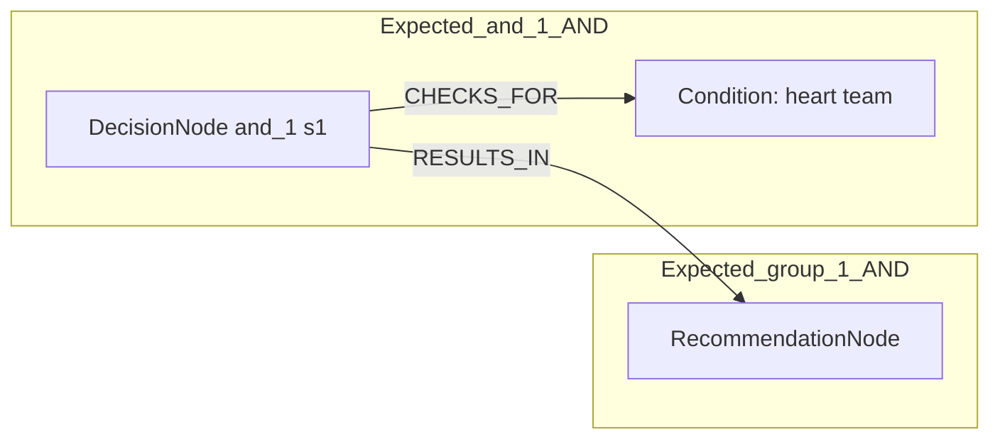
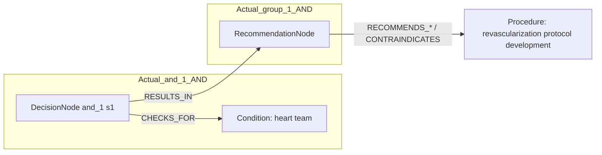

# row_05 (mapped to row_06)

Original table row text (ground truth):

```json
{
  "Table Header": "Recommendations for revascularization in patients with chronic coronary syndrome",
  "Section Header": "Informed and shared decisions",
  "Recommendations": "It is recommended that the Heart Team (on site or with a partner institution) develop institutional protocols to implement the appropriate revascularization strategy in accordance with current guidelines. 855,856,858",
  "input": "the Heart Team",
  "recommendation": "It is recommended that the Heart Team (on site or with a partner institution) develop institutional protocols to implement the appropriate revascularization strategy in accordance with current guidelines.",
  "Class a": "I",
  "Level b": "C"
}
```

Aligned JSON (expected vs actual):

<table>
  <tr>
    <th align="left">Expected</th>
    <th align="left">Actual</th>
  </tr>
  <tr>
    <td valign="top"><pre>
[
  {
    "entity": "heart team",
    "entity_original": "the heart team",
    "role": "Condition",
    "operator": "PRESENT",
    "threshold": null,
    "unit": null,
    "condition_context": null,
    "logic_type": "AND",
    "logic_group": "and_1",
    "strength": null,
    "level": null,
    "direction": null
  },
  {
    "entity": "protocols for revascularization",
    "entity_original": "develop institutional protocols to implement the appropriate revascularization strategy in accordance with current guidelines",
    "role": "string",
    "operator": null,
    "threshold": null,
    "unit": null,
    "condition_context": null,
    "logic_type": null,
    "logic_group": null,
    "strength": "I",
    "level": "C",
    "direction": "POSITIVE"
  }
]
</pre></td>
    <td valign="top"><pre>
[
  {
    "entity": "heart team",
    "entity_original": "heart team (on site or with a partner institution)",
    "role": "Condition",
    "operator": "PRESENT",
    "threshold": null,
    "unit": null,
    "condition_context": "on site or with a partner institution",
    "logic_type": "AND",
    "logic_group": "and_1",
    "strength": "I",
    "level": "C",
    "direction": "POSITIVE"
  },
  {
    "entity": "revascularization protocol development",
    "entity_original": "develop institutional protocols to implement the appropriate revascularization strategy in accordance with current guidelines",
    "role": "Procedure",
    "operator": null,
    "threshold": null,
    "unit": null,
    "condition_context": "in accordance with current guidelines",
    "logic_type": null,
    "logic_group": null,
    "strength": "I",
    "level": "C",
    "direction": "POSITIVE"
  }
]
</pre></td>
  </tr>
</table>

Mermaid (expected):



Mermaid (actual):



Concepts:
- expected: 2
- actual: 2
- matches: 1
- missing: 1
- extra: 1

Missing concepts:
- string: protocols for revascularization

Extra concepts:
- Procedure: revascularization protocol development

Rules (concept + logic fields):
- expected: 2
- actual: 2
- matches: 0
- missing: 2
- extra: 2

Missing rules:
- Condition: heart team | op=PRESENT | logic=AND | grp=and_1
- string: protocols for revascularization | class=I | level=C | dir=POSITIVE

Extra rules:
- Condition: heart team | op=PRESENT | ctx=on site or with a partner institution | logic=AND | grp=and_1 | class=I | level=C | dir=POSITIVE
- Procedure: revascularization protocol development | ctx=in accordance with current guidelines | class=I | level=C | dir=POSITIVE

