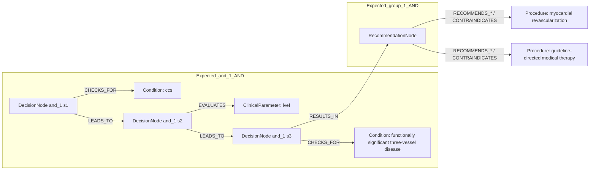
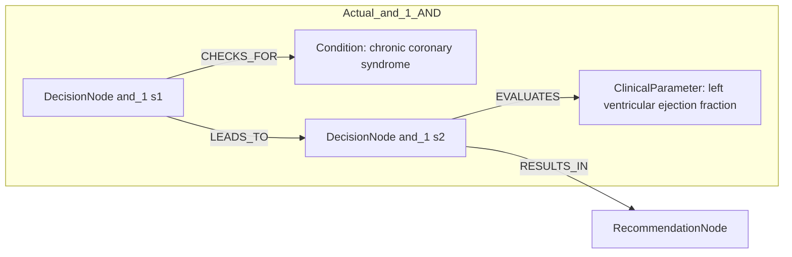

# row_07 (mapped to row_08)

Original table row text (ground truth):

```json
{
  "Recommendations": "In CCS patients with LVEF > 35%, myocardial revascularization is recommended, in addition to guideline-directed medical therapy, for patients with functionally significant three-vessel disease to improve long-term survival and to reduce long-term cardiovascular mortality and the risk of spontaneous myocardial infarction. 55,56,317,732-734",
  "Class a": "I",
  "Level b": "A"
}
```

Aligned JSON (expected vs actual):

<table>
  <tr>
    <th align="left">Human Annotation</th>
    <th align="left">LLM Generated</th>
  </tr>
  <tr>
    <td valign="top"><pre>
[
  {
    "entity": "ccs",
    "entity_original": "ccs patient",
    "role": "Condition",
    "operator": "PRESENT",
    "threshold": null,
    "unit": null,
    "condition_context": null,
    "logic_type": "AND",
    "logic_group": "and_1",
    "strength": null,
    "level": null,
    "direction": null
  },
  {
    "entity": "lvef",
    "entity_original": "lvef > 35%",
    "role": "ClinicalParameter",
    "operator": ">",
    "threshold": "35",
    "unit": "%",
    "condition_context": null,
    "logic_type": "AND",
    "logic_group": "and_1",
    "strength": null,
    "level": null,
    "direction": null
  },
  {
    "entity": "functionally significant three-vessel disease",
    "entity_original": "functionally significant three-vessel disease",
    "role": "Condition",
    "operator": "PRESENT",
    "threshold": null,
    "unit": null,
    "condition_context": null,
    "logic_type": "AND",
    "logic_group": "and_1",
    "strength": null,
    "level": null,
    "direction": null
  },
  {
    "entity": "myocardial revascularization",
    "entity_original": "myocardial revascularization is recommended to improve long-term survival and to reduce long-term cardiovascular mortality and the risk of spontaneous myocardial infarction",
    "role": "Procedure",
    "operator": null,
    "threshold": null,
    "unit": null,
    "condition_context": null,
    "logic_type": null,
    "logic_group": null,
    "strength": "I",
    "level": "A",
    "direction": "POSITIVE"
  },
  {
    "entity": "guideline-directed medical therapy",
    "entity_original": "guideline-directed medical therapy is recommended to improve long-term survival and to reduce long-term cardiovascular mortality and the risk of spontaneous myocardial infarction",
    "role": "Procedure",
    "operator": null,
    "threshold": null,
    "unit": null,
    "condition_context": null,
    "logic_type": null,
    "logic_group": null,
    "strength": "I",
    "level": "A",
    "direction": "POSITIVE"
  }
]
</pre></td>
    <td valign="top"><pre>
[
  {
    "entity": "chronic coronary syndrome",
    "entity_original": "chronic coronary syndrome patients",
    "role": "Condition",
    "operator": "PRESENT",
    "threshold": null,
    "unit": null,
    "condition_context": "chronic coronary syndrome",
    "logic_type": "AND",
    "logic_group": "and_1",
    "strength": null,
    "level": null,
    "direction": "POSITIVE"
  },
  {
    "entity": "left ventricular ejection fraction",
    "entity_original": "left ventricular ejection fraction > 35%",
    "role": "ClinicalParameter",
    "operator": ">",
    "threshold": "35",
    "unit": "%",
    "condition_context": "left ventricular ejection fraction",
    "logic_type": "AND",
    "logic_group": "and_1",
    "strength": null,
    "level": null,
    "direction": "POSITIVE"
  }
]
</pre></td>
  </tr>
</table>

Mermaid (expected):



Mermaid (actual):



Concepts:
- expected: 5
- actual: 2
- matches: 0
- missing: 5
- extra: 2

Missing concepts:
- ClinicalParameter: lvef
- Condition: ccs
- Condition: functionally significant three-vessel disease
- Procedure: guideline-directed medical therapy
- Procedure: myocardial revascularization

Extra concepts:
- ClinicalParameter: left ventricular ejection fraction
- Condition: chronic coronary syndrome

Rules (concept + logic fields):
- expected: 5
- actual: 2
- matches: 0
- missing: 5
- extra: 2

Missing rules:
- ClinicalParameter: lvef | op=> | thr=35 | unit=% | logic=AND | grp=and_1
- Condition: ccs | op=PRESENT | logic=AND | grp=and_1
- Condition: functionally significant three-vessel disease | op=PRESENT | logic=AND | grp=and_1
- Procedure: guideline-directed medical therapy | class=I | level=A | dir=POSITIVE
- Procedure: myocardial revascularization | class=I | level=A | dir=POSITIVE

Extra rules:
- ClinicalParameter: left ventricular ejection fraction | op=> | thr=35 | unit=% | ctx=left ventricular ejection fraction | logic=AND | grp=and_1 | dir=POSITIVE
- Condition: chronic coronary syndrome | op=PRESENT | ctx=chronic coronary syndrome | logic=AND | grp=and_1 | dir=POSITIVE

