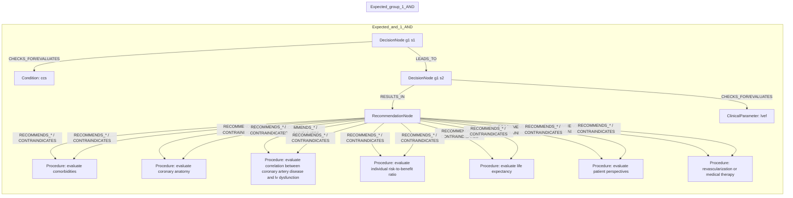
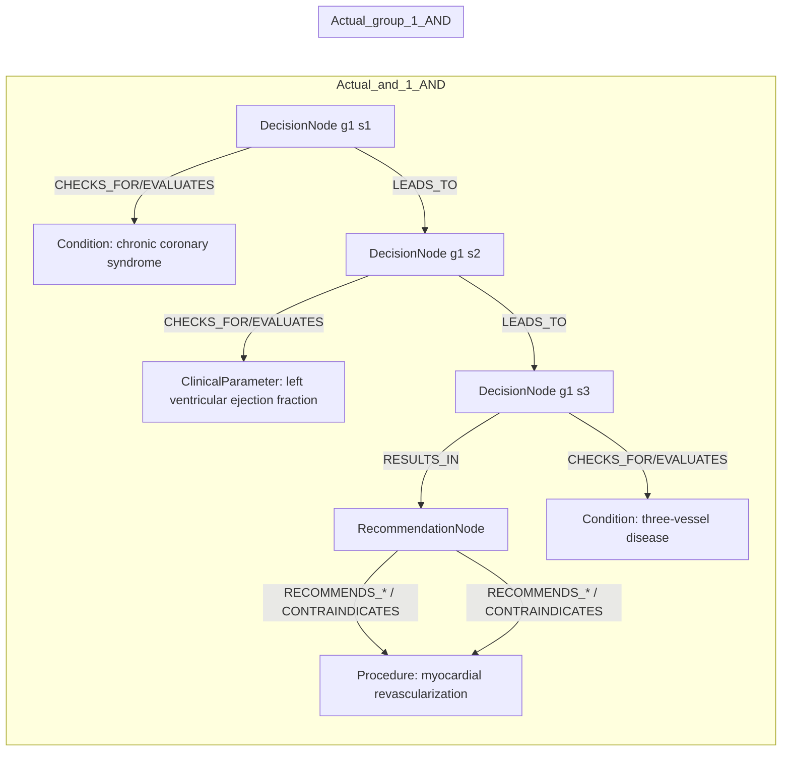

# row_09 (mapped to row_10)

Original table row text (ground truth):

```json
{
  "Table Header": "Recommendations for revascularization in patients with chronic coronary syndrome",
  "Section Header": "Revascularization to improve outcomes",
  "Sub Header": "In chronic coronary syndrome patients with left ventricular ejection fraction \u2264 35%",
  "Recommendations": "In CCS patients with LVEF \u2264 35%, it is recommended to choose between revascularization or medical therapy alone, after careful evaluation, preferably by the Heart Team, of coronary anatomy, correlation between coronary artery disease and LV dysfunction, comorbidities, life expectancy, individual risk-to-benefit ratio, and patient perspectives.",
  "input": "CCS patients with LVEF \u2264 35%",
  "recommendation": "it is recommended to choose between revascularization or medical therapy alone, after careful evaluation, preferably by the Heart Team, of coronary anatomy, correlation between coronary artery disease and LV dysfunction, comorbidities, life expectancy, individual risk-to-benefit ratio, and patient perspectives.",
  "Class a": "I",
  "Level b": "C"
}
```

Aligned JSON (expected vs actual):

<table>
  <tr>
    <th align="left">Expected</th>
    <th align="left">Actual</th>
  </tr>
  <tr>
    <td valign="top"><pre>
[
  {
    "entity": "ccs",
    "role": "Condition",
    "operator": "PRESENT",
    "threshold": null,
    "unit": null,
    "condition_context": null,
    "logic_type": "AND",
    "logic_group": "and_1",
    "strength": null,
    "level": null,
    "direction": null
  },
  {
    "entity": "evaluate comorbidities",
    "role": "Procedure",
    "operator": null,
    "threshold": null,
    "unit": null,
    "condition_context": null,
    "logic_type": null,
    "logic_group": null,
    "strength": "I",
    "level": "C",
    "direction": "POSITIVE"
  },
  {
    "entity": "evaluate coronary anatomy",
    "role": "Procedure",
    "operator": null,
    "threshold": null,
    "unit": null,
    "condition_context": null,
    "logic_type": null,
    "logic_group": null,
    "strength": "I",
    "level": "C",
    "direction": "POSITIVE"
  },
  {
    "entity": "evaluate correlation between coronary artery disease and lv dysfunction",
    "role": "Procedure",
    "operator": null,
    "threshold": null,
    "unit": null,
    "condition_context": null,
    "logic_type": null,
    "logic_group": null,
    "strength": "I",
    "level": "C",
    "direction": "POSITIVE"
  },
  {
    "entity": "evaluate individual risk-to-benefit ratio",
    "role": "Procedure",
    "operator": null,
    "threshold": null,
    "unit": null,
    "condition_context": null,
    "logic_type": null,
    "logic_group": null,
    "strength": "I",
    "level": "C",
    "direction": "POSITIVE"
  },
  {
    "entity": "evaluate life expectancy",
    "role": "Procedure",
    "operator": null,
    "threshold": null,
    "unit": null,
    "condition_context": null,
    "logic_type": null,
    "logic_group": null,
    "strength": "I",
    "level": "C",
    "direction": "POSITIVE"
  },
  {
    "entity": "evaluate patient perspectives",
    "role": "Procedure",
    "operator": null,
    "threshold": null,
    "unit": null,
    "condition_context": null,
    "logic_type": null,
    "logic_group": null,
    "strength": "I",
    "level": "C",
    "direction": "POSITIVE"
  },
  {
    "entity": "lvef",
    "role": "ClinicalParameter",
    "operator": "\u2264",
    "threshold": "35",
    "unit": "%",
    "condition_context": null,
    "logic_type": "AND",
    "logic_group": "and_1",
    "strength": null,
    "level": null,
    "direction": null
  },
  {
    "entity": "revascularization or medical therapy",
    "role": "Procedure",
    "operator": null,
    "threshold": null,
    "unit": null,
    "condition_context": null,
    "logic_type": null,
    "logic_group": null,
    "strength": "I",
    "level": "C",
    "direction": "POSITIVE"
  }
]
</pre></td>
    <td valign="top"><pre>
[
  {
    "entity": "chronic coronary syndrome",
    "role": "Condition",
    "operator": "PRESENT",
    "threshold": null,
    "unit": null,
    "condition_context": null,
    "logic_type": "AND",
    "logic_group": "and_1",
    "strength": null,
    "level": null,
    "direction": "UNKNOWN"
  },
  {
    "entity": "left ventricular ejection fraction",
    "role": "ClinicalParameter",
    "operator": ">",
    "threshold": "35",
    "unit": "%",
    "condition_context": "chronic coronary syndrome",
    "logic_type": "AND",
    "logic_group": "and_1",
    "strength": null,
    "level": null,
    "direction": "UNKNOWN"
  },
  {
    "entity": "myocardial revascularization",
    "role": "Procedure",
    "operator": null,
    "threshold": null,
    "unit": null,
    "condition_context": null,
    "logic_type": null,
    "logic_group": null,
    "strength": "I",
    "level": "A",
    "direction": "POSITIVE"
  },
  {
    "entity": "three-vessel disease",
    "role": "Condition",
    "operator": "PRESENT",
    "threshold": null,
    "unit": null,
    "condition_context": "functionally significant",
    "logic_type": "AND",
    "logic_group": "and_1",
    "strength": null,
    "level": null,
    "direction": "UNKNOWN"
  }
]
</pre></td>
  </tr>
</table>

Mermaid (expected):



Mermaid (actual):



Concepts:
- expected: 9
- actual: 4
- matches: 0
- missing: 9
- extra: 4

Missing concepts:
- ClinicalParameter: lvef
- Condition: ccs
- Procedure: evaluate comorbidities
- Procedure: evaluate coronary anatomy
- Procedure: evaluate correlation between coronary artery disease and lv dysfunction
- Procedure: evaluate individual risk-to-benefit ratio
- Procedure: evaluate life expectancy
- Procedure: evaluate patient perspectives
- Procedure: revascularization or medical therapy

Extra concepts:
- ClinicalParameter: left ventricular ejection fraction
- Condition: chronic coronary syndrome
- Condition: three-vessel disease
- Procedure: myocardial revascularization

Rules (concept + logic fields):
- expected: 9
- actual: 4
- matches: 0
- missing: 9
- extra: 4

Missing rules:
- ClinicalParameter: lvef | op=≤ | thr=35 | unit=% | logic=AND | grp=and_1
- Condition: ccs | op=PRESENT | logic=AND | grp=and_1
- Procedure: evaluate comorbidities | class=I | level=C | dir=POSITIVE
- Procedure: evaluate coronary anatomy | class=I | level=C | dir=POSITIVE
- Procedure: evaluate correlation between coronary artery disease and lv dysfunction | class=I | level=C | dir=POSITIVE
- Procedure: evaluate individual risk-to-benefit ratio | class=I | level=C | dir=POSITIVE
- Procedure: evaluate life expectancy | class=I | level=C | dir=POSITIVE
- Procedure: evaluate patient perspectives | class=I | level=C | dir=POSITIVE
- Procedure: revascularization or medical therapy | class=I | level=C | dir=POSITIVE

Extra rules:
- ClinicalParameter: left ventricular ejection fraction | op=> | thr=35 | unit=% | ctx=chronic coronary syndrome | logic=AND | grp=and_1 | dir=UNKNOWN
- Condition: chronic coronary syndrome | op=PRESENT | logic=AND | grp=and_1 | dir=UNKNOWN
- Condition: three-vessel disease | op=PRESENT | ctx=functionally significant | logic=AND | grp=and_1 | dir=UNKNOWN
- Procedure: myocardial revascularization | class=I | level=A | dir=POSITIVE

