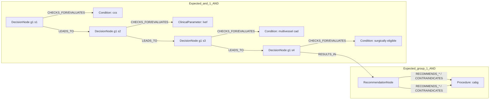
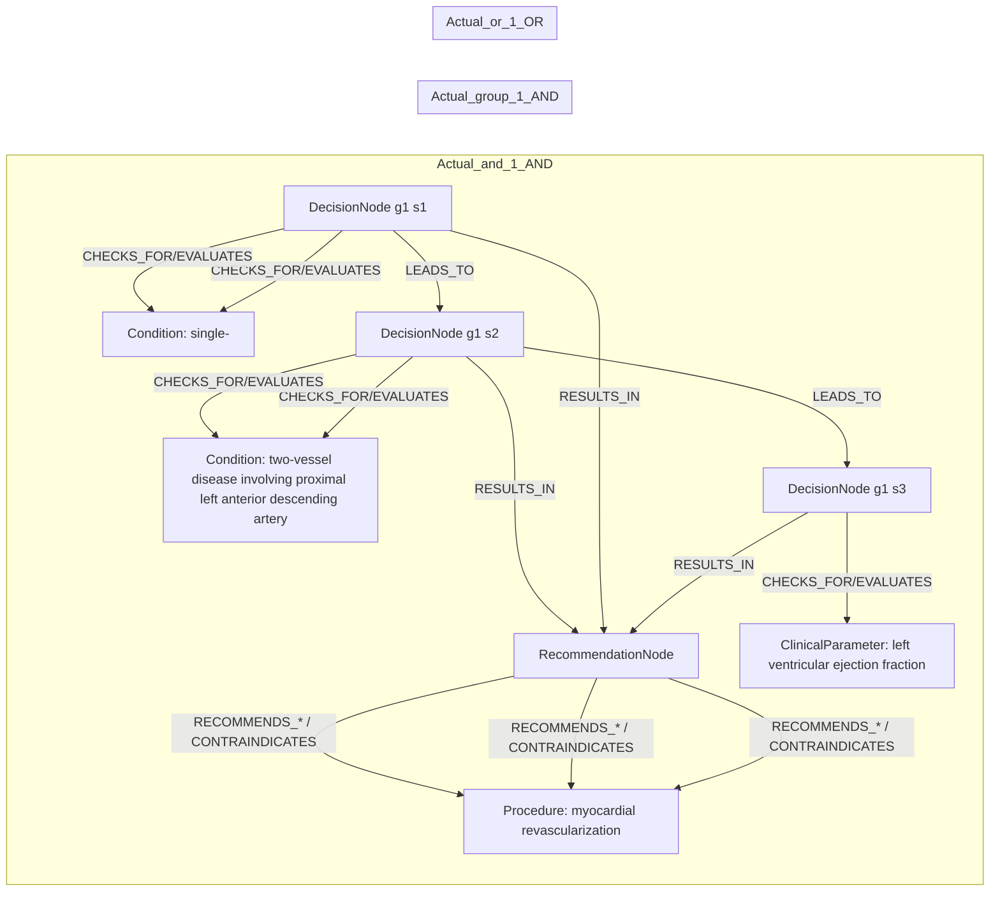

# row_10 (mapped to row_11)

Original table row text (ground truth):

```json
{
  "Table Header": "Recommendations for revascularization in patients with chronic coronary syndrome",
  "Section Header": "Revascularization to improve outcomes",
  "Sub Header": "In chronic coronary syndrome patients with left ventricular ejection fraction \u2264 35%",
  "Recommendations": "In surgically eligible CCS patients with multivessel CAD and LVEF \u2264 35%, myocardial revascularization with CABG is recommended over medical therapy alone to improve long-term survival. 53,54,749,861",
  "input": "surgically eligible CCS patients with multivessel CAD and LVEF \u2264 35%",
  "recommendation": "myocardial revascularization with CABG is recommended over medical therapy alone to improve long-term survival",
  "Class a": "I",
  "Level b": "B"
}
```

Aligned JSON (expected vs actual):

<table>
  <tr>
    <th align="left">Expected</th>
    <th align="left">Actual</th>
  </tr>
  <tr>
    <td valign="top"><pre>
[
  {
    "entity": "cabg",
    "entity_original": "myocardial revascularization with cabg over medical therapy alone to improve long-term survival",
    "role": "Procedure",
    "operator": null,
    "threshold": null,
    "unit": null,
    "condition_context": null,
    "logic_type": null,
    "logic_group": null,
    "strength": "I",
    "level": "B",
    "direction": "POSITIVE"
  },
  {
    "entity": "ccs",
    "entity_original": "ccs patient",
    "role": "Condition",
    "operator": "PRESENT",
    "threshold": null,
    "unit": null,
    "condition_context": null,
    "logic_type": "AND",
    "logic_group": "and_1",
    "strength": null,
    "level": null,
    "direction": null
  },
  {
    "entity": "lvef",
    "entity_original": "lvef \u2264 35%",
    "role": "ClinicalParameter",
    "operator": "\u2264",
    "threshold": "35",
    "unit": "%",
    "condition_context": null,
    "logic_type": "AND",
    "logic_group": "and_1",
    "strength": null,
    "level": null,
    "direction": null
  },
  {
    "entity": "multivessel cad",
    "entity_original": "multivessel cad",
    "role": "Condition",
    "operator": "PRESENT",
    "threshold": null,
    "unit": null,
    "condition_context": null,
    "logic_type": "AND",
    "logic_group": "and_1",
    "strength": null,
    "level": null,
    "direction": null
  },
  {
    "entity": "surgically eligible",
    "entity_original": "surgically eligible patient",
    "role": "Condition",
    "operator": "PRESENT",
    "threshold": null,
    "unit": null,
    "condition_context": null,
    "logic_type": "AND",
    "logic_group": "and_1",
    "strength": null,
    "level": null,
    "direction": null
  }
]
</pre></td>
    <td valign="top"><pre>
[
  {
    "entity": "functionally significant single-vessel disease involving proximal left anterior descending artery",
    "entity_original": "functionally significant single- or two-vessel disease involving the proximal left anterior descending artery (lad)",
    "role": "Condition",
    "operator": "PRESENT",
    "threshold": null,
    "unit": null,
    "condition_context": "proximal left anterior descending artery",
    "logic_type": "AND",
    "logic_group": "and_1",
    "strength": "I",
    "level": "B",
    "direction": "POSITIVE"
  },
  {
    "entity": "left ventricular ejection fraction",
    "entity_original": "left ventricular ejection fraction (lvef) > 35%",
    "role": "ClinicalParameter",
    "operator": ">",
    "threshold": "35",
    "unit": "%",
    "condition_context": "ejection fraction",
    "logic_type": "AND",
    "logic_group": "and_1",
    "strength": "I",
    "level": "B",
    "direction": "POSITIVE"
  },
  {
    "entity": "left ventricular ejection fraction",
    "entity_original": "left ventricular ejection fraction (lvef) > 35%",
    "role": "ClinicalParameter",
    "operator": ">",
    "threshold": "35",
    "unit": "%",
    "condition_context": "elevated",
    "logic_type": "AND",
    "logic_group": "and_1",
    "strength": "I",
    "level": "B",
    "direction": "POSITIVE"
  },
  {
    "entity": "myocardial revascularization",
    "entity_original": "myocardial revascularization",
    "role": "Procedure",
    "operator": "PRESENT",
    "threshold": null,
    "unit": null,
    "condition_context": null,
    "logic_type": null,
    "logic_group": null,
    "strength": "I",
    "level": "B",
    "direction": "POSITIVE"
  },
  {
    "entity": "single-",
    "entity_original": "functionally significant single- or two-vessel disease involving the proximal left anterior descending artery (lad)",
    "role": "Condition",
    "operator": "PRESENT",
    "threshold": null,
    "unit": null,
    "condition_context": "functionally significant",
    "logic_type": "OR",
    "logic_group": "or_1",
    "strength": "I",
    "level": "B",
    "direction": "POSITIVE"
  },
  {
    "entity": "two-vessel disease involving proximal left anterior descending artery",
    "entity_original": "functionally significant single- or two-vessel disease involving the proximal left anterior descending artery (lad)",
    "role": "Condition",
    "operator": "PRESENT",
    "threshold": null,
    "unit": null,
    "condition_context": "functionally significant",
    "logic_type": "OR",
    "logic_group": "or_1",
    "strength": "I",
    "level": "B",
    "direction": "POSITIVE"
  }
]
</pre></td>
  </tr>
</table>

Mermaid (expected):



Mermaid (actual):



Concepts:
- expected: 5
- actual: 5
- matches: 0
- missing: 5
- extra: 5

Missing concepts:
- ClinicalParameter: lvef
- Condition: ccs
- Condition: multivessel cad
- Condition: surgically eligible
- Procedure: cabg

Extra concepts:
- ClinicalParameter: left ventricular ejection fraction
- Condition: functionally significant single-vessel disease involving proximal left anterior descending artery
- Condition: single-
- Condition: two-vessel disease involving proximal left anterior descending artery
- Procedure: myocardial revascularization

Rules (concept + logic fields):
- expected: 5
- actual: 6
- matches: 0
- missing: 5
- extra: 6

Missing rules:
- ClinicalParameter: lvef | op=≤ | thr=35 | unit=% | logic=AND | grp=and_1
- Condition: ccs | op=PRESENT | logic=AND | grp=and_1
- Condition: multivessel cad | op=PRESENT | logic=AND | grp=and_1
- Condition: surgically eligible | op=PRESENT | logic=AND | grp=and_1
- Procedure: cabg | class=I | level=B | dir=POSITIVE

Extra rules:
- ClinicalParameter: left ventricular ejection fraction | op=> | thr=35 | unit=% | ctx=ejection fraction | logic=AND | grp=and_1 | class=I | level=B | dir=POSITIVE
- ClinicalParameter: left ventricular ejection fraction | op=> | thr=35 | unit=% | ctx=elevated | logic=AND | grp=and_1 | class=I | level=B | dir=POSITIVE
- Condition: functionally significant single-vessel disease involving proximal left anterior descending artery | op=PRESENT | ctx=proximal left anterior descending artery | logic=AND | grp=and_1 | class=I | level=B | dir=POSITIVE
- Condition: single- | op=PRESENT | ctx=functionally significant | logic=OR | grp=or_1 | class=I | level=B | dir=POSITIVE
- Condition: two-vessel disease involving proximal left anterior descending artery | op=PRESENT | ctx=functionally significant | logic=OR | grp=or_1 | class=I | level=B | dir=POSITIVE
- Procedure: myocardial revascularization | op=PRESENT | class=I | level=B | dir=POSITIVE

