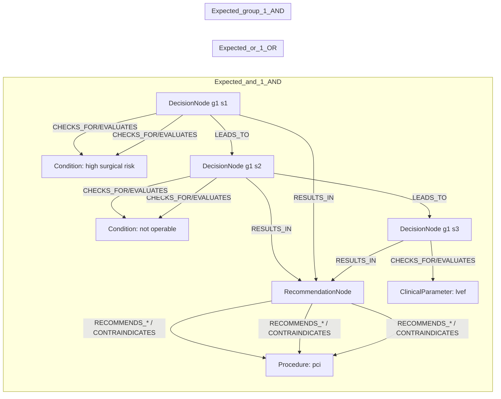
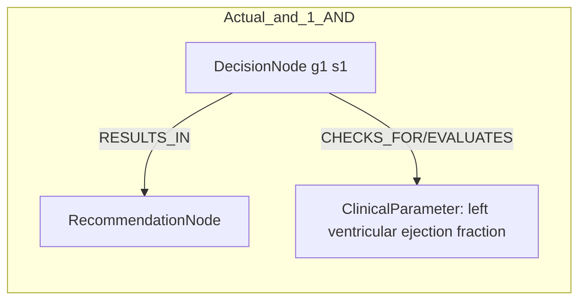

# row_11 (mapped to row_12)

Original table row text (ground truth):

```json
{
  "Table Header": "Recommendations for revascularization in patients with chronic coronary syndrome",
  "Section Header": "Revascularization to improve outcomes",
  "Sub Header": "In chronic coronary syndrome patients with left ventricular ejection fraction \u2264 35%",
  "Recommendations": "In selected CCS patients with functionally significant MVD and LVEF \u2264 35% who are at high surgical risk or not operable, PCI may be considered as an alternative to CABG. 526,729",
  "input": "selected CCS patients with functionally significant MVD and LVEF \u2264 35% who are at high surgical risk or not operable",
  "recommendation": "PCI may be considered as an alternative to CABG",
  "Class a": "IIb",
  "Level b": "B"
}
```

Aligned JSON (expected vs actual):

<table>
  <tr>
    <th align="left">Expected</th>
    <th align="left">Actual</th>
  </tr>
  <tr>
    <td valign="top"><pre>
[
  {
    "entity": "ccs",
    "role": "Condition",
    "operator": "PRESENT",
    "threshold": null,
    "unit": null,
    "condition_context": null,
    "logic_type": "AND",
    "logic_group": "and_1",
    "strength": null,
    "level": null,
    "direction": null
  },
  {
    "entity": "functionally significant mvd",
    "role": "Condition",
    "operator": "PRESENT",
    "threshold": null,
    "unit": null,
    "condition_context": null,
    "logic_type": "AND",
    "logic_group": "and_1",
    "strength": null,
    "level": null,
    "direction": null
  },
  {
    "entity": "high surgical risk",
    "role": "Condition",
    "operator": "PRESENT",
    "threshold": null,
    "unit": null,
    "condition_context": null,
    "logic_type": "OR",
    "logic_group": "or_1",
    "strength": null,
    "level": null,
    "direction": null
  },
  {
    "entity": "lvef",
    "role": "ClinicalParameter",
    "operator": "\u2264",
    "threshold": "35",
    "unit": "%",
    "condition_context": null,
    "logic_type": "AND",
    "logic_group": "and_1",
    "strength": null,
    "level": null,
    "direction": null
  },
  {
    "entity": "not operable",
    "role": "Condition",
    "operator": "PRESENT",
    "threshold": null,
    "unit": null,
    "condition_context": null,
    "logic_type": "OR",
    "logic_group": "or_1",
    "strength": null,
    "level": null,
    "direction": null
  },
  {
    "entity": "pci",
    "role": "Procedure",
    "operator": null,
    "threshold": null,
    "unit": null,
    "condition_context": null,
    "logic_type": null,
    "logic_group": null,
    "strength": "IIb",
    "level": "B",
    "direction": "POSITIVE"
  }
]
</pre></td>
    <td valign="top"><pre>
[
  {
    "entity": "left ventricular ejection fraction",
    "role": "ClinicalParameter",
    "operator": "<=",
    "threshold": "35",
    "unit": "%",
    "condition_context": null,
    "logic_type": "AND",
    "logic_group": "and_1",
    "strength": "IIa",
    "level": "B",
    "direction": "POSITIVE"
  }
]
</pre></td>
  </tr>
</table>

Mermaid (expected):



Mermaid (actual):



Concepts:
- expected: 6
- actual: 1
- matches: 0
- missing: 6
- extra: 1

Missing concepts:
- ClinicalParameter: lvef
- Condition: ccs
- Condition: functionally significant mvd
- Condition: high surgical risk
- Condition: not operable
- Procedure: pci

Extra concepts:
- ClinicalParameter: left ventricular ejection fraction

Rules (concept + logic fields):
- expected: 6
- actual: 1
- matches: 0
- missing: 6
- extra: 1

Missing rules:
- ClinicalParameter: lvef | op=≤ | thr=35 | unit=% | logic=AND | grp=and_1
- Condition: ccs | op=PRESENT | logic=AND | grp=and_1
- Condition: functionally significant mvd | op=PRESENT | logic=AND | grp=and_1
- Condition: high surgical risk | op=PRESENT | logic=OR | grp=or_1
- Condition: not operable | op=PRESENT | logic=OR | grp=or_1
- Procedure: pci | class=IIb | level=B | dir=POSITIVE

Extra rules:
- ClinicalParameter: left ventricular ejection fraction | op=<= | thr=35 | unit=% | logic=AND | grp=and_1 | class=IIa | level=B | dir=POSITIVE

