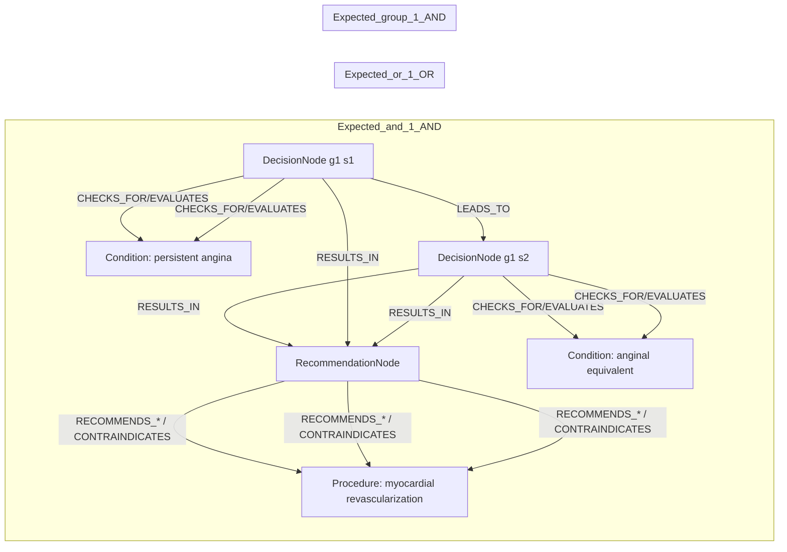
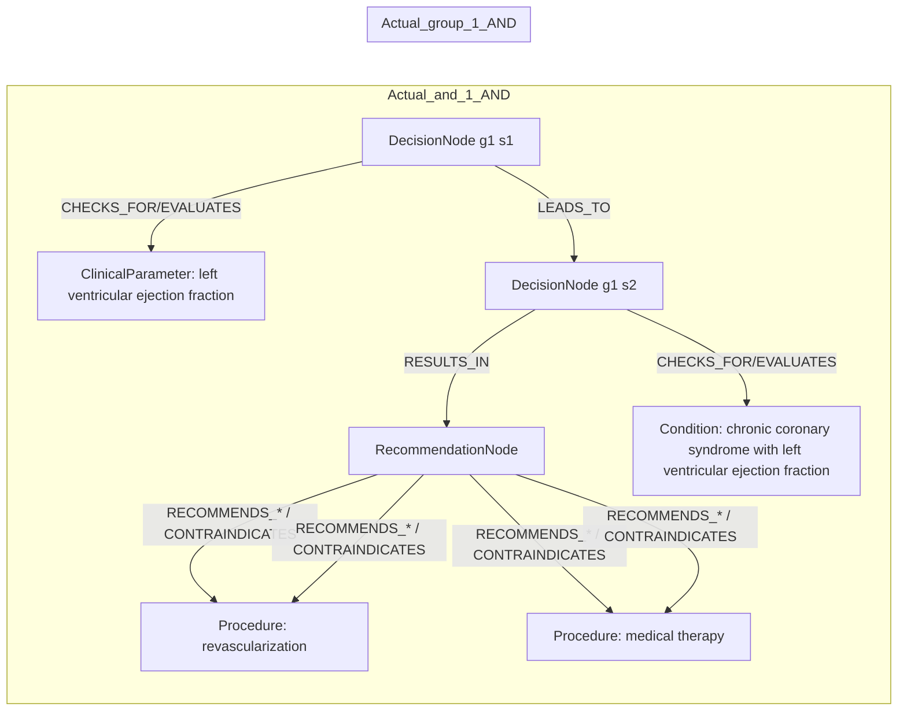

# row_12 (mapped to row_13)

Original table row text (ground truth):

```json
{
  "Table Header": "Recommendations for revascularization in patients with chronic coronary syndrome",
  "Section Header": "Revascularization to improve symptoms",
  "Recommendations": "In CCS patients with persistent angina or anginal equivalent, despite guideline-directed medical treatment, myocardial revascularization of functionally significant obstructive CAD is recommended to improve symptoms. 50,321,402,732,734,757",
  "input": "CCS patients with persistent angina or anginal equivalent, despite guideline-directed medical treatment",
  "recommendation": "myocardial revascularization of functionally significant obstructive CAD is recommended to improve symptoms",
  "Class a": "I",
  "Level b": "A"
}
```

Aligned JSON (expected vs actual):

<table>
  <tr>
    <th align="left">Expected</th>
    <th align="left">Actual</th>
  </tr>
  <tr>
    <td valign="top"><pre>
[
  {
    "entity": "ccs",
    "entity_original": "ccs patient",
    "role": "Condition",
    "operator": "PRESENT",
    "threshold": null,
    "unit": null,
    "condition_context": null,
    "logic_type": "AND",
    "logic_group": "and_1",
    "strength": null,
    "level": null,
    "direction": null
  },
  {
    "entity": "persistent angina",
    "entity_original": "persistent angina",
    "role": "Condition",
    "operator": "PRESENT",
    "threshold": null,
    "unit": null,
    "condition_context": null,
    "logic_type": "OR",
    "logic_group": "or_1",
    "strength": null,
    "level": null,
    "direction": null
  },
  {
    "entity": "anginal equivalent",
    "entity_original": "anginal equivalent",
    "role": "Condition",
    "operator": "PRESENT",
    "threshold": null,
    "unit": null,
    "condition_context": null,
    "logic_type": "OR",
    "logic_group": "or_1",
    "strength": null,
    "level": null,
    "direction": null
  },
  {
    "entity": "despite guideline-directed medical treatment",
    "entity_original": "despite guideline-directed medical treatment",
    "role": "Condition",
    "operator": "PRESENT",
    "threshold": null,
    "unit": null,
    "condition_context": null,
    "logic_type": "AND",
    "logic_group": "and_1",
    "strength": null,
    "level": null,
    "direction": null
  },
  {
    "entity": "myocardial revascularization",
    "entity_original": "myocardial revascularization of functionally significant obstructive cad is recommended to improve symptoms",
    "role": "Procedure",
    "operator": null,
    "threshold": null,
    "unit": null,
    "condition_context": null,
    "logic_type": null,
    "logic_group": null,
    "strength": "I",
    "level": "A",
    "direction": "POSITIVE"
  }
]
</pre></td>
    <td valign="top"><pre>
[
  {
    "entity": "left ventricular ejection fraction",
    "entity_original": "left ventricular ejection fraction (lvef) \u2264 35%",
    "role": "ClinicalParameter",
    "operator": "<=",
    "threshold": "35",
    "unit": "%",
    "condition_context": null,
    "logic_type": "AND",
    "logic_group": "and_1",
    "strength": "I",
    "level": "C",
    "direction": "POSITIVE"
  },
  {
    "entity": "revascularization",
    "entity_original": "revascularization",
    "role": "Procedure",
    "operator": null,
    "threshold": null,
    "unit": null,
    "condition_context": null,
    "logic_type": null,
    "logic_group": null,
    "strength": "I",
    "level": "C",
    "direction": "POSITIVE"
  },
  {
    "entity": "medical therapy",
    "entity_original": "medical therapy",
    "role": "Procedure",
    "operator": null,
    "threshold": null,
    "unit": null,
    "condition_context": null,
    "logic_type": null,
    "logic_group": null,
    "strength": "I",
    "level": "C",
    "direction": "POSITIVE"
  },
  {
    "entity": "chronic coronary syndrome with left ventricular ejection fraction",
    "entity_original": "ccs patients with left ventricular ejection fraction (lvef) \u2264 35%",
    "role": "Condition",
    "operator": "<=",
    "threshold": "35",
    "unit": "%",
    "condition_context": "chronic coronary syndrome",
    "logic_type": "AND",
    "logic_group": "and_1",
    "strength": "I",
    "level": "C",
    "direction": "POSITIVE"
  }
]
</pre></td>
  </tr>
</table>

Mermaid (expected):



Mermaid (actual):



Concepts:
- expected: 5
- actual: 4
- matches: 0
- missing: 5
- extra: 4

Missing concepts:
- Condition: anginal equivalent
- Condition: ccs
- Condition: despite guideline-directed medical treatment
- Condition: persistent angina
- Procedure: myocardial revascularization

Extra concepts:
- ClinicalParameter: left ventricular ejection fraction
- Condition: chronic coronary syndrome with left ventricular ejection fraction
- Procedure: medical therapy
- Procedure: revascularization

Rules (concept + logic fields):
- expected: 5
- actual: 4
- matches: 0
- missing: 5
- extra: 4

Missing rules:
- Condition: anginal equivalent | op=PRESENT | logic=OR | grp=or_1
- Condition: ccs | op=PRESENT | logic=AND | grp=and_1
- Condition: despite guideline-directed medical treatment | op=PRESENT | logic=AND | grp=and_1
- Condition: persistent angina | op=PRESENT | logic=OR | grp=or_1
- Procedure: myocardial revascularization | class=I | level=A | dir=POSITIVE

Extra rules:
- ClinicalParameter: left ventricular ejection fraction | op=<= | thr=35 | unit=% | logic=AND | grp=and_1 | class=I | level=C | dir=POSITIVE
- Condition: chronic coronary syndrome with left ventricular ejection fraction | op=<= | thr=35 | unit=% | ctx=chronic coronary syndrome | logic=AND | grp=and_1 | class=I | level=C | dir=POSITIVE
- Procedure: medical therapy | class=I | level=C | dir=POSITIVE
- Procedure: revascularization | class=I | level=C | dir=POSITIVE

