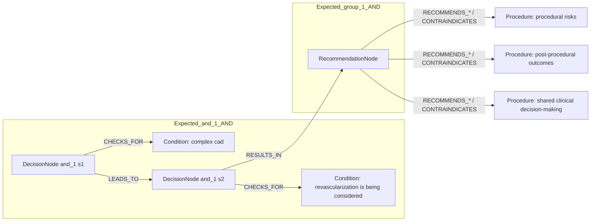
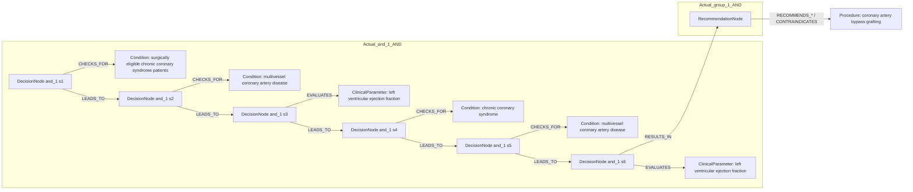

# row_13 (mapped to row_14)

Original table row text (ground truth):

```json
{
  "Table Header": "Recommendations for revascularization in patients with chronic coronary syndrome",
  "Section Header": "Assessment of procedural risks and post-procedural outcomes",
  "Recommendations": "In patients with complex CAD in whom revascularization is being considered, it is recommended to assess procedural risks and post-procedural outcomes to guide shared clinical decision-making.",
  "input": "patients with complex CAD in whom revascularization is being considered",
  "recommendation": "it is recommended to assess procedural risks and post-procedural outcomes to guide shared clinical decision-making",
  "Class a": "I",
  "Level b": "C"
}
```

Aligned JSON (expected vs actual):

<table>
  <tr>
    <th align="left">Expected</th>
    <th align="left">Actual</th>
  </tr>
  <tr>
    <td valign="top"><pre>
[
  {
    "entity": "complex cad",
    "entity_original": "patients with complex cad",
    "role": "Condition",
    "operator": "PRESENT",
    "threshold": null,
    "unit": null,
    "condition_context": null,
    "logic_type": "AND",
    "logic_group": "and_1",
    "strength": null,
    "level": null,
    "direction": null
  },
  {
    "entity": "revascularization is being considered",
    "entity_original": "patients in whom revascularization is being considered",
    "role": "Condition",
    "operator": "PRESENT",
    "threshold": null,
    "unit": null,
    "condition_context": null,
    "logic_type": "AND",
    "logic_group": "and_1",
    "strength": null,
    "level": null,
    "direction": null
  },
  {
    "entity": "procedural risks",
    "entity_original": "assess procedural risks",
    "role": "Procedure",
    "operator": null,
    "threshold": null,
    "unit": null,
    "condition_context": null,
    "logic_type": null,
    "logic_group": null,
    "strength": "I",
    "level": "C",
    "direction": "POSITIVE"
  },
  {
    "entity": "post-procedural outcomes",
    "entity_original": "assess post-procedural outcomes",
    "role": "Procedure",
    "operator": null,
    "threshold": null,
    "unit": null,
    "condition_context": null,
    "logic_type": null,
    "logic_group": null,
    "strength": "I",
    "level": "C",
    "direction": "POSITIVE"
  },
  {
    "entity": "shared clinical decision-making",
    "entity_original": "take part in shared clinical decision-making",
    "role": "Procedure",
    "operator": null,
    "threshold": null,
    "unit": null,
    "condition_context": null,
    "logic_type": null,
    "logic_group": null,
    "strength": "I",
    "level": "C",
    "direction": "POSITIVE"
  }
]
</pre></td>
    <td valign="top"><pre>
[
  {
    "entity": "surgically eligible chronic coronary syndrome patients",
    "entity_original": "surgically eligible chronic coronary syndrome (ccs) patients",
    "role": "Condition",
    "operator": "PRESENT",
    "threshold": null,
    "unit": null,
    "condition_context": "surgically eligible",
    "logic_type": "AND",
    "logic_group": "and_1",
    "strength": "I",
    "level": "B",
    "direction": "POSITIVE"
  },
  {
    "entity": "multivessel coronary artery disease",
    "entity_original": "multivessel coronary artery disease (cad)",
    "role": "Condition",
    "operator": "PRESENT",
    "threshold": null,
    "unit": null,
    "condition_context": "multivessel",
    "logic_type": "AND",
    "logic_group": "and_1",
    "strength": "I",
    "level": "B",
    "direction": "POSITIVE"
  },
  {
    "entity": "left ventricular ejection fraction",
    "entity_original": "left ventricular ejection fraction (lvef) \u2264 35%",
    "role": "ClinicalParameter",
    "operator": "<=",
    "threshold": "35",
    "unit": "%",
    "condition_context": "reduced",
    "logic_type": "AND",
    "logic_group": "and_1",
    "strength": "I",
    "level": "B",
    "direction": "POSITIVE"
  },
  {
    "entity": "coronary artery bypass grafting",
    "entity_original": "myocardial revascularization with coronary artery bypass grafting (cabg)",
    "role": "Procedure",
    "operator": "PRESENT",
    "threshold": null,
    "unit": null,
    "condition_context": "revascularization",
    "logic_type": null,
    "logic_group": null,
    "strength": "I",
    "level": "B",
    "direction": "POSITIVE"
  },
  {
    "entity": "chronic coronary syndrome",
    "entity_original": "surgically eligible chronic coronary syndrome (ccs) patients",
    "role": "Condition",
    "operator": "PRESENT",
    "threshold": null,
    "unit": null,
    "condition_context": "surgically eligible",
    "logic_type": "AND",
    "logic_group": "and_1",
    "strength": "I",
    "level": "B",
    "direction": "POSITIVE"
  },
  {
    "entity": "multivessel coronary artery disease",
    "entity_original": "multivessel coronary artery disease (cad)",
    "role": "Condition",
    "operator": "PRESENT",
    "threshold": null,
    "unit": null,
    "condition_context": null,
    "logic_type": "AND",
    "logic_group": "and_1",
    "strength": "I",
    "level": "B",
    "direction": "POSITIVE"
  },
  {
    "entity": "left ventricular ejection fraction",
    "entity_original": "left ventricular ejection fraction (lvef) \u2264 35%",
    "role": "ClinicalParameter",
    "operator": "\u2264",
    "threshold": "35",
    "unit": "%",
    "condition_context": null,
    "logic_type": "AND",
    "logic_group": "and_1",
    "strength": "I",
    "level": "B",
    "direction": "POSITIVE"
  }
]
</pre></td>
  </tr>
</table>

Mermaid (expected):



Mermaid (actual):



Concepts:
- expected: 5
- actual: 5
- matches: 0
- missing: 5
- extra: 5

Missing concepts:
- Condition: complex cad
- Condition: revascularization is being considered
- Procedure: post-procedural outcomes
- Procedure: procedural risks
- Procedure: shared clinical decision-making

Extra concepts:
- ClinicalParameter: left ventricular ejection fraction
- Condition: chronic coronary syndrome
- Condition: multivessel coronary artery disease
- Condition: surgically eligible chronic coronary syndrome patients
- Procedure: coronary artery bypass grafting

Rules (concept + logic fields):
- expected: 5
- actual: 7
- matches: 0
- missing: 5
- extra: 7

Missing rules:
- Condition: complex cad | op=PRESENT | logic=AND | grp=and_1
- Condition: revascularization is being considered | op=PRESENT | logic=AND | grp=and_1
- Procedure: post-procedural outcomes | class=I | level=C | dir=POSITIVE
- Procedure: procedural risks | class=I | level=C | dir=POSITIVE
- Procedure: shared clinical decision-making | class=I | level=C | dir=POSITIVE

Extra rules:
- ClinicalParameter: left ventricular ejection fraction | op=<= | thr=35 | unit=% | ctx=reduced | logic=AND | grp=and_1 | class=I | level=B | dir=POSITIVE
- ClinicalParameter: left ventricular ejection fraction | op=≤ | thr=35 | unit=% | logic=AND | grp=and_1 | class=I | level=B | dir=POSITIVE
- Condition: chronic coronary syndrome | op=PRESENT | ctx=surgically eligible | logic=AND | grp=and_1 | class=I | level=B | dir=POSITIVE
- Condition: multivessel coronary artery disease | op=PRESENT | ctx=multivessel | logic=AND | grp=and_1 | class=I | level=B | dir=POSITIVE
- Condition: multivessel coronary artery disease | op=PRESENT | logic=AND | grp=and_1 | class=I | level=B | dir=POSITIVE
- Condition: surgically eligible chronic coronary syndrome patients | op=PRESENT | ctx=surgically eligible | logic=AND | grp=and_1 | class=I | level=B | dir=POSITIVE
- Procedure: coronary artery bypass grafting | op=PRESENT | ctx=revascularization | class=I | level=B | dir=POSITIVE

