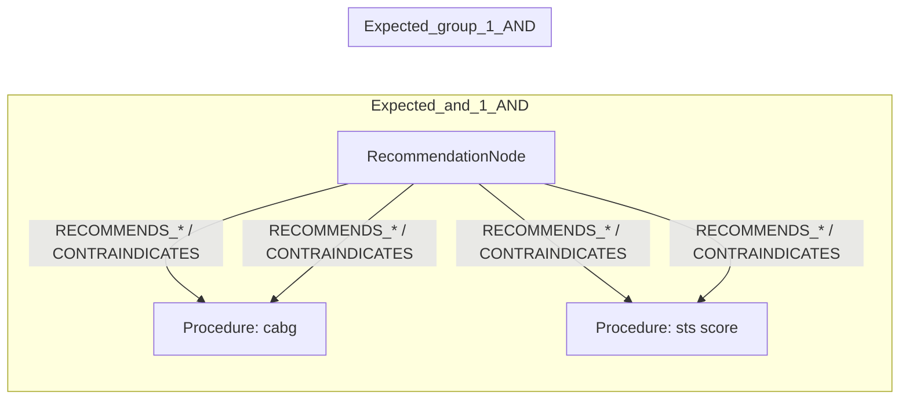
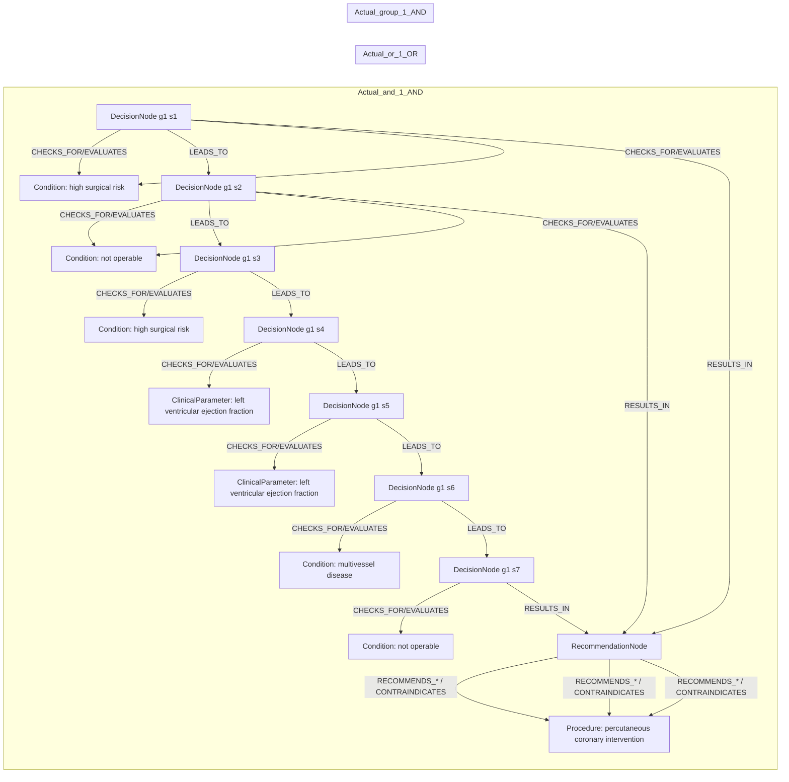

# row_14 (mapped to row_15)

Original table row text (ground truth):

```json
{
  "Table Header": "Recommendations for revascularization in patients with chronic coronary syndrome",
  "Section Header": "Assessment of procedural risks and post-procedural outcomes",
  "Recommendations": "Calculation of the STS score is recommended to estimate in-hospital morbidity and 30-day mortality after CABG. 777,862-864",
  "input": "CABG",
  "recommendation": "Calculation of the STS score is recommended to estimate in-hospital morbidity and 30-day mortality after CABG",
  "Class a": "I",
  "Level b": "B"
}
```

Aligned JSON (expected vs actual):

<table>
  <tr>
    <th align="left">Expected</th>
    <th align="left">Actual</th>
  </tr>
  <tr>
    <td valign="top"><pre>
[
  {
    "entity": "cabg",
    "role": "Procedure",
    "operator": "PRESENT",
    "threshold": null,
    "unit": null,
    "condition_context": null,
    "logic_type": "AND",
    "logic_group": "and_1",
    "strength": null,
    "level": null,
    "direction": null
  },
  {
    "entity": "sts score",
    "role": "Procedure",
    "operator": null,
    "threshold": null,
    "unit": null,
    "condition_context": null,
    "logic_type": null,
    "logic_group": null,
    "strength": "I",
    "level": "B",
    "direction": "POSITIVE"
  }
]
</pre></td>
    <td valign="top"><pre>
[
  {
    "entity": "chronic coronary syndrome",
    "role": "Condition",
    "operator": "PRESENT",
    "threshold": null,
    "unit": null,
    "condition_context": "selected",
    "logic_type": "AND",
    "logic_group": "and_1",
    "strength": "IIb",
    "level": "B",
    "direction": "UNKNOWN"
  },
  {
    "entity": "chronic coronary syndrome patients with functionally significant multivessel disease",
    "role": "Condition",
    "operator": "PRESENT",
    "threshold": null,
    "unit": null,
    "condition_context": "functionally significant",
    "logic_type": "AND",
    "logic_group": "and_1",
    "strength": "IIb",
    "level": "B",
    "direction": "POSITIVE"
  },
  {
    "entity": "high surgical risk",
    "role": "Condition",
    "operator": "PRESENT",
    "threshold": null,
    "unit": null,
    "condition_context": null,
    "logic_type": "OR",
    "logic_group": "or_1",
    "strength": "IIb",
    "level": "B",
    "direction": "POSITIVE"
  },
  {
    "entity": "high surgical risk",
    "role": "Condition",
    "operator": "PRESENT",
    "threshold": null,
    "unit": null,
    "condition_context": null,
    "logic_type": "AND",
    "logic_group": "and_1",
    "strength": "IIb",
    "level": "B",
    "direction": "UNKNOWN"
  },
  {
    "entity": "left ventricular ejection fraction",
    "role": "ClinicalParameter",
    "operator": "<=",
    "threshold": "35",
    "unit": "%",
    "condition_context": null,
    "logic_type": "AND",
    "logic_group": "and_1",
    "strength": "IIb",
    "level": "B",
    "direction": "POSITIVE"
  },
  {
    "entity": "left ventricular ejection fraction",
    "role": "ClinicalParameter",
    "operator": "LE",
    "threshold": "35",
    "unit": "%",
    "condition_context": null,
    "logic_type": "AND",
    "logic_group": "and_1",
    "strength": "IIb",
    "level": "B",
    "direction": "UNKNOWN"
  },
  {
    "entity": "multivessel disease",
    "role": "Condition",
    "operator": "PRESENT",
    "threshold": null,
    "unit": null,
    "condition_context": "functionally significant",
    "logic_type": "AND",
    "logic_group": "and_1",
    "strength": "IIb",
    "level": "B",
    "direction": "UNKNOWN"
  },
  {
    "entity": "not operable",
    "role": "Condition",
    "operator": "PRESENT",
    "threshold": null,
    "unit": null,
    "condition_context": null,
    "logic_type": "OR",
    "logic_group": "or_1",
    "strength": "IIb",
    "level": "B",
    "direction": "POSITIVE"
  },
  {
    "entity": "not operable",
    "role": "Condition",
    "operator": "PRESENT",
    "threshold": null,
    "unit": null,
    "condition_context": null,
    "logic_type": "AND",
    "logic_group": "and_1",
    "strength": "IIb",
    "level": "B",
    "direction": "UNKNOWN"
  },
  {
    "entity": "percutaneous coronary intervention",
    "role": "Procedure",
    "operator": "PRESENT",
    "threshold": null,
    "unit": null,
    "condition_context": null,
    "logic_type": null,
    "logic_group": null,
    "strength": "IIb",
    "level": "B",
    "direction": "POSITIVE"
  }
]
</pre></td>
  </tr>
</table>

Mermaid (expected):



Mermaid (actual):



Concepts:
- expected: 2
- actual: 7
- matches: 0
- missing: 2
- extra: 7

Missing concepts:
- Procedure: cabg
- Procedure: sts score

Extra concepts:
- ClinicalParameter: left ventricular ejection fraction
- Condition: chronic coronary syndrome
- Condition: chronic coronary syndrome patients with functionally significant multivessel disease
- Condition: high surgical risk
- Condition: multivessel disease
- Condition: not operable
- Procedure: percutaneous coronary intervention

Rules (concept + logic fields):
- expected: 2
- actual: 10
- matches: 0
- missing: 2
- extra: 10

Missing rules:
- Procedure: cabg | op=PRESENT | logic=AND | grp=and_1
- Procedure: sts score | class=I | level=B | dir=POSITIVE

Extra rules:
- ClinicalParameter: left ventricular ejection fraction | op=<= | thr=35 | unit=% | logic=AND | grp=and_1 | class=IIb | level=B | dir=POSITIVE
- ClinicalParameter: left ventricular ejection fraction | op=LE | thr=35 | unit=% | logic=AND | grp=and_1 | class=IIb | level=B | dir=UNKNOWN
- Condition: chronic coronary syndrome patients with functionally significant multivessel disease | op=PRESENT | ctx=functionally significant | logic=AND | grp=and_1 | class=IIb | level=B | dir=POSITIVE
- Condition: chronic coronary syndrome | op=PRESENT | ctx=selected | logic=AND | grp=and_1 | class=IIb | level=B | dir=UNKNOWN
- Condition: high surgical risk | op=PRESENT | logic=AND | grp=and_1 | class=IIb | level=B | dir=UNKNOWN
- Condition: high surgical risk | op=PRESENT | logic=OR | grp=or_1 | class=IIb | level=B | dir=POSITIVE
- Condition: multivessel disease | op=PRESENT | ctx=functionally significant | logic=AND | grp=and_1 | class=IIb | level=B | dir=UNKNOWN
- Condition: not operable | op=PRESENT | logic=AND | grp=and_1 | class=IIb | level=B | dir=UNKNOWN
- Condition: not operable | op=PRESENT | logic=OR | grp=or_1 | class=IIb | level=B | dir=POSITIVE
- Procedure: percutaneous coronary intervention | op=PRESENT | class=IIb | level=B | dir=POSITIVE

