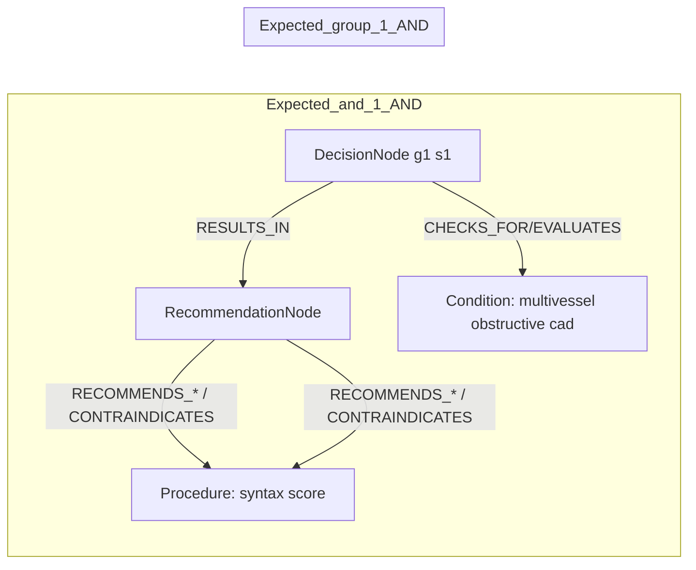
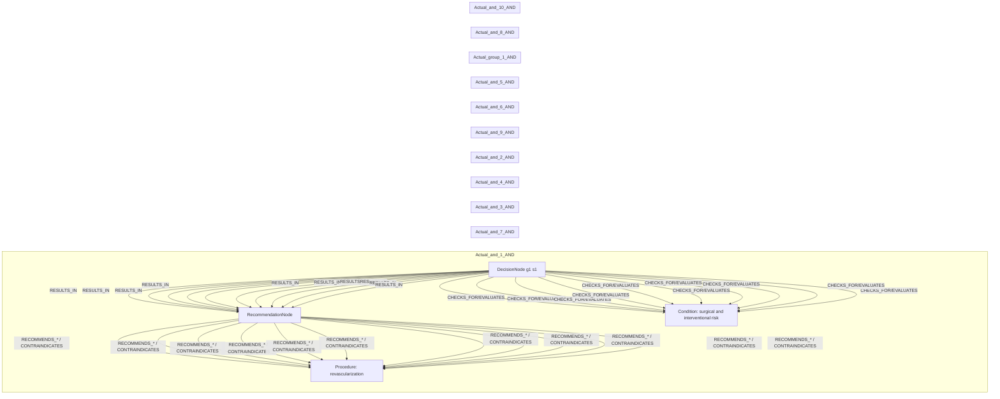

# row_15 (mapped to row_16)

Original table row text (ground truth):

```json
{
  "Table Header": "Recommendations for revascularization in patients with chronic coronary syndrome",
  "Section Header": "Assessment of procedural risks and post-procedural outcomes",
  "Recommendations": "In patients with multivessel obstructive CAD, calculation of the SYNTAX score is recommended to assess the anatomical complexity of disease. 786,865",
  "input": "patients with multivessel obstructive CAD",
  "recommendation": "calculation of the SYNTAX score is recommended to assess the anatomical complexity of disease",
  "Class a": "I",
  "Level b": "B"
}
```

Aligned JSON (expected vs actual):

<table>
  <tr>
    <th align="left">Expected</th>
    <th align="left">Actual</th>
  </tr>
  <tr>
    <td valign="top"><pre>
[
  {
    "entity": "multivessel obstructive cad",
    "entity_original": "patients with multivessel obstructive cad",
    "role": "Condition",
    "operator": "PRESENT",
    "threshold": null,
    "unit": null,
    "condition_context": null,
    "logic_type": "AND",
    "logic_group": "and_1",
    "strength": null,
    "level": null,
    "direction": null
  },
  {
    "entity": "syntax score",
    "entity_original": "calculation of the syntax score is recommended to assess the anatomical complexity of disease",
    "role": "Procedure",
    "operator": null,
    "threshold": null,
    "unit": null,
    "condition_context": null,
    "logic_type": null,
    "logic_group": null,
    "strength": "I",
    "level": "B",
    "direction": "POSITIVE"
  }
]
</pre></td>
    <td valign="top"><pre>
[
  {
    "entity": "age",
    "entity_original": "age",
    "role": "Condition",
    "operator": "PRESENT",
    "threshold": null,
    "unit": null,
    "condition_context": null,
    "logic_type": "AND",
    "logic_group": "and_1",
    "strength": null,
    "level": null,
    "direction": "UNKNOWN"
  },
  {
    "entity": "anatomical complexity",
    "entity_original": "high anatomical complexity",
    "role": "Condition",
    "operator": "PRESENT",
    "threshold": null,
    "unit": null,
    "condition_context": "high",
    "logic_type": "AND",
    "logic_group": "and_7",
    "strength": null,
    "level": null,
    "direction": "UNKNOWN"
  },
  {
    "entity": "cognitive status",
    "entity_original": "cognitive status",
    "role": "Condition",
    "operator": "PRESENT",
    "threshold": null,
    "unit": null,
    "condition_context": null,
    "logic_type": "AND",
    "logic_group": "and_3",
    "strength": null,
    "level": null,
    "direction": "UNKNOWN"
  },
  {
    "entity": "diabetes",
    "entity_original": "diabetes",
    "role": "Condition",
    "operator": "PRESENT",
    "threshold": null,
    "unit": null,
    "condition_context": null,
    "logic_type": "AND",
    "logic_group": "and_4",
    "strength": null,
    "level": null,
    "direction": "UNKNOWN"
  },
  {
    "entity": "frailty",
    "entity_original": "frailty",
    "role": "Condition",
    "operator": "PRESENT",
    "threshold": null,
    "unit": null,
    "condition_context": null,
    "logic_type": "AND",
    "logic_group": "and_2",
    "strength": null,
    "level": null,
    "direction": "UNKNOWN"
  },
  {
    "entity": "local expertise",
    "entity_original": "local expertise and outcomes",
    "role": "Condition",
    "operator": "PRESENT",
    "threshold": null,
    "unit": null,
    "condition_context": "and outcomes",
    "logic_type": "AND",
    "logic_group": "and_9",
    "strength": null,
    "level": null,
    "direction": "UNKNOWN"
  },
  {
    "entity": "multivessel disease",
    "entity_original": "multivessel disease with/out left main stem involvement",
    "role": "Condition",
    "operator": "PRESENT",
    "threshold": null,
    "unit": null,
    "condition_context": "with/out left main stem involvement",
    "logic_type": "AND",
    "logic_group": "and_6",
    "strength": null,
    "level": null,
    "direction": "UNKNOWN"
  },
  {
    "entity": "other comorbidities",
    "entity_original": "any other comorbidities",
    "role": "Condition",
    "operator": "PRESENT",
    "threshold": null,
    "unit": null,
    "condition_context": null,
    "logic_type": "AND",
    "logic_group": "and_5",
    "strength": null,
    "level": null,
    "direction": "UNKNOWN"
  },
  {
    "entity": "revascularization",
    "entity_original": "revascularization",
    "role": "Procedure",
    "operator": null,
    "threshold": null,
    "unit": null,
    "condition_context": null,
    "logic_type": null,
    "logic_group": null,
    "strength": null,
    "level": null,
    "direction": "POSITIVE"
  },
  {
    "entity": "revascularization completeness",
    "entity_original": "likelihood of revascularization completeness",
    "role": "Condition",
    "operator": "PRESENT",
    "threshold": null,
    "unit": null,
    "condition_context": "likelihood of",
    "logic_type": "AND",
    "logic_group": "and_8",
    "strength": null,
    "level": null,
    "direction": "UNKNOWN"
  },
  {
    "entity": "surgical and interventional risk",
    "entity_original": "surgical and interventional risk",
    "role": "Condition",
    "operator": "PRESENT",
    "threshold": null,
    "unit": null,
    "condition_context": null,
    "logic_type": "AND",
    "logic_group": "and_10",
    "strength": null,
    "level": null,
    "direction": "UNKNOWN"
  }
]
</pre></td>
  </tr>
</table>

Mermaid (expected):



Mermaid (actual):



Concepts:
- expected: 2
- actual: 11
- matches: 0
- missing: 2
- extra: 11

Missing concepts:
- Condition: multivessel obstructive cad
- Procedure: syntax score

Extra concepts:
- Condition: age
- Condition: anatomical complexity
- Condition: cognitive status
- Condition: diabetes
- Condition: frailty
- Condition: local expertise
- Condition: multivessel disease
- Condition: other comorbidities
- Condition: revascularization completeness
- Condition: surgical and interventional risk
- Procedure: revascularization

Rules (concept + logic fields):
- expected: 2
- actual: 11
- matches: 0
- missing: 2
- extra: 11

Missing rules:
- Condition: multivessel obstructive cad | op=PRESENT | logic=AND | grp=and_1
- Procedure: syntax score | class=I | level=B | dir=POSITIVE

Extra rules:
- Condition: age | op=PRESENT | logic=AND | grp=and_1 | dir=UNKNOWN
- Condition: anatomical complexity | op=PRESENT | ctx=high | logic=AND | grp=and_7 | dir=UNKNOWN
- Condition: cognitive status | op=PRESENT | logic=AND | grp=and_3 | dir=UNKNOWN
- Condition: diabetes | op=PRESENT | logic=AND | grp=and_4 | dir=UNKNOWN
- Condition: frailty | op=PRESENT | logic=AND | grp=and_2 | dir=UNKNOWN
- Condition: local expertise | op=PRESENT | ctx=and outcomes | logic=AND | grp=and_9 | dir=UNKNOWN
- Condition: multivessel disease | op=PRESENT | ctx=with/out left main stem involvement | logic=AND | grp=and_6 | dir=UNKNOWN
- Condition: other comorbidities | op=PRESENT | logic=AND | grp=and_5 | dir=UNKNOWN
- Condition: revascularization completeness | op=PRESENT | ctx=likelihood of | logic=AND | grp=and_8 | dir=UNKNOWN
- Condition: surgical and interventional risk | op=PRESENT | logic=AND | grp=and_10 | dir=UNKNOWN
- Procedure: revascularization | dir=POSITIVE

