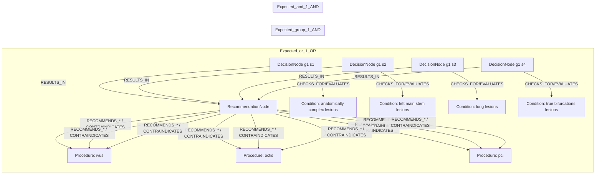
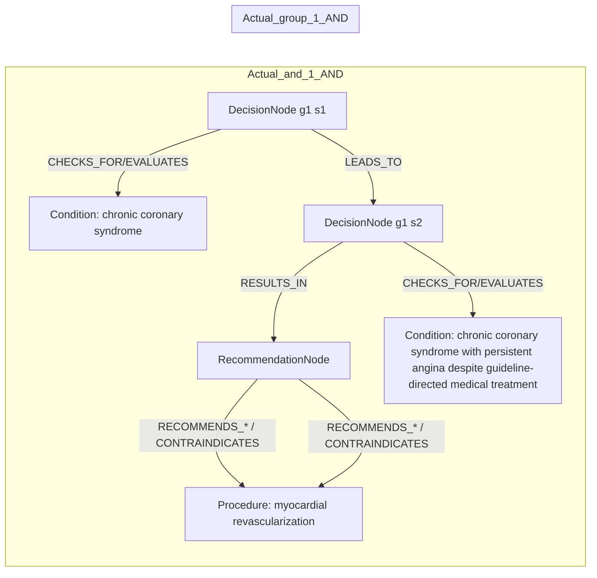

# row_16 (mapped to row_17)

Original table row text (ground truth):

```json
{
  "Table Header": "Recommendations for revascularization in patients with chronic coronary syndrome",
  "Section Header": "Assessment of procedural risks and post-procedural outcomes",
  "Recommendations": "Intracoronary imaging guidance by IVUS or OCTis recommended when performing PCI on anatomically complex lesions, in particular left main stem, true bifurcations, and long lesions. 866,337,810,840,841",
  "input": "when performing PCI on anatomically complex lesions, in particular left main stem, true bifurcations, and long lesions",
  "recommendation": "Intracoronary imaging guidance by IVUS or OCTis recommended",
  "Class a": "I",
  "Level b": "A"
}
```

Aligned JSON (expected vs actual):

<table>
  <tr>
    <th align="left">Expected</th>
    <th align="left">Actual</th>
  </tr>
  <tr>
    <td valign="top"><pre>
[
  {
    "entity": "anatomically complex lesions",
    "entity_original": "anatomically complex lesions",
    "role": "Condition",
    "operator": "PRESENT",
    "threshold": null,
    "unit": null,
    "condition_context": null,
    "logic_type": "OR",
    "logic_group": "or_1",
    "strength": null,
    "level": null,
    "direction": null
  },
  {
    "entity": "ivus",
    "entity_original": "intracoronary imaging guidance by ivus recommended",
    "role": "Procedure",
    "operator": null,
    "threshold": null,
    "unit": null,
    "condition_context": null,
    "logic_type": null,
    "logic_group": null,
    "strength": "I",
    "level": "A",
    "direction": "POSITIVE"
  },
  {
    "entity": "left main stem lesions",
    "entity_original": "left main stem lesions",
    "role": "Condition",
    "operator": "PRESENT",
    "threshold": null,
    "unit": null,
    "condition_context": null,
    "logic_type": "OR",
    "logic_group": "or_1",
    "strength": null,
    "level": null,
    "direction": null
  },
  {
    "entity": "long lesions",
    "entity_original": "long lesions",
    "role": "Condition",
    "operator": "PRESENT",
    "threshold": null,
    "unit": null,
    "condition_context": null,
    "logic_type": "OR",
    "logic_group": "or_1",
    "strength": null,
    "level": null,
    "direction": null
  },
  {
    "entity": "octis",
    "entity_original": "intracoronary imaging guidance by octis recommended",
    "role": "Procedure",
    "operator": null,
    "threshold": null,
    "unit": null,
    "condition_context": null,
    "logic_type": null,
    "logic_group": null,
    "strength": "I",
    "level": "A",
    "direction": "POSITIVE"
  },
  {
    "entity": "pci",
    "entity_original": "pci",
    "role": "Procedure",
    "operator": "PRESENT",
    "threshold": null,
    "unit": null,
    "condition_context": null,
    "logic_type": "AND",
    "logic_group": "and_1",
    "strength": null,
    "level": null,
    "direction": null
  },
  {
    "entity": "true bifurcations lesions",
    "entity_original": "true bifurcations lesions",
    "role": "Condition",
    "operator": "PRESENT",
    "threshold": null,
    "unit": null,
    "condition_context": null,
    "logic_type": "OR",
    "logic_group": "or_1",
    "strength": null,
    "level": null,
    "direction": null
  }
]
</pre></td>
    <td valign="top"><pre>
[
  {
    "entity": "chronic coronary syndrome",
    "entity_original": "chronic coronary syndrome (ccs) patients with persistent angina or anginal equivalent, despite guideline-directed medical treatment",
    "role": "Condition",
    "operator": "PRESENT",
    "threshold": null,
    "unit": null,
    "condition_context": "with persistent angina or anginal equivalent, despite guideline-directed medical treatment",
    "logic_type": "AND",
    "logic_group": "and_1",
    "strength": "I",
    "level": "A",
    "direction": "POSITIVE"
  },
  {
    "entity": "chronic coronary syndrome with persistent angina despite guideline-directed medical treatment",
    "entity_original": "chronic coronary syndrome (ccs) patients with persistent angina or anginal equivalent, despite guideline-directed medical treatment",
    "role": "Condition",
    "operator": "PRESENT",
    "threshold": null,
    "unit": null,
    "condition_context": "with persistent angina or anginal equivalent, despite guideline-directed medical treatment",
    "logic_type": "AND",
    "logic_group": "and_1",
    "strength": "I",
    "level": "A",
    "direction": "UNKNOWN"
  },
  {
    "entity": "myocardial revascularization",
    "entity_original": "myocardial revascularization of functionally significant obstructive coronary artery disease (cad)",
    "role": "Procedure",
    "operator": null,
    "threshold": null,
    "unit": null,
    "condition_context": "of functionally significant obstructive coronary artery disease (cad)",
    "logic_type": null,
    "logic_group": null,
    "strength": "I",
    "level": "A",
    "direction": "POSITIVE"
  }
]
</pre></td>
  </tr>
</table>

Mermaid (expected):



Mermaid (actual):



Concepts:
- expected: 7
- actual: 3
- matches: 0
- missing: 7
- extra: 3

Missing concepts:
- Condition: anatomically complex lesions
- Condition: left main stem lesions
- Condition: long lesions
- Condition: true bifurcations lesions
- Procedure: ivus
- Procedure: octis
- Procedure: pci

Extra concepts:
- Condition: chronic coronary syndrome
- Condition: chronic coronary syndrome with persistent angina despite guideline-directed medical treatment
- Procedure: myocardial revascularization

Rules (concept + logic fields):
- expected: 7
- actual: 3
- matches: 0
- missing: 7
- extra: 3

Missing rules:
- Condition: anatomically complex lesions | op=PRESENT | logic=OR | grp=or_1
- Condition: left main stem lesions | op=PRESENT | logic=OR | grp=or_1
- Condition: long lesions | op=PRESENT | logic=OR | grp=or_1
- Condition: true bifurcations lesions | op=PRESENT | logic=OR | grp=or_1
- Procedure: ivus | class=I | level=A | dir=POSITIVE
- Procedure: octis | class=I | level=A | dir=POSITIVE
- Procedure: pci | op=PRESENT | logic=AND | grp=and_1

Extra rules:
- Condition: chronic coronary syndrome with persistent angina despite guideline-directed medical treatment | op=PRESENT | ctx=with persistent angina or anginal equivalent, despite guideline-directed medical treatment | logic=AND | grp=and_1 | class=I | level=A | dir=UNKNOWN
- Condition: chronic coronary syndrome | op=PRESENT | ctx=with persistent angina or anginal equivalent, despite guideline-directed medical treatment | logic=AND | grp=and_1 | class=I | level=A | dir=POSITIVE
- Procedure: myocardial revascularization | ctx=of functionally significant obstructive coronary artery disease (cad) | class=I | level=A | dir=POSITIVE

