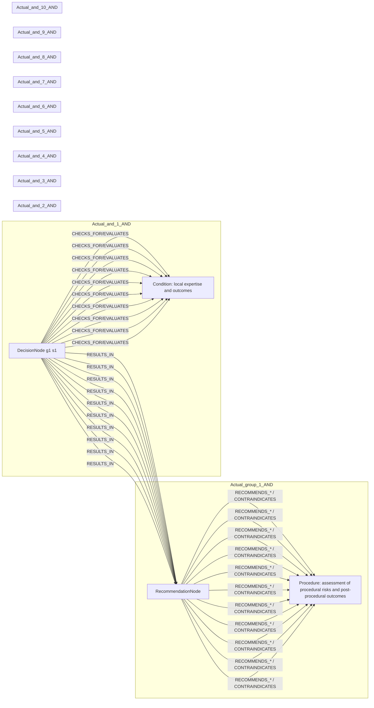

# row_17 (mapped to row_18)

Original table row text (ground truth):

```json
{
  "Table Header": "Recommendations for revascularization in patients with chronic coronary syndrome",
  "Section Header": "Assessment of procedural risks and post-procedural outcomes",
  "Sub Header": "Intracoronary pressure measurement (FFR or iFR) or computation (QFR) :",
  "Recommendations": "\u2022 is recommended to guide lesion selection for intervention in patients with multivessel disease; 308,826,866,867",
  "input": "intervention in patients with multivessel disease",
  "recommendation": "Intracoronary pressure measurement (FFR or iFR) or computation (QFR) is recommended to guide lesion selection for intervention",
  "Class a": "I",
  "Level b": "A"
}
```

Aligned JSON (expected vs actual):

<table>
  <tr>
    <th align="left">Expected</th>
    <th align="left">Actual</th>
  </tr>
  <tr>
    <td valign="top"><pre>
[
  {
    "entity": "intervention",
    "entity_original": "intervention",
    "role": "Procedure",
    "operator": "PRESENT",
    "threshold": null,
    "unit": null,
    "condition_context": null,
    "logic_type": "AND",
    "logic_group": "and_1",
    "strength": null,
    "level": null,
    "direction": null
  },
  {
    "entity": "multivessel disease",
    "entity_original": "patients with multivessel disease",
    "role": "Condition",
    "operator": "PRESENT",
    "threshold": null,
    "unit": null,
    "condition_context": null,
    "logic_type": "AND",
    "logic_group": "and_1",
    "strength": null,
    "level": null,
    "direction": null
  },
  {
    "entity": "intracoronary pressure measurement (ffr)",
    "entity_original": "intracoronary pressure measurement (ffr) is recommended to guide lesion selection for intervention",
    "role": "Procedure",
    "operator": null,
    "threshold": null,
    "unit": null,
    "condition_context": null,
    "logic_type": null,
    "logic_group": null,
    "strength": "I",
    "level": "A",
    "direction": "POSITIVE"
  },
  {
    "entity": "intracoronary pressure measurement (ifr)",
    "entity_original": "intracoronary pressure measurement (ifr) is recommended to guide lesion selection for intervention",
    "role": "Procedure",
    "operator": null,
    "threshold": null,
    "unit": null,
    "condition_context": null,
    "logic_type": null,
    "logic_group": null,
    "strength": "I",
    "level": "A",
    "direction": "POSITIVE"
  },
  {
    "entity": "computation (qfr)",
    "entity_original": "computation (qfr) is recommended to guide lesion selection for intervention",
    "role": "Procedure",
    "operator": null,
    "threshold": null,
    "unit": null,
    "condition_context": null,
    "logic_type": null,
    "logic_group": null,
    "strength": "I",
    "level": "A",
    "direction": "POSITIVE"
  }
]
</pre></td>
    <td valign="top"><pre>
[
  {
    "entity": "assessment of procedural risks and post-procedural outcomes",
    "entity_original": "assessment of procedural risks and post-procedural outcomes",
    "role": "Procedure",
    "operator": null,
    "threshold": null,
    "unit": null,
    "condition_context": null,
    "logic_type": null,
    "logic_group": null,
    "strength": null,
    "level": null,
    "direction": "POSITIVE"
  },
  {
    "entity": "age",
    "entity_original": "age",
    "role": "Condition",
    "operator": "PRESENT",
    "threshold": null,
    "unit": null,
    "condition_context": null,
    "logic_type": "AND",
    "logic_group": "and_1",
    "strength": null,
    "level": null,
    "direction": "UNKNOWN"
  },
  {
    "entity": "frailty",
    "entity_original": "frailty",
    "role": "Condition",
    "operator": "PRESENT",
    "threshold": null,
    "unit": null,
    "condition_context": null,
    "logic_type": "AND",
    "logic_group": "and_2",
    "strength": null,
    "level": null,
    "direction": "UNKNOWN"
  },
  {
    "entity": "cognitive status",
    "entity_original": "cognitive status",
    "role": "Condition",
    "operator": "PRESENT",
    "threshold": null,
    "unit": null,
    "condition_context": null,
    "logic_type": "AND",
    "logic_group": "and_3",
    "strength": null,
    "level": null,
    "direction": "UNKNOWN"
  },
  {
    "entity": "diabetes",
    "entity_original": "diabetes",
    "role": "Condition",
    "operator": "PRESENT",
    "threshold": null,
    "unit": null,
    "condition_context": null,
    "logic_type": "AND",
    "logic_group": "and_4",
    "strength": null,
    "level": null,
    "direction": "UNKNOWN"
  },
  {
    "entity": "other comorbidities",
    "entity_original": "any other comorbidities",
    "role": "Condition",
    "operator": "PRESENT",
    "threshold": null,
    "unit": null,
    "condition_context": null,
    "logic_type": "AND",
    "logic_group": "and_5",
    "strength": null,
    "level": null,
    "direction": "UNKNOWN"
  },
  {
    "entity": "multivessel disease",
    "entity_original": "multivessel disease",
    "role": "Condition",
    "operator": "PRESENT",
    "threshold": null,
    "unit": null,
    "condition_context": null,
    "logic_type": "AND",
    "logic_group": "and_6",
    "strength": null,
    "level": null,
    "direction": "UNKNOWN"
  },
  {
    "entity": "left main stem involvement",
    "entity_original": "left main stem involvement",
    "role": "Condition",
    "operator": "PRESENT",
    "threshold": null,
    "unit": null,
    "condition_context": null,
    "logic_type": "AND",
    "logic_group": "and_7",
    "strength": null,
    "level": null,
    "direction": "UNKNOWN"
  },
  {
    "entity": "high anatomical complexity",
    "entity_original": "high anatomical complexity",
    "role": "Condition",
    "operator": "PRESENT",
    "threshold": null,
    "unit": null,
    "condition_context": null,
    "logic_type": "AND",
    "logic_group": "and_8",
    "strength": null,
    "level": null,
    "direction": "UNKNOWN"
  },
  {
    "entity": "likelihood of revascularization completeness",
    "entity_original": "likelihood of revascularization completeness",
    "role": "Condition",
    "operator": "PRESENT",
    "threshold": null,
    "unit": null,
    "condition_context": null,
    "logic_type": "AND",
    "logic_group": "and_9",
    "strength": null,
    "level": null,
    "direction": "UNKNOWN"
  },
  {
    "entity": "local expertise and outcomes",
    "entity_original": "local expertise and outcomes",
    "role": "Condition",
    "operator": "PRESENT",
    "threshold": null,
    "unit": null,
    "condition_context": null,
    "logic_type": "AND",
    "logic_group": "and_10",
    "strength": null,
    "level": null,
    "direction": "UNKNOWN"
  }
]
</pre></td>
  </tr>
</table>

Mermaid (expected):

```mermaid
graph LR
  subgraph Expected_and_1_AND
    REC[RecommendationNode]
    D1[DecisionNode g1 s1]
    C1[Condition: multivessel disease]
    D1 -->|CHECKS_FOR/EVALUATES| C1
    D1 -->|RESULTS_IN| REC
    ACT1[Procedure: intervention]
    REC -->|RECOMMENDS_* / CONTRAINDICATES| ACT1
    ACT2[Procedure: intracoronary pressure measurement (ffr)]
    REC -->|RECOMMENDS_* / CONTRAINDICATES| ACT2
    ACT3[Procedure: intracoronary pressure measurement (ifr)]
    REC -->|RECOMMENDS_* / CONTRAINDICATES| ACT3
    ACT4[Procedure: computation (qfr)]
    REC -->|RECOMMENDS_* / CONTRAINDICATES| ACT4
  end
  subgraph Expected_group_1_AND
    REC[RecommendationNode]
    REC
    ACT1[Procedure: intervention]
    REC -->|RECOMMENDS_* / CONTRAINDICATES| ACT1
    ACT2[Procedure: intracoronary pressure measurement (ffr)]
    REC -->|RECOMMENDS_* / CONTRAINDICATES| ACT2
    ACT3[Procedure: intracoronary pressure measurement (ifr)]
    REC -->|RECOMMENDS_* / CONTRAINDICATES| ACT3
    ACT4[Procedure: computation (qfr)]
    REC -->|RECOMMENDS_* / CONTRAINDICATES| ACT4
  end
```

Mermaid (actual):



Concepts:
- expected: 5
- actual: 11
- matches: 1
- missing: 4
- extra: 10

Missing concepts:
- Procedure: computation (qfr)
- Procedure: intervention
- Procedure: intracoronary pressure measurement (ffr)
- Procedure: intracoronary pressure measurement (ifr)

Extra concepts:
- Condition: age
- Condition: cognitive status
- Condition: diabetes
- Condition: frailty
- Condition: high anatomical complexity
- Condition: left main stem involvement
- Condition: likelihood of revascularization completeness
- Condition: local expertise and outcomes
- Condition: other comorbidities
- Procedure: assessment of procedural risks and post-procedural outcomes

Rules (concept + logic fields):
- expected: 5
- actual: 11
- matches: 0
- missing: 5
- extra: 11

Missing rules:
- Condition: multivessel disease | op=PRESENT | logic=AND | grp=and_1
- Procedure: computation (qfr) | class=I | level=A | dir=POSITIVE
- Procedure: intervention | op=PRESENT | logic=AND | grp=and_1
- Procedure: intracoronary pressure measurement (ffr) | class=I | level=A | dir=POSITIVE
- Procedure: intracoronary pressure measurement (ifr) | class=I | level=A | dir=POSITIVE

Extra rules:
- Condition: age | op=PRESENT | logic=AND | grp=and_1 | dir=UNKNOWN
- Condition: cognitive status | op=PRESENT | logic=AND | grp=and_3 | dir=UNKNOWN
- Condition: diabetes | op=PRESENT | logic=AND | grp=and_4 | dir=UNKNOWN
- Condition: frailty | op=PRESENT | logic=AND | grp=and_2 | dir=UNKNOWN
- Condition: high anatomical complexity | op=PRESENT | logic=AND | grp=and_8 | dir=UNKNOWN
- Condition: left main stem involvement | op=PRESENT | logic=AND | grp=and_7 | dir=UNKNOWN
- Condition: likelihood of revascularization completeness | op=PRESENT | logic=AND | grp=and_9 | dir=UNKNOWN
- Condition: local expertise and outcomes | op=PRESENT | logic=AND | grp=and_10 | dir=UNKNOWN
- Condition: multivessel disease | op=PRESENT | logic=AND | grp=and_6 | dir=UNKNOWN
- Condition: other comorbidities | op=PRESENT | logic=AND | grp=and_5 | dir=UNKNOWN
- Procedure: assessment of procedural risks and post-procedural outcomes | dir=POSITIVE

