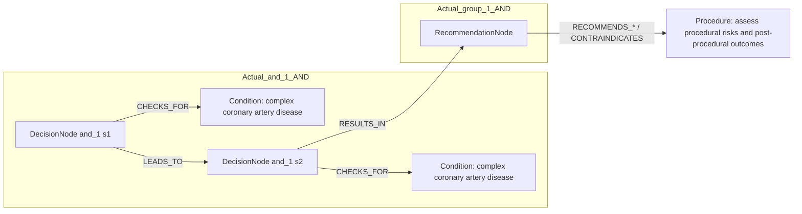

# row_18 (mapped to row_19)

Original table row text (ground truth):

```json
{
  "Recommendations": "\u2022 should be considered at the end of the procedure to identify patients at high risk of persistent angina and subsequent clinical events; 828,830,831,868",
  "Class a": "IIa",
  "Level b": "B"
}
```

Aligned JSON (expected vs actual):

<table>
  <tr>
    <th align="left">Human Annotation</th>
    <th align="left">LLM Generated</th>
  </tr>
  <tr>
    <td valign="top"><pre>
[
  {
    "rule_id": 1,
    "conditions": [
      {
        "entity": "revascularization",
        "entity_original": "at the end of the revascularization",
        "role": "Procedure",
        "operator": "PRESENT",
        "threshold": null,
        "unit": null,
        "condition_context": null,
        "logic_type": "AND",
        "logic_group": "and_1",
        "strength": null,
        "level": null,
        "direction": null
      },
      {
        "entity": "chronic coronary syndrome",
        "entity_original": "patients with chronic coronary syndrome",
        "role": "Condition",
        "operator": "PRESENT",
        "threshold": null,
        "unit": null,
        "condition_context": null,
        "logic_type": "AND",
        "logic_group": "and_1",
        "strength": null,
        "level": null,
        "direction": null
      }
    ],
    "actions": [
      {
        "entity": "intracoronary pressure measurement (ffr)",
        "entity_original": "intracoronary pressure measurement (ffr) is recommended to identify patients at high risk of persistent angina and subsequent clinical events",
        "role": "Procedure",
        "operator": null,
        "threshold": null,
        "unit": null,
        "condition_context": null,
        "logic_type": null,
        "logic_group": null,
        "strength": "IIa",
        "level": "B",
        "direction": "POSITIVE"
      },
      {
        "entity": "intracoronary pressure measurement (ifr)",
        "entity_original": "intracoronary pressure measurement (ifr) is recommended to identify patients at high risk of persistent angina and subsequent clinical events",
        "role": "Procedure",
        "operator": null,
        "threshold": null,
        "unit": null,
        "condition_context": null,
        "logic_type": null,
        "logic_group": null,
        "strength": "IIa",
        "level": "B",
        "direction": "POSITIVE"
      },
      {
        "entity": "computation (qfr)",
        "entity_original": "computation (qfr) is recommended to identify patients at high risk of persistent angina and subsequent clinical events",
        "role": "Procedure",
        "operator": null,
        "threshold": null,
        "unit": null,
        "condition_context": null,
        "logic_type": null,
        "logic_group": null,
        "strength": "IIa",
        "level": "B",
        "direction": "POSITIVE"
      }
    ]
  }
]
</pre></td>
    <td valign="top"><pre>
[
  {
    "entity": "complex coronary artery disease",
    "entity_original": "complex coronary artery disease (cad)",
    "role": "Condition",
    "operator": "PRESENT",
    "threshold": null,
    "unit": null,
    "condition_context": "in whom revascularization is being considered",
    "logic_type": "AND",
    "logic_group": "and_1",
    "strength": "I",
    "level": "C",
    "direction": "POSITIVE"
  },
  {
    "entity": "assess procedural risks and post-procedural outcomes",
    "entity_original": "assess procedural risks and post-procedural outcomes",
    "role": "Procedure",
    "operator": null,
    "threshold": null,
    "unit": null,
    "condition_context": "to guide shared clinical decision-making",
    "logic_type": null,
    "logic_group": null,
    "strength": "I",
    "level": "C",
    "direction": "POSITIVE"
  },
  {
    "entity": "complex coronary artery disease",
    "entity_original": "complex coronary artery disease (cad) in whom revascularization is being considered",
    "role": "Condition",
    "operator": "PRESENT",
    "threshold": null,
    "unit": null,
    "condition_context": "revascularization considered",
    "logic_type": "AND",
    "logic_group": "and_1",
    "strength": "I",
    "level": "C",
    "direction": "UNKNOWN"
  }
]
</pre></td>
  </tr>
</table>

Mermaid (expected):

```mermaid
graph LR
  REC[RecommendationNode]
  ACT1[Procedure: revascularization]
  REC -->|RECOMMENDS_* / CONTRAINDICATES| ACT1
  ACT2[Procedure: intracoronary pressure measurement (ffr)]
  REC -->|RECOMMENDS_* / CONTRAINDICATES| ACT2
  ACT3[Procedure: intracoronary pressure measurement (ifr)]
  REC -->|RECOMMENDS_* / CONTRAINDICATES| ACT3
  ACT4[Procedure: computation (qfr)]
  REC -->|RECOMMENDS_* / CONTRAINDICATES| ACT4
  subgraph Expected_and_1_AND
    D_and_1_1[DecisionNode and_1 s1]
    C_and_1_1[Condition: chronic coronary syndrome]
    D_and_1_1 -->|CHECKS_FOR| C_and_1_1
  end
  subgraph Expected_group_1_AND
    REC
  end
  D_and_1_1 -->|RESULTS_IN| REC
```

Mermaid (actual):



Concepts:
- expected: 5
- actual: 2
- matches: 0
- missing: 5
- extra: 2

Missing concepts:
- Condition: chronic coronary syndrome
- Procedure: computation (qfr)
- Procedure: intracoronary pressure measurement (ffr)
- Procedure: intracoronary pressure measurement (ifr)
- Procedure: revascularization

Extra concepts:
- Condition: complex coronary artery disease
- Procedure: assess procedural risks and post-procedural outcomes

Rules (concept + logic fields):
- expected: 5
- actual: 3
- matches: 0
- missing: 5
- extra: 3

Missing rules:
- Condition: chronic coronary syndrome | op=PRESENT | logic=AND | grp=and_1
- Procedure: computation (qfr) | class=IIa | level=B | dir=POSITIVE
- Procedure: intracoronary pressure measurement (ffr) | class=IIa | level=B | dir=POSITIVE
- Procedure: intracoronary pressure measurement (ifr) | class=IIa | level=B | dir=POSITIVE
- Procedure: revascularization | op=PRESENT | logic=AND | grp=and_1

Extra rules:
- Condition: complex coronary artery disease | op=PRESENT | ctx=in whom revascularization is being considered | logic=AND | grp=and_1 | class=I | level=C | dir=POSITIVE
- Condition: complex coronary artery disease | op=PRESENT | ctx=revascularization considered | logic=AND | grp=and_1 | class=I | level=C | dir=UNKNOWN
- Procedure: assess procedural risks and post-procedural outcomes | ctx=to guide shared clinical decision-making | class=I | level=C | dir=POSITIVE

