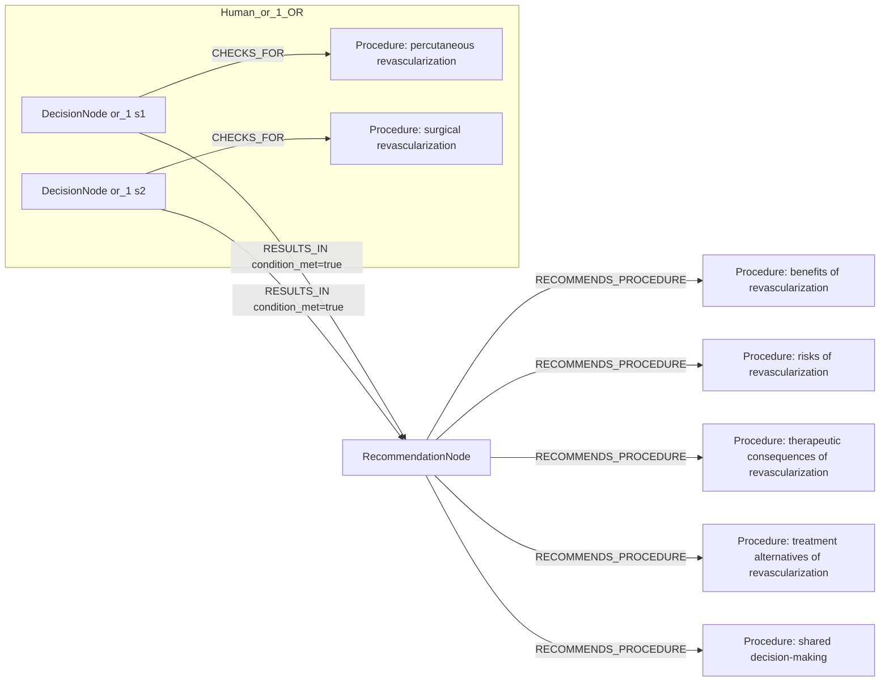
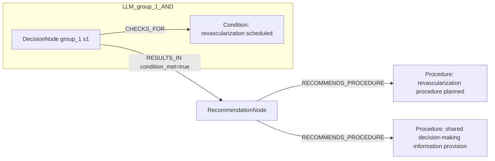

# row_01 (mapped to row_01)

Original table row text (ground truth):

```json
{
  "Recommendations": "It is recommended that patients scheduled for percutaneous or surgical revascularization receive complete information about the benefits, risks, therapeutic consequences, and alternatives to revascularization, as part of shared clinical decision-making. 847,848,857",
  "Class a": "I",
  "Level b": "C"
}
```

Aligned JSON (expected vs actual):

<table>
  <tr>
    <th align="left">Human Annotation</th>
    <th align="left">LLM Generated</th>
  </tr>
  <tr>
    <td valign="top"><pre>
[
  {
    "rule_id": 1,
    "conditions": [
      {
        "entity": "percutaneous revascularization",
        "entity_original": "patients scheduled for percutaneous revascularization",
        "role": "Procedure",
        "operator": "PRESENT",
        "threshold": null,
        "unit": null,
        "condition_context": null,
        "logic_type": "OR",
        "logic_group": "or_1",
        "strength": null,
        "level": null,
        "direction": null
      },
      {
        "entity": "surgical revascularization",
        "entity_original": "patients scheduled for surgical revascularization",
        "role": "Procedure",
        "operator": "PRESENT",
        "threshold": null,
        "unit": null,
        "condition_context": null,
        "logic_type": "OR",
        "logic_group": "or_1",
        "strength": null,
        "level": null,
        "direction": null
      }
    ],
    "actions": [
      {
        "entity": "benefits of revascularization",
        "entity_original": "provide information about benefits of revascularization",
        "role": "Procedure",
        "operator": null,
        "threshold": null,
        "unit": null,
        "condition_context": null,
        "logic_type": null,
        "logic_group": null,
        "strength": "I",
        "level": "C",
        "direction": "POSITIVE"
      },
      {
        "entity": "risks of revascularization",
        "entity_original": "provide information about risks of revascularization",
        "role": "Procedure",
        "operator": null,
        "threshold": null,
        "unit": null,
        "condition_context": null,
        "logic_type": null,
        "logic_group": null,
        "strength": "I",
        "level": "C",
        "direction": "POSITIVE"
      },
      {
        "entity": "therapeutic consequences of revascularization",
        "entity_original": "receive information about therapeutic consequences of revascularization",
        "role": "Procedure",
        "operator": null,
        "threshold": null,
        "unit": null,
        "condition_context": null,
        "logic_type": null,
        "logic_group": null,
        "strength": "I",
        "level": "C",
        "direction": "POSITIVE"
      },
      {
        "entity": "treatment alternatives of revascularization",
        "entity_original": "provide information about treatment alternatives of revascularization",
        "role": "Procedure",
        "operator": null,
        "threshold": null,
        "unit": null,
        "condition_context": null,
        "logic_type": null,
        "logic_group": null,
        "strength": "I",
        "level": "C",
        "direction": "POSITIVE"
      },
      {
        "entity": "shared decision-making",
        "entity_original": "take part in shared clinical decision-making",
        "role": "Procedure",
        "operator": null,
        "threshold": null,
        "unit": null,
        "condition_context": null,
        "logic_type": null,
        "logic_group": null,
        "strength": "I",
        "level": "C",
        "direction": "POSITIVE"
      }
    ]
  }
]
</pre></td>
    <td valign="top"><pre>
{
  "1": {
    "conditions": [],
    "actions": [
      {
        "entity": "revascularization procedure planned",
        "entity_original": "patients scheduled for percutaneous or surgical revascularization",
        "role": "Procedure",
        "operator": "PLANNED",
        "threshold": null,
        "unit": null,
        "condition_context": null,
        "logic_type": null,
        "logic_group": null,
        "strength": null,
        "level": null,
        "direction": "UNKNOWN",
        "rule_id": 1,
        "side": "action",
        "preferred_term": "Limb revascularization (procedure)",
        "synonyms": [
          "Limb revascularisation",
          "Limb revascularization"
        ],
        "snomed_id": 233497001,
        "target_label": "Procedure",
        "taxonomy_path": [
          {
            "concept_id": "233497001",
            "term": "Limb revascularization (procedure)"
          },
          {
            "concept_id": "22701007",
            "term": "Operative procedure on artery of extremity (procedure)"
          },
          {
            "concept_id": "363187007",
            "term": "Limb operation (procedure)"
          },
          {
            "concept_id": "128927009",
            "term": "Procedure by method (procedure)"
          },
          {
            "concept_id": "71388002",
            "term": "Procedure (procedure)"
          },
          {
            "concept_id": "138875005",
            "term": "SNOMED CT Concept (SNOMED RT+CTV3)"
          }
        ],
        "root_concept_id": "71388002",
        "root_concept_term": "Procedure (procedure)",
        "mapped_target_label": "Procedure"
      }
    ]
  }
}
</pre></td>
  </tr>
</table>

Mermaid (Human Annotation):



Mermaid (LLM Generated):



Grounding summary (optional):

```json
{
  "enabled": true,
  "total_grounded": 1,
  "target_label_counts": {
    "Procedure": 1
  },
  "root_hit_counts": {
    "71388002": 1
  },
  "root_hits": [
    {
      "entity": "Revascularization procedure PLANNED",
      "entity_original": "patients scheduled for percutaneous or surgical revascularization",
      "role": "Procedure",
      "preferred_term": "Limb revascularization (procedure)",
      "synonyms": [
        "Limb revascularisation",
        "Limb revascularization"
      ],
      "snomed_id": 233497001,
      "target_label": "Procedure",
      "taxonomy_path": [
        {
          "concept_id": "233497001",
          "term": "Limb revascularization (procedure)"
        },
        {
          "concept_id": "22701007",
          "term": "Operative procedure on artery of extremity (procedure)"
        },
        {
          "concept_id": "363187007",
          "term": "Limb operation (procedure)"
        },
        {
          "concept_id": "128927009",
          "term": "Procedure by method (procedure)"
        },
        {
          "concept_id": "71388002",
          "term": "Procedure (procedure)"
        },
        {
          "concept_id": "138875005",
          "term": "SNOMED CT Concept (SNOMED RT+CTV3)"
        }
      ],
      "root_hit": {
        "root_concept_id": "71388002",
        "root_concept_term": "Procedure (procedure)",
        "mapped_target_label": "Procedure"
      }
    }
  ]
}
```

Concepts:
- expected: 7
- actual: 3
- matches: 0
- missing: 7
- extra: 3

Missing concepts:
- Procedure: benefits of revascularization
- Procedure: percutaneous revascularization
- Procedure: risks of revascularization
- Procedure: shared decision-making
- Procedure: surgical revascularization
- Procedure: therapeutic consequences of revascularization
- Procedure: treatment alternatives of revascularization

Extra concepts:
- Condition: revascularization scheduled
- Procedure: revascularization procedure planned
- Procedure: shared decision-making information provision

Rules (concept + logic fields):
- expected: 7
- actual: 3
- matches: 0
- missing: 7
- extra: 3

Missing rules:
- Procedure: benefits of revascularization | class=I | level=C | dir=POSITIVE
- Procedure: percutaneous revascularization | op=PRESENT | logic=OR | grp=or_1
- Procedure: risks of revascularization | class=I | level=C | dir=POSITIVE
- Procedure: shared decision-making | class=I | level=C | dir=POSITIVE
- Procedure: surgical revascularization | op=PRESENT | logic=OR | grp=or_1
- Procedure: therapeutic consequences of revascularization | class=I | level=C | dir=POSITIVE
- Procedure: treatment alternatives of revascularization | class=I | level=C | dir=POSITIVE

Extra rules:
- Condition: revascularization scheduled | op=PLANNED | ctx=scheduled | class=I | level=C | dir=POSITIVE
- Procedure: revascularization procedure planned | op=PLANNED | dir=UNKNOWN
- Procedure: shared decision-making information provision | class=I | level=C | dir=POSITIVE

