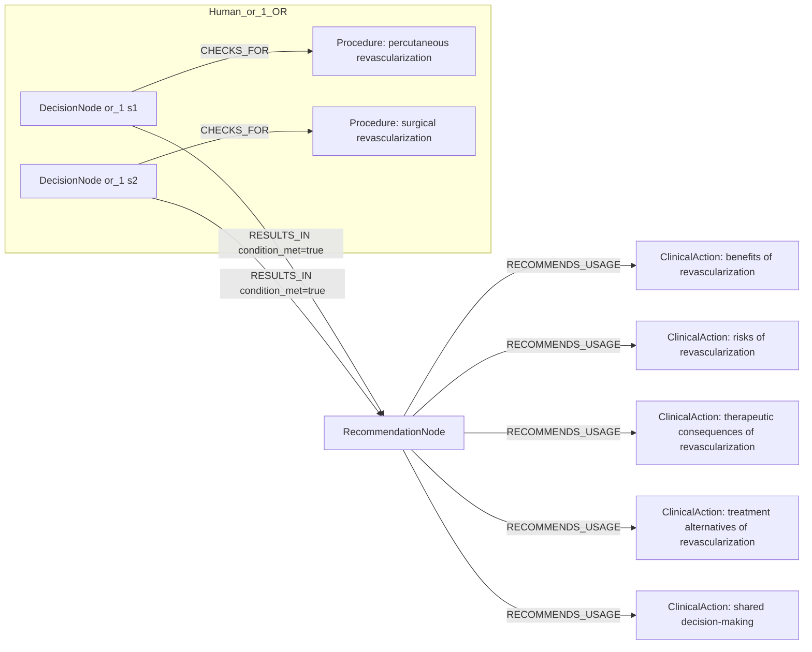
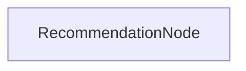

# row_01 (mapped to row_02)

Original table row text (ground truth):

```json
{
  "Recommendations": "It is recommended that patients scheduled for percutaneous or surgical revascularization receive complete information about the benefits, risks, therapeutic consequences, and alternatives to revascularization, as part of shared clinical decision-making. 847,848,857",
  "Class a": "I",
  "Level b": "C"
}
```

Aligned JSON (expected vs actual):

<table>
  <tr>
    <th align="left">Human Annotation</th>
    <th align="left">LLM Generated</th>
  </tr>
  <tr>
    <td valign="top"><pre>
[
  {
    "conditions": [
      {
        "entity": "percutaneous revascularization",
        "entity_original": "patients scheduled for percutaneous revascularization",
        "role": "Procedure",
        "operator": "PRESENT",
        "threshold": null,
        "unit": null,
        "context": null,
        "logic_type": "OR",
        "logic_group": "or_1",
        "strength": null,
        "level": null,
        "direction": null
      },
      {
        "entity": "surgical revascularization",
        "entity_original": "patients scheduled for surgical revascularization",
        "role": "Procedure",
        "operator": "PRESENT",
        "threshold": null,
        "unit": null,
        "context": null,
        "logic_type": "OR",
        "logic_group": "or_1",
        "strength": null,
        "level": null,
        "direction": null
      }
    ],
    "actions": [
      {
        "entity": "benefits of revascularization",
        "entity_original": "provide information about benefits of revascularization",
        "role": "ClinicalAction",
        "operator": null,
        "threshold": null,
        "unit": null,
        "context": null,
        "logic_type": null,
        "logic_group": null,
        "strength": "I",
        "level": "C",
        "direction": "POSITIVE"
      },
      {
        "entity": "risks of revascularization",
        "entity_original": "provide information about risks of revascularization",
        "role": "ClinicalAction",
        "operator": null,
        "threshold": null,
        "unit": null,
        "context": null,
        "logic_type": null,
        "logic_group": null,
        "strength": "I",
        "level": "C",
        "direction": "POSITIVE"
      },
      {
        "entity": "therapeutic consequences of revascularization",
        "entity_original": "receive information about therapeutic consequences of revascularization",
        "role": "ClinicalAction",
        "operator": null,
        "threshold": null,
        "unit": null,
        "context": null,
        "logic_type": null,
        "logic_group": null,
        "strength": "I",
        "level": "C",
        "direction": "POSITIVE"
      },
      {
        "entity": "treatment alternatives of revascularization",
        "entity_original": "provide information about treatment alternatives of revascularization",
        "role": "ClinicalAction",
        "operator": null,
        "threshold": null,
        "unit": null,
        "context": null,
        "logic_type": null,
        "logic_group": null,
        "strength": "I",
        "level": "C",
        "direction": "POSITIVE"
      },
      {
        "entity": "shared decision-making",
        "entity_original": "take part in shared clinical decision-making",
        "role": "ClinicalAction",
        "operator": null,
        "threshold": null,
        "unit": null,
        "context": null,
        "logic_type": null,
        "logic_group": null,
        "strength": "I",
        "level": "C",
        "direction": "POSITIVE"
      }
    ]
  }
]
</pre></td>
    <td valign="top"><pre>
{
  "rules": [
    {
      "conditions": [],
      "actions": []
    }
  ]
}
</pre></td>
  </tr>
</table>

Mermaid (Human Annotation):



Mermaid (LLM Generated):



Concepts:
- expected: 7
- actual: 2
- matches: 0
- missing: 7
- extra: 2

Missing concepts:
- ClinicalAction: benefits of revascularization
- ClinicalAction: risks of revascularization
- ClinicalAction: shared decision-making
- ClinicalAction: therapeutic consequences of revascularization
- ClinicalAction: treatment alternatives of revascularization
- Procedure: percutaneous revascularization
- Procedure: surgical revascularization

Extra concepts:
- Condition: patients scheduled for revascularization
- Procedure: information about revascularization benefits, risks, and alternatives

Rules (concept + logic fields):
- expected: 7
- actual: 3
- matches: 0
- missing: 7
- extra: 3

Missing rules:
- ClinicalAction: benefits of revascularization | class=I | level=C | dir=POSITIVE
- ClinicalAction: risks of revascularization | class=I | level=C | dir=POSITIVE
- ClinicalAction: shared decision-making | class=I | level=C | dir=POSITIVE
- ClinicalAction: therapeutic consequences of revascularization | class=I | level=C | dir=POSITIVE
- ClinicalAction: treatment alternatives of revascularization | class=I | level=C | dir=POSITIVE
- Procedure: percutaneous revascularization | op=PRESENT | logic=OR | grp=or_1
- Procedure: surgical revascularization | op=PRESENT | logic=OR | grp=or_1

Extra rules:
- Condition: patients scheduled for revascularization | op=PRESENT | logic=AND | grp=and_1 | class=Class I | level=C | dir=POSITIVE
- Condition: patients scheduled for revascularization | op=PRESENT | logic=AND | grp=and_1 | class=Class I | level=C | dir=UNKNOWN
- Procedure: information about revascularization benefits, risks, and alternatives | class=Class I | level=C | dir=POSITIVE
