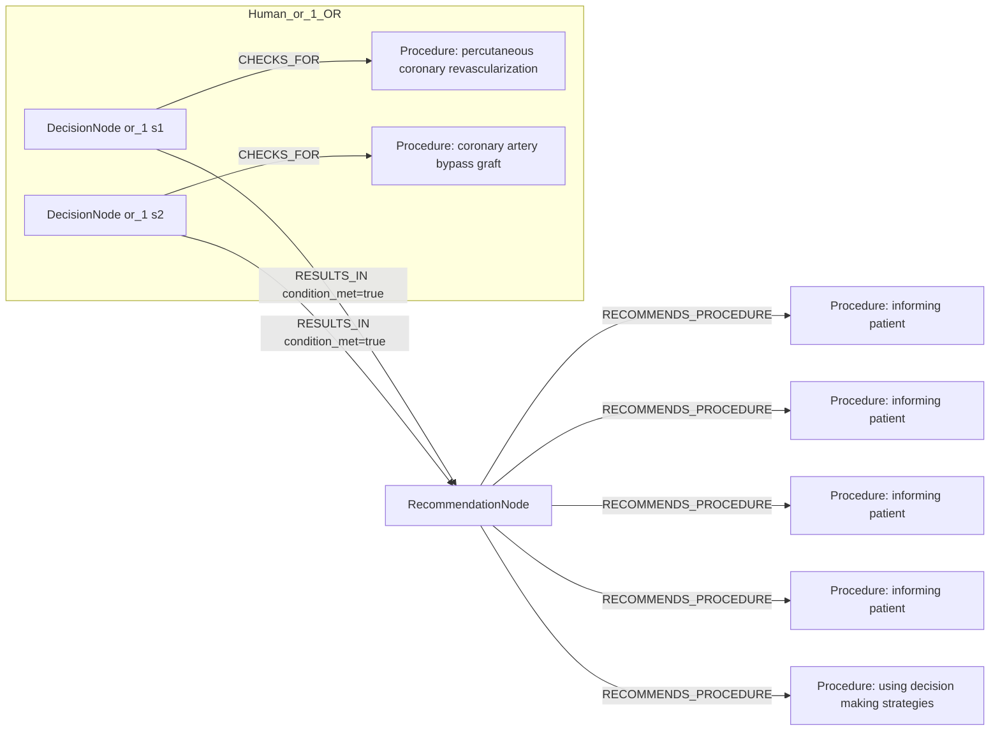
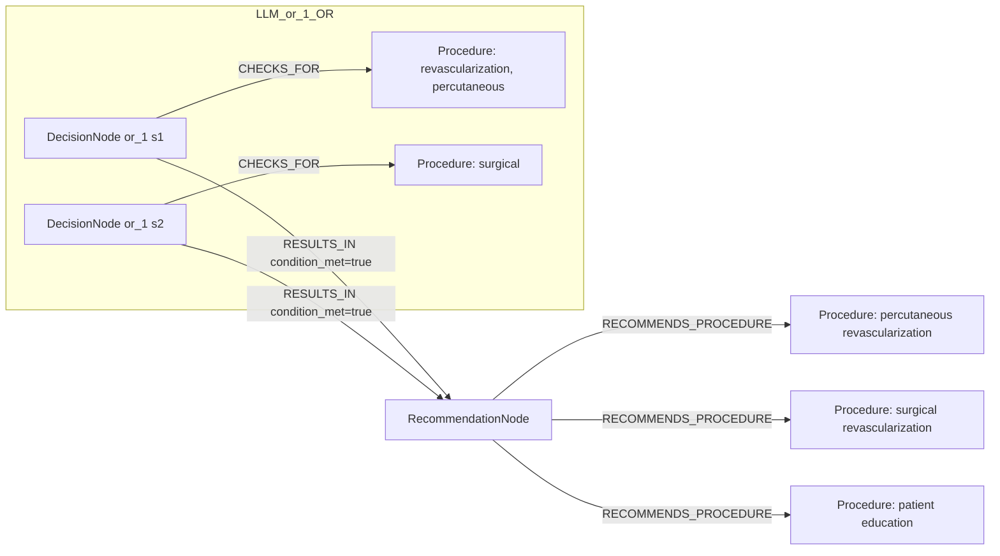

# row_01 (mapped to row_01)

Original table row text (ground truth):

```json
{
  "Recommendations": "It is recommended that patients scheduled for percutaneous or surgical revascularization receive complete information about the benefits, risks, therapeutic consequences, and alternatives to revascularization, as part of shared clinical decision-making. 847,848,857",
  "Class a": "I",
  "Level b": "C"
}
```

Aligned JSON (expected vs actual):

<table>
  <tr>
    <th align="left">Human Annotation</th>
    <th align="left">LLM Generated</th>
  </tr>
  <tr>
    <td valign="top"><pre>
[
  {
    "conditions": [
      {
        "entity": "percutaneous coronary revascularization",
        "entity_original": "percutaneous revascularization",
        "role": "Procedure",
        "operator": "PRESENT",
        "threshold": null,
        "unit": null,
        "context": null,
        "logic_type": "OR",
        "logic_group": "or_1",
        "strength": null,
        "level": null,
        "direction": null,
        "preferred_term": null,
        "synonyms": [],
        "snomed_id": "415070008",
        "target_label": null,
        "taxonomy_path": [],
        "root_concept_id": null,
        "root_concept_term": null
      },
      {
        "entity": "coronary artery bypass graft",
        "entity_original": "surgical revascularization",
        "role": "Procedure",
        "operator": "PRESENT",
        "threshold": null,
        "unit": null,
        "context": null,
        "logic_type": "OR",
        "logic_group": "or_1",
        "strength": null,
        "level": null,
        "direction": null,
        "preferred_term": null,
        "synonyms": [],
        "snomed_id": "232717009",
        "target_label": null,
        "taxonomy_path": [],
        "root_concept_id": null,
        "root_concept_term": null
      }
    ],
    "actions": [
      {
        "entity": "informing patient",
        "entity_original": "benefits of revascularization",
        "role": "Procedure",
        "operator": null,
        "threshold": null,
        "unit": null,
        "context": null,
        "logic_type": null,
        "logic_group": null,
        "strength": "I",
        "level": "C",
        "direction": "POSITIVE",
        "preferred_term": null,
        "synonyms": [],
        "snomed_id": "310866003",
        "target_label": null,
        "taxonomy_path": [],
        "root_concept_id": null,
        "root_concept_term": null
      },
      {
        "entity": "informing patient",
        "entity_original": "risks of revascularization",
        "role": "Procedure",
        "operator": null,
        "threshold": null,
        "unit": null,
        "context": null,
        "logic_type": null,
        "logic_group": null,
        "strength": "I",
        "level": "C",
        "direction": "POSITIVE",
        "preferred_term": null,
        "synonyms": [],
        "snomed_id": "310866003",
        "target_label": null,
        "taxonomy_path": [],
        "root_concept_id": null,
        "root_concept_term": null
      },
      {
        "entity": "informing patient",
        "entity_original": "therapeutic consequences of revascularization",
        "role": "Procedure",
        "operator": null,
        "threshold": null,
        "unit": null,
        "context": null,
        "logic_type": null,
        "logic_group": null,
        "strength": "I",
        "level": "C",
        "direction": "POSITIVE",
        "preferred_term": null,
        "synonyms": [],
        "snomed_id": "310866003",
        "target_label": null,
        "taxonomy_path": [],
        "root_concept_id": null,
        "root_concept_term": null
      },
      {
        "entity": "informing patient",
        "entity_original": "treatment alternatives of revascularization",
        "role": "Procedure",
        "operator": null,
        "threshold": null,
        "unit": null,
        "context": null,
        "logic_type": null,
        "logic_group": null,
        "strength": "I",
        "level": "C",
        "direction": "POSITIVE",
        "preferred_term": null,
        "synonyms": [],
        "snomed_id": "310866003",
        "target_label": null,
        "taxonomy_path": [],
        "root_concept_id": null,
        "root_concept_term": null
      },
      {
        "entity": "using decision making strategies",
        "entity_original": "shared clinical decision-making",
        "role": "Procedure",
        "operator": null,
        "threshold": null,
        "unit": null,
        "context": null,
        "logic_type": null,
        "logic_group": null,
        "strength": "I",
        "level": "C",
        "direction": "POSITIVE",
        "preferred_term": null,
        "synonyms": [],
        "snomed_id": "415806002",
        "target_label": null,
        "taxonomy_path": [],
        "root_concept_id": null,
        "root_concept_term": null
      }
    ]
  }
]
</pre></td>
    <td valign="top"><pre>
{
  "rules": [
    {
      "conditions": [
        {
          "entity": "revascularization, percutaneous",
          "entity_original": "percutaneous or surgical revascularization",
          "role": "Procedure",
          "operator": "PLANNED",
          "threshold": null,
          "unit": null,
          "context": null,
          "logic_type": "OR",
          "logic_group": "or_1",
          "strength": "Unknown",
          "level": "Unknown",
          "direction": null,
          "preferred_term": "Revascularization of hand (procedure)",
          "synonyms": [
            "Revascularisation of hand",
            "Revascularization of hand"
          ],
          "snomed_id": 233501006,
          "target_label": "Procedure",
          "taxonomy_path": [
            {
              "concept_id": "233501006",
              "term": "Revascularization of hand (procedure)"
            },
            {
              "concept_id": "233498006",
              "term": "Revascularization of upper limb (procedure)"
            },
            {
              "concept_id": "107769006",
              "term": "Operative procedure on upper extremity (procedure)"
            },
            {
              "concept_id": "363187007",
              "term": "Limb operation (procedure)"
            },
            {
              "concept_id": "128927009",
              "term": "Procedure by method (procedure)"
            },
            {
              "concept_id": "71388002",
              "term": "Procedure (procedure)"
            },
            {
              "concept_id": "138875005",
              "term": "SNOMED CT Concept (SNOMED RT+CTV3)"
            }
          ],
          "root_concept_id": "71388002",
          "root_concept_term": "Procedure (procedure)"
        },
        {
          "entity": "surgical",
          "entity_original": "percutaneous or surgical revascularization",
          "role": "Procedure",
          "operator": "PLANNED",
          "threshold": null,
          "unit": null,
          "context": null,
          "logic_type": "OR",
          "logic_group": "or_1",
          "strength": "Unknown",
          "level": "Unknown",
          "direction": null,
          "preferred_term": "Surgical repair (procedure)",
          "synonyms": [
            "Surgical repair",
            "Repair"
          ],
          "snomed_id": 4365001,
          "target_label": "Procedure",
          "taxonomy_path": [
            {
              "concept_id": "4365001",
              "term": "Surgical repair (procedure)"
            },
            {
              "concept_id": "128927009",
              "term": "Procedure by method (procedure)"
            },
            {
              "concept_id": "71388002",
              "term": "Procedure (procedure)"
            },
            {
              "concept_id": "138875005",
              "term": "SNOMED CT Concept (SNOMED RT+CTV3)"
            }
          ],
          "root_concept_id": "71388002",
          "root_concept_term": "Procedure (procedure)"
        }
      ],
      "actions": [
        {
          "entity": "percutaneous revascularization",
          "entity_original": "scheduled for percutaneous or surgical revascularization",
          "role": "Procedure",
          "operator": "PLANNED",
          "threshold": null,
          "unit": null,
          "context": null,
          "logic_type": null,
          "logic_group": null,
          "strength": "Class I",
          "level": "C",
          "direction": "POSITIVE",
          "preferred_term": "Heart revascularization (procedure)",
          "synonyms": [
            "Heart revascularisation",
            "Heart revascularization"
          ],
          "snomed_id": 81266008,
          "target_label": "Procedure",
          "taxonomy_path": [
            {
              "concept_id": "81266008",
              "term": "Heart revascularization (procedure)"
            },
            {
              "concept_id": "31413008",
              "term": "Operative procedure on coronary artery (procedure)"
            },
            {
              "concept_id": "118806004",
              "term": "Procedure on coronary arteries (procedure)"
            },
            {
              "concept_id": "118797008",
              "term": "Procedure on heart (procedure)"
            },
            {
              "concept_id": "118672003",
              "term": "Procedure on cardiovascular system (procedure)"
            },
            {
              "concept_id": "118664000",
              "term": "Procedure on body system (procedure)"
            },
            {
              "concept_id": "362958002",
              "term": "Procedure by site (procedure)"
            },
            {
              "concept_id": "71388002",
              "term": "Procedure (procedure)"
            },
            {
              "concept_id": "138875005",
              "term": "SNOMED CT Concept (SNOMED RT+CTV3)"
            }
          ],
          "root_concept_id": "71388002",
          "root_concept_term": "Procedure (procedure)"
        },
        {
          "entity": "surgical revascularization",
          "entity_original": "scheduled for percutaneous or surgical revascularization",
          "role": "Procedure",
          "operator": "PLANNED",
          "threshold": null,
          "unit": null,
          "context": null,
          "logic_type": null,
          "logic_group": null,
          "strength": "Class I",
          "level": "C",
          "direction": "POSITIVE",
          "preferred_term": "Bronchial revascularization (procedure)",
          "synonyms": [
            "Bronchial revascularization",
            "Bronchial revascularisation"
          ],
          "snomed_id": 277437006,
          "target_label": "Procedure",
          "taxonomy_path": [
            {
              "concept_id": "277437006",
              "term": "Bronchial revascularization (procedure)"
            },
            {
              "concept_id": "26476002",
              "term": "Operation on bronchus (procedure)"
            },
            {
              "concept_id": "118793007",
              "term": "Procedure on bronchus (procedure)"
            },
            {
              "concept_id": "129254006",
              "term": "Procedure on tracheobronchial tree (procedure)"
            },
            {
              "concept_id": "118717007",
              "term": "Procedure on organ (procedure)"
            },
            {
              "concept_id": "362958002",
              "term": "Procedure by site (procedure)"
            },
            {
              "concept_id": "71388002",
              "term": "Procedure (procedure)"
            },
            {
              "concept_id": "138875005",
              "term": "SNOMED CT Concept (SNOMED RT+CTV3)"
            }
          ],
          "root_concept_id": "71388002",
          "root_concept_term": "Procedure (procedure)"
        },
        {
          "entity": "patient education",
          "entity_original": "complete information about the benefits, risks, therapeutic consequences, and alternatives to revascularization",
          "role": "Procedure",
          "operator": "PRESENT",
          "threshold": null,
          "unit": null,
          "context": null,
          "logic_type": null,
          "logic_group": null,
          "strength": "Class I",
          "level": "C",
          "direction": "POSITIVE",
          "preferred_term": "Patient education (procedure)",
          "synonyms": [],
          "snomed_id": 175293005,
          "target_label": "Procedure",
          "taxonomy_path": [
            {
              "concept_id": "175293005",
              "term": "Patient education (procedure)"
            }
          ],
          "root_concept_id": null,
          "root_concept_term": null
        }
      ]
    }
  ]
}
</pre></td>
  </tr>
</table>

Mermaid (Human Annotation):



Mermaid (LLM Generated):



Grounding summary (optional):

```json
{
  "enabled": true,
  "total_grounded": 5,
  "target_label_counts": {
    "Procedure": 5
  },
  "root_hit_counts": {
    "71388002": 4
  },
  "root_hits": [
    {
      "entity": "percutaneous revascularization",
      "entity_original": "scheduled for percutaneous or surgical revascularization",
      "role": "Procedure",
      "preferred_term": "Heart revascularization (procedure)",
      "synonyms": [
        "Heart revascularisation",
        "Heart revascularization"
      ],
      "snomed_id": 81266008,
      "target_label": "Procedure",
      "taxonomy_path": [
        {
          "concept_id": "81266008",
          "term": "Heart revascularization (procedure)"
        },
        {
          "concept_id": "31413008",
          "term": "Operative procedure on coronary artery (procedure)"
        },
        {
          "concept_id": "118806004",
          "term": "Procedure on coronary arteries (procedure)"
        },
        {
          "concept_id": "118797008",
          "term": "Procedure on heart (procedure)"
        },
        {
          "concept_id": "118672003",
          "term": "Procedure on cardiovascular system (procedure)"
        },
        {
          "concept_id": "118664000",
          "term": "Procedure on body system (procedure)"
        },
        {
          "concept_id": "362958002",
          "term": "Procedure by site (procedure)"
        },
        {
          "concept_id": "71388002",
          "term": "Procedure (procedure)"
        },
        {
          "concept_id": "138875005",
          "term": "SNOMED CT Concept (SNOMED RT+CTV3)"
        }
      ],
      "root_hit": {
        "root_concept_id": "71388002",
        "root_concept_term": "Procedure (procedure)",
        "mapped_target_label": "Procedure"
      }
    },
    {
      "entity": "surgical revascularization",
      "entity_original": "scheduled for percutaneous or surgical revascularization",
      "role": "Procedure",
      "preferred_term": "Bronchial revascularization (procedure)",
      "synonyms": [
        "Bronchial revascularization",
        "Bronchial revascularisation"
      ],
      "snomed_id": 277437006,
      "target_label": "Procedure",
      "taxonomy_path": [
        {
          "concept_id": "277437006",
          "term": "Bronchial revascularization (procedure)"
        },
        {
          "concept_id": "26476002",
          "term": "Operation on bronchus (procedure)"
        },
        {
          "concept_id": "118793007",
          "term": "Procedure on bronchus (procedure)"
        },
        {
          "concept_id": "129254006",
          "term": "Procedure on tracheobronchial tree (procedure)"
        },
        {
          "concept_id": "118717007",
          "term": "Procedure on organ (procedure)"
        },
        {
          "concept_id": "362958002",
          "term": "Procedure by site (procedure)"
        },
        {
          "concept_id": "71388002",
          "term": "Procedure (procedure)"
        },
        {
          "concept_id": "138875005",
          "term": "SNOMED CT Concept (SNOMED RT+CTV3)"
        }
      ],
      "root_hit": {
        "root_concept_id": "71388002",
        "root_concept_term": "Procedure (procedure)",
        "mapped_target_label": "Procedure"
      }
    },
    {
      "entity": "patient education",
      "entity_original": "complete information about the benefits, risks, therapeutic consequences, and alternatives to revascularization",
      "role": "Procedure",
      "preferred_term": "Patient education (procedure)",
      "synonyms": [],
      "snomed_id": 175293005,
      "target_label": "Procedure",
      "taxonomy_path": [
        {
          "concept_id": "175293005",
          "term": "Patient education (procedure)"
        }
      ],
      "root_hit": null
    },
    {
      "entity": "Revascularization, Percutaneous",
      "entity_original": "percutaneous or surgical revascularization",
      "role": "Procedure",
      "preferred_term": "Revascularization of hand (procedure)",
      "synonyms": [
        "Revascularisation of hand",
        "Revascularization of hand"
      ],
      "snomed_id": 233501006,
      "target_label": "Procedure",
      "taxonomy_path": [
        {
          "concept_id": "233501006",
          "term": "Revascularization of hand (procedure)"
        },
        {
          "concept_id": "233498006",
          "term": "Revascularization of upper limb (procedure)"
        },
        {
          "concept_id": "107769006",
          "term": "Operative procedure on upper extremity (procedure)"
        },
        {
          "concept_id": "363187007",
          "term": "Limb operation (procedure)"
        },
        {
          "concept_id": "128927009",
          "term": "Procedure by method (procedure)"
        },
        {
          "concept_id": "71388002",
          "term": "Procedure (procedure)"
        },
        {
          "concept_id": "138875005",
          "term": "SNOMED CT Concept (SNOMED RT+CTV3)"
        }
      ],
      "root_hit": {
        "root_concept_id": "71388002",
        "root_concept_term": "Procedure (procedure)",
        "mapped_target_label": "Procedure"
      }
    },
    {
      "entity": "Surgical",
      "entity_original": "percutaneous or surgical revascularization",
      "role": "Procedure",
      "preferred_term": "Surgical repair (procedure)",
      "synonyms": [
        "Surgical repair",
        "Repair"
      ],
      "snomed_id": 4365001,
      "target_label": "Procedure",
      "taxonomy_path": [
        {
          "concept_id": "4365001",
          "term": "Surgical repair (procedure)"
        },
        {
          "concept_id": "128927009",
          "term": "Procedure by method (procedure)"
        },
        {
          "concept_id": "71388002",
          "term": "Procedure (procedure)"
        },
        {
          "concept_id": "138875005",
          "term": "SNOMED CT Concept (SNOMED RT+CTV3)"
        }
      ],
      "root_hit": {
        "root_concept_id": "71388002",
        "root_concept_term": "Procedure (procedure)",
        "mapped_target_label": "Procedure"
      }
    }
  ]
}
```

Concepts:
- expected: 4
- actual: 5
- matches: 0
- missing: 4
- extra: 5

Missing concepts:
- Procedure: coronary artery bypass graft
- Procedure: informing patient
- Procedure: percutaneous coronary revascularization
- Procedure: using decision making strategies

Extra concepts:
- Procedure: patient education
- Procedure: percutaneous revascularization
- Procedure: revascularization, percutaneous
- Procedure: surgical
- Procedure: surgical revascularization

Rules (concept + logic fields):
- expected: 4
- actual: 5
- matches: 0
- missing: 4
- extra: 5

Missing rules:
- Procedure: coronary artery bypass graft | op=PRESENT | logic=OR | grp=or_1
- Procedure: informing patient | class=I | level=C | dir=POSITIVE
- Procedure: percutaneous coronary revascularization | op=PRESENT | logic=OR | grp=or_1
- Procedure: using decision making strategies | class=I | level=C | dir=POSITIVE

Extra rules:
- Procedure: patient education | op=PRESENT | class=Class I | level=C | dir=POSITIVE
- Procedure: percutaneous revascularization | op=PLANNED | class=Class I | level=C | dir=POSITIVE
- Procedure: revascularization, percutaneous | op=PLANNED | logic=OR | grp=or_1 | class=Unknown | level=Unknown
- Procedure: surgical revascularization | op=PLANNED | class=Class I | level=C | dir=POSITIVE
- Procedure: surgical | op=PLANNED | logic=OR | grp=or_1 | class=Unknown | level=Unknown

