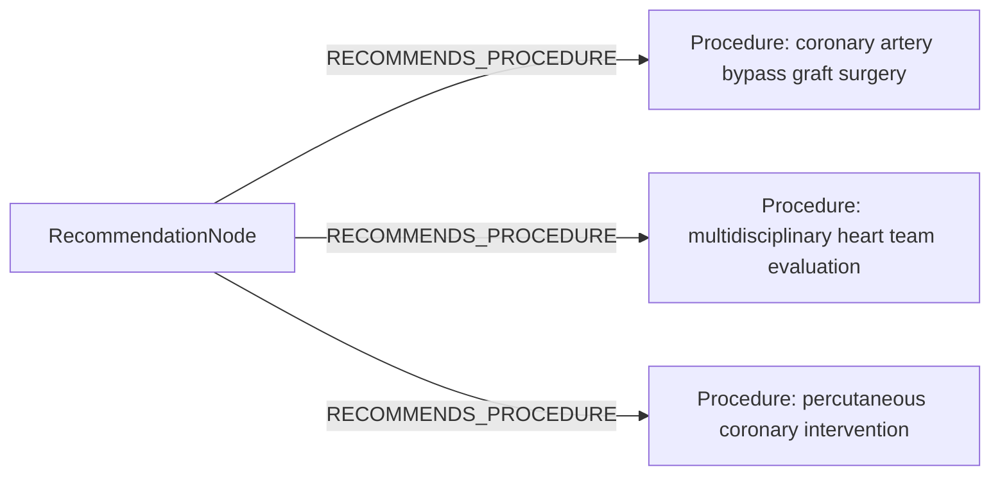

# row_02 (mapped to row_02)

Original table row text (ground truth):

```json
{
  "Recommendations": "For complex clinical cases, to define the optimal treatment strategy, in particular when CABG and PCI hold the same level of recommendation, a Heart Team discussion is recommended, including representatives from interventional cardiology, cardiac surgery, non-interventional cardiology, and other specialties if indicated, aimed at selecting the most appropriate treatment to improve patient outcomes and quality of life.",
  "Class a": "I",
  "Level b": "C"
}
```

Aligned JSON (expected vs actual):

<table>
  <tr>
    <th align="left">Human Annotation</th>
    <th align="left">LLM Generated</th>
  </tr>
  <tr>
    <td valign="top"><pre>
[
  {
    "conditions": [
      {
        "entity": "complex clinical cases",
        "entity_original": "complex clinical cases",
        "role": "ClinicalCondition",
        "operator": "PRESENT",
        "threshold": null,
        "unit": null,
        "context": null,
        "logic_type": "AND",
        "logic_group": "and_1",
        "strength": null,
        "level": null,
        "direction": null,
        "preferred_term": null,
        "synonyms": [],
        "snomed_id": null,
        "target_label": null,
        "taxonomy_path": [],
        "root_concept_id": null,
        "root_concept_term": null
      }
    ],
    "actions": [
      {
        "entity": "heart team discussion",
        "entity_original": "heart team discussion",
        "role": "Procedure",
        "operator": null,
        "threshold": null,
        "unit": null,
        "context": null,
        "logic_type": null,
        "logic_group": null,
        "strength": "I",
        "level": "C",
        "direction": "POSITIVE",
        "preferred_term": null,
        "synonyms": [],
        "snomed_id": null,
        "target_label": null,
        "taxonomy_path": [],
        "root_concept_id": null,
        "root_concept_term": null
      }
    ]
  }
]
</pre></td>
    <td valign="top"><pre>
{
  "rules": [
    {
      "conditions": [],
      "actions": [
        {
          "entity": "coronary artery bypass graft surgery",
          "entity_original": "cabg",
          "role": "Procedure",
          "operator": "PRESENT",
          "threshold": null,
          "unit": null,
          "context": "same recommendation level",
          "logic_type": null,
          "logic_group": null,
          "strength": "Class I",
          "level": "C",
          "direction": "POSITIVE"
        },
        {
          "entity": "multidisciplinary heart team evaluation",
          "entity_original": "heart team discussion",
          "role": "Procedure",
          "operator": "PRESENT",
          "threshold": null,
          "unit": null,
          "context": "for complex cases with equal recommendation levels of cabg and pci",
          "logic_type": null,
          "logic_group": null,
          "strength": "Class I",
          "level": "C",
          "direction": "POSITIVE"
        },
        {
          "entity": "percutaneous coronary intervention",
          "entity_original": "pci",
          "role": "Procedure",
          "operator": "PRESENT",
          "threshold": null,
          "unit": null,
          "context": "same recommendation level",
          "logic_type": null,
          "logic_group": null,
          "strength": "Class I",
          "level": "C",
          "direction": "POSITIVE"
        }
      ]
    }
  ]
}
</pre></td>
  </tr>
</table>

Mermaid (Human Annotation):


Mermaid (LLM Generated):



Concepts:
- expected: 2
- actual: 3
- matches: 0
- missing: 2
- extra: 3

Missing concepts:
- ClinicalCondition: complex clinical cases
- Procedure: heart team discussion

Extra concepts:
- Procedure: coronary artery bypass graft surgery
- Procedure: multidisciplinary heart team evaluation
- Procedure: percutaneous coronary intervention

Rules (concept + logic fields):
- expected: 2
- actual: 3
- matches: 0
- missing: 2
- extra: 3

Missing rules:
- ClinicalCondition: complex clinical cases | op=PRESENT | logic=AND | grp=and_1
- Procedure: heart team discussion | class=I | level=C | dir=POSITIVE

Extra rules:
- Procedure: coronary artery bypass graft surgery | op=PRESENT | class=Class I | level=C | dir=POSITIVE
- Procedure: multidisciplinary heart team evaluation | op=PRESENT | class=Class I | level=C | dir=POSITIVE
- Procedure: percutaneous coronary intervention | op=PRESENT | class=Class I | level=C | dir=POSITIVE

