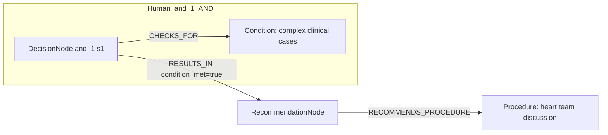
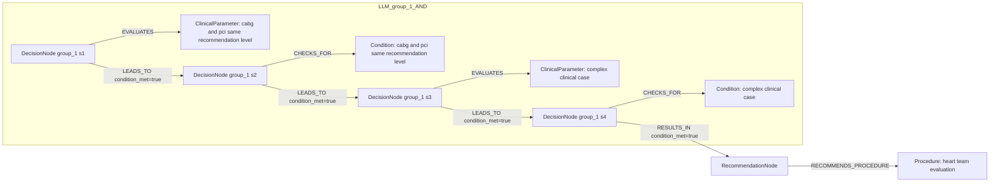

# row_02 (mapped to row_02)

Original table row text (ground truth):

```json
{
  "Recommendations": "For complex clinical cases, to define the optimal treatment strategy, in particular when CABG and PCI hold the same level of recommendation, a Heart Team discussion is recommended, including representatives from interventional cardiology, cardiac surgery, non-interventional cardiology, and other specialties if indicated, aimed at selecting the most appropriate treatment to improve patient outcomes and quality of life.",
  "Class a": "I",
  "Level b": "C"
}
```

Aligned JSON (expected vs actual):

<table>
  <tr>
    <th align="left">Human Annotation</th>
    <th align="left">LLM Generated</th>
  </tr>
  <tr>
    <td valign="top"><pre>
[
  {
    "rule_id": 1,
    "conditions": [
      {
        "entity": "complex clinical cases",
        "entity_original": "complex clinical cases",
        "role": "Condition",
        "operator": "PRESENT",
        "threshold": null,
        "unit": null,
        "condition_context": null,
        "logic_type": "AND",
        "logic_group": "and_1",
        "strength": null,
        "level": null,
        "direction": null
      }
    ],
    "actions": [
      {
        "entity": "heart team discussion",
        "entity_original": "heart team discussion",
        "role": "Procedure",
        "operator": null,
        "threshold": null,
        "unit": null,
        "condition_context": null,
        "logic_type": null,
        "logic_group": null,
        "strength": "I",
        "level": "C",
        "direction": "POSITIVE"
      }
    ]
  }
]
</pre></td>
    <td valign="top"><pre>
{
  "1": {
    "conditions": [
      {
        "entity": "cabg and pci same recommendation level",
        "entity_original": "cabg and pci hold the same level of recommendation",
        "role": "ClinicalParameter",
        "operator": "PRESENT",
        "threshold": null,
        "unit": null,
        "condition_context": null,
        "logic_type": null,
        "logic_group": null,
        "strength": "I",
        "level": "C",
        "direction": "POSITIVE",
        "rule_id": 1,
        "side": "condition",
        "preferred_term": null,
        "synonyms": [],
        "snomed_id": null,
        "target_label": "ClinicalParameter",
        "taxonomy_path": [],
        "root_concept_id": null,
        "root_concept_term": null,
        "mapped_target_label": null
      }
    ],
    "actions": [
      {
        "entity": "heart team evaluation",
        "entity_original": "heart team discussion",
        "role": "Procedure",
        "operator": null,
        "threshold": null,
        "unit": null,
        "condition_context": null,
        "logic_type": null,
        "logic_group": null,
        "strength": "I",
        "level": "C",
        "direction": "POSITIVE",
        "rule_id": 1,
        "side": "action",
        "preferred_term": "Gait evaluation (regime/therapy)",
        "synonyms": [
          "Gait evaluation"
        ],
        "snomed_id": 39609006,
        "target_label": "Procedure",
        "taxonomy_path": [
          {
            "concept_id": "39609006",
            "term": "Gait evaluation (regime/therapy)"
          },
          {
            "concept_id": "58452000",
            "term": "Physiotherapy training (procedure)"
          },
          {
            "concept_id": "118629009",
            "term": "Functional training (procedure)"
          },
          {
            "concept_id": "409073007",
            "term": "Education (procedure)"
          },
          {
            "concept_id": "128927009",
            "term": "Procedure by method (procedure)"
          },
          {
            "concept_id": "71388002",
            "term": "Procedure (procedure)"
          },
          {
            "concept_id": "138875005",
            "term": "SNOMED CT Concept (SNOMED RT+CTV3)"
          }
        ],
        "root_concept_id": "71388002",
        "root_concept_term": "Procedure (procedure)",
        "mapped_target_label": "Procedure"
      }
    ]
  }
}
</pre></td>
  </tr>
</table>

Mermaid (Human Annotation):



Mermaid (LLM Generated):



Grounding summary (optional):

```json
{
  "enabled": true,
  "total_grounded": 2,
  "target_label_counts": {
    "ClinicalParameter": 1,
    "Procedure": 1
  },
  "root_hit_counts": {
    "71388002": 1
  },
  "root_hits": [
    {
      "entity": "CABG and PCI same recommendation level",
      "entity_original": "CABG and PCI hold the same level of recommendation",
      "role": "ClinicalParameter",
      "preferred_term": null,
      "synonyms": [],
      "snomed_id": null,
      "target_label": "ClinicalParameter",
      "taxonomy_path": [],
      "root_hit": null
    },
    {
      "entity": "Heart Team Evaluation",
      "entity_original": "Heart Team discussion",
      "role": "Procedure",
      "preferred_term": "Gait evaluation (regime/therapy)",
      "synonyms": [
        "Gait evaluation"
      ],
      "snomed_id": 39609006,
      "target_label": "Procedure",
      "taxonomy_path": [
        {
          "concept_id": "39609006",
          "term": "Gait evaluation (regime/therapy)"
        },
        {
          "concept_id": "58452000",
          "term": "Physiotherapy training (procedure)"
        },
        {
          "concept_id": "118629009",
          "term": "Functional training (procedure)"
        },
        {
          "concept_id": "409073007",
          "term": "Education (procedure)"
        },
        {
          "concept_id": "128927009",
          "term": "Procedure by method (procedure)"
        },
        {
          "concept_id": "71388002",
          "term": "Procedure (procedure)"
        },
        {
          "concept_id": "138875005",
          "term": "SNOMED CT Concept (SNOMED RT+CTV3)"
        }
      ],
      "root_hit": {
        "root_concept_id": "71388002",
        "root_concept_term": "Procedure (procedure)",
        "mapped_target_label": "Procedure"
      }
    }
  ]
}
```

Concepts:
- expected: 2
- actual: 5
- matches: 0
- missing: 2
- extra: 5

Missing concepts:
- Condition: complex clinical cases
- Procedure: heart team discussion

Extra concepts:
- ClinicalParameter: cabg and pci same recommendation level
- ClinicalParameter: complex clinical case
- Condition: cabg and pci same recommendation level
- Condition: complex clinical case
- Procedure: heart team evaluation

Rules (concept + logic fields):
- expected: 2
- actual: 5
- matches: 0
- missing: 2
- extra: 5

Missing rules:
- Condition: complex clinical cases | op=PRESENT | logic=AND | grp=and_1
- Procedure: heart team discussion | class=I | level=C | dir=POSITIVE

Extra rules:
- ClinicalParameter: cabg and pci same recommendation level | op=PRESENT | class=I | level=C | dir=POSITIVE
- ClinicalParameter: complex clinical case | op=PRESENT | class=I | level=C | dir=POSITIVE
- Condition: cabg and pci same recommendation level | op=PRESENT | ctx=same level of recommendation | dir=POSITIVE
- Condition: complex clinical case | op=PRESENT | dir=POSITIVE
- Procedure: heart team evaluation | class=I | level=C | dir=POSITIVE

