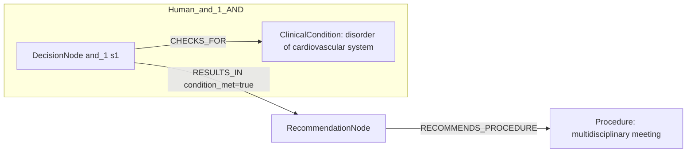
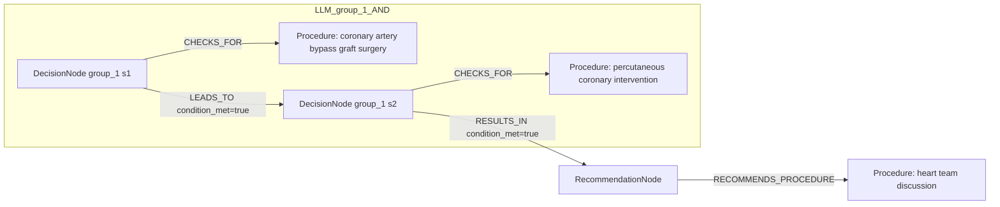

# row_02 (mapped to row_02)

Original table row text (ground truth):

```json
{
  "Recommendations": "For complex clinical cases, to define the optimal treatment strategy, in particular when CABG and PCI hold the same level of recommendation, a Heart Team discussion is recommended, including representatives from interventional cardiology, cardiac surgery, non-interventional cardiology, and other specialties if indicated, aimed at selecting the most appropriate treatment to improve patient outcomes and quality of life.",
  "Class a": "I",
  "Level b": "C"
}
```

Aligned JSON (expected vs actual):

<table>
  <tr>
    <th align="left">Human Annotation</th>
    <th align="left">LLM Generated</th>
  </tr>
  <tr>
    <td valign="top"><pre>
[
  {
    "conditions": [
      {
        "entity": "disorder of cardiovascular system",
        "entity_original": "complex clinical cases",
        "role": "ClinicalCondition",
        "operator": "PRESENT",
        "threshold": null,
        "unit": null,
        "context": null,
        "logic_type": "AND",
        "logic_group": "and_1",
        "strength": null,
        "level": null,
        "direction": null,
        "preferred_term": null,
        "synonyms": [],
        "snomed_id": "49601007",
        "target_label": null,
        "taxonomy_path": [],
        "root_concept_id": null,
        "root_concept_term": null
      }
    ],
    "actions": [
      {
        "entity": "multidisciplinary meeting",
        "entity_original": "heart team discussion",
        "role": "Procedure",
        "operator": null,
        "threshold": null,
        "unit": null,
        "context": null,
        "logic_type": null,
        "logic_group": null,
        "strength": "I",
        "level": "C",
        "direction": "POSITIVE",
        "preferred_term": null,
        "synonyms": [],
        "snomed_id": "287051000000107",
        "target_label": null,
        "taxonomy_path": [],
        "root_concept_id": null,
        "root_concept_term": null
      }
    ]
  }
]
</pre></td>
    <td valign="top"><pre>
{
  "rules": [
    {
      "conditions": [
        {
          "entity": "coronary artery bypass graft surgery",
          "entity_original": "cabg",
          "role": "Procedure",
          "operator": "PRESENT",
          "threshold": null,
          "unit": null,
          "context": null,
          "logic_type": null,
          "logic_group": null,
          "strength": "Unknown",
          "level": "Unknown",
          "direction": null,
          "preferred_term": "Aortocoronary artery bypass graft with vein graft (procedure)",
          "synonyms": [
            "Aortocoronary artery bypass graft with vein graft",
            "ACVG - aortocoronary vein graft",
            "CAVG - coronary artery vein graft",
            "CVG - coronary vein graft"
          ],
          "snomed_id": 17073005,
          "target_label": "Procedure",
          "taxonomy_path": [
            {
              "concept_id": "17073005",
              "term": "Aortocoronary artery bypass graft with vein graft (procedure)"
            },
            {
              "concept_id": "287347004",
              "term": "Arterial bypass using vein graft (procedure)"
            },
            {
              "concept_id": "116360008",
              "term": "Arterial bypass graft (procedure)"
            },
            {
              "concept_id": "23075000",
              "term": "Creation of vascular bypass (procedure)"
            },
            {
              "concept_id": "48537004",
              "term": "Bypass graft (procedure)"
            },
            {
              "concept_id": "78817002",
              "term": "Construction of anastomosis (procedure)"
            },
            {
              "concept_id": "410614008",
              "term": "Construction (procedure)"
            },
            {
              "concept_id": "4365001",
              "term": "Surgical repair (procedure)"
            },
            {
              "concept_id": "387713003",
              "term": "Surgical procedure (procedure)"
            },
            {
              "concept_id": "71388002",
              "term": "Procedure (procedure)"
            }
          ],
          "root_concept_id": "71388002",
          "root_concept_term": "Procedure (procedure)"
        },
        {
          "entity": "percutaneous coronary intervention",
          "entity_original": "pci",
          "role": "Procedure",
          "operator": "PRESENT",
          "threshold": null,
          "unit": null,
          "context": null,
          "logic_type": null,
          "logic_group": null,
          "strength": "Unknown",
          "level": "Unknown",
          "direction": null,
          "preferred_term": "Percutaneous transluminal coronary intervention using imaging guidance with contrast (procedure)",
          "synonyms": [],
          "snomed_id": 415070008,
          "target_label": "Procedure",
          "taxonomy_path": [
            {
              "concept_id": "415070008",
              "term": "Percutaneous transluminal coronary intervention using imaging guidance with contrast (procedure)"
            },
            {
              "concept_id": "4365001",
              "term": "Surgical repair (procedure)"
            },
            {
              "concept_id": "128927009",
              "term": "Procedure by method (procedure)"
            },
            {
              "concept_id": "71388002",
              "term": "Procedure (procedure)"
            }
          ],
          "root_concept_id": "71388002",
          "root_concept_term": "Procedure (procedure)"
        }
      ],
      "actions": [
        {
          "entity": "heart team discussion",
          "entity_original": "heart team discussion",
          "role": "Procedure",
          "operator": null,
          "threshold": null,
          "unit": null,
          "context": null,
          "logic_type": null,
          "logic_group": null,
          "strength": "Class I",
          "level": "C",
          "direction": "POSITIVE",
          "preferred_term": "Discussion (procedure)",
          "synonyms": [],
          "snomed_id": 223482009,
          "target_label": "Procedure",
          "taxonomy_path": [
            {
              "concept_id": "223482009",
              "term": "Discussion (procedure)"
            },
            {
              "concept_id": "128927009",
              "term": "Procedure by method (procedure)"
            },
            {
              "concept_id": "71388002",
              "term": "Procedure (procedure)"
            }
          ],
          "root_concept_id": "71388002",
          "root_concept_term": "Procedure (procedure)"
        }
      ]
    }
  ]
}
</pre></td>
  </tr>
</table>

Mermaid (Human Annotation):



Mermaid (LLM Generated):



Grounding summary (optional):

```json
{
  "enabled": true,
  "total_grounded": 3,
  "target_label_counts": {
    "Procedure": 3
  },
  "root_hit_counts": {
    "71388002": 3
  },
  "root_hits": [
    {
      "entity": "Coronary artery bypass graft surgery",
      "entity_original": "CABG",
      "role": "Procedure",
      "preferred_term": "Aortocoronary artery bypass graft with vein graft (procedure)",
      "synonyms": [
        "Aortocoronary artery bypass graft with vein graft",
        "ACVG - aortocoronary vein graft",
        "CAVG - coronary artery vein graft",
        "CVG - coronary vein graft"
      ],
      "snomed_id": 17073005,
      "target_label": "Procedure",
      "taxonomy_path": [
        {
          "concept_id": "17073005",
          "term": "Aortocoronary artery bypass graft with vein graft (procedure)"
        },
        {
          "concept_id": "287347004",
          "term": "Arterial bypass using vein graft (procedure)"
        },
        {
          "concept_id": "116360008",
          "term": "Arterial bypass graft (procedure)"
        },
        {
          "concept_id": "23075000",
          "term": "Creation of vascular bypass (procedure)"
        },
        {
          "concept_id": "48537004",
          "term": "Bypass graft (procedure)"
        },
        {
          "concept_id": "78817002",
          "term": "Construction of anastomosis (procedure)"
        },
        {
          "concept_id": "410614008",
          "term": "Construction (procedure)"
        },
        {
          "concept_id": "4365001",
          "term": "Surgical repair (procedure)"
        },
        {
          "concept_id": "387713003",
          "term": "Surgical procedure (procedure)"
        },
        {
          "concept_id": "71388002",
          "term": "Procedure (procedure)"
        }
      ],
      "root_hit": {
        "root_concept_id": "71388002",
        "root_concept_term": "Procedure (procedure)",
        "mapped_target_label": "Procedure"
      }
    },
    {
      "entity": "Percutaneous coronary intervention",
      "entity_original": "PCI",
      "role": "Procedure",
      "preferred_term": "Percutaneous transluminal coronary intervention using imaging guidance with contrast (procedure)",
      "synonyms": [],
      "snomed_id": 415070008,
      "target_label": "Procedure",
      "taxonomy_path": [
        {
          "concept_id": "415070008",
          "term": "Percutaneous transluminal coronary intervention using imaging guidance with contrast (procedure)"
        },
        {
          "concept_id": "4365001",
          "term": "Surgical repair (procedure)"
        },
        {
          "concept_id": "128927009",
          "term": "Procedure by method (procedure)"
        },
        {
          "concept_id": "71388002",
          "term": "Procedure (procedure)"
        }
      ],
      "root_hit": {
        "root_concept_id": "71388002",
        "root_concept_term": "Procedure (procedure)",
        "mapped_target_label": "Procedure"
      }
    },
    {
      "entity": "Heart team discussion",
      "entity_original": "Heart Team discussion",
      "role": "Procedure",
      "preferred_term": "Discussion (procedure)",
      "synonyms": [],
      "snomed_id": 223482009,
      "target_label": "Procedure",
      "taxonomy_path": [
        {
          "concept_id": "223482009",
          "term": "Discussion (procedure)"
        },
        {
          "concept_id": "128927009",
          "term": "Procedure by method (procedure)"
        },
        {
          "concept_id": "71388002",
          "term": "Procedure (procedure)"
        }
      ],
      "root_hit": {
        "root_concept_id": "71388002",
        "root_concept_term": "Procedure (procedure)",
        "mapped_target_label": "Procedure"
      }
    }
  ]
}
```

Concepts:
- expected: 2
- actual: 4
- matches: 0
- missing: 2
- extra: 4

Missing concepts:
- ClinicalCondition: disorder of cardiovascular system
- Procedure: multidisciplinary meeting

Extra concepts:
- ClinicalParameter: complex clinical case
- Procedure: coronary artery bypass graft surgery
- Procedure: heart team discussion
- Procedure: percutaneous coronary intervention

Rules (concept + logic fields):
- expected: 2
- actual: 4
- matches: 0
- missing: 2
- extra: 4

Missing rules:
- ClinicalCondition: disorder of cardiovascular system | op=PRESENT | logic=AND | grp=and_1
- Procedure: multidisciplinary meeting | class=I | level=C | dir=POSITIVE

Extra rules:
- ClinicalParameter: complex clinical case | op=PRESENT | class=Unknown | level=Unknown
- Procedure: coronary artery bypass graft surgery | op=PRESENT | class=Unknown | level=Unknown
- Procedure: heart team discussion | class=Class I | level=C | dir=POSITIVE
- Procedure: percutaneous coronary intervention | op=PRESENT | class=Unknown | level=Unknown

