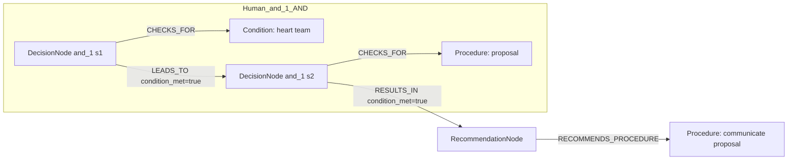

# row_03 (mapped to row_03)

Original table row text (ground truth):

```json
{
  "Recommendations": "It is recommended to communicate the proposal of the Heart Team in a balanced way using language that the patient can understand.",
  "Class a": "I",
  "Level b": "C"
}
```

Aligned JSON (expected vs actual):

<table>
  <tr>
    <th align="left">Human Annotation</th>
    <th align="left">LLM Generated</th>
  </tr>
  <tr>
    <td valign="top"><pre>
[
  {
    "rule_id": 1,
    "conditions": [
      {
        "entity": "heart team",
        "entity_original": "heart team",
        "role": "Condition",
        "operator": "PRESENT",
        "threshold": null,
        "unit": null,
        "condition_context": null,
        "logic_type": "AND",
        "logic_group": "and_1",
        "strength": null,
        "level": null,
        "direction": null
      },
      {
        "entity": "proposal",
        "entity_original": "proposal",
        "role": "Procedure",
        "operator": "PRESENT",
        "threshold": null,
        "unit": null,
        "condition_context": null,
        "logic_type": "AND",
        "logic_group": "and_1",
        "strength": null,
        "level": null,
        "direction": null
      }
    ],
    "actions": [
      {
        "entity": "communicate proposal",
        "entity_original": "communicate the proposal of the heart team in a balanced way using language that the patient can understand",
        "role": "Procedure",
        "operator": null,
        "threshold": null,
        "unit": null,
        "condition_context": null,
        "logic_type": null,
        "logic_group": null,
        "strength": "I",
        "level": "C",
        "direction": "POSITIVE"
      }
    ]
  }
]
</pre></td>
    <td valign="top"><pre>
{
  "1": {
    "conditions": [],
    "actions": [
      {
        "entity": "heart team communication",
        "entity_original": "communicate the proposal of the heart team in a balanced way using language that the patient can understand",
        "role": "Procedure",
        "operator": null,
        "threshold": null,
        "unit": null,
        "condition_context": null,
        "logic_type": null,
        "logic_group": null,
        "strength": "I",
        "level": "C",
        "direction": "POSITIVE",
        "rule_id": 1,
        "side": "action",
        "preferred_term": "Ensuring good communication (regime/therapy)",
        "synonyms": [
          "Ensuring good communication"
        ],
        "snomed_id": 225981007,
        "target_label": "Procedure",
        "taxonomy_path": [
          {
            "concept_id": "225981007",
            "term": "Ensuring good communication (regime/therapy)"
          },
          {
            "concept_id": "225220004",
            "term": "Communication interventions (regime/therapy)"
          },
          {
            "concept_id": "282259008",
            "term": "Psychotherapeutic, behavioral and/or communication procedure (procedure)"
          },
          {
            "concept_id": "108310004",
            "term": "Psychologic AND/OR psychiatric procedure AND/OR service (procedure)"
          },
          {
            "concept_id": "127777001",
            "term": "Provider-specific procedure (procedure)"
          },
          {
            "concept_id": "71388002",
            "term": "Procedure (procedure)"
          },
          {
            "concept_id": "138875005",
            "term": "SNOMED CT Concept (SNOMED RT+CTV3)"
          }
        ],
        "root_concept_id": "71388002",
        "root_concept_term": "Procedure (procedure)",
        "mapped_target_label": "Procedure"
      }
    ]
  }
}
</pre></td>
  </tr>
</table>

Mermaid (Human Annotation):



Mermaid (LLM Generated):


Grounding summary (optional):

```json
{
  "enabled": true,
  "total_grounded": 1,
  "target_label_counts": {
    "Procedure": 1
  },
  "root_hit_counts": {
    "71388002": 1
  },
  "root_hits": [
    {
      "entity": "Heart Team Communication",
      "entity_original": "communicate the proposal of the Heart Team in a balanced way using language that the patient can understand",
      "role": "Procedure",
      "preferred_term": "Ensuring good communication (regime/therapy)",
      "synonyms": [
        "Ensuring good communication"
      ],
      "snomed_id": 225981007,
      "target_label": "Procedure",
      "taxonomy_path": [
        {
          "concept_id": "225981007",
          "term": "Ensuring good communication (regime/therapy)"
        },
        {
          "concept_id": "225220004",
          "term": "Communication interventions (regime/therapy)"
        },
        {
          "concept_id": "282259008",
          "term": "Psychotherapeutic, behavioral and/or communication procedure (procedure)"
        },
        {
          "concept_id": "108310004",
          "term": "Psychologic AND/OR psychiatric procedure AND/OR service (procedure)"
        },
        {
          "concept_id": "127777001",
          "term": "Provider-specific procedure (procedure)"
        },
        {
          "concept_id": "71388002",
          "term": "Procedure (procedure)"
        },
        {
          "concept_id": "138875005",
          "term": "SNOMED CT Concept (SNOMED RT+CTV3)"
        }
      ],
      "root_hit": {
        "root_concept_id": "71388002",
        "root_concept_term": "Procedure (procedure)",
        "mapped_target_label": "Procedure"
      }
    }
  ]
}
```

Concepts:
- expected: 3
- actual: 1
- matches: 0
- missing: 3
- extra: 1

Missing concepts:
- Condition: heart team
- Procedure: communicate proposal
- Procedure: proposal

Extra concepts:
- Procedure: heart team communication

Rules (concept + logic fields):
- expected: 3
- actual: 1
- matches: 0
- missing: 3
- extra: 1

Missing rules:
- Condition: heart team | op=PRESENT | logic=AND | grp=and_1
- Procedure: communicate proposal | class=I | level=C | dir=POSITIVE
- Procedure: proposal | op=PRESENT | logic=AND | grp=and_1

Extra rules:
- Procedure: heart team communication | class=I | level=C | dir=POSITIVE

