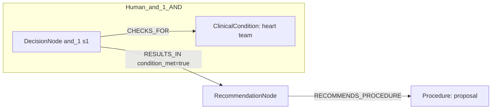
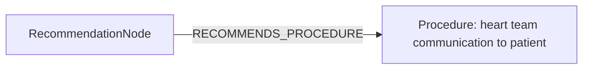

# row_03 (mapped to row_03)

Original table row text (ground truth):

```json
{
  "Recommendations": "It is recommended to communicate the proposal of the Heart Team in a balanced way using language that the patient can understand.",
  "Class a": "I",
  "Level b": "C"
}
```

Aligned JSON (expected vs actual):

<table>
  <tr>
    <th align="left">Human Annotation</th>
    <th align="left">LLM Generated</th>
  </tr>
  <tr>
    <td valign="top"><pre>
[
  {
    "conditions": [
      {
        "entity": "heart team",
        "entity_original": "heart team",
        "role": "ClinicalCondition",
        "operator": "PRESENT",
        "threshold": null,
        "unit": null,
        "context": null,
        "logic_type": "AND",
        "logic_group": "and_1",
        "strength": null,
        "level": null,
        "direction": null
      },
      {
        "entity": "proposal",
        "entity_original": "proposal",
        "role": "Procedure",
        "operator": "PRESENT",
        "threshold": null,
        "unit": null,
        "context": null,
        "logic_type": "AND",
        "logic_group": "and_1",
        "strength": null,
        "level": null,
        "direction": null
      }
    ],
    "actions": [
      {
        "entity": "communicate proposal",
        "entity_original": "communicate the proposal of the heart team in a balanced way using language that the patient can understand",
        "role": "ClinicalAction",
        "operator": null,
        "threshold": null,
        "unit": null,
        "context": null,
        "logic_type": null,
        "logic_group": null,
        "strength": "I",
        "level": "C",
        "direction": "POSITIVE"
      }
    ]
  }
]
</pre></td>
    <td valign="top"><pre>
{
  "rules": [
    {
      "conditions": [],
      "actions": [
        {
          "entity": "heart team communication to patient",
          "entity_original": "communicate the proposal of the heart team in a balanced way using language that the patient can understand",
          "role": "Procedure",
          "operator": null,
          "threshold": null,
          "unit": null,
          "context": null,
          "logic_type": null,
          "logic_group": null,
          "strength": "Class I",
          "level": "C",
          "direction": "POSITIVE",
          "preferred_term": null,
          "synonyms": [],
          "snomed_id": null,
          "target_label": "Procedure",
          "taxonomy_path": [],
          "root_concept_id": null,
          "root_concept_term": null
        }
      ]
    }
  ]
}
</pre></td>
  </tr>
</table>

Mermaid (Human Annotation):



Mermaid (LLM Generated):



Grounding summary (optional):

```json
{
  "enabled": true,
  "total_grounded": 1,
  "target_label_counts": {
    "Procedure": 1
  },
  "root_hit_counts": {},
  "root_hits": [
    {
      "entity": "Heart Team communication to patient",
      "entity_original": "communicate the proposal of the Heart Team in a balanced way using language that the patient can understand",
      "role": "Procedure",
      "preferred_term": null,
      "synonyms": [],
      "snomed_id": null,
      "target_label": "Procedure",
      "taxonomy_path": [],
      "root_hit": null
    }
  ]
}
```

Concepts:
- expected: 3
- actual: 1
- matches: 0
- missing: 3
- extra: 1

Missing concepts:
- ClinicalAction: communicate proposal
- ClinicalCondition: heart team
- Procedure: proposal

Extra concepts:
- Procedure: heart team communication to patient

Rules (concept + logic fields):
- expected: 3
- actual: 1
- matches: 0
- missing: 3
- extra: 1

Missing rules:
- ClinicalAction: communicate proposal | class=I | level=C | dir=POSITIVE
- ClinicalCondition: heart team | op=PRESENT | logic=AND | grp=and_1
- Procedure: proposal | op=PRESENT | logic=AND | grp=and_1

Extra rules:
- Procedure: heart team communication to patient | class=Class I | level=C | dir=POSITIVE

