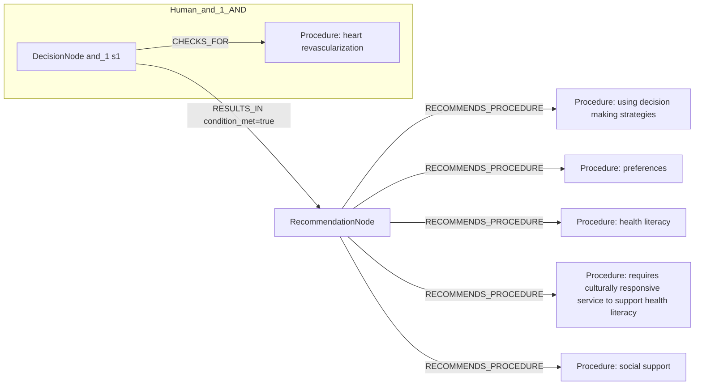
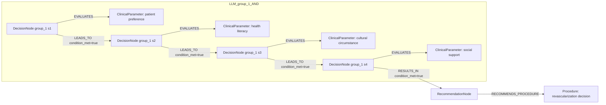

# row_04 (mapped to row_04)

Original table row text (ground truth):

```json
{
  "Recommendations": "It is recommended that the decision for revascularization and its modality be patient-centred, considering patient preferences, health literacy, cultural circumstances, and social support. 849-851",
  "Class a": "I",
  "Level b": "C"
}
```

Aligned JSON (expected vs actual):

<table>
  <tr>
    <th align="left">Human Annotation</th>
    <th align="left">LLM Generated</th>
  </tr>
  <tr>
    <td valign="top"><pre>
[
  {
    "conditions": [
      {
        "entity": "heart revascularization",
        "entity_original": "revascularization and its modality",
        "role": "Procedure",
        "operator": "PRESENT",
        "threshold": null,
        "unit": null,
        "context": null,
        "logic_type": "AND",
        "logic_group": "and_1",
        "strength": null,
        "level": null,
        "direction": null,
        "preferred_term": null,
        "synonyms": [],
        "snomed_id": "81266008",
        "target_label": null,
        "taxonomy_path": [],
        "root_concept_id": null,
        "root_concept_term": null
      }
    ],
    "actions": [
      {
        "entity": "using decision making strategies",
        "entity_original": "patient-centred decision",
        "role": "Procedure",
        "operator": null,
        "threshold": null,
        "unit": null,
        "context": null,
        "logic_type": null,
        "logic_group": null,
        "strength": "I",
        "level": "C",
        "direction": "positive",
        "preferred_term": null,
        "synonyms": [],
        "snomed_id": "415806002",
        "target_label": null,
        "taxonomy_path": [],
        "root_concept_id": null,
        "root_concept_term": null
      },
      {
        "entity": "preferences",
        "entity_original": "the decision for revascularization and its modality consider patient preferences",
        "role": "Procedure",
        "operator": null,
        "threshold": null,
        "unit": null,
        "context": null,
        "logic_type": null,
        "logic_group": null,
        "strength": "I",
        "level": "C",
        "direction": "positive",
        "preferred_term": null,
        "synonyms": [],
        "snomed_id": "225773000",
        "target_label": null,
        "taxonomy_path": [],
        "root_concept_id": null,
        "root_concept_term": null
      },
      {
        "entity": "health literacy",
        "entity_original": "the decision for revascularization and its modality consider health literacy",
        "role": "Procedure",
        "operator": null,
        "threshold": null,
        "unit": null,
        "context": null,
        "logic_type": null,
        "logic_group": null,
        "strength": "I",
        "level": "C",
        "direction": "positive",
        "preferred_term": null,
        "synonyms": [],
        "snomed_id": "870552008",
        "target_label": null,
        "taxonomy_path": [],
        "root_concept_id": null,
        "root_concept_term": null
      },
      {
        "entity": "requires culturally responsive service to support health literacy",
        "entity_original": "the decision for revascularization and its modality consider cultural circumstances",
        "role": "Procedure",
        "operator": null,
        "threshold": null,
        "unit": null,
        "context": null,
        "logic_type": null,
        "logic_group": null,
        "strength": "I",
        "level": "C",
        "direction": "positive",
        "preferred_term": null,
        "synonyms": [],
        "snomed_id": "1254714002",
        "target_label": null,
        "taxonomy_path": [],
        "root_concept_id": null,
        "root_concept_term": null
      },
      {
        "entity": "social support",
        "entity_original": "the decision for revascularization and its modality consider social support",
        "role": "Procedure",
        "operator": null,
        "threshold": null,
        "unit": null,
        "context": null,
        "logic_type": null,
        "logic_group": null,
        "strength": "I",
        "level": "C",
        "direction": "positive",
        "preferred_term": null,
        "synonyms": [],
        "snomed_id": "315042007",
        "target_label": null,
        "taxonomy_path": [],
        "root_concept_id": null,
        "root_concept_term": null
      }
    ]
  }
]
</pre></td>
    <td valign="top"><pre>
{
  "rules": [
    {
      "conditions": [
        {
          "entity": "patient preference",
          "entity_original": "patient preferences",
          "role": "ClinicalParameter",
          "operator": "PRESENT",
          "threshold": null,
          "unit": null,
          "context": null,
          "logic_type": null,
          "logic_group": null,
          "strength": "Class I",
          "level": "C",
          "direction": "POSITIVE",
          "preferred_term": "Hand preference (observable entity)",
          "synonyms": [
            "Hand preference"
          ],
          "snomed_id": 246559009,
          "target_label": "ClinicalParameter",
          "taxonomy_path": [
            {
              "concept_id": "246559009",
              "term": "Hand preference (observable entity)"
            },
            {
              "concept_id": "363823006",
              "term": "Cerebral dominance observable (observable entity)"
            },
            {
              "concept_id": "363822001",
              "term": "Brain observable (observable entity)"
            },
            {
              "concept_id": "363821008",
              "term": "Central nervous system observable (observable entity)"
            },
            {
              "concept_id": "363820009",
              "term": "Neurological observable (observable entity)"
            },
            {
              "concept_id": "363788007",
              "term": "Clinical history/examination observable (observable entity)"
            },
            {
              "concept_id": "363787002",
              "term": "Observable entity (observable entity)"
            },
            {
              "concept_id": "138875005",
              "term": "SNOMED CT Concept (SNOMED RT+CTV3)"
            }
          ],
          "root_concept_id": "363787002",
          "root_concept_term": "Observable entity (observable entity)"
        },
        {
          "entity": "health literacy",
          "entity_original": "health literacy",
          "role": "ClinicalParameter",
          "operator": "PRESENT",
          "threshold": null,
          "unit": null,
          "context": null,
          "logic_type": null,
          "logic_group": null,
          "strength": "Class I",
          "level": "C",
          "direction": "POSITIVE",
          "preferred_term": "Health literacy (observable entity)",
          "synonyms": [
            "Health literacy"
          ],
          "snomed_id": 870552008,
          "target_label": "ClinicalParameter",
          "taxonomy_path": [
            {
              "concept_id": "870552008",
              "term": "Health literacy (observable entity)"
            },
            {
              "concept_id": "246464006",
              "term": "Function (observable entity)"
            },
            {
              "concept_id": "363787002",
              "term": "Observable entity (observable entity)"
            },
            {
              "concept_id": "138875005",
              "term": "SNOMED CT Concept (SNOMED RT+CTV3)"
            }
          ],
          "root_concept_id": "363787002",
          "root_concept_term": "Observable entity (observable entity)"
        },
        {
          "entity": "cultural circumstance",
          "entity_original": "cultural circumstances",
          "role": "ClinicalParameter",
          "operator": "PRESENT",
          "threshold": null,
          "unit": null,
          "context": null,
          "logic_type": null,
          "logic_group": null,
          "strength": "Class I",
          "level": "C",
          "direction": "POSITIVE",
          "preferred_term": "Cultural barrier status (observable entity)",
          "synonyms": [
            "Cultural barrier status"
          ],
          "snomed_id": 425271000,
          "target_label": "ClinicalParameter",
          "taxonomy_path": [
            {
              "concept_id": "425271000",
              "term": "Cultural barrier status (observable entity)"
            },
            {
              "concept_id": "363910003",
              "term": "Characteristic of psychosocial functioning (observable entity)"
            },
            {
              "concept_id": "3850002",
              "term": "Psychological function (observable entity)"
            },
            {
              "concept_id": "285231000",
              "term": "Mental function (observable entity)"
            },
            {
              "concept_id": "18373002",
              "term": "Nervous system function (observable entity)"
            },
            {
              "concept_id": "246464006",
              "term": "Function (observable entity)"
            },
            {
              "concept_id": "363787002",
              "term": "Observable entity (observable entity)"
            },
            {
              "concept_id": "138875005",
              "term": "SNOMED CT Concept (SNOMED RT+CTV3)"
            }
          ],
          "root_concept_id": "363787002",
          "root_concept_term": "Observable entity (observable entity)"
        },
        {
          "entity": "social support",
          "entity_original": "social support",
          "role": "ClinicalParameter",
          "operator": "PRESENT",
          "threshold": null,
          "unit": null,
          "context": null,
          "logic_type": null,
          "logic_group": null,
          "strength": "Class I",
          "level": "C",
          "direction": "POSITIVE",
          "preferred_term": "Social support status (observable entity)",
          "synonyms": [
            "Social support status"
          ],
          "snomed_id": 405076007,
          "target_label": "ClinicalParameter",
          "taxonomy_path": [
            {
              "concept_id": "405076007",
              "term": "Social support status (observable entity)"
            },
            {
              "concept_id": "302160007",
              "term": "Household, family and support network detail (observable entity)"
            },
            {
              "concept_id": "160476009",
              "term": "Social / personal history observable (observable entity)"
            },
            {
              "concept_id": "363787002",
              "term": "Observable entity (observable entity)"
            },
            {
              "concept_id": "138875005",
              "term": "SNOMED CT Concept (SNOMED RT+CTV3)"
            }
          ],
          "root_concept_id": "363787002",
          "root_concept_term": "Observable entity (observable entity)"
        }
      ],
      "actions": [
        {
          "entity": "revascularization decision",
          "entity_original": "decision for revascularization and its modality",
          "role": "Procedure",
          "operator": null,
          "threshold": null,
          "unit": null,
          "context": null,
          "logic_type": null,
          "logic_group": null,
          "strength": "Class I",
          "level": "C",
          "direction": "POSITIVE",
          "preferred_term": "Revascularization of toe (procedure)",
          "synonyms": [
            "Revascularisation of toe",
            "Revascularization of toe"
          ],
          "snomed_id": 233508000,
          "target_label": "Procedure",
          "taxonomy_path": [
            {
              "concept_id": "233508000",
              "term": "Revascularization of toe (procedure)"
            },
            {
              "concept_id": "233507005",
              "term": "Revascularization of foot (procedure)"
            },
            {
              "concept_id": "61661004",
              "term": "Operative procedure on foot (procedure)"
            },
            {
              "concept_id": "118716003",
              "term": "Procedure on foot (procedure)"
            },
            {
              "concept_id": "118710009",
              "term": "Procedure on lower extremity (procedure)"
            },
            {
              "concept_id": "118949002",
              "term": "Procedure on extremity (procedure)"
            },
            {
              "concept_id": "771329004",
              "term": "Procedure on body region (procedure)"
            },
            {
              "concept_id": "362958002",
              "term": "Procedure by site (procedure)"
            },
            {
              "concept_id": "71388002",
              "term": "Procedure (procedure)"
            },
            {
              "concept_id": "138875005",
              "term": "SNOMED CT Concept (SNOMED RT+CTV3)"
            }
          ],
          "root_concept_id": "71388002",
          "root_concept_term": "Procedure (procedure)"
        }
      ]
    }
  ]
}
</pre></td>
  </tr>
</table>

Mermaid (Human Annotation):



Mermaid (LLM Generated):



Grounding summary (optional):

```json
{
  "enabled": true,
  "total_grounded": 5,
  "target_label_counts": {
    "ClinicalParameter": 4,
    "Procedure": 1
  },
  "root_hit_counts": {
    "363787002": 4,
    "71388002": 1
  },
  "root_hits": [
    {
      "entity": "Patient preference",
      "entity_original": "patient preferences",
      "role": "ClinicalParameter",
      "preferred_term": "Hand preference (observable entity)",
      "synonyms": [
        "Hand preference"
      ],
      "snomed_id": 246559009,
      "target_label": "ClinicalParameter",
      "taxonomy_path": [
        {
          "concept_id": "246559009",
          "term": "Hand preference (observable entity)"
        },
        {
          "concept_id": "363823006",
          "term": "Cerebral dominance observable (observable entity)"
        },
        {
          "concept_id": "363822001",
          "term": "Brain observable (observable entity)"
        },
        {
          "concept_id": "363821008",
          "term": "Central nervous system observable (observable entity)"
        },
        {
          "concept_id": "363820009",
          "term": "Neurological observable (observable entity)"
        },
        {
          "concept_id": "363788007",
          "term": "Clinical history/examination observable (observable entity)"
        },
        {
          "concept_id": "363787002",
          "term": "Observable entity (observable entity)"
        },
        {
          "concept_id": "138875005",
          "term": "SNOMED CT Concept (SNOMED RT+CTV3)"
        }
      ],
      "root_hit": {
        "root_concept_id": "363787002",
        "root_concept_term": "Observable entity (observable entity)",
        "mapped_target_label": "ClinicalParameter"
      }
    },
    {
      "entity": "Health literacy",
      "entity_original": "health literacy",
      "role": "ClinicalParameter",
      "preferred_term": "Health literacy (observable entity)",
      "synonyms": [
        "Health literacy"
      ],
      "snomed_id": 870552008,
      "target_label": "ClinicalParameter",
      "taxonomy_path": [
        {
          "concept_id": "870552008",
          "term": "Health literacy (observable entity)"
        },
        {
          "concept_id": "246464006",
          "term": "Function (observable entity)"
        },
        {
          "concept_id": "363787002",
          "term": "Observable entity (observable entity)"
        },
        {
          "concept_id": "138875005",
          "term": "SNOMED CT Concept (SNOMED RT+CTV3)"
        }
      ],
      "root_hit": {
        "root_concept_id": "363787002",
        "root_concept_term": "Observable entity (observable entity)",
        "mapped_target_label": "ClinicalParameter"
      }
    },
    {
      "entity": "Cultural circumstance",
      "entity_original": "cultural circumstances",
      "role": "ClinicalParameter",
      "preferred_term": "Cultural barrier status (observable entity)",
      "synonyms": [
        "Cultural barrier status"
      ],
      "snomed_id": 425271000,
      "target_label": "ClinicalParameter",
      "taxonomy_path": [
        {
          "concept_id": "425271000",
          "term": "Cultural barrier status (observable entity)"
        },
        {
          "concept_id": "363910003",
          "term": "Characteristic of psychosocial functioning (observable entity)"
        },
        {
          "concept_id": "3850002",
          "term": "Psychological function (observable entity)"
        },
        {
          "concept_id": "285231000",
          "term": "Mental function (observable entity)"
        },
        {
          "concept_id": "18373002",
          "term": "Nervous system function (observable entity)"
        },
        {
          "concept_id": "246464006",
          "term": "Function (observable entity)"
        },
        {
          "concept_id": "363787002",
          "term": "Observable entity (observable entity)"
        },
        {
          "concept_id": "138875005",
          "term": "SNOMED CT Concept (SNOMED RT+CTV3)"
        }
      ],
      "root_hit": {
        "root_concept_id": "363787002",
        "root_concept_term": "Observable entity (observable entity)",
        "mapped_target_label": "ClinicalParameter"
      }
    },
    {
      "entity": "Social support",
      "entity_original": "social support",
      "role": "ClinicalParameter",
      "preferred_term": "Social support status (observable entity)",
      "synonyms": [
        "Social support status"
      ],
      "snomed_id": 405076007,
      "target_label": "ClinicalParameter",
      "taxonomy_path": [
        {
          "concept_id": "405076007",
          "term": "Social support status (observable entity)"
        },
        {
          "concept_id": "302160007",
          "term": "Household, family and support network detail (observable entity)"
        },
        {
          "concept_id": "160476009",
          "term": "Social / personal history observable (observable entity)"
        },
        {
          "concept_id": "363787002",
          "term": "Observable entity (observable entity)"
        },
        {
          "concept_id": "138875005",
          "term": "SNOMED CT Concept (SNOMED RT+CTV3)"
        }
      ],
      "root_hit": {
        "root_concept_id": "363787002",
        "root_concept_term": "Observable entity (observable entity)",
        "mapped_target_label": "ClinicalParameter"
      }
    },
    {
      "entity": "Revascularization decision",
      "entity_original": "decision for revascularization and its modality",
      "role": "Procedure",
      "preferred_term": "Revascularization of toe (procedure)",
      "synonyms": [
        "Revascularisation of toe",
        "Revascularization of toe"
      ],
      "snomed_id": 233508000,
      "target_label": "Procedure",
      "taxonomy_path": [
        {
          "concept_id": "233508000",
          "term": "Revascularization of toe (procedure)"
        },
        {
          "concept_id": "233507005",
          "term": "Revascularization of foot (procedure)"
        },
        {
          "concept_id": "61661004",
          "term": "Operative procedure on foot (procedure)"
        },
        {
          "concept_id": "118716003",
          "term": "Procedure on foot (procedure)"
        },
        {
          "concept_id": "118710009",
          "term": "Procedure on lower extremity (procedure)"
        },
        {
          "concept_id": "118949002",
          "term": "Procedure on extremity (procedure)"
        },
        {
          "concept_id": "771329004",
          "term": "Procedure on body region (procedure)"
        },
        {
          "concept_id": "362958002",
          "term": "Procedure by site (procedure)"
        },
        {
          "concept_id": "71388002",
          "term": "Procedure (procedure)"
        },
        {
          "concept_id": "138875005",
          "term": "SNOMED CT Concept (SNOMED RT+CTV3)"
        }
      ],
      "root_hit": {
        "root_concept_id": "71388002",
        "root_concept_term": "Procedure (procedure)",
        "mapped_target_label": "Procedure"
      }
    }
  ]
}
```

Concepts:
- expected: 6
- actual: 5
- matches: 0
- missing: 6
- extra: 5

Missing concepts:
- Procedure: health literacy
- Procedure: heart revascularization
- Procedure: preferences
- Procedure: requires culturally responsive service to support health literacy
- Procedure: social support
- Procedure: using decision making strategies

Extra concepts:
- ClinicalParameter: cultural circumstance
- ClinicalParameter: health literacy
- ClinicalParameter: patient preference
- ClinicalParameter: social support
- Procedure: revascularization decision

Rules (concept + logic fields):
- expected: 6
- actual: 5
- matches: 0
- missing: 6
- extra: 5

Missing rules:
- Procedure: health literacy | class=I | level=C | dir=positive
- Procedure: heart revascularization | op=PRESENT | logic=AND | grp=and_1
- Procedure: preferences | class=I | level=C | dir=positive
- Procedure: requires culturally responsive service to support health literacy | class=I | level=C | dir=positive
- Procedure: social support | class=I | level=C | dir=positive
- Procedure: using decision making strategies | class=I | level=C | dir=positive

Extra rules:
- ClinicalParameter: cultural circumstance | op=PRESENT | class=Class I | level=C | dir=POSITIVE
- ClinicalParameter: health literacy | op=PRESENT | class=Class I | level=C | dir=POSITIVE
- ClinicalParameter: patient preference | op=PRESENT | class=Class I | level=C | dir=POSITIVE
- ClinicalParameter: social support | op=PRESENT | class=Class I | level=C | dir=POSITIVE
- Procedure: revascularization decision | class=Class I | level=C | dir=POSITIVE

