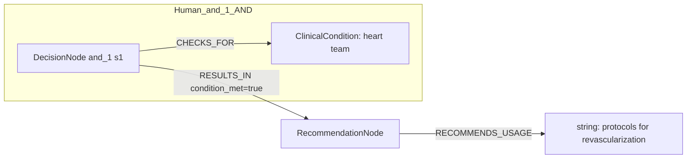
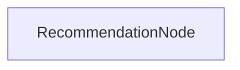

# row_05 (mapped to row_06)

Original table row text (ground truth):

```json
{
  "Recommendations": "It is recommended that the Heart Team (on site or with a partner institution) develop institutional protocols to implement the appropriate revascularization strategy in accordance with current guidelines. 855,856,858",
  "Class a": "I",
  "Level b": "C"
}
```

Aligned JSON (expected vs actual):

<table>
  <tr>
    <th align="left">Human Annotation</th>
    <th align="left">LLM Generated</th>
  </tr>
  <tr>
    <td valign="top"><pre>
[
  {
    "conditions": [
      {
        "entity": "heart team",
        "entity_original": "the heart team",
        "role": "ClinicalCondition",
        "operator": "PRESENT",
        "threshold": null,
        "unit": null,
        "context": null,
        "logic_type": "AND",
        "logic_group": "and_1",
        "strength": null,
        "level": null,
        "direction": null
      }
    ],
    "actions": [
      {
        "entity": "protocols for revascularization",
        "entity_original": "develop institutional protocols to implement the appropriate revascularization strategy in accordance with current guidelines",
        "role": "string",
        "operator": null,
        "threshold": null,
        "unit": null,
        "context": null,
        "logic_type": null,
        "logic_group": null,
        "strength": "I",
        "level": "C",
        "direction": "POSITIVE"
      }
    ]
  }
]
</pre></td>
    <td valign="top"><pre>
{
  "rules": [
    {
      "conditions": [],
      "actions": []
    }
  ]
}
</pre></td>
  </tr>
</table>

Mermaid (Human Annotation):



Mermaid (LLM Generated):



Concepts:
- expected: 2
- actual: 2
- matches: 0
- missing: 2
- extra: 2

Missing concepts:
- ClinicalCondition: heart team
- string: protocols for revascularization

Extra concepts:
- Condition: heart team
- Procedure: revascularization protocol development

Rules (concept + logic fields):
- expected: 2
- actual: 2
- matches: 0
- missing: 2
- extra: 2

Missing rules:
- ClinicalCondition: heart team | op=PRESENT | logic=AND | grp=and_1
- string: protocols for revascularization | class=I | level=C | dir=POSITIVE

Extra rules:
- Condition: heart team | op=PRESENT | logic=AND | grp=and_1 | class=Class I | level=C | dir=POSITIVE
- Procedure: revascularization protocol development | class=Class I | level=C | dir=POSITIVE

