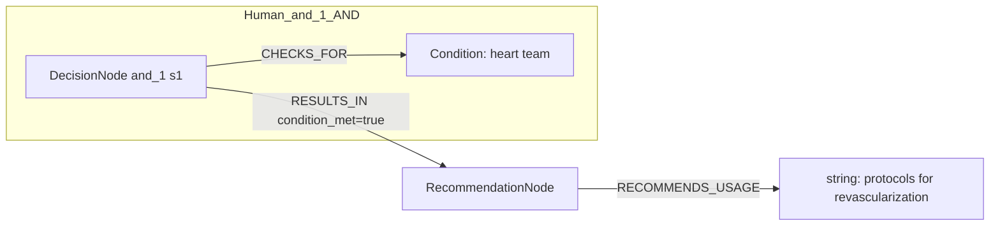
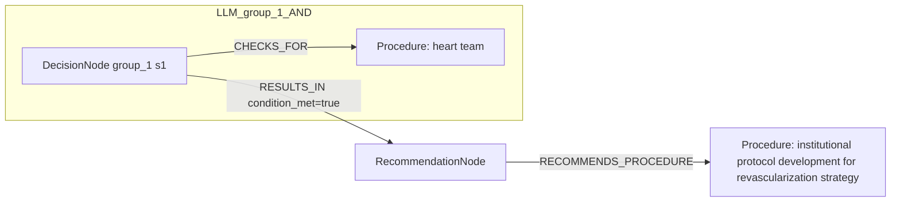

# row_05 (mapped to row_05)

Original table row text (ground truth):

```json
{
  "Recommendations": "It is recommended that the Heart Team (on site or with a partner institution) develop institutional protocols to implement the appropriate revascularization strategy in accordance with current guidelines. 855,856,858",
  "Class a": "I",
  "Level b": "C"
}
```

Aligned JSON (expected vs actual):

<table>
  <tr>
    <th align="left">Human Annotation</th>
    <th align="left">LLM Generated</th>
  </tr>
  <tr>
    <td valign="top"><pre>
[
  {
    "rule_id": 1,
    "conditions": [
      {
        "entity": "heart team",
        "entity_original": "the heart team",
        "role": "Condition",
        "operator": "PRESENT",
        "threshold": null,
        "unit": null,
        "condition_context": null,
        "logic_type": "AND",
        "logic_group": "and_1",
        "strength": null,
        "level": null,
        "direction": null
      }
    ],
    "actions": [
      {
        "entity": "protocols for revascularization",
        "entity_original": "develop institutional protocols to implement the appropriate revascularization strategy in accordance with current guidelines",
        "role": "string",
        "operator": null,
        "threshold": null,
        "unit": null,
        "condition_context": null,
        "logic_type": null,
        "logic_group": null,
        "strength": "I",
        "level": "C",
        "direction": "POSITIVE"
      }
    ]
  }
]
</pre></td>
    <td valign="top"><pre>
{
  "1": {
    "conditions": [
      {
        "entity": "heart team",
        "entity_original": "heart team (on site or with a partner institution)",
        "role": "Procedure",
        "operator": "PRESENT",
        "threshold": null,
        "unit": null,
        "condition_context": "on site or with a partner institution",
        "logic_type": null,
        "logic_group": null,
        "strength": "Unknown",
        "level": "Unknown",
        "direction": "UNKNOWN",
        "rule_id": 1,
        "side": "condition",
        "preferred_term": "Open heart surgery (procedure)",
        "synonyms": [
          "Open heart surgery"
        ],
        "snomed_id": 2598006,
        "target_label": "Procedure",
        "taxonomy_path": [
          {
            "concept_id": "2598006",
            "term": "Open heart surgery (procedure)"
          },
          {
            "concept_id": "64915003",
            "term": "Operation on heart (procedure)"
          },
          {
            "concept_id": "386765006",
            "term": "Operation on mediastinum (procedure)"
          },
          {
            "concept_id": "118696008",
            "term": "Procedure on mediastinum (procedure)"
          },
          {
            "concept_id": "118695007",
            "term": "Procedure on thorax (procedure)"
          },
          {
            "concept_id": "118694006",
            "term": "Procedure on trunk (procedure)"
          },
          {
            "concept_id": "771329004",
            "term": "Procedure on body region (procedure)"
          },
          {
            "concept_id": "362958002",
            "term": "Procedure by site (procedure)"
          },
          {
            "concept_id": "71388002",
            "term": "Procedure (procedure)"
          },
          {
            "concept_id": "138875005",
            "term": "SNOMED CT Concept (SNOMED RT+CTV3)"
          }
        ],
        "root_concept_id": "71388002",
        "root_concept_term": "Procedure (procedure)",
        "mapped_target_label": "Procedure"
      }
    ],
    "actions": []
  }
}
</pre></td>
  </tr>
</table>

Mermaid (Human Annotation):



Mermaid (LLM Generated):



Grounding summary (optional):

```json
{
  "enabled": true,
  "total_grounded": 1,
  "target_label_counts": {
    "Procedure": 1
  },
  "root_hit_counts": {
    "71388002": 1
  },
  "root_hits": [
    {
      "entity": "Heart Team",
      "entity_original": "Heart Team (on site or with a partner institution)",
      "role": "Procedure",
      "preferred_term": "Open heart surgery (procedure)",
      "synonyms": [
        "Open heart surgery"
      ],
      "snomed_id": 2598006,
      "target_label": "Procedure",
      "taxonomy_path": [
        {
          "concept_id": "2598006",
          "term": "Open heart surgery (procedure)"
        },
        {
          "concept_id": "64915003",
          "term": "Operation on heart (procedure)"
        },
        {
          "concept_id": "386765006",
          "term": "Operation on mediastinum (procedure)"
        },
        {
          "concept_id": "118696008",
          "term": "Procedure on mediastinum (procedure)"
        },
        {
          "concept_id": "118695007",
          "term": "Procedure on thorax (procedure)"
        },
        {
          "concept_id": "118694006",
          "term": "Procedure on trunk (procedure)"
        },
        {
          "concept_id": "771329004",
          "term": "Procedure on body region (procedure)"
        },
        {
          "concept_id": "362958002",
          "term": "Procedure by site (procedure)"
        },
        {
          "concept_id": "71388002",
          "term": "Procedure (procedure)"
        },
        {
          "concept_id": "138875005",
          "term": "SNOMED CT Concept (SNOMED RT+CTV3)"
        }
      ],
      "root_hit": {
        "root_concept_id": "71388002",
        "root_concept_term": "Procedure (procedure)",
        "mapped_target_label": "Procedure"
      }
    }
  ]
}
```

Concepts:
- expected: 2
- actual: 2
- matches: 0
- missing: 2
- extra: 2

Missing concepts:
- Condition: heart team
- string: protocols for revascularization

Extra concepts:
- Procedure: heart team
- Procedure: institutional protocol development for revascularization strategy

Rules (concept + logic fields):
- expected: 2
- actual: 2
- matches: 0
- missing: 2
- extra: 2

Missing rules:
- Condition: heart team | op=PRESENT | logic=AND | grp=and_1
- string: protocols for revascularization | class=I | level=C | dir=POSITIVE

Extra rules:
- Procedure: heart team | op=PRESENT | ctx=on site or with a partner institution | class=Unknown | level=Unknown | dir=UNKNOWN
- Procedure: institutional protocol development for revascularization strategy | class=I | level=C | dir=POSITIVE

