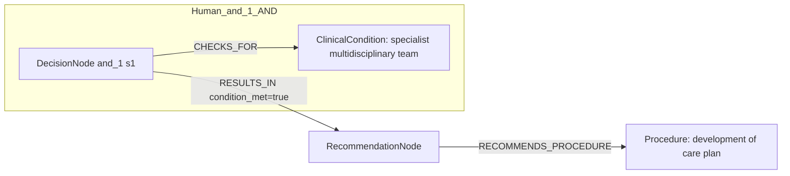

# row_05 (mapped to row_05)

Original table row text (ground truth):

```json
{
  "Recommendations": "It is recommended that the Heart Team (on site or with a partner institution) develop institutional protocols to implement the appropriate revascularization strategy in accordance with current guidelines. 855,856,858",
  "Class a": "I",
  "Level b": "C"
}
```

Aligned JSON (expected vs actual):

<table>
  <tr>
    <th align="left">Human Annotation</th>
    <th align="left">LLM Generated</th>
  </tr>
  <tr>
    <td valign="top"><pre>
[
  {
    "conditions": [
      {
        "entity": "specialist multidisciplinary team",
        "entity_original": "the heart team",
        "role": "ClinicalCondition",
        "operator": "PRESENT",
        "threshold": null,
        "unit": null,
        "context": null,
        "logic_type": "AND",
        "logic_group": "and_1",
        "strength": null,
        "level": null,
        "direction": null,
        "preferred_term": null,
        "synonyms": [],
        "snomed_id": "408458006",
        "target_label": null,
        "taxonomy_path": [],
        "root_concept_id": null,
        "root_concept_term": null
      }
    ],
    "actions": [
      {
        "entity": "development of care plan",
        "entity_original": "develop institutional protocols",
        "role": "Procedure",
        "operator": null,
        "threshold": null,
        "unit": null,
        "context": null,
        "logic_type": null,
        "logic_group": null,
        "strength": "I",
        "level": "C",
        "direction": "POSITIVE",
        "preferred_term": null,
        "synonyms": [],
        "snomed_id": "399684003",
        "target_label": null,
        "taxonomy_path": [],
        "root_concept_id": null,
        "root_concept_term": null
      }
    ]
  }
]
</pre></td>
    <td valign="top"><pre>
{
  "rules": [
    {
      "conditions": [],
      "actions": [
        {
          "entity": "heart team",
          "entity_original": "heart team (on site or with a partner institution)",
          "role": "Procedure",
          "operator": "PRESENT",
          "threshold": null,
          "unit": null,
          "context": null,
          "logic_type": null,
          "logic_group": null,
          "strength": "Class I",
          "level": "C",
          "direction": "POSITIVE",
          "preferred_term": "Open heart surgery (procedure)",
          "synonyms": [
            "Open heart surgery"
          ],
          "snomed_id": 2598006,
          "target_label": "Procedure",
          "taxonomy_path": [
            {
              "concept_id": "2598006",
              "term": "Open heart surgery (procedure)"
            },
            {
              "concept_id": "64915003",
              "term": "Operation on heart (procedure)"
            },
            {
              "concept_id": "386765006",
              "term": "Operation on mediastinum (procedure)"
            },
            {
              "concept_id": "118696008",
              "term": "Procedure on mediastinum (procedure)"
            },
            {
              "concept_id": "118695007",
              "term": "Procedure on thorax (procedure)"
            },
            {
              "concept_id": "118694006",
              "term": "Procedure on trunk (procedure)"
            },
            {
              "concept_id": "771329004",
              "term": "Procedure on body region (procedure)"
            },
            {
              "concept_id": "362958002",
              "term": "Procedure by site (procedure)"
            },
            {
              "concept_id": "71388002",
              "term": "Procedure (procedure)"
            },
            {
              "concept_id": "138875005",
              "term": "SNOMED CT Concept (SNOMED RT+CTV3)"
            }
          ],
          "root_concept_id": "71388002",
          "root_concept_term": "Procedure (procedure)"
        }
      ]
    }
  ]
}
</pre></td>
  </tr>
</table>

Mermaid (Human Annotation):



Mermaid (LLM Generated):


Grounding summary (optional):

```json
{
  "enabled": true,
  "total_grounded": 1,
  "target_label_counts": {
    "Procedure": 1
  },
  "root_hit_counts": {
    "71388002": 1
  },
  "root_hits": [
    {
      "entity": "Heart Team",
      "entity_original": "Heart Team (on site or with a partner institution)",
      "role": "Procedure",
      "preferred_term": "Open heart surgery (procedure)",
      "synonyms": [
        "Open heart surgery"
      ],
      "snomed_id": 2598006,
      "target_label": "Procedure",
      "taxonomy_path": [
        {
          "concept_id": "2598006",
          "term": "Open heart surgery (procedure)"
        },
        {
          "concept_id": "64915003",
          "term": "Operation on heart (procedure)"
        },
        {
          "concept_id": "386765006",
          "term": "Operation on mediastinum (procedure)"
        },
        {
          "concept_id": "118696008",
          "term": "Procedure on mediastinum (procedure)"
        },
        {
          "concept_id": "118695007",
          "term": "Procedure on thorax (procedure)"
        },
        {
          "concept_id": "118694006",
          "term": "Procedure on trunk (procedure)"
        },
        {
          "concept_id": "771329004",
          "term": "Procedure on body region (procedure)"
        },
        {
          "concept_id": "362958002",
          "term": "Procedure by site (procedure)"
        },
        {
          "concept_id": "71388002",
          "term": "Procedure (procedure)"
        },
        {
          "concept_id": "138875005",
          "term": "SNOMED CT Concept (SNOMED RT+CTV3)"
        }
      ],
      "root_hit": {
        "root_concept_id": "71388002",
        "root_concept_term": "Procedure (procedure)",
        "mapped_target_label": "Procedure"
      }
    }
  ]
}
```

Concepts:
- expected: 2
- actual: 2
- matches: 0
- missing: 2
- extra: 2

Missing concepts:
- ClinicalCondition: specialist multidisciplinary team
- Procedure: development of care plan

Extra concepts:
- Procedure: develop institutional protocols
- Procedure: heart team

Rules (concept + logic fields):
- expected: 2
- actual: 2
- matches: 0
- missing: 2
- extra: 2

Missing rules:
- ClinicalCondition: specialist multidisciplinary team | op=PRESENT | logic=AND | grp=and_1
- Procedure: development of care plan | class=I | level=C | dir=POSITIVE

Extra rules:
- Procedure: develop institutional protocols | class=Class I | level=C | dir=POSITIVE
- Procedure: heart team | op=PRESENT | class=Class I | level=C | dir=POSITIVE

