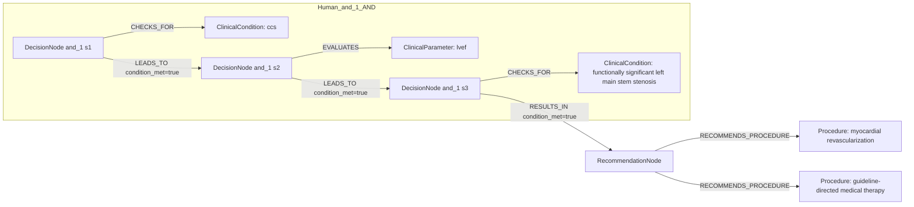

# row_06 (mapped to row_07)

Original table row text (ground truth):

```json
{
  "Recommendations": "In CCS patients with LVEF > 35%, myocardial revascularization is recommended, in addition to guideline-directed medical therapy, for patients with functionally significant left main stem stenosis to improve survival. 718,719,859,860",
  "Class a": "I",
  "Level b": "A"
}
```

Aligned JSON (expected vs actual):

<table>
  <tr>
    <th align="left">Human Annotation</th>
    <th align="left">LLM Generated</th>
  </tr>
  <tr>
    <td valign="top"><pre>
[
  {
    "conditions": [
      {
        "entity": "ccs",
        "entity_original": "ccs patient",
        "role": "ClinicalCondition",
        "operator": "PRESENT",
        "threshold": null,
        "unit": null,
        "context": null,
        "logic_type": "AND",
        "logic_group": "and_1",
        "strength": null,
        "level": null,
        "direction": null
      },
      {
        "entity": "lvef",
        "entity_original": "lvef > 35%",
        "role": "ClinicalParameter",
        "operator": ">",
        "threshold": "35",
        "unit": "%",
        "context": null,
        "logic_type": "AND",
        "logic_group": "and_1",
        "strength": null,
        "level": null,
        "direction": null
      },
      {
        "entity": "functionally significant left main stem stenosis",
        "entity_original": "functionally significant left main stem stenosis",
        "role": "ClinicalCondition",
        "operator": "PRESENT",
        "threshold": null,
        "unit": null,
        "context": null,
        "logic_type": "AND",
        "logic_group": "and_1",
        "strength": null,
        "level": null,
        "direction": null
      }
    ],
    "actions": [
      {
        "entity": "myocardial revascularization",
        "entity_original": "myocardial revascularization to improve survival",
        "role": "Procedure",
        "operator": null,
        "threshold": null,
        "unit": null,
        "context": null,
        "logic_type": null,
        "logic_group": null,
        "strength": "I",
        "level": "A",
        "direction": "POSITIVE"
      },
      {
        "entity": "guideline-directed medical therapy",
        "entity_original": "guideline-directed medical therapy to improve survival",
        "role": "Procedure",
        "operator": null,
        "threshold": null,
        "unit": null,
        "context": null,
        "logic_type": null,
        "logic_group": null,
        "strength": "I",
        "level": "A",
        "direction": "POSITIVE"
      }
    ]
  }
]
</pre></td>
    <td valign="top"><pre>
{
  "rules": [
    {
      "conditions": [],
      "actions": []
    }
  ]
}
</pre></td>
  </tr>
</table>

Mermaid (Human Annotation):



Mermaid (LLM Generated):


Concepts:
- expected: 5
- actual: 12
- matches: 0
- missing: 5
- extra: 12

Missing concepts:
- ClinicalCondition: ccs
- ClinicalCondition: functionally significant left main stem stenosis
- ClinicalParameter: lvef
- Procedure: guideline-directed medical therapy
- Procedure: myocardial revascularization

Extra concepts:
- Condition: age
- Condition: cognitive status
- Condition: diabetes
- Condition: frailty
- Condition: high anatomical complexity
- Condition: left main stem involvement
- Condition: likelihood of revascularization completeness
- Condition: local expertise
- Condition: multivessel disease
- Condition: other comorbidities
- Condition: surgical and interventional risk
- Procedure: revascularization

Rules (concept + logic fields):
- expected: 5
- actual: 12
- matches: 0
- missing: 5
- extra: 12

Missing rules:
- ClinicalCondition: ccs | op=PRESENT | logic=AND | grp=and_1
- ClinicalCondition: functionally significant left main stem stenosis | op=PRESENT | logic=AND | grp=and_1
- ClinicalParameter: lvef | op=> | thr=35 | unit=% | logic=AND | grp=and_1
- Procedure: guideline-directed medical therapy | class=I | level=A | dir=POSITIVE
- Procedure: myocardial revascularization | class=I | level=A | dir=POSITIVE

Extra rules:
- Condition: age | op=PRESENT | logic=AND | grp=and_1 | dir=UNKNOWN
- Condition: cognitive status | op=PRESENT | logic=AND | grp=and_3 | dir=UNKNOWN
- Condition: diabetes | op=PRESENT | logic=AND | grp=and_4 | dir=UNKNOWN
- Condition: frailty | op=PRESENT | logic=AND | grp=and_2 | dir=UNKNOWN
- Condition: high anatomical complexity | op=PRESENT | logic=AND | grp=and_8 | dir=UNKNOWN
- Condition: left main stem involvement | op=PRESENT | logic=AND | grp=and_7 | dir=UNKNOWN
- Condition: likelihood of revascularization completeness | op=PRESENT | logic=AND | grp=and_9 | dir=UNKNOWN
- Condition: local expertise | op=PRESENT | logic=AND | grp=and_10 | dir=UNKNOWN
- Condition: multivessel disease | op=PRESENT | logic=AND | grp=and_6 | dir=UNKNOWN
- Condition: other comorbidities | op=PRESENT | logic=AND | grp=and_5 | dir=UNKNOWN
- Condition: surgical and interventional risk | op=PRESENT | logic=AND | grp=and_11 | dir=UNKNOWN
- Procedure: revascularization | dir=POSITIVE
