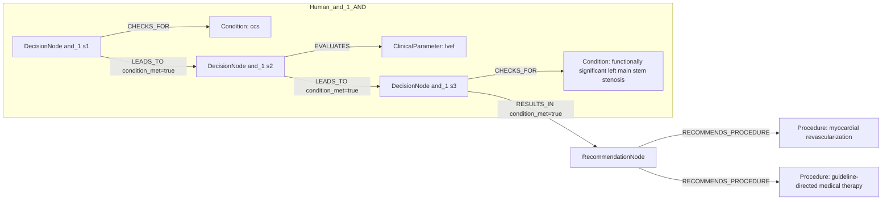
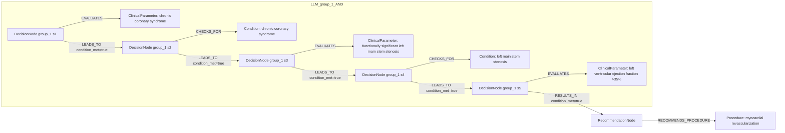

# row_06 (mapped to row_06)

Original table row text (ground truth):

```json
{
  "Recommendations": "In CCS patients with LVEF > 35%, myocardial revascularization is recommended, in addition to guideline-directed medical therapy, for patients with functionally significant left main stem stenosis to improve survival. 718,719,859,860",
  "Class a": "I",
  "Level b": "A"
}
```

Aligned JSON (expected vs actual):

<table>
  <tr>
    <th align="left">Human Annotation</th>
    <th align="left">LLM Generated</th>
  </tr>
  <tr>
    <td valign="top"><pre>
[
  {
    "rule_id": 1,
    "conditions": [
      {
        "entity": "ccs",
        "entity_original": "ccs patient",
        "role": "Condition",
        "operator": "PRESENT",
        "threshold": null,
        "unit": null,
        "condition_context": null,
        "logic_type": "AND",
        "logic_group": "and_1",
        "strength": null,
        "level": null,
        "direction": null
      },
      {
        "entity": "lvef",
        "entity_original": "lvef > 35%",
        "role": "ClinicalParameter",
        "operator": ">",
        "threshold": "35",
        "unit": "%",
        "condition_context": null,
        "logic_type": "AND",
        "logic_group": "and_1",
        "strength": null,
        "level": null,
        "direction": null
      },
      {
        "entity": "functionally significant left main stem stenosis",
        "entity_original": "functionally significant left main stem stenosis",
        "role": "Condition",
        "operator": "PRESENT",
        "threshold": null,
        "unit": null,
        "condition_context": null,
        "logic_type": "AND",
        "logic_group": "and_1",
        "strength": null,
        "level": null,
        "direction": null
      }
    ],
    "actions": [
      {
        "entity": "myocardial revascularization",
        "entity_original": "myocardial revascularization to improve survival",
        "role": "Procedure",
        "operator": null,
        "threshold": null,
        "unit": null,
        "condition_context": null,
        "logic_type": null,
        "logic_group": null,
        "strength": "I",
        "level": "A",
        "direction": "POSITIVE"
      },
      {
        "entity": "guideline-directed medical therapy",
        "entity_original": "guideline-directed medical therapy to improve survival",
        "role": "Procedure",
        "operator": null,
        "threshold": null,
        "unit": null,
        "condition_context": null,
        "logic_type": null,
        "logic_group": null,
        "strength": "I",
        "level": "A",
        "direction": "POSITIVE"
      }
    ]
  }
]
</pre></td>
    <td valign="top"><pre>
{
  "1": {
    "conditions": [
      {
        "entity": "left ventricular ejection fraction >35%",
        "entity_original": "lvef > 35%",
        "role": "ClinicalParameter",
        "operator": ">",
        "threshold": "35",
        "unit": "%",
        "condition_context": null,
        "logic_type": null,
        "logic_group": null,
        "strength": "I",
        "level": "A",
        "direction": "POSITIVE",
        "rule_id": 1,
        "side": "condition",
        "preferred_term": "Left ventricular ejection fraction (observable entity)",
        "synonyms": [
          "LVEF - Left ventricular ejection fraction",
          "Left ventricular ejection fraction"
        ],
        "snomed_id": 250908004,
        "target_label": "ClinicalParameter",
        "taxonomy_path": [
          {
            "concept_id": "250908004",
            "term": "Left ventricular ejection fraction (observable entity)"
          },
          {
            "concept_id": "70822001",
            "term": "Cardiac ejection fraction, function (observable entity)"
          },
          {
            "concept_id": "86185002",
            "term": "Cardiac function (observable entity)"
          },
          {
            "concept_id": "70337006",
            "term": "Cardiovascular function (observable entity)"
          },
          {
            "concept_id": "246464006",
            "term": "Function (observable entity)"
          },
          {
            "concept_id": "363787002",
            "term": "Observable entity (observable entity)"
          },
          {
            "concept_id": "138875005",
            "term": "SNOMED CT Concept (SNOMED RT+CTV3)"
          }
        ],
        "root_concept_id": "363787002",
        "root_concept_term": "Observable entity (observable entity)",
        "mapped_target_label": "ClinicalParameter"
      },
      {
        "entity": "left main stem stenosis",
        "entity_original": "functionally significant left main stem stenosis",
        "role": "Condition",
        "operator": "PRESENT",
        "threshold": null,
        "unit": null,
        "condition_context": "functionally significant",
        "logic_type": null,
        "logic_group": null,
        "strength": "I",
        "level": "A",
        "direction": "POSITIVE",
        "rule_id": 1,
        "side": "condition",
        "preferred_term": "Left main coronary artery thrombosis (disorder)",
        "synonyms": [
          "Left main coronary artery thrombosis"
        ],
        "snomed_id": 56276002,
        "target_label": "ClinicalCondition",
        "taxonomy_path": [
          {
            "concept_id": "56276002",
            "term": "Left main coronary artery thrombosis (disorder)"
          },
          {
            "concept_id": "398274000",
            "term": "Coronary artery thrombosis (disorder)"
          },
          {
            "concept_id": "65198009",
            "term": "Arterial thrombosis (disorder)"
          },
          {
            "concept_id": "359557001",
            "term": "Disorder of artery (disorder)"
          },
          {
            "concept_id": "27550009",
            "term": "Disorder of blood vessel (disorder)"
          },
          {
            "concept_id": "19660004",
            "term": "Disorder of soft tissue (disorder)"
          },
          {
            "concept_id": "248402002",
            "term": "General finding of soft tissue (finding)"
          },
          {
            "concept_id": "404684003",
            "term": "Clinical finding (finding)"
          },
          {
            "concept_id": "138875005",
            "term": "SNOMED CT Concept (SNOMED RT+CTV3)"
          }
        ],
        "root_concept_id": "404684003",
        "root_concept_term": "Clinical finding (finding)",
        "mapped_target_label": "ClinicalCondition"
      }
    ],
    "actions": [
      {
        "entity": "myocardial revascularization",
        "entity_original": "myocardial revascularization",
        "role": "Procedure",
        "operator": "PRESENT",
        "threshold": null,
        "unit": null,
        "condition_context": null,
        "logic_type": null,
        "logic_group": null,
        "strength": "I",
        "level": "A",
        "direction": "POSITIVE",
        "rule_id": 1,
        "side": "action",
        "preferred_term": "Myocardial revascularization (procedure)",
        "synonyms": [],
        "snomed_id": 275227003,
        "target_label": "Procedure",
        "taxonomy_path": [
          {
            "concept_id": "275227003",
            "term": "Myocardial revascularization (procedure)"
          },
          {
            "concept_id": "81266008",
            "term": "Heart revascularization (procedure)"
          },
          {
            "concept_id": "31413008",
            "term": "Operative procedure on coronary artery (procedure)"
          },
          {
            "concept_id": "38629001",
            "term": "Operative procedure on the arteries of the thorax and abdomen (procedure)"
          },
          {
            "concept_id": "74943008",
            "term": "Operation on trunk (procedure)"
          },
          {
            "concept_id": "387713003",
            "term": "Surgical procedure (procedure)"
          },
          {
            "concept_id": "71388002",
            "term": "Procedure (procedure)"
          }
        ],
        "root_concept_id": "71388002",
        "root_concept_term": "Procedure (procedure)",
        "mapped_target_label": "Procedure"
      }
    ]
  }
}
</pre></td>
  </tr>
</table>

Mermaid (Human Annotation):



Mermaid (LLM Generated):



Grounding summary (optional):

```json
{
  "enabled": true,
  "total_grounded": 3,
  "target_label_counts": {
    "ClinicalParameter": 1,
    "ClinicalCondition": 1,
    "Procedure": 1
  },
  "root_hit_counts": {
    "363787002": 1,
    "404684003": 1,
    "71388002": 1
  },
  "root_hits": [
    {
      "entity": "Left ventricular ejection fraction >35%",
      "entity_original": "LVEF > 35%",
      "role": "ClinicalParameter",
      "preferred_term": "Left ventricular ejection fraction (observable entity)",
      "synonyms": [
        "LVEF - Left ventricular ejection fraction",
        "Left ventricular ejection fraction"
      ],
      "snomed_id": 250908004,
      "target_label": "ClinicalParameter",
      "taxonomy_path": [
        {
          "concept_id": "250908004",
          "term": "Left ventricular ejection fraction (observable entity)"
        },
        {
          "concept_id": "70822001",
          "term": "Cardiac ejection fraction, function (observable entity)"
        },
        {
          "concept_id": "86185002",
          "term": "Cardiac function (observable entity)"
        },
        {
          "concept_id": "70337006",
          "term": "Cardiovascular function (observable entity)"
        },
        {
          "concept_id": "246464006",
          "term": "Function (observable entity)"
        },
        {
          "concept_id": "363787002",
          "term": "Observable entity (observable entity)"
        },
        {
          "concept_id": "138875005",
          "term": "SNOMED CT Concept (SNOMED RT+CTV3)"
        }
      ],
      "root_hit": {
        "root_concept_id": "363787002",
        "root_concept_term": "Observable entity (observable entity)",
        "mapped_target_label": "ClinicalParameter"
      }
    },
    {
      "entity": "Left main stem stenosis",
      "entity_original": "functionally significant left main stem stenosis",
      "role": "Condition",
      "preferred_term": "Left main coronary artery thrombosis (disorder)",
      "synonyms": [
        "Left main coronary artery thrombosis"
      ],
      "snomed_id": 56276002,
      "target_label": "ClinicalCondition",
      "taxonomy_path": [
        {
          "concept_id": "56276002",
          "term": "Left main coronary artery thrombosis (disorder)"
        },
        {
          "concept_id": "398274000",
          "term": "Coronary artery thrombosis (disorder)"
        },
        {
          "concept_id": "65198009",
          "term": "Arterial thrombosis (disorder)"
        },
        {
          "concept_id": "359557001",
          "term": "Disorder of artery (disorder)"
        },
        {
          "concept_id": "27550009",
          "term": "Disorder of blood vessel (disorder)"
        },
        {
          "concept_id": "19660004",
          "term": "Disorder of soft tissue (disorder)"
        },
        {
          "concept_id": "248402002",
          "term": "General finding of soft tissue (finding)"
        },
        {
          "concept_id": "404684003",
          "term": "Clinical finding (finding)"
        },
        {
          "concept_id": "138875005",
          "term": "SNOMED CT Concept (SNOMED RT+CTV3)"
        }
      ],
      "root_hit": {
        "root_concept_id": "404684003",
        "root_concept_term": "Clinical finding (finding)",
        "mapped_target_label": "ClinicalCondition"
      }
    },
    {
      "entity": "Myocardial revascularization",
      "entity_original": "myocardial revascularization",
      "role": "Procedure",
      "preferred_term": "Myocardial revascularization (procedure)",
      "synonyms": [],
      "snomed_id": 275227003,
      "target_label": "Procedure",
      "taxonomy_path": [
        {
          "concept_id": "275227003",
          "term": "Myocardial revascularization (procedure)"
        },
        {
          "concept_id": "81266008",
          "term": "Heart revascularization (procedure)"
        },
        {
          "concept_id": "31413008",
          "term": "Operative procedure on coronary artery (procedure)"
        },
        {
          "concept_id": "38629001",
          "term": "Operative procedure on the arteries of the thorax and abdomen (procedure)"
        },
        {
          "concept_id": "74943008",
          "term": "Operation on trunk (procedure)"
        },
        {
          "concept_id": "387713003",
          "term": "Surgical procedure (procedure)"
        },
        {
          "concept_id": "71388002",
          "term": "Procedure (procedure)"
        }
      ],
      "root_hit": {
        "root_concept_id": "71388002",
        "root_concept_term": "Procedure (procedure)",
        "mapped_target_label": "Procedure"
      }
    }
  ]
}
```

Concepts:
- expected: 5
- actual: 6
- matches: 1
- missing: 4
- extra: 5

Missing concepts:
- ClinicalParameter: lvef
- Condition: ccs
- Condition: functionally significant left main stem stenosis
- Procedure: guideline-directed medical therapy

Extra concepts:
- ClinicalParameter: chronic coronary syndrome
- ClinicalParameter: functionally significant left main stem stenosis
- ClinicalParameter: left ventricular ejection fraction >35%
- Condition: chronic coronary syndrome
- Condition: left main stem stenosis

Rules (concept + logic fields):
- expected: 5
- actual: 6
- matches: 0
- missing: 5
- extra: 6

Missing rules:
- ClinicalParameter: lvef | op=> | thr=35 | unit=% | logic=AND | grp=and_1
- Condition: ccs | op=PRESENT | logic=AND | grp=and_1
- Condition: functionally significant left main stem stenosis | op=PRESENT | logic=AND | grp=and_1
- Procedure: guideline-directed medical therapy | class=I | level=A | dir=POSITIVE
- Procedure: myocardial revascularization | class=I | level=A | dir=POSITIVE

Extra rules:
- ClinicalParameter: chronic coronary syndrome | op=PRESENT | class=I | level=A | dir=POSITIVE
- ClinicalParameter: functionally significant left main stem stenosis | op=PRESENT | ctx=functionally significant | class=I | level=A | dir=POSITIVE
- ClinicalParameter: left ventricular ejection fraction >35% | op=> | thr=35 | unit=% | class=I | level=A | dir=POSITIVE
- Condition: chronic coronary syndrome | op=PRESENT | class=I | level=A | dir=POSITIVE
- Condition: left main stem stenosis | op=PRESENT | ctx=functionally significant | class=I | level=A | dir=POSITIVE
- Procedure: myocardial revascularization | op=PRESENT | class=I | level=A | dir=POSITIVE

