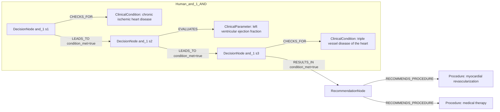
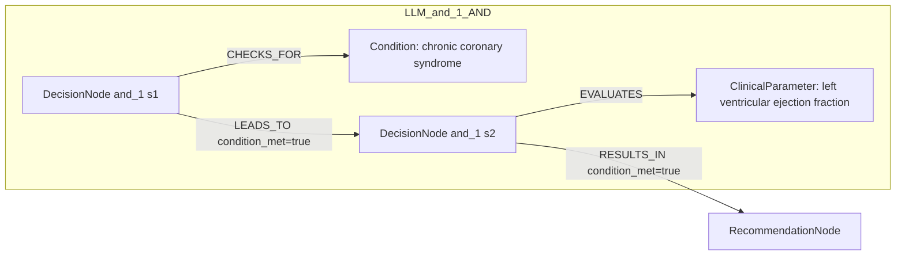

# row_07 (mapped to row_08)

Original table row text (ground truth):

```json
{
  "Recommendations": "In CCS patients with LVEF > 35%, myocardial revascularization is recommended, in addition to guideline-directed medical therapy, for patients with functionally significant three-vessel disease to improve long-term survival and to reduce long-term cardiovascular mortality and the risk of spontaneous myocardial infarction. 55,56,317,732-734",
  "Class a": "I",
  "Level b": "A"
}
```

Aligned JSON (expected vs actual):

<table>
  <tr>
    <th align="left">Human Annotation</th>
    <th align="left">LLM Generated</th>
  </tr>
  <tr>
    <td valign="top"><pre>
[
  {
    "conditions": [
      {
        "entity": "chronic ischemic heart disease",
        "entity_original": "ccs patient",
        "role": "ClinicalCondition",
        "operator": "PRESENT",
        "threshold": null,
        "unit": null,
        "context": null,
        "logic_type": "AND",
        "logic_group": "and_1",
        "strength": null,
        "level": null,
        "direction": null,
        "preferred_term": null,
        "synonyms": [],
        "snomed_id": "413838009",
        "target_label": null,
        "taxonomy_path": [],
        "root_concept_id": null,
        "root_concept_term": null
      },
      {
        "entity": "left ventricular ejection fraction",
        "entity_original": "lvef > 35%",
        "role": "ClinicalParameter",
        "operator": ">",
        "threshold": "35",
        "unit": "%",
        "context": null,
        "logic_type": "AND",
        "logic_group": "and_1",
        "strength": null,
        "level": null,
        "direction": null,
        "preferred_term": null,
        "synonyms": [],
        "snomed_id": "250908004",
        "target_label": null,
        "taxonomy_path": [],
        "root_concept_id": null,
        "root_concept_term": null
      },
      {
        "entity": "triple vessel disease of the heart",
        "entity_original": "functionally significant three-vessel disease",
        "role": "ClinicalCondition",
        "operator": "PRESENT",
        "threshold": null,
        "unit": null,
        "context": null,
        "logic_type": "AND",
        "logic_group": "and_1",
        "strength": null,
        "level": null,
        "direction": null,
        "preferred_term": null,
        "synonyms": [],
        "snomed_id": "233817007",
        "target_label": null,
        "taxonomy_path": [],
        "root_concept_id": null,
        "root_concept_term": null
      }
    ],
    "actions": [
      {
        "entity": "myocardial revascularization",
        "entity_original": "myocardial revascularization",
        "role": "Procedure",
        "operator": null,
        "threshold": null,
        "unit": null,
        "context": null,
        "logic_type": null,
        "logic_group": null,
        "strength": "I",
        "level": "A",
        "direction": "POSITIVE",
        "preferred_term": null,
        "synonyms": [],
        "snomed_id": "275227003",
        "target_label": null,
        "taxonomy_path": [],
        "root_concept_id": null,
        "root_concept_term": null
      },
      {
        "entity": "medical therapy",
        "entity_original": "guideline-directed medical therapy",
        "role": "Procedure",
        "operator": null,
        "threshold": null,
        "unit": null,
        "context": null,
        "logic_type": null,
        "logic_group": null,
        "strength": "I",
        "level": "A",
        "direction": "POSITIVE",
        "preferred_term": null,
        "synonyms": [],
        "snomed_id": "243121000",
        "target_label": null,
        "taxonomy_path": [],
        "root_concept_id": null,
        "root_concept_term": null
      }
    ]
  }
]
</pre></td>
    <td valign="top"><pre>
{
  "rules": [
    {
      "conditions": [
        {
          "entity": "chronic coronary syndrome",
          "entity_original": "chronic coronary syndrome patients",
          "role": "Condition",
          "operator": "PRESENT",
          "threshold": null,
          "unit": null,
          "context": null,
          "logic_type": "AND",
          "logic_group": "and_1",
          "strength": null,
          "level": null,
          "direction": "POSITIVE"
        },
        {
          "entity": "left ventricular ejection fraction",
          "entity_original": "left ventricular ejection fraction > 35%",
          "role": "ClinicalParameter",
          "operator": ">",
          "threshold": "35",
          "unit": "%",
          "context": null,
          "logic_type": "AND",
          "logic_group": "and_1",
          "strength": null,
          "level": null,
          "direction": "POSITIVE"
        }
      ],
      "actions": []
    }
  ]
}
</pre></td>
  </tr>
</table>

Mermaid (Human Annotation):



Mermaid (LLM Generated):



Concepts:
- expected: 5
- actual: 2
- matches: 1
- missing: 4
- extra: 1

Missing concepts:
- ClinicalCondition: chronic ischemic heart disease
- ClinicalCondition: triple vessel disease of the heart
- Procedure: medical therapy
- Procedure: myocardial revascularization

Extra concepts:
- Condition: chronic coronary syndrome

Rules (concept + logic fields):
- expected: 5
- actual: 2
- matches: 0
- missing: 5
- extra: 2

Missing rules:
- ClinicalCondition: chronic ischemic heart disease | op=PRESENT | logic=AND | grp=and_1
- ClinicalCondition: triple vessel disease of the heart | op=PRESENT | logic=AND | grp=and_1
- ClinicalParameter: left ventricular ejection fraction | op=> | thr=35 | unit=% | logic=AND | grp=and_1
- Procedure: medical therapy | class=I | level=A | dir=POSITIVE
- Procedure: myocardial revascularization | class=I | level=A | dir=POSITIVE

Extra rules:
- ClinicalParameter: left ventricular ejection fraction | op=> | thr=35 | unit=% | logic=AND | grp=and_1 | dir=POSITIVE
- Condition: chronic coronary syndrome | op=PRESENT | logic=AND | grp=and_1 | dir=POSITIVE

