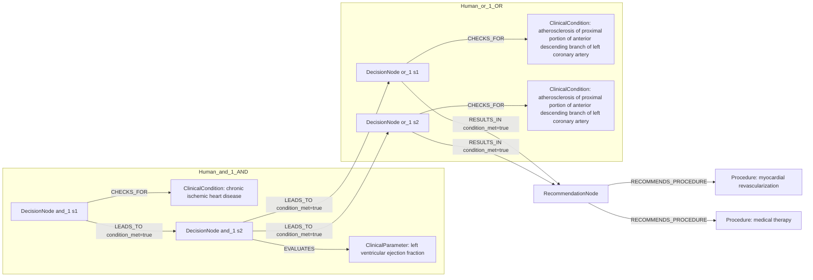
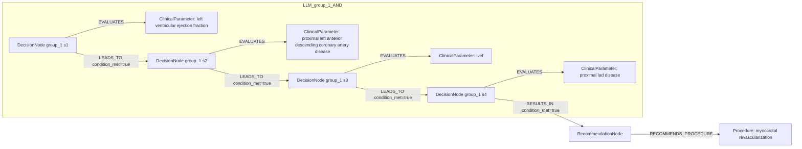

# row_08 (mapped to row_08)

Original table row text (ground truth):

```json
{
  "Recommendations": "In CCS patients with LVEF > 35%, myocardial revascularization is recommended, in addition to guideline-directed medical therapy, for patients with functionally significant single- or two-vessel disease involving the proximal LAD, to reduce long-term cardiovascular mortality",
  "Class a": "I",
  "Level b": "B"
}
```

Aligned JSON (expected vs actual):

<table>
  <tr>
    <th align="left">Human Annotation</th>
    <th align="left">LLM Generated</th>
  </tr>
  <tr>
    <td valign="top"><pre>
[
  {
    "conditions": [
      {
        "entity": "chronic ischemic heart disease",
        "entity_original": "ccs patient",
        "role": "ClinicalCondition",
        "operator": "PRESENT",
        "threshold": null,
        "unit": null,
        "context": null,
        "logic_type": "AND",
        "logic_group": "and_1",
        "strength": null,
        "level": null,
        "direction": null,
        "preferred_term": null,
        "synonyms": [],
        "snomed_id": "413838009",
        "target_label": null,
        "taxonomy_path": [],
        "root_concept_id": null,
        "root_concept_term": null
      },
      {
        "entity": "left ventricular ejection fraction",
        "entity_original": "lvef > 35%",
        "role": "ClinicalParameter",
        "operator": ">",
        "threshold": "35",
        "unit": "%",
        "context": null,
        "logic_type": "AND",
        "logic_group": "and_1",
        "strength": null,
        "level": null,
        "direction": null,
        "preferred_term": null,
        "synonyms": [],
        "snomed_id": "250908004",
        "target_label": null,
        "taxonomy_path": [],
        "root_concept_id": null,
        "root_concept_term": null
      },
      {
        "entity": "atherosclerosis of proximal portion of anterior descending branch of left coronary artery",
        "entity_original": "functionally significant single-vessel disease involving the proximal lad",
        "role": "ClinicalCondition",
        "operator": "PRESENT",
        "threshold": null,
        "unit": null,
        "context": null,
        "logic_type": "OR",
        "logic_group": "or_1",
        "strength": null,
        "level": null,
        "direction": null,
        "preferred_term": null,
        "synonyms": [],
        "snomed_id": "1366501001",
        "target_label": null,
        "taxonomy_path": [],
        "root_concept_id": null,
        "root_concept_term": null
      },
      {
        "entity": "atherosclerosis of proximal portion of anterior descending branch of left coronary artery",
        "entity_original": "functionally significant two-vessel disease involving the proximal lad",
        "role": "ClinicalCondition",
        "operator": "PRESENT",
        "threshold": null,
        "unit": null,
        "context": null,
        "logic_type": "OR",
        "logic_group": "or_1",
        "strength": null,
        "level": null,
        "direction": null,
        "preferred_term": null,
        "synonyms": [],
        "snomed_id": "1366501001",
        "target_label": null,
        "taxonomy_path": [],
        "root_concept_id": null,
        "root_concept_term": null
      }
    ],
    "actions": [
      {
        "entity": "myocardial revascularization",
        "entity_original": "myocardial revascularization",
        "role": "Procedure",
        "operator": null,
        "threshold": null,
        "unit": null,
        "context": null,
        "logic_type": null,
        "logic_group": null,
        "strength": "I",
        "level": "B",
        "direction": "POSITIVE",
        "preferred_term": null,
        "synonyms": [],
        "snomed_id": "275227003",
        "target_label": null,
        "taxonomy_path": [],
        "root_concept_id": null,
        "root_concept_term": null
      },
      {
        "entity": "medical therapy",
        "entity_original": "guideline-directed medical therapy",
        "role": "Procedure",
        "operator": null,
        "threshold": null,
        "unit": null,
        "context": null,
        "logic_type": null,
        "logic_group": null,
        "strength": "I",
        "level": "B",
        "direction": "POSITIVE",
        "preferred_term": null,
        "synonyms": [],
        "snomed_id": "243121000",
        "target_label": null,
        "taxonomy_path": [],
        "root_concept_id": null,
        "root_concept_term": null
      }
    ]
  }
]
</pre></td>
    <td valign="top"><pre>
{
  "rules": [
    {
      "conditions": [
        {
          "entity": "left ventricular ejection fraction",
          "entity_original": "lvef > 35%",
          "role": "ClinicalParameter",
          "operator": ">",
          "threshold": "35",
          "unit": "%",
          "context": null,
          "logic_type": null,
          "logic_group": null,
          "strength": null,
          "level": null,
          "direction": "UNKNOWN",
          "preferred_term": "Left ventricular ejection fraction (observable entity)",
          "synonyms": [],
          "snomed_id": 250908004,
          "target_label": "ClinicalParameter",
          "taxonomy_path": [
            {
              "concept_id": "250908004",
              "term": "Left ventricular ejection fraction (observable entity)"
            },
            {
              "concept_id": "70822001",
              "term": "Cardiac ejection fraction, function (observable entity)"
            },
            {
              "concept_id": "86185002",
              "term": "Cardiac function (observable entity)"
            },
            {
              "concept_id": "70337006",
              "term": "Cardiovascular function (observable entity)"
            },
            {
              "concept_id": "246464006",
              "term": "Function (observable entity)"
            },
            {
              "concept_id": "363787002",
              "term": "Observable entity (observable entity)"
            }
          ],
          "root_concept_id": "363787002",
          "root_concept_term": "Observable entity (observable entity)"
        },
        {
          "entity": "proximal left anterior descending coronary artery disease",
          "entity_original": "functionally significant single- or two-vessel disease involving the proximal lad",
          "role": "ClinicalParameter",
          "operator": "PRESENT",
          "threshold": null,
          "unit": null,
          "context": null,
          "logic_type": null,
          "logic_group": null,
          "strength": null,
          "level": null,
          "direction": "UNKNOWN",
          "preferred_term": "Left anterior descending coronary artery thrombosis (disorder)",
          "synonyms": [],
          "snomed_id": 28248000,
          "target_label": "ClinicalCondition",
          "taxonomy_path": [
            {
              "concept_id": "28248000",
              "term": "Left anterior descending coronary artery thrombosis (disorder)"
            },
            {
              "concept_id": "398274000",
              "term": "Coronary artery thrombosis (disorder)"
            },
            {
              "concept_id": "896818001",
              "term": "Structural abnormality of coronary artery (disorder)"
            },
            {
              "concept_id": "128599005",
              "term": "Structural disorder of heart (disorder)"
            },
            {
              "concept_id": "56265001",
              "term": "Heart disease (disorder)"
            },
            {
              "concept_id": "49601007",
              "term": "Disorder of cardiovascular system (disorder)"
            }
          ],
          "root_concept_id": "49601007",
          "root_concept_term": "Disorder of cardiovascular system (disorder)"
        },
        {
          "entity": "lvef",
          "entity_original": "lvef > 35%",
          "role": "ClinicalParameter",
          "operator": ">",
          "threshold": "35",
          "unit": "%",
          "context": null,
          "logic_type": null,
          "logic_group": null,
          "strength": "Unknown",
          "level": "Unknown",
          "direction": null,
          "preferred_term": "Left ventricular ejection fraction (observable entity)",
          "synonyms": [
            "LVEF - Left ventricular ejection fraction",
            "Left ventricular ejection fraction"
          ],
          "snomed_id": 250908004,
          "target_label": "ClinicalParameter",
          "taxonomy_path": [
            {
              "concept_id": "250908004",
              "term": "Left ventricular ejection fraction (observable entity)"
            },
            {
              "concept_id": "250907009",
              "term": "Left ventricular function (observable entity)"
            },
            {
              "concept_id": "364080001",
              "term": "Feature of left ventricle (observable entity)"
            },
            {
              "concept_id": "364072008",
              "term": "Cardiac feature (observable entity)"
            },
            {
              "concept_id": "414236006",
              "term": "Feature of anatomical entity (observable entity)"
            },
            {
              "concept_id": "414237002",
              "term": "Feature of entity (observable entity)"
            },
            {
              "concept_id": "363787002",
              "term": "Observable entity (observable entity)"
            },
            {
              "concept_id": "138875005",
              "term": "SNOMED CT Concept (SNOMED RT+CTV3)"
            }
          ],
          "root_concept_id": "363787002",
          "root_concept_term": "Observable entity (observable entity)"
        },
        {
          "entity": "proximal lad disease",
          "entity_original": "functionally significant single- or two-vessel disease involving the proximal lad",
          "role": "ClinicalParameter",
          "operator": "PRESENT",
          "threshold": null,
          "unit": null,
          "context": null,
          "logic_type": null,
          "logic_group": null,
          "strength": "Unknown",
          "level": "Unknown",
          "direction": null,
          "preferred_term": null,
          "synonyms": [],
          "snomed_id": null,
          "target_label": "ClinicalParameter",
          "taxonomy_path": [],
          "root_concept_id": null,
          "root_concept_term": null
        }
      ],
      "actions": [
        {
          "entity": "myocardial revascularization",
          "entity_original": "myocardial revascularization",
          "role": "Procedure",
          "operator": null,
          "threshold": null,
          "unit": null,
          "context": null,
          "logic_type": null,
          "logic_group": null,
          "strength": "Class I",
          "level": "B",
          "direction": "POSITIVE",
          "preferred_term": "Myocardial revascularization (procedure)",
          "synonyms": [],
          "snomed_id": 275227003,
          "target_label": "Procedure",
          "taxonomy_path": [
            {
              "concept_id": "275227003",
              "term": "Myocardial revascularization (procedure)"
            },
            {
              "concept_id": "81266008",
              "term": "Heart revascularization (procedure)"
            },
            {
              "concept_id": "31413008",
              "term": "Operative procedure on coronary artery (procedure)"
            },
            {
              "concept_id": "38629001",
              "term": "Operative procedure on the arteries of the thorax and abdomen (procedure)"
            },
            {
              "concept_id": "74943008",
              "term": "Operation on trunk (procedure)"
            },
            {
              "concept_id": "387713003",
              "term": "Surgical procedure (procedure)"
            },
            {
              "concept_id": "71388002",
              "term": "Procedure (procedure)"
            }
          ],
          "root_concept_id": "71388002",
          "root_concept_term": "Procedure (procedure)"
        }
      ]
    }
  ]
}
</pre></td>
  </tr>
</table>

Mermaid (Human Annotation):



Mermaid (LLM Generated):



Grounding summary (optional):

```json
{
  "enabled": true,
  "total_grounded": 5,
  "target_label_counts": {
    "ClinicalParameter": 3,
    "ClinicalCondition": 1,
    "Procedure": 1
  },
  "root_hit_counts": {
    "363787002": 2,
    "49601007": 1,
    "71388002": 1
  },
  "root_hits": [
    {
      "entity": "Left ventricular ejection fraction",
      "entity_original": "LVEF > 35%",
      "role": "ClinicalParameter",
      "preferred_term": "Left ventricular ejection fraction (observable entity)",
      "synonyms": [],
      "snomed_id": 250908004,
      "target_label": "ClinicalParameter",
      "taxonomy_path": [
        {
          "concept_id": "250908004",
          "term": "Left ventricular ejection fraction (observable entity)"
        },
        {
          "concept_id": "70822001",
          "term": "Cardiac ejection fraction, function (observable entity)"
        },
        {
          "concept_id": "86185002",
          "term": "Cardiac function (observable entity)"
        },
        {
          "concept_id": "70337006",
          "term": "Cardiovascular function (observable entity)"
        },
        {
          "concept_id": "246464006",
          "term": "Function (observable entity)"
        },
        {
          "concept_id": "363787002",
          "term": "Observable entity (observable entity)"
        }
      ],
      "root_hit": {
        "root_concept_id": "363787002",
        "root_concept_term": "Observable entity (observable entity)",
        "mapped_target_label": "ClinicalParameter"
      }
    },
    {
      "entity": "Proximal left anterior descending coronary artery disease",
      "entity_original": "functionally significant single- or two-vessel disease involving the proximal LAD",
      "role": "ClinicalParameter",
      "preferred_term": "Left anterior descending coronary artery thrombosis (disorder)",
      "synonyms": [],
      "snomed_id": 28248000,
      "target_label": "ClinicalCondition",
      "taxonomy_path": [
        {
          "concept_id": "28248000",
          "term": "Left anterior descending coronary artery thrombosis (disorder)"
        },
        {
          "concept_id": "398274000",
          "term": "Coronary artery thrombosis (disorder)"
        },
        {
          "concept_id": "896818001",
          "term": "Structural abnormality of coronary artery (disorder)"
        },
        {
          "concept_id": "128599005",
          "term": "Structural disorder of heart (disorder)"
        },
        {
          "concept_id": "56265001",
          "term": "Heart disease (disorder)"
        },
        {
          "concept_id": "49601007",
          "term": "Disorder of cardiovascular system (disorder)"
        }
      ],
      "root_hit": {
        "root_concept_id": "49601007",
        "root_concept_term": "Disorder of cardiovascular system (disorder)",
        "mapped_target_label": "ClinicalCondition"
      }
    },
    {
      "entity": "Myocardial revascularization",
      "entity_original": "myocardial revascularization",
      "role": "Procedure",
      "preferred_term": "Myocardial revascularization (procedure)",
      "synonyms": [],
      "snomed_id": 275227003,
      "target_label": "Procedure",
      "taxonomy_path": [
        {
          "concept_id": "275227003",
          "term": "Myocardial revascularization (procedure)"
        },
        {
          "concept_id": "81266008",
          "term": "Heart revascularization (procedure)"
        },
        {
          "concept_id": "31413008",
          "term": "Operative procedure on coronary artery (procedure)"
        },
        {
          "concept_id": "38629001",
          "term": "Operative procedure on the arteries of the thorax and abdomen (procedure)"
        },
        {
          "concept_id": "74943008",
          "term": "Operation on trunk (procedure)"
        },
        {
          "concept_id": "387713003",
          "term": "Surgical procedure (procedure)"
        },
        {
          "concept_id": "71388002",
          "term": "Procedure (procedure)"
        }
      ],
      "root_hit": {
        "root_concept_id": "71388002",
        "root_concept_term": "Procedure (procedure)",
        "mapped_target_label": "Procedure"
      }
    },
    {
      "entity": "LVEF",
      "entity_original": "LVEF > 35%",
      "role": "ClinicalParameter",
      "preferred_term": "Left ventricular ejection fraction (observable entity)",
      "synonyms": [
        "LVEF - Left ventricular ejection fraction",
        "Left ventricular ejection fraction"
      ],
      "snomed_id": 250908004,
      "target_label": "ClinicalParameter",
      "taxonomy_path": [
        {
          "concept_id": "250908004",
          "term": "Left ventricular ejection fraction (observable entity)"
        },
        {
          "concept_id": "250907009",
          "term": "Left ventricular function (observable entity)"
        },
        {
          "concept_id": "364080001",
          "term": "Feature of left ventricle (observable entity)"
        },
        {
          "concept_id": "364072008",
          "term": "Cardiac feature (observable entity)"
        },
        {
          "concept_id": "414236006",
          "term": "Feature of anatomical entity (observable entity)"
        },
        {
          "concept_id": "414237002",
          "term": "Feature of entity (observable entity)"
        },
        {
          "concept_id": "363787002",
          "term": "Observable entity (observable entity)"
        },
        {
          "concept_id": "138875005",
          "term": "SNOMED CT Concept (SNOMED RT+CTV3)"
        }
      ],
      "root_hit": {
        "root_concept_id": "363787002",
        "root_concept_term": "Observable entity (observable entity)",
        "mapped_target_label": "ClinicalParameter"
      }
    },
    {
      "entity": "proximal LAD disease",
      "entity_original": "functionally significant single- or two-vessel disease involving the proximal LAD",
      "role": "ClinicalParameter",
      "preferred_term": null,
      "synonyms": [],
      "snomed_id": null,
      "target_label": "ClinicalParameter",
      "taxonomy_path": [],
      "root_hit": null
    }
  ]
}
```

Concepts:
- expected: 5
- actual: 6
- matches: 2
- missing: 3
- extra: 4

Missing concepts:
- ClinicalCondition: atherosclerosis of proximal portion of anterior descending branch of left coronary artery
- ClinicalCondition: chronic ischemic heart disease
- Procedure: medical therapy

Extra concepts:
- ClinicalParameter: lvef
- ClinicalParameter: proximal lad disease
- ClinicalParameter: proximal left anterior descending coronary artery disease
- Condition: ccs

Rules (concept + logic fields):
- expected: 5
- actual: 6
- matches: 0
- missing: 5
- extra: 6

Missing rules:
- ClinicalCondition: atherosclerosis of proximal portion of anterior descending branch of left coronary artery | op=PRESENT | logic=OR | grp=or_1
- ClinicalCondition: chronic ischemic heart disease | op=PRESENT | logic=AND | grp=and_1
- ClinicalParameter: left ventricular ejection fraction | op=> | thr=35 | unit=% | logic=AND | grp=and_1
- Procedure: medical therapy | class=I | level=B | dir=POSITIVE
- Procedure: myocardial revascularization | class=I | level=B | dir=POSITIVE

Extra rules:
- ClinicalParameter: left ventricular ejection fraction | op=> | thr=35 | unit=% | dir=UNKNOWN
- ClinicalParameter: lvef | op=> | thr=35 | unit=% | class=Unknown | level=Unknown
- ClinicalParameter: proximal lad disease | op=PRESENT | class=Unknown | level=Unknown
- ClinicalParameter: proximal left anterior descending coronary artery disease | op=PRESENT | dir=UNKNOWN
- Condition: ccs | op=PRESENT | class=Unknown | level=Unknown
- Procedure: myocardial revascularization | class=Class I | level=B | dir=POSITIVE

