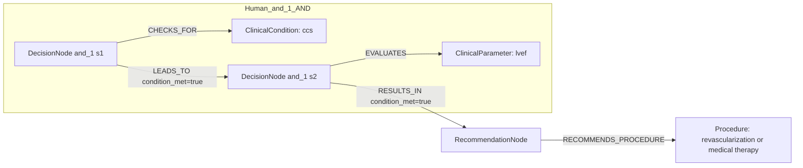

# row_09 (mapped to row_09)

Original table row text (ground truth):

```json
{}
```

Aligned JSON (expected vs actual):

<table>
  <tr>
    <th align="left">Human Annotation</th>
    <th align="left">LLM Generated</th>
  </tr>
  <tr>
    <td valign="top"><pre>
[
  {
    "conditions": [
      {
        "entity": "ccs",
        "entity_original": "ccs patient",
        "role": "ClinicalCondition",
        "operator": "PRESENT",
        "threshold": null,
        "unit": null,
        "context": null,
        "logic_type": "AND",
        "logic_group": "and_1",
        "strength": null,
        "level": null,
        "direction": null
      },
      {
        "entity": "lvef",
        "entity_original": "lvef \u2264 35%",
        "role": "ClinicalParameter",
        "operator": "\u2264",
        "threshold": "35",
        "unit": "%",
        "context": null,
        "logic_type": "AND",
        "logic_group": "and_1",
        "strength": null,
        "level": null,
        "direction": null
      }
    ],
    "actions": [
      {
        "entity": "revascularization or medical therapy",
        "entity_original": "choose between revascularization or medical therapy alone",
        "role": "Procedure",
        "operator": null,
        "threshold": null,
        "unit": null,
        "context": null,
        "logic_type": null,
        "logic_group": null,
        "strength": "I",
        "level": "C",
        "direction": "POSITIVE"
      },
      {
        "entity": "evaluate coronary anatomy",
        "entity_original": "evaluate coronary anatomy preferably by the heart team",
        "role": "ClinicalAction",
        "operator": null,
        "threshold": null,
        "unit": null,
        "context": null,
        "logic_type": null,
        "logic_group": null,
        "strength": "I",
        "level": "C",
        "direction": "POSITIVE"
      },
      {
        "entity": "evaluate correlation between coronary artery disease and lv dysfunction",
        "entity_original": "evaluate correlation between coronary artery disease and lv dysfunction preferably by the heart team",
        "role": "ClinicalAction",
        "operator": null,
        "threshold": null,
        "unit": null,
        "context": null,
        "logic_type": null,
        "logic_group": null,
        "strength": "I",
        "level": "C",
        "direction": "POSITIVE"
      },
      {
        "entity": "evaluate comorbidities",
        "entity_original": "evaluate comorbidities preferably by the heart team",
        "role": "ClinicalAction",
        "operator": null,
        "threshold": null,
        "unit": null,
        "context": null,
        "logic_type": null,
        "logic_group": null,
        "strength": "I",
        "level": "C",
        "direction": "POSITIVE"
      },
      {
        "entity": "evaluate life expectancy",
        "entity_original": "evaluate life expectancy by the heart team",
        "role": "ClinicalAction",
        "operator": null,
        "threshold": null,
        "unit": null,
        "context": null,
        "logic_type": null,
        "logic_group": null,
        "strength": "I",
        "level": "C",
        "direction": "POSITIVE"
      },
      {
        "entity": "evaluate individual risk-to-benefit ratio",
        "entity_original": "evaluate individual risk-to-benefit ratio by the heart team",
        "role": "ClinicalAction",
        "operator": null,
        "threshold": null,
        "unit": null,
        "context": null,
        "logic_type": null,
        "logic_group": null,
        "strength": "I",
        "level": "C",
        "direction": "POSITIVE"
      },
      {
        "entity": "evaluate patient perspectives",
        "entity_original": "evaluate patient perspectives by the heart team",
        "role": "ClinicalAction",
        "operator": null,
        "threshold": null,
        "unit": null,
        "context": null,
        "logic_type": null,
        "logic_group": null,
        "strength": "I",
        "level": "C",
        "direction": "POSITIVE"
      }
    ]
  }
]
</pre></td>
    <td valign="top"><pre>
{
  "rules": [
    {
      "conditions": [],
      "actions": []
    }
  ]
}
</pre></td>
  </tr>
</table>

Mermaid (Human Annotation):



Mermaid (LLM Generated):


Concepts:
- expected: 9
- actual: 0
- matches: 0
- missing: 9
- extra: 0

Missing concepts:
- ClinicalAction: evaluate comorbidities
- ClinicalAction: evaluate coronary anatomy
- ClinicalAction: evaluate correlation between coronary artery disease and lv dysfunction
- ClinicalAction: evaluate individual risk-to-benefit ratio
- ClinicalAction: evaluate life expectancy
- ClinicalAction: evaluate patient perspectives
- ClinicalCondition: ccs
- ClinicalParameter: lvef
- Procedure: revascularization or medical therapy

Rules (concept + logic fields):
- expected: 9
- actual: 0
- matches: 0
- missing: 9
- extra: 0

Missing rules:
- ClinicalAction: evaluate comorbidities | class=I | level=C | dir=POSITIVE
- ClinicalAction: evaluate coronary anatomy | class=I | level=C | dir=POSITIVE
- ClinicalAction: evaluate correlation between coronary artery disease and lv dysfunction | class=I | level=C | dir=POSITIVE
- ClinicalAction: evaluate individual risk-to-benefit ratio | class=I | level=C | dir=POSITIVE
- ClinicalAction: evaluate life expectancy | class=I | level=C | dir=POSITIVE
- ClinicalAction: evaluate patient perspectives | class=I | level=C | dir=POSITIVE
- ClinicalCondition: ccs | op=PRESENT | logic=AND | grp=and_1
- ClinicalParameter: lvef | op=≤ | thr=35 | unit=% | logic=AND | grp=and_1
- Procedure: revascularization or medical therapy | class=I | level=C | dir=POSITIVE

