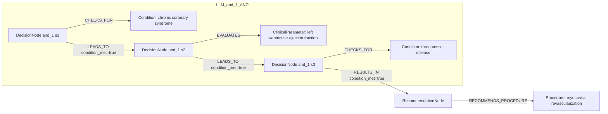

# row_09 (mapped to row_10)

Original table row text (ground truth):

```json
{}
```

Aligned JSON (expected vs actual):

<table>
  <tr>
    <th align="left">Human Annotation</th>
    <th align="left">LLM Generated</th>
  </tr>
  <tr>
    <td valign="top"><pre>
[
  {
    "conditions": [
      {
        "entity": "chronic ischemic heart disease",
        "entity_original": "ccs patient",
        "role": "ClinicalCondition",
        "operator": "PRESENT",
        "threshold": null,
        "unit": null,
        "context": null,
        "logic_type": "AND",
        "logic_group": "and_1",
        "strength": null,
        "level": null,
        "direction": null,
        "preferred_term": null,
        "synonyms": [],
        "snomed_id": "413838009",
        "target_label": null,
        "taxonomy_path": [],
        "root_concept_id": null,
        "root_concept_term": null
      },
      {
        "entity": "left ventricular ejection fraction",
        "entity_original": "lvef \u2264 35%",
        "role": "ClinicalParameter",
        "operator": "\u2264",
        "threshold": "35",
        "unit": "%",
        "context": null,
        "logic_type": "AND",
        "logic_group": "and_1",
        "strength": null,
        "level": null,
        "direction": null,
        "preferred_term": null,
        "synonyms": [],
        "snomed_id": "250908004",
        "target_label": null,
        "taxonomy_path": [],
        "root_concept_id": null,
        "root_concept_term": null
      }
    ],
    "actions": [
      {
        "entity": "decision making",
        "entity_original": "choose between revascularization or medical therapy alone",
        "role": "Procedure",
        "operator": null,
        "threshold": null,
        "unit": null,
        "context": null,
        "logic_type": null,
        "logic_group": null,
        "strength": "I",
        "level": "C",
        "direction": "POSITIVE",
        "preferred_term": null,
        "synonyms": [],
        "snomed_id": "247583006",
        "target_label": null,
        "taxonomy_path": [],
        "root_concept_id": null,
        "root_concept_term": null
      },
      {
        "entity": "angiography of coronary artery",
        "entity_original": "evaluate coronary anatomy",
        "role": "Procedure",
        "operator": null,
        "threshold": null,
        "unit": null,
        "context": null,
        "logic_type": null,
        "logic_group": null,
        "strength": "I",
        "level": "C",
        "direction": "POSITIVE",
        "preferred_term": null,
        "synonyms": [],
        "snomed_id": "33367005",
        "target_label": null,
        "taxonomy_path": [],
        "root_concept_id": null,
        "root_concept_term": null
      },
      {
        "entity": "therapeutic evaluation (procedure)",
        "entity_original": "evaluate correlation between coronary artery disease and lv dysfunction",
        "role": "Procedure",
        "operator": null,
        "threshold": null,
        "unit": null,
        "context": null,
        "logic_type": null,
        "logic_group": null,
        "strength": "I",
        "level": "C",
        "direction": "POSITIVE",
        "preferred_term": null,
        "synonyms": [],
        "snomed_id": "110463001",
        "target_label": null,
        "taxonomy_path": [],
        "root_concept_id": null,
        "root_concept_term": null
      },
      {
        "entity": "therapeutic evaluation (procedure)",
        "entity_original": "evaluate comorbidities preferably by the heart team",
        "role": "Procedure",
        "operator": null,
        "threshold": null,
        "unit": null,
        "context": null,
        "logic_type": null,
        "logic_group": null,
        "strength": "I",
        "level": "C",
        "direction": "POSITIVE",
        "preferred_term": null,
        "synonyms": [],
        "snomed_id": "110463001",
        "target_label": null,
        "taxonomy_path": [],
        "root_concept_id": null,
        "root_concept_term": null
      },
      {
        "entity": "therapeutic evaluation (procedure)",
        "entity_original": "evaluate life expectancy",
        "role": "Procedure",
        "operator": null,
        "threshold": null,
        "unit": null,
        "context": null,
        "logic_type": null,
        "logic_group": null,
        "strength": "I",
        "level": "C",
        "direction": "POSITIVE",
        "preferred_term": null,
        "synonyms": [],
        "snomed_id": "110463001",
        "target_label": null,
        "taxonomy_path": [],
        "root_concept_id": null,
        "root_concept_term": null
      },
      {
        "entity": "therapeutic evaluation (procedure)",
        "entity_original": "evaluate individual risk-to-benefit ratio",
        "role": "Procedure",
        "operator": null,
        "threshold": null,
        "unit": null,
        "context": null,
        "logic_type": null,
        "logic_group": null,
        "strength": "I",
        "level": "C",
        "direction": "POSITIVE",
        "preferred_term": null,
        "synonyms": [],
        "snomed_id": "110463001",
        "target_label": null,
        "taxonomy_path": [],
        "root_concept_id": null,
        "root_concept_term": null
      },
      {
        "entity": "therapeutic evaluation (procedure)",
        "entity_original": "evaluate patient perspectives",
        "role": "Procedure",
        "operator": null,
        "threshold": null,
        "unit": null,
        "context": null,
        "logic_type": null,
        "logic_group": null,
        "strength": "I",
        "level": "C",
        "direction": "POSITIVE",
        "preferred_term": null,
        "synonyms": [],
        "snomed_id": "110463001",
        "target_label": null,
        "taxonomy_path": [],
        "root_concept_id": null,
        "root_concept_term": null
      }
    ]
  }
]
</pre></td>
    <td valign="top"><pre>
{
  "rules": [
    {
      "conditions": [
        {
          "entity": "chronic coronary syndrome",
          "entity_original": "chronic coronary syndrome (ccs) patients",
          "role": "Condition",
          "operator": "PRESENT",
          "threshold": null,
          "unit": null,
          "context": null,
          "logic_type": "AND",
          "logic_group": "and_1",
          "strength": null,
          "level": null,
          "direction": "UNKNOWN"
        },
        {
          "entity": "left ventricular ejection fraction",
          "entity_original": "left ventricular ejection fraction (lvef) > 35%",
          "role": "ClinicalParameter",
          "operator": ">",
          "threshold": "35",
          "unit": "%",
          "context": null,
          "logic_type": "AND",
          "logic_group": "and_1",
          "strength": null,
          "level": null,
          "direction": "UNKNOWN"
        },
        {
          "entity": "three-vessel disease",
          "entity_original": "functionally significant three-vessel disease",
          "role": "Condition",
          "operator": "PRESENT",
          "threshold": null,
          "unit": null,
          "context": null,
          "logic_type": "AND",
          "logic_group": "and_1",
          "strength": null,
          "level": null,
          "direction": "UNKNOWN"
        }
      ],
      "actions": [
        {
          "entity": "myocardial revascularization",
          "entity_original": "myocardial revascularization",
          "role": "Procedure",
          "operator": null,
          "threshold": null,
          "unit": null,
          "context": null,
          "logic_type": null,
          "logic_group": null,
          "strength": "Class I",
          "level": "A",
          "direction": "POSITIVE"
        }
      ]
    }
  ]
}
</pre></td>
  </tr>
</table>

Mermaid (Human Annotation):

```mermaid
graph LR
  REC[RecommendationNode]
  ACT1[Procedure: decision making]
  REC -->|RECOMMENDS_PROCEDURE| ACT1
  ACT2[Procedure: angiography of coronary artery]
  REC -->|RECOMMENDS_PROCEDURE| ACT2
  ACT3[Procedure: therapeutic evaluation (procedure)]
  REC -->|RECOMMENDS_PROCEDURE| ACT3
  ACT4[Procedure: therapeutic evaluation (procedure)]
  REC -->|RECOMMENDS_PROCEDURE| ACT4
  ACT5[Procedure: therapeutic evaluation (procedure)]
  REC -->|RECOMMENDS_PROCEDURE| ACT5
  ACT6[Procedure: therapeutic evaluation (procedure)]
  REC -->|RECOMMENDS_PROCEDURE| ACT6
  ACT7[Procedure: therapeutic evaluation (procedure)]
  REC -->|RECOMMENDS_PROCEDURE| ACT7
  subgraph Human_and_1_AND
    D_and_1_1[DecisionNode and_1 s1]
    C_and_1_1[ClinicalCondition: chronic ischemic heart disease]
    D_and_1_1 -->|CHECKS_FOR| C_and_1_1
    D_and_1_2[DecisionNode and_1 s2]
    C_and_1_2[ClinicalParameter: left ventricular ejection fraction]
    D_and_1_2 -->|EVALUATES| C_and_1_2
    D_and_1_1 -->|LEADS_TO condition_met=true| D_and_1_2
  end
  D_and_1_2 -->|RESULTS_IN condition_met=true| REC
```

Mermaid (LLM Generated):



Concepts:
- expected: 5
- actual: 4
- matches: 1
- missing: 4
- extra: 3

Missing concepts:
- ClinicalCondition: chronic ischemic heart disease
- Procedure: angiography of coronary artery
- Procedure: decision making
- Procedure: therapeutic evaluation (procedure)

Extra concepts:
- Condition: chronic coronary syndrome
- Condition: three-vessel disease
- Procedure: myocardial revascularization

Rules (concept + logic fields):
- expected: 5
- actual: 4
- matches: 0
- missing: 5
- extra: 4

Missing rules:
- ClinicalCondition: chronic ischemic heart disease | op=PRESENT | logic=AND | grp=and_1
- ClinicalParameter: left ventricular ejection fraction | op=≤ | thr=35 | unit=% | logic=AND | grp=and_1
- Procedure: angiography of coronary artery | class=I | level=C | dir=POSITIVE
- Procedure: decision making | class=I | level=C | dir=POSITIVE
- Procedure: therapeutic evaluation (procedure) | class=I | level=C | dir=POSITIVE

Extra rules:
- ClinicalParameter: left ventricular ejection fraction | op=> | thr=35 | unit=% | logic=AND | grp=and_1 | dir=UNKNOWN
- Condition: chronic coronary syndrome | op=PRESENT | logic=AND | grp=and_1 | dir=UNKNOWN
- Condition: three-vessel disease | op=PRESENT | logic=AND | grp=and_1 | dir=UNKNOWN
- Procedure: myocardial revascularization | class=Class I | level=A | dir=POSITIVE

