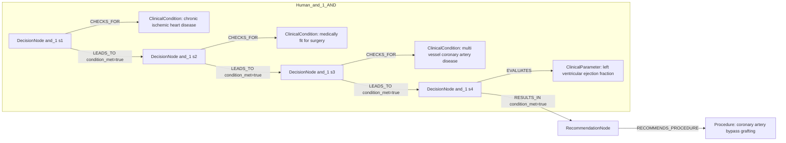
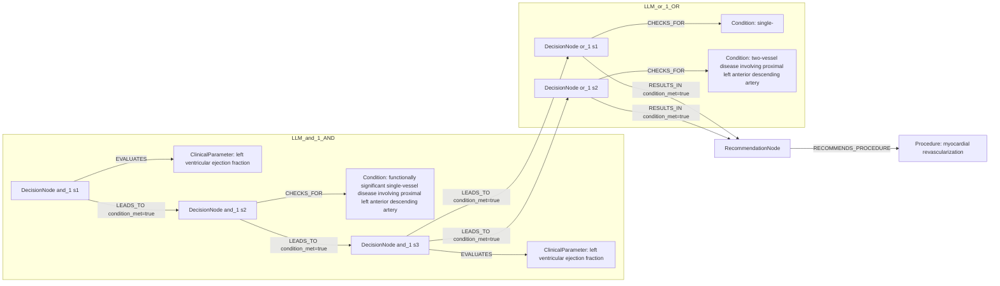

# row_10 (mapped to row_11)

Original table row text (ground truth):

```json
{
  "Recommendations": "In surgically eligible CCS patients with multivessel CAD and LVEF \u2264 35%, myocardial revascularization with CABG is recommended over medical therapy alone to improve long-term survival. 53,54,749,861",
  "Class a": "I",
  "Level b": "B"
}
```

Aligned JSON (expected vs actual):

<table>
  <tr>
    <th align="left">Human Annotation</th>
    <th align="left">LLM Generated</th>
  </tr>
  <tr>
    <td valign="top"><pre>
[
  {
    "conditions": [
      {
        "entity": "chronic ischemic heart disease",
        "entity_original": "ccs patient",
        "role": "ClinicalCondition",
        "operator": "PRESENT",
        "threshold": null,
        "unit": null,
        "context": null,
        "logic_type": "AND",
        "logic_group": "and_1",
        "strength": null,
        "level": null,
        "direction": null,
        "preferred_term": null,
        "synonyms": [],
        "snomed_id": "413838009",
        "target_label": null,
        "taxonomy_path": [],
        "root_concept_id": null,
        "root_concept_term": null
      },
      {
        "entity": "medically fit for surgery",
        "entity_original": "surgically eligible patient",
        "role": "ClinicalCondition",
        "operator": "PRESENT",
        "threshold": null,
        "unit": null,
        "context": null,
        "logic_type": "AND",
        "logic_group": "and_1",
        "strength": null,
        "level": null,
        "direction": null,
        "preferred_term": null,
        "synonyms": [],
        "snomed_id": "713671003",
        "target_label": null,
        "taxonomy_path": [],
        "root_concept_id": null,
        "root_concept_term": null
      },
      {
        "entity": "multi vessel coronary artery disease",
        "entity_original": "multivessel cad",
        "role": "ClinicalCondition",
        "operator": "PRESENT",
        "threshold": null,
        "unit": null,
        "context": null,
        "logic_type": "AND",
        "logic_group": "and_1",
        "strength": null,
        "level": null,
        "direction": null,
        "preferred_term": null,
        "synonyms": [],
        "snomed_id": "371803003",
        "target_label": null,
        "taxonomy_path": [],
        "root_concept_id": null,
        "root_concept_term": null
      },
      {
        "entity": "left ventricular ejection fraction",
        "entity_original": "lvef \u2264 35%",
        "role": "ClinicalParameter",
        "operator": "\u2264",
        "threshold": "35",
        "unit": "%",
        "context": null,
        "logic_type": "AND",
        "logic_group": "and_1",
        "strength": null,
        "level": null,
        "direction": null,
        "preferred_term": null,
        "synonyms": [],
        "snomed_id": "250908004",
        "target_label": null,
        "taxonomy_path": [],
        "root_concept_id": null,
        "root_concept_term": null
      }
    ],
    "actions": [
      {
        "entity": "coronary artery bypass grafting",
        "entity_original": "myocardial revascularization with cabg",
        "role": "Procedure",
        "operator": null,
        "threshold": null,
        "unit": null,
        "context": null,
        "logic_type": null,
        "logic_group": null,
        "strength": "I",
        "level": "B",
        "direction": "POSITIVE",
        "preferred_term": null,
        "synonyms": [],
        "snomed_id": "232717009",
        "target_label": null,
        "taxonomy_path": [],
        "root_concept_id": null,
        "root_concept_term": null
      }
    ]
  }
]
</pre></td>
    <td valign="top"><pre>
{
  "rules": [
    {
      "conditions": [
        {
          "entity": "left ventricular ejection fraction",
          "entity_original": "left ventricular ejection fraction (lvef) > 35%",
          "role": "ClinicalParameter",
          "operator": ">",
          "threshold": "35",
          "unit": "%",
          "context": null,
          "logic_type": "AND",
          "logic_group": "and_1",
          "strength": "Class I",
          "level": "B",
          "direction": "POSITIVE"
        },
        {
          "entity": "functionally significant single-vessel disease involving proximal left anterior descending artery",
          "entity_original": "functionally significant single- or two-vessel disease involving the proximal left anterior descending artery (lad)",
          "role": "Condition",
          "operator": "PRESENT",
          "threshold": null,
          "unit": null,
          "context": null,
          "logic_type": "AND",
          "logic_group": "and_1",
          "strength": "Class I",
          "level": "B",
          "direction": "POSITIVE"
        },
        {
          "entity": "left ventricular ejection fraction",
          "entity_original": "left ventricular ejection fraction (lvef) > 35%",
          "role": "ClinicalParameter",
          "operator": ">",
          "threshold": "35",
          "unit": "%",
          "context": null,
          "logic_type": "AND",
          "logic_group": "and_1",
          "strength": "Class I",
          "level": "B",
          "direction": "POSITIVE"
        },
        {
          "entity": "single-",
          "entity_original": "functionally significant single- or two-vessel disease involving the proximal left anterior descending artery (lad)",
          "role": "Condition",
          "operator": "PRESENT",
          "threshold": null,
          "unit": null,
          "context": null,
          "logic_type": "OR",
          "logic_group": "or_1",
          "strength": "Class I",
          "level": "B",
          "direction": "POSITIVE"
        },
        {
          "entity": "two-vessel disease involving proximal left anterior descending artery",
          "entity_original": "functionally significant single- or two-vessel disease involving the proximal left anterior descending artery (lad)",
          "role": "Condition",
          "operator": "PRESENT",
          "threshold": null,
          "unit": null,
          "context": null,
          "logic_type": "OR",
          "logic_group": "or_1",
          "strength": "Class I",
          "level": "B",
          "direction": "POSITIVE"
        }
      ],
      "actions": [
        {
          "entity": "myocardial revascularization",
          "entity_original": "myocardial revascularization",
          "role": "Procedure",
          "operator": "PRESENT",
          "threshold": null,
          "unit": null,
          "context": null,
          "logic_type": null,
          "logic_group": null,
          "strength": "Class I",
          "level": "B",
          "direction": "POSITIVE"
        }
      ]
    }
  ]
}
</pre></td>
  </tr>
</table>

Mermaid (Human Annotation):



Mermaid (LLM Generated):



Concepts:
- expected: 5
- actual: 5
- matches: 1
- missing: 4
- extra: 4

Missing concepts:
- ClinicalCondition: chronic ischemic heart disease
- ClinicalCondition: medically fit for surgery
- ClinicalCondition: multi vessel coronary artery disease
- Procedure: coronary artery bypass grafting

Extra concepts:
- Condition: functionally significant single-vessel disease involving proximal left anterior descending artery
- Condition: single-
- Condition: two-vessel disease involving proximal left anterior descending artery
- Procedure: myocardial revascularization

Rules (concept + logic fields):
- expected: 5
- actual: 5
- matches: 0
- missing: 5
- extra: 5

Missing rules:
- ClinicalCondition: chronic ischemic heart disease | op=PRESENT | logic=AND | grp=and_1
- ClinicalCondition: medically fit for surgery | op=PRESENT | logic=AND | grp=and_1
- ClinicalCondition: multi vessel coronary artery disease | op=PRESENT | logic=AND | grp=and_1
- ClinicalParameter: left ventricular ejection fraction | op=≤ | thr=35 | unit=% | logic=AND | grp=and_1
- Procedure: coronary artery bypass grafting | class=I | level=B | dir=POSITIVE

Extra rules:
- ClinicalParameter: left ventricular ejection fraction | op=> | thr=35 | unit=% | logic=AND | grp=and_1 | class=Class I | level=B | dir=POSITIVE
- Condition: functionally significant single-vessel disease involving proximal left anterior descending artery | op=PRESENT | logic=AND | grp=and_1 | class=Class I | level=B | dir=POSITIVE
- Condition: single- | op=PRESENT | logic=OR | grp=or_1 | class=Class I | level=B | dir=POSITIVE
- Condition: two-vessel disease involving proximal left anterior descending artery | op=PRESENT | logic=OR | grp=or_1 | class=Class I | level=B | dir=POSITIVE
- Procedure: myocardial revascularization | op=PRESENT | class=Class I | level=B | dir=POSITIVE

